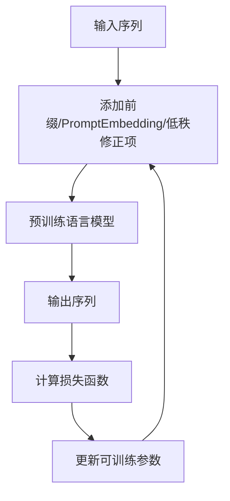

# 大语言模型原理基础与前沿 轻量级微调

## 1. 背景介绍

### 1.1 大语言模型的兴起

近年来,大型语言模型(Large Language Model,LLM)在自然语言处理领域取得了巨大的突破。这些模型通过在大规模语料库上进行预训练,学习到了丰富的语言知识和上下文信息,从而在下游任务中表现出了强大的泛化能力。

代表性的大语言模型包括:

- GPT(Generative Pre-trained Transformer)系列模型
- BERT(Bidirectional Encoder Representations from Transformers)
- XLNet
- RoBERTa
- ALBERT
- T5(Text-to-Text Transfer Transformer)

这些模型通过自监督预训练的方式,在海量的文本数据上学习语义表示,从而获得了强大的语言理解和生成能力。

### 1.2 大语言模型的挑战

尽管大语言模型取得了令人瞩目的成就,但它们也面临着一些重大挑战:

1. **计算资源消耗巨大**: 训练大型语言模型需要消耗大量的计算资源,包括GPU、TPU等昂贵的硬件设备,以及海量的训练数据。这使得大多数组织和个人难以从头训练这些模型。

2. **推理效率低下**: 大语言模型通常包含数十亿甚至上百亿的参数,导致推理过程计算量巨大,响应时间延迟较高,难以满足实时应用的需求。

3. **知识更新缓慢**: 一旦大语言模型训练完成,其包含的知识就被固化了。要想更新模型的知识,需要从头重新训练,代价高昂。

4. **缺乏可解释性**: 大语言模型的内部机理往往是一个黑盒,缺乏可解释性,难以让人类理解模型的决策过程。

5. **存在偏见和不当内容**: 由于训练数据的局限性,大语言模型可能会产生有偏见的输出,或生成一些不当的内容。

为了应对这些挑战,研究人员提出了一种称为"轻量级微调"(Prompt Tuning)的新颖方法,旨在提高大语言模型的可用性和效率。

## 2. 核心概念与联系

### 2.1 微调(Fine-tuning)

在传统的fine-tuning方法中,我们通常会在大语言模型的基础上,针对特定的下游任务(如文本分类、机器翻译等)进行进一步的微调。这种方法需要更新模型的所有参数,计算成本较高,并且可能会导致灾难性遗忘(catastrophic forgetting),即模型在学习新任务时,会忘记之前学到的知识。

### 2.2 提示学习(Prompt Learning)

提示学习是一种新兴的范式,它通过设计特殊的提示(prompt)来指导大语言模型完成特定的任务,而不需要更新模型的参数。这种方法具有以下优点:

1. **计算效率高**: 不需要更新模型参数,只需要生成提示,计算成本较低。
2. **知识保留**: 模型的原始知识不会被破坏,可以很好地保留之前学到的知识。
3. **灵活性强**: 通过设计不同的提示,可以指导模型完成多种任务,提高了模型的灵活性。

然而,提示学习也存在一些挑战,例如:

1. **提示设计的困难性**: 设计高质量的提示需要专业知识和经验,并非一件容易的事情。
2. **性能上限较低**: 相比fine-tuning,提示学习的性能往往会有一定程度的下降。

### 2.3 轻量级微调(Prompt Tuning)

轻量级微调是一种折中的方法,它结合了微调和提示学习的优点。具体来说,它在保留大语言模型绝大部分参数不变的情况下,只微调一小部分与任务相关的参数。这些参数可以是:

1. **前缀提示(Prefix Tuning)**: 在输入序列的开头添加一些可训练的前缀向量,作为提示。
2. **PromptTuning**: 在Transformer的每一层注意力机制中,添加一些可训练的PromptEmbedding向量。
3. **LoRA(Low-Rank Adaptation)**: 在每一层的权重矩阵上,添加两个低秩矩阵的乘积作为可训练的修正项。

轻量级微调的优点包括:

1. **计算效率高**: 只需要微调少量参数,计算成本远低于全量微调。
2. **性能较好**: 相比纯提示学习,性能有一定提升。
3. **知识保留**: 大部分参数保持不变,可以很好地保留原始知识。
4. **灵活性强**: 可以通过设计不同的微调策略,应对不同的任务。

## 3. 核心算法原理具体操作步骤

在这一部分,我们将详细介绍几种常见的轻量级微调算法的原理和操作步骤。

### 3.1 前缀提示(Prefix Tuning)

前缀提示的核心思想是在输入序列的开头添加一些可训练的前缀向量,作为提示。在推理时,这些前缀向量将与输入序列一起被送入模型,以影响模型的输出。

具体操作步骤如下:

1. 为每个输入序列添加一个长度为$n$的前缀向量序列$\boldsymbol{P} = [\boldsymbol{p}_1, \boldsymbol{p}_2, \cdots, \boldsymbol{p}_n]$,其中$\boldsymbol{p}_i \in \mathbb{R}^{d_\text{model}}$是一个可训练的前缀向量。
2. 将原始输入序列$\boldsymbol{X} = [x_1, x_2, \cdots, x_m]$与前缀向量序列$\boldsymbol{P}$拼接,形成新的输入序列$\boldsymbol{X}' = [\boldsymbol{p}_1, \boldsymbol{p}_2, \cdots, \boldsymbol{p}_n, x_1, x_2, \cdots, x_m]$。
3. 将新的输入序列$\boldsymbol{X}'$送入预训练语言模型,获得对应的输出序列$\boldsymbol{Y}' = [y_1', y_2', \cdots, y_m']$。
4. 根据下游任务的目标,计算损失函数$\mathcal{L}(\boldsymbol{Y}', \boldsymbol{Y})$,其中$\boldsymbol{Y}$是期望的输出序列。
5. 使用优化算法(如Adam)对前缀向量$\boldsymbol{P}$进行更新,最小化损失函数$\mathcal{L}(\boldsymbol{Y}', \boldsymbol{Y})$。

在推理阶段,我们只需要将训练好的前缀向量与输入序列拼接,然后送入预训练语言模型,即可获得对应的输出。

前缀提示的优点是计算高效,只需要训练少量的前缀向量。但它也存在一些局限性,例如前缀长度的选择需要人工设置,且前缀向量的语义含义不明确,难以解释。

### 3.2 PromptTuning

PromptTuning是另一种轻量级微调方法,它在Transformer的每一层注意力机制中,添加一些可训练的PromptEmbedding向量,作为注意力机制的偏置项。

具体操作步骤如下:

1. 为每一层的注意力机制添加一个可训练的PromptEmbedding向量$\boldsymbol{e}_l \in \mathbb{R}^{d_\text{model}}$,其中$l$表示层数。
2. 在计算注意力分数时,将PromptEmbedding向量$\boldsymbol{e}_l$添加到查询向量$\boldsymbol{Q}$、键向量$\boldsymbol{K}$和值向量$\boldsymbol{V}$中,即:

$$
\begin{aligned}
\boldsymbol{Q}' &= \boldsymbol{Q} + \boldsymbol{e}_l \\
\boldsymbol{K}' &= \boldsymbol{K} + \boldsymbol{e}_l \\
\boldsymbol{V}' &= \boldsymbol{V} + \boldsymbol{e}_l
\end{aligned}
$$

3. 使用修正后的$\boldsymbol{Q}'$、$\boldsymbol{K}'$和$\boldsymbol{V}'$计算注意力输出。
4. 根据下游任务的目标,计算损失函数$\mathcal{L}(\boldsymbol{Y}', \boldsymbol{Y})$,其中$\boldsymbol{Y}'$是模型的输出序列,$\boldsymbol{Y}$是期望的输出序列。
5. 使用优化算法(如Adam)对PromptEmbedding向量$\{\boldsymbol{e}_l\}$进行更新,最小化损失函数$\mathcal{L}(\boldsymbol{Y}', \boldsymbol{Y})$。

在推理阶段,我们只需要使用训练好的PromptEmbedding向量,按照上述步骤修正注意力机制的输入,即可获得对应的输出。

PromptTuning的优点是可以直接影响注意力机制的计算过程,从而更好地引导模型的输出。但它也存在一些局限性,例如需要为每一层训练一个PromptEmbedding向量,参数量相对较大。

### 3.3 LoRA(Low-Rank Adaptation)

LoRA是一种基于低秩矩阵分解的轻量级微调方法。它在每一层的权重矩阵上,添加两个低秩矩阵的乘积作为可训练的修正项。

具体操作步骤如下:

1. 对于Transformer的每一层,将其权重矩阵$\boldsymbol{W} \in \mathbb{R}^{m \times n}$分解为两个低秩矩阵$\boldsymbol{A} \in \mathbb{R}^{m \times k}$和$\boldsymbol{B} \in \mathbb{R}^{k \times n}$的乘积,即$\boldsymbol{W} = \boldsymbol{W}_0 + \boldsymbol{A}\boldsymbol{B}$,其中$\boldsymbol{W}_0$是原始的权重矩阵,而$\boldsymbol{A}$和$\boldsymbol{B}$是可训练的低秩修正项。
2. 在前向传播时,使用修正后的权重矩阵$\boldsymbol{W} = \boldsymbol{W}_0 + \boldsymbol{A}\boldsymbol{B}$进行计算。
3. 根据下游任务的目标,计算损失函数$\mathcal{L}(\boldsymbol{Y}', \boldsymbol{Y})$,其中$\boldsymbol{Y}'$是模型的输出序列,$\boldsymbol{Y}$是期望的输出序列。
4. 使用优化算法(如Adam)对低秩修正项$\boldsymbol{A}$和$\boldsymbol{B}$进行更新,最小化损失函数$\mathcal{L}(\boldsymbol{Y}', \boldsymbol{Y})$。

在推理阶段,我们只需要使用训练好的低秩修正项$\boldsymbol{A}$和$\boldsymbol{B}$,按照上述步骤修正权重矩阵,即可获得对应的输出。

LoRA的优点是参数量较小,计算效率较高。但它也存在一些局限性,例如需要为每一层训练两个低秩矩阵,并且低秩约束可能会限制模型的表达能力。

上述三种算法都是轻量级微调的代表性方法,它们各有优缺点,需要根据具体的任务和场景进行选择和调优。

## 4. 数学模型和公式详细讲解举例说明

在上一节中,我们介绍了三种轻量级微调算法的具体操作步骤。现在,我们将详细解释其中涉及的数学模型和公式,并给出具体的例子说明。

### 4.1 前缀提示(Prefix Tuning)

在前缀提示中,我们为每个输入序列添加了一个长度为$n$的前缀向量序列$\boldsymbol{P} = [\boldsymbol{p}_1, \boldsymbol{p}_2, \cdots, \boldsymbol{p}_n]$,其中$\boldsymbol{p}_i \in \mathbb{R}^{d_\text{model}}$是一个可训练的前缀