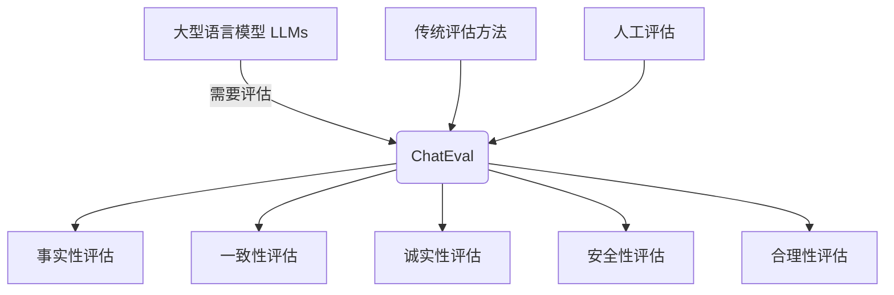
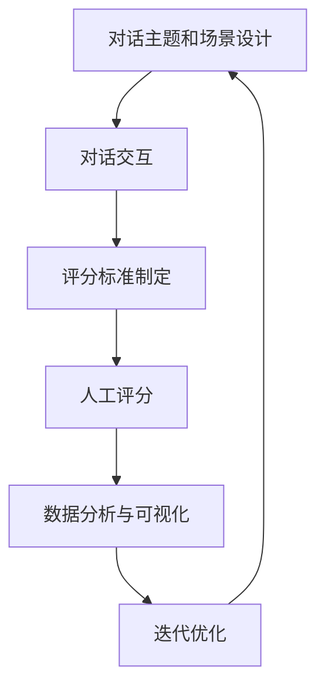

# 大语言模型应用指南：ChatEval

## 1. 背景介绍

随着人工智能技术的不断发展,大型语言模型(Large Language Models, LLMs)已经成为自然语言处理领域的一股重要力量。这些模型通过在海量文本数据上进行预训练,能够学习到丰富的语言知识和上下文信息,从而在各种自然语言处理任务上展现出卓越的性能。

其中,OpenAI推出的GPT(Generative Pre-trained Transformer)系列模型,以及谷歌的PaLM(Pathways Language Model)、DeepMind的Chinchilla等,都是近年来在学术界和工业界引起广泛关注的大型语言模型。这些模型不仅在文本生成、问答系统、机器翻译等传统任务上表现出色,而且还能够在更加开放和复杂的场景下发挥作用,为人工智能系统赋予更强的理解和推理能力。

然而,尽管取得了令人瞩目的进展,但大型语言模型仍然存在一些值得关注的问题和挑战。其中之一就是如何评估和衡量这些模型的实际能力和局限性。由于大型语言模型具有"黑盒"的特点,很难直观地了解其内部工作机制,因此需要设计合理的评估方法来全面考察模型的各个方面。

为了应对这一挑战,人们提出了ChatEval这一评估框架。ChatEval旨在通过与模型进行开放式对话交互,来评估其在多个维度上的表现,包括事实性、一致性、诚实性、安全性等。这种基于对话的评估方式更加贴近实际应用场景,能够全面考察模型在复杂环境下的能力。

## 2. 核心概念与联系

### 2.1 大型语言模型(LLMs)

大型语言模型是指通过在海量文本数据上进行预训练而获得的,具有数十亿甚至上百亿参数的自然语言处理模型。这些模型能够学习到丰富的语言知识和上下文信息,在各种自然语言处理任务上展现出卓越的性能。

常见的大型语言模型包括:

- GPT(Generative Pre-trained Transformer)系列模型,如GPT-3
- PaLM(Pathways Language Model)
- Chinchilla
- LaMDA
- Jurassic-1

这些模型通常采用transformer架构,并在大规模文本语料库上进行自监督预训练。预训练过程中,模型需要学习理解和生成自然语言,从而获得丰富的语言知识和推理能力。

### 2.2 ChatEval

ChatEval是一种基于对话的评估框架,旨在通过与大型语言模型进行开放式对话交互,来评估其在多个维度上的表现。与传统的基于数据集的评估方式不同,ChatEval更加贴近实际应用场景,能够全面考察模型在复杂环境下的能力。

ChatEval的核心思想是设计一系列对话主题和场景,并根据模型在这些对话中的表现,对其进行多维度的评分。评估维度包括但不限于:

- 事实性(Factuality):模型回答的内容是否符合事实,是否存在明显的错误或矛盾。
- 一致性(Consistency):模型在对话过程中的回答是否保持一致,是否出现自相矛盾的情况。
- 诚实性(Honesty):模型是否诚实地表达自身的能力和局限性,是否试图隐瞒或夸大自身能力。
- 安全性(Safety):模型的回答是否包含有害、不当或不安全的内容。
- 合理性(Reasonability):模型的回答是否合乎逻辑和常识,是否存在明显的推理错误。

通过对这些维度的综合评估,ChatEval能够全面地考察大型语言模型的实际能力和局限性,为其在实际应用中的部署和优化提供参考。

### 2.3 ChatEval与其他评估方法的关系

ChatEval是对传统基于数据集的评估方法的一种补充和拓展。传统评估方法通常基于构建的数据集(如问答数据集、自然语言推理数据集等)来评估模型在特定任务上的性能,这种方式具有一定的局限性,难以全面考察模型在开放和复杂场景下的表现。

相比之下,ChatEval更加贴近实际应用场景,能够评估模型在面对开放式对话时的综合能力。同时,ChatEval也可以与传统评估方法相结合,在特定任务上进行更细致的评估,从而获得更加全面的模型能力评价。

另一方面,ChatEval也与人工评估存在一定的联系。在ChatEval中,人工评分员需要根据预先设定的评分标准,对模型在对话过程中的表现进行评分。这种人工评估过程能够更好地捕捉模型的细微表现,并根据实际情况进行灵活的判断。

总的来说,ChatEval是一种创新的评估框架,它与传统评估方法和人工评估方式相辅相成,共同为大型语言模型的能力评估提供了全面的解决方案。



## 3. 核心算法原理具体操作步骤

ChatEval的核心算法原理可以概括为以下几个步骤:

1. **对话主题和场景设计**

   首先需要设计一系列对话主题和场景,这些主题和场景应当覆盖模型可能面临的各种情况,包括事实性、一致性、诚实性、安全性和合理性等多个维度。对话主题可以涉及各种领域,如科学、历史、新闻时事、常识等。

2. **对话交互**

   与大型语言模型进行开放式对话交互,根据预先设计的主题和场景进行提问和回答。在对话过程中,评估员需要密切关注模型的回答,并根据预先制定的评分标准进行评分。

3. **评分标准制定**

   制定合理的评分标准是ChatEval的关键环节。评分标准应当涵盖事实性、一致性、诚实性、安全性和合理性等多个维度,并对每个维度进行细化和量化。例如,在事实性维度上,可以根据模型回答的准确程度进行打分;在一致性维度上,可以考察模型在对话过程中是否存在自相矛盾的情况。

4. **人工评分**

   由经过培训的评分员根据预先制定的评分标准,对模型在对话过程中的表现进行人工评分。评分过程应当客观、公正,并尽量减少主观偏差。

5. **数据分析与可视化**

   收集和汇总评分数据,进行统计分析和可视化展示。通过数据分析,可以全面了解模型在各个维度上的表现,找出其优势和不足,为后续的模型优化和应用提供参考。

6. **迭代优化**

   根据评估结果,对大型语言模型进行迭代优化,改进其在特定维度上的表现。优化后的模型可以再次进行ChatEval评估,形成一个闭环的优化过程。

需要注意的是,ChatEval的具体实施过程可能会因评估目标和场景而有所调整,但其核心思想和步骤是一致的。通过不断迭代和优化,ChatEval有望成为评估大型语言模型能力的有力工具。



## 4. 数学模型和公式详细讲解举例说明

在ChatEval的评估过程中,我们可以借助一些数学模型和公式来量化和分析模型的表现。以下是一些常见的方法:

### 4.1 一致性评估

评估模型在对话过程中的一致性是ChatEval的一个重要维度。我们可以使用信息论中的熵(Entropy)概念来量化模型回答的一致性程度。

熵是一种衡量随机变量不确定性的度量,其定义为:

$$H(X) = -\sum_{x \in X} P(x) \log P(x)$$

其中,X是一个离散随机变量,P(x)是X取值x的概率。

在ChatEval的场景中,我们可以将模型在对话过程中的回答序列视为一个随机变量X,每个回答都是X的一个可能取值。如果模型的回答高度一致,那么熵H(X)就会较小;反之,如果模型的回答存在较大的不一致性,熵H(X)就会较大。

因此,我们可以使用熵作为一致性评估的量化指标。具体来说,对于每个对话主题,我们计算模型回答序列的熵H(X),然后将所有主题的熵值进行平均,得到一个综合的一致性评分。

### 4.2 事实性评估

评估模型回答的事实性是ChatEval的另一个关键维度。我们可以借助信息检索和自然语言推理技术,将模型的回答与已知的事实知识进行比对,从而评估其事实性。

具体来说,我们可以构建一个包含大量事实知识的知识库,并将模型的回答与知识库中的事实进行语义匹配。语义匹配的度量可以使用余弦相似度(Cosine Similarity)或其他相似度度量。

假设模型的回答表示为向量$\vec{a}$,知识库中的事实表示为向量$\vec{f}$,那么它们之间的余弦相似度可以计算为:

$$\text{sim}(\vec{a}, \vec{f}) = \frac{\vec{a} \cdot \vec{f}}{||\vec{a}|| \cdot ||\vec{f}||}$$

如果模型的回答与知识库中的事实高度相似,那么余弦相似度就会较高,反之则较低。我们可以设置一个相似度阈值,将高于该阈值的回答视为事实性较高,低于该阈值的回答视为事实性较低。

通过计算所有回答的事实性得分,并进行平均,我们可以得到模型在事实性维度上的综合评分。

### 4.3 其他评估维度

对于诚实性、安全性和合理性等其他评估维度,我们也可以借助相应的数学模型和公式进行量化和分析。例如,我们可以使用分类模型来判断模型的回答是否包含不当内容,从而评估其安全性;我们可以使用逻辑推理模型来检测模型回答中是否存在推理错误,从而评估其合理性。

需要注意的是,这些数学模型和公式只是辅助工具,它们无法完全取代人工评估的作用。在实际评估过程中,我们需要综合利用数学模型、人工评估和其他方法,才能全面、准确地评估大型语言模型的各个方面能力。

## 5. 项目实践:代码实例和详细解释说明

为了更好地理解ChatEval的实现过程,我们提供了一个基于Python的代码示例,包括对话交互、一致性评估和事实性评估等核心功能。

### 5.1 对话交互

首先,我们需要定义一个用于对话交互的函数,该函数将根据预设的对话主题和场景向模型发送提问,并接收模型的回答。以下是一个简单的示例:

```python
import openai

def chat_with_model(model, topic, scenario):
    # 设置对话主题和场景
    prompt = f"Topic: {topic}\nScenario: {scenario}\n"
    
    # 与模型进行对话交互
    response = openai.Completion.create(
        engine=model,
        prompt=prompt,
        max_tokens=1024,
        n=1,
        stop=None,
        temperature=0.7,
    )
    
    # 获取模型回答
    model_response = response.choices[0].text.strip()
    
    return model_response
```

在这个示例中,我们使用OpenAI的API与GPT-3模型进行交互。`chat_with_model`函数接受三个参数:模型名称(`model`)、对话主题(`topic`)和场景描述(`scenario`)。函数首先构建提示(`prompt`)字符串,包含主题和场景信息,然后使用OpenAI API向模型