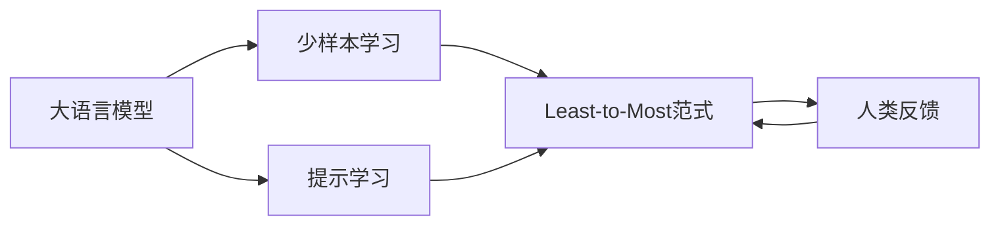

# 大语言模型应用指南：Least-to-Most

## 1. 背景介绍

### 1.1 大语言模型的兴起
近年来,随着深度学习技术的快速发展,大语言模型(Large Language Models, LLMs)在自然语言处理(NLP)领域取得了突破性的进展。从ELMo、BERT到GPT系列模型,大语言模型展现出了强大的语言理解和生成能力,引领了NLP技术的新浪潮。

### 1.2 大语言模型面临的挑战
尽管大语言模型取得了瞩目的成就,但在实际应用中仍然面临诸多挑战:
- 模型参数量巨大,训练和推理成本高昂
- 模型泛化能力有限,难以适应特定领域任务
- 模型推理结果不可控,存在安全和伦理风险
- 缺乏有效的人机交互和反馈机制

### 1.3 Least-to-Most范式的提出
针对大语言模型面临的挑战,斯坦福大学的Anthropic团队提出了Least-to-Most(最小到最大)的应用范式。该范式旨在充分利用大语言模型的语言理解和生成能力,同时引入人类反馈和交互,实现大语言模型在实际任务中的高效应用。

## 2. 核心概念与联系

### 2.1 大语言模型(Large Language Models)
大语言模型是基于海量文本数据,利用深度神经网络训练得到的语言模型。它能够学习文本数据中蕴含的语法、语义、常识等丰富知识,具备强大的语言理解和生成能力。代表模型有GPT系列、BERT、T5等。

### 2.2 少样本学习(Few-Shot Learning) 
少样本学习是指利用极少量的标注样本对模型进行微调,使其能够快速适应新任务的学习范式。大语言模型蕴含了丰富的语言知识,具备很强的少样本学习能力,能够通过几个示例就理解任务要求并给出合理输出。

### 2.3 提示学习(Prompt Learning)
提示学习是指通过设计恰当的输入提示(Prompt),引导语言模型执行特定任务并输出所需结果的学习范式。通过精心构造的提示,可以充分利用语言模型学习到的知识,实现零样本和少样本条件下的任务求解。

### 2.4 人类反馈(Human Feedback)
人类反馈是指在大语言模型应用过程中,引入人类专家对模型输出结果的评估和反馈,并据此对模型进行微调和改进。人类反馈可以帮助模型更好地理解任务需求,提高输出质量,并避免产生不恰当或有害的内容。

### 2.5 核心概念之间的关系
Least-to-Most范式是在大语言模型的基础上,综合利用少样本学习、提示学习和人类反馈等技术,实现大语言模型在实际任务中的高效应用。通过设计恰当的任务提示,利用少量示例微调模型,并引入人类反馈对模型输出进行优化,最终达到高质量的任务输出。



## 3. 核心算法原理具体操作步骤

### 3.1 任务定义与提示构建
- 明确任务目标和输入输出格式
- 设计恰当的任务提示,引导模型理解任务需求
- 提示可包括任务说明、输入示例、期望输出格式等

### 3.2 少样本数据准备
- 选择少量高质量的示例数据,覆盖任务的典型场景
- 示例数据应与任务提示相呼应,体现输入输出对应关系
- 数据量一般为2-10个样本,过多样本会降低泛化能力

### 3.3 模型微调
- 以预训练的大语言模型为基础,使用少样本数据进行微调
- 微调过程通过梯度下降算法优化模型参数,使其适应任务需求
- 微调时需要合理设置学习率、训练轮数等超参数

### 3.4 人类反馈与模型优化
- 对模型生成的输出结果进行人工评估,给出质量分数和改进建议
- 将人类反馈加入训练数据,重新微调模型
- 通过多轮迭代优化,不断提升模型在任务上的表现

### 3.5 模型测试与部署应用
- 在测试集上评估模型的性能,分析错误情况
- 对模型输出进行后处理,如过滤、排序、格式转换等
- 将模型封装为 API 接口,集成到应用系统中进行调用

## 4. 数学模型和公式详细讲解举例说明

### 4.1 语言模型的概率公式
大语言模型本质上是一个基于概率的生成模型,其目标是学习自然语言序列的概率分布。给定一个语言序列 $x=(x_1,x_2,...,x_T)$,语言模型的概率公式可表示为:

$$P(x)=\prod_{t=1}^T P(x_t|x_{<t})$$

其中,$x_t$ 表示序列中的第 $t$ 个词,$x_{<t}$ 表示 $x_t$ 之前的所有词。语言模型的任务就是估计每个词在给定前文的条件下的概率分布。

### 4.2 Transformer 模型的注意力机制
大语言模型大多基于 Transformer 架构,其核心是自注意力机制(Self-Attention)。对于输入序列的每个位置,注意力机制计算其与其他位置的相关性,得到一个权重分布。

对于第 $i$ 个位置,其查询向量(Query)为 $q_i$,其他位置的键向量(Key)为 $k_j$,值向量(Value)为 $v_j$。注意力权重计算公式为:

$$\alpha_{ij}=\frac{\exp(q_i k_j^T/\sqrt{d_k})}{\sum_{j=1}^T \exp(q_i k_j^T/\sqrt{d_k})}$$

其中,$d_k$ 为键向量的维度。根据注意力权重,可以计算第 $i$ 个位置的注意力输出:

$$z_i=\sum_{j=1}^T \alpha_{ij} v_j$$

通过注意力机制,模型能够捕捉序列中不同位置之间的长距离依赖关系,从而更好地理解语言的语义。

### 4.3 微调过程的损失函数
在 Least-to-Most 范式中,我们利用少样本数据对预训练的语言模型进行微调。微调过程本质上是一个监督学习问题,目标是最小化模型在示例数据上的损失函数。

设示例数据为 $D=\{(x^{(i)},y^{(i)})\}_{i=1}^N$,其中 $x^{(i)}$ 为输入序列,$y^{(i)}$ 为期望输出。模型在第 $i$ 个样本上的损失为:

$$L(x^{(i)},y^{(i)})=-\log P(y^{(i)}|x^{(i)})=-\sum_{t=1}^{T_i} \log P(y_t^{(i)}|y_{<t}^{(i)},x^{(i)})$$

其中,$T_i$ 为第 $i$ 个样本输出序列的长度。微调过程通过梯度下降算法最小化所有示例的平均损失:

$$L(D)=\frac{1}{N}\sum_{i=1}^N L(x^{(i)},y^{(i)})$$

通过最小化损失函数,模型学习调整参数,以更好地拟合示例数据,实现对新任务的适应。

## 5. 项目实践：代码实例和详细解释说明

下面我们以一个简单的情感分类任务为例,演示如何使用 Least-to-Most 范式进行大语言模型的应用。我们将使用 HuggingFace 的 Transformers 库和 PyTorch 实现。

### 5.1 任务定义与提示构建

我们的任务是对给定的文本进行情感分类,判断其情感是积极(Positive)还是消极(Negative)。我们设计如下的任务提示:

```
请对以下文本进行情感分类,判断其情感是积极(Positive)还是消极(Negative):

文本: 这部电影真是太棒了,我从头到尾都在享受!
情感:

文本: 这次考试太难了,我感觉很糟糕,不知道能得多少分。
情感:

文本: {}
情感:
```

其中,`{}`为需要填充的输入文本位置。

### 5.2 少样本数据准备

我们准备少量的示例数据,如:

```python
samples = [
    ("这部电影真是太棒了,我从头到尾都在享受!", "Positive"),
    ("这次考试太难了,我感觉很糟糕,不知道能得多少分。", "Negative"),
    ("天气真好,我决定去公园散散步,呼吸新鲜空气。", "Positive"),
    ("工作压力太大了,我都不知道该怎么办了。", "Negative")
]
```

### 5.3 加载预训练模型

我们使用 HuggingFace 的 Transformers 库加载预训练的中文 BERT 模型:

```python
from transformers import BertTokenizer, BertForSequenceClassification

model_name = "bert-base-chinese"
tokenizer = BertTokenizer.from_pretrained(model_name)
model = BertForSequenceClassification.from_pretrained(model_name)
```

### 5.4 模型微调

我们将示例数据转换为模型的输入格式,并进行微调:

```python
from torch.utils.data import DataLoader

train_encodings = tokenizer([prompt.format(text) for text, _ in samples], 
                            truncation=True, padding=True)
train_labels = [1 if label == "Positive" else 0 for _, label in samples]

train_dataset = torch.utils.data.TensorDataset(
    torch.tensor(train_encodings["input_ids"]),
    torch.tensor(train_encodings["attention_mask"]),
    torch.tensor(train_labels)
)
train_loader = DataLoader(train_dataset, batch_size=2, shuffle=True)

device = torch.device("cuda" if torch.cuda.is_available() else "cpu")
model.to(device)
model.train()

optimizer = torch.optim.AdamW(model.parameters(), lr=1e-5)
for epoch in range(3):
    for batch in train_loader:
        input_ids, attention_mask, labels = batch
        input_ids, attention_mask, labels = input_ids.to(device), attention_mask.to(device), labels.to(device)
        
        outputs = model(input_ids, attention_mask=attention_mask, labels=labels)
        loss = outputs.loss
        loss.backward()
        optimizer.step()
        optimizer.zero_grad()
```

### 5.5 模型测试与应用

微调后,我们可以使用模型对新的文本进行情感分类:

```python
def predict_sentiment(text):
    encoding = tokenizer(prompt.format(text), truncation=True, padding=True, return_tensors="pt")
    encoding = {k: v.to(device) for k, v in encoding.items()}
    
    with torch.no_grad():
        outputs = model(**encoding)
        logits = outputs.logits
        predicted_class_id = logits.argmax().item()
        return "Positive" if predicted_class_id == 1 else "Negative"

text = "我非常喜欢这家餐厅的菜品,环境也很不错,下次还会来的。"
sentiment = predict_sentiment(text)
print(f"文本: {text}\n情感: {sentiment}")
```

输出结果:
```
文本: 我非常喜欢这家餐厅的菜品,环境也很不错,下次还会来的。
情感: Positive
```

通过以上步骤,我们实现了使用 Least-to-Most 范式对预训练的 BERT 模型进行微调,并应用于情感分类任务。在实践中,我们还可以引入人类反馈对模型输出进行评估和优化,进一步提升模型性能。

## 6. 实际应用场景

Least-to-Most 范式可以广泛应用于各种需要语言理解和生成的场景,下面列举几个典型的应用方向:

### 6.1 智能客服
- 利用大语言模型构建智能客服系统,自动解答用户咨询
- 通过少样本学习和人类反馈,不断优化模型在特定领域的回答质量

### 6.2 内容生成
- 应用大语言模型进行文本生成,如新闻写作、文案创作、对话生成等
- 通过提示工程引导模型生成符合特定风格和主题的内容

### 6.3 信息抽取
- 利