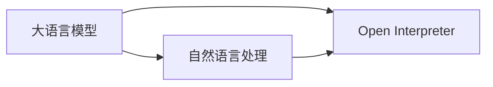

# 大语言模型应用指南：Open Interpreter

## 1. 背景介绍
### 1.1 大语言模型的发展历程
#### 1.1.1 早期的语言模型
#### 1.1.2 Transformer的出现
#### 1.1.3 预训练语言模型的崛起
### 1.2 Open Interpreter的诞生
#### 1.2.1 Open Interpreter的起源
#### 1.2.2 Open Interpreter的特点
#### 1.2.3 Open Interpreter的发展现状

## 2. 核心概念与联系
### 2.1 大语言模型
#### 2.1.1 定义
#### 2.1.2 特点
#### 2.1.3 应用领域
### 2.2 Open Interpreter
#### 2.2.1 定义
#### 2.2.2 特点  
#### 2.2.3 与传统解释器的区别
### 2.3 自然语言处理
#### 2.3.1 定义
#### 2.3.2 与大语言模型的关系
#### 2.3.3 在Open Interpreter中的应用

## 3. 核心算法原理具体操作步骤
### 3.1 Transformer架构
#### 3.1.1 Encoder
#### 3.1.2 Decoder
#### 3.1.3 Attention机制
### 3.2 预训练
#### 3.2.1 无监督预训练
#### 3.2.2 有监督微调
#### 3.2.3 预训练的优势
### 3.3 Open Interpreter的工作流程
#### 3.3.1 输入处理
#### 3.3.2 语义理解
#### 3.3.3 任务执行
#### 3.3.4 输出生成

## 4. 数学模型和公式详细讲解举例说明
### 4.1 Transformer的数学原理
#### 4.1.1 Self-Attention
$Attention(Q,K,V) = softmax(\frac{QK^T}{\sqrt{d_k}})V$
#### 4.1.2 Multi-Head Attention 
$$MultiHead(Q,K,V) = Concat(head_1, ..., head_h)W^O$$
$$head_i = Attention(QW_i^Q, KW_i^K, VW_i^V)$$
#### 4.1.3 前馈神经网络
$FFN(x) = max(0, xW_1 + b_1)W_2 + b_2$
### 4.2 预训练的损失函数
#### 4.2.1 掩码语言模型损失
$L_{MLM}(\theta) = -\sum_{i=1}^{n}log P(w_i|w_{-i};\theta)$
#### 4.2.2 下一句预测损失  
$L_{NSP}(\theta) = -log P(IsNext|s_1,s_2;\theta)$

## 5. 项目实践：代码实例和详细解释说明
### 5.1 环境配置
#### 5.1.1 安装依赖库
#### 5.1.2 下载预训练模型
### 5.2 数据准备
#### 5.2.1 数据集介绍
#### 5.2.2 数据预处理
### 5.3 模型训练
#### 5.3.1 定义模型结构
#### 5.3.2 设置训练参数
#### 5.3.3 启动训练过程
### 5.4 模型评估
#### 5.4.1 评估指标
#### 5.4.2 结果分析
### 5.5 模型部署
#### 5.5.1 导出模型
#### 5.5.2 搭建推理服务

## 6. 实际应用场景
### 6.1 智能客服
#### 6.1.1 场景描述
#### 6.1.2 Open Interpreter的应用
#### 6.1.3 效果评估
### 6.2 智能助手
#### 6.2.1 场景描述
#### 6.2.2 Open Interpreter的应用
#### 6.2.3 效果评估 
### 6.3 知识问答
#### 6.3.1 场景描述
#### 6.3.2 Open Interpreter的应用
#### 6.3.3 效果评估

## 7. 工具和资源推荐
### 7.1 开源工具
#### 7.1.1 Hugging Face Transformers
#### 7.1.2 OpenAI GPT-3
#### 7.1.3 Google BERT
### 7.2 数据集
#### 7.2.1 Wikipedia
#### 7.2.2 BookCorpus
#### 7.2.3 CommonCrawl
### 7.3 学习资源
#### 7.3.1 论文
#### 7.3.2 教程
#### 7.3.3 课程

## 8. 总结：未来发展趋势与挑战
### 8.1 未来发展趋势
#### 8.1.1 模型规模的增大
#### 8.1.2 多模态融合
#### 8.1.3 个性化定制
### 8.2 面临的挑战
#### 8.2.1 计算资源的限制
#### 8.2.2 数据隐私和安全
#### 8.2.3 模型的可解释性
### 8.3 Open Interpreter的未来
#### 8.3.1 技术突破方向
#### 8.3.2 应用场景拓展
#### 8.3.3 生态建设

## 9. 附录：常见问题与解答
### 9.1 Open Interpreter与传统编程语言的区别？
Open Interpreter基于大语言模型，可以理解自然语言指令并执行相应任务，而传统编程语言需要严格遵循语法规则，缺乏灵活性。
### 9.2 Open Interpreter的局限性有哪些？
Open Interpreter在处理复杂逻辑和需要外部知识的任务时可能会遇到困难，同时推理过程的可解释性有待提高。
### 9.3 如何提高Open Interpreter的性能？
可以通过增大模型规模、引入更多领域知识、优化推理算法等方式来提升Open Interpreter的性能。

作者：禅与计算机程序设计艺术 / Zen and the Art of Computer Programming