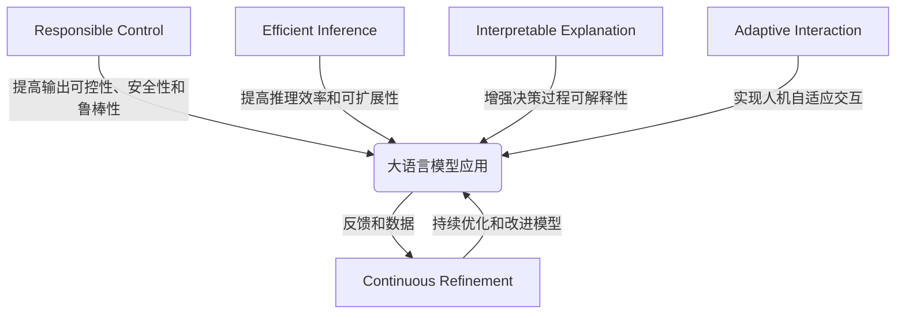

# 大语言模型应用指南：ReAct 框架

## 1. 背景介绍

随着人工智能技术的不断发展,大型语言模型 (Large Language Models, LLMs) 已经成为当前最受关注的研究热点之一。这些模型通过在海量文本数据上进行预训练,展现出了惊人的自然语言理解和生成能力,在多个领域取得了突破性的进展。然而,将这些模型应用于实际场景仍然面临诸多挑战,例如可控性、安全性、效率等问题。为了更好地利用大语言模型的强大功能,同时规避其潜在风险,我们提出了 ReAct (Responsible AI Control and Transformation) 框架,旨在为大语言模型的应用提供一种系统化、可控且负责任的解决方案。

### 1.1 大语言模型的兴起

大语言模型是一种基于 Transformer 架构的预训练模型,通过在海量文本语料库上进行自监督学习,获取了丰富的语言知识和理解能力。代表性模型包括 GPT-3、BERT、XLNet 等。这些模型在自然语言处理任务上展现出了超越人类的卓越表现,推动了人工智能领域的快速发展。

### 1.2 大语言模型应用的挑战

尽管大语言模型取得了令人瞩目的成就,但将其应用于实际场景仍然面临诸多挑战:

1. **可控性**: 大语言模型的输出往往缺乏可控性,存在产生不当、有偏见或有害内容的风险。
2. **安全性**: 模型可能会泄露隐私信息或生成违法内容,给应用带来安全隐患。
3. **效率**: 大型模型的推理过程计算量巨大,部署和运行成本高昂。
4. **可解释性**: 模型的决策过程往往是一个黑箱,缺乏可解释性和透明度。
5. **鲁棒性**: 模型容易受到对抗性攻击,输出结果的鲁棒性有待提高。

### 1.3 ReAct 框架概述

为了应对上述挑战,我们提出了 ReAct 框架,旨在为大语言模型的应用提供一种系统化、可控且负责任的解决方案。ReAct 框架包括五个核心模块:

1. **Responsible Control (负责任控制)**: 通过约束优化、对抗训练等技术,提高模型输出的可控性、安全性和鲁棒性。
2. **Efficient Inference (高效推理)**: 采用模型压缩、分布式推理等策略,提高推理过程的效率和可扩展性。
3. **Interpretable Explanation (可解释性说明)**: 引入注意力可视化、概念激活向量等技术,增强模型决策过程的可解释性。
4. **Adaptive Interaction (自适应交互)**: 通过人机协作、反馈调整等机制,实现人与模型之间的自适应交互。
5. **Continuous Refinement (持续优化)**: 基于模型应用中收集的反馈和数据,持续优化和改进模型的性能。

本文将详细介绍 ReAct 框架的核心理念、技术细节和实践经验,为大语言模型的负责任应用提供指导和建议。

## 2. 核心概念与联系

ReAct 框架的核心思想是将负责任的人工智能原则贯穿于大语言模型的整个应用生命周期,从而实现可控、高效、可解释、自适应和持续优化的目标。框架中的五个模块相互关联、协同作用,共同构建了一个完整的解决方案。

### 2.1 Responsible Control (负责任控制)

负责任控制模块旨在提高大语言模型输出的可控性、安全性和鲁棒性,确保模型在应用场景中产生负责任的输出。主要技术包括:

1. **约束优化 (Constrained Optimization)**: 在模型训练过程中引入约束条件,限制模型输出满足特定的规则或要求。
2. **对抗训练 (Adversarial Training)**: 通过注入对抗性样本,增强模型对于有害输出或对抗性攻击的鲁棒性。
3. **输出过滤 (Output Filtering)**: 使用规则或机器学习模型对模型输出进行过滤,移除不当或有害内容。

### 2.2 Efficient Inference (高效推理)

高效推理模块旨在提高大语言模型推理过程的效率和可扩展性,降低部署和运行成本。主要技术包括:

1. **模型压缩 (Model Compression)**: 通过知识蒸馏、剪枝等技术,压缩大型模型的参数规模,降低推理计算量。
2. **分布式推理 (Distributed Inference)**: 将大型模型分割部署在多个计算节点上,实现并行推理和负载均衡。
3. **硬件加速 (Hardware Acceleration)**: 利用 GPU、TPU 等专用硬件,加速模型推理过程。

### 2.3 Interpretable Explanation (可解释性说明)

可解释性说明模块旨在增强大语言模型决策过程的可解释性和透明度,提高用户对模型输出的信任度。主要技术包括:

1. **注意力可视化 (Attention Visualization)**: 通过可视化 Transformer 模型中的注意力机制,解释模型关注的重点信息。
2. **概念激活向量 (Concept Activation Vectors)**: 使用人工标注的概念集,量化模型对不同概念的激活程度,解释模型的决策依据。
3. **决策路径追踪 (Decision Path Tracking)**: 追踪模型在生成输出时的中间状态和决策路径,提供更细粒度的解释。

### 2.4 Adaptive Interaction (自适应交互)

自适应交互模块旨在实现人与大语言模型之间的自适应交互,提高模型输出的有效性和用户体验。主要技术包括:

1. **人机协作 (Human-AI Collaboration)**: 将人工智能与人类专家知识相结合,实现人机协同工作。
2. **反馈调整 (Feedback Adjustment)**: 根据用户对模型输出的反馈,动态调整模型参数或策略,提高输出质量。
3. **对话管理 (Dialogue Management)**: 在对话系统中,根据上下文信息和用户意图,控制模型输出的合理性和连贯性。

### 2.5 Continuous Refinement (持续优化)

持续优化模块旨在基于大语言模型应用中收集的反馈和数据,持续优化和改进模型的性能。主要技术包括:

1. **在线学习 (Online Learning)**: 利用模型应用过程中收集的新数据,持续对模型进行微调和改进。
2. **人工标注 (Human Annotation)**: 通过人工标注模型输出的质量和问题,为模型优化提供监督信号。
3. **自动化测试 (Automated Testing)**: 构建自动化测试框架,持续评估和监控模型的性能和行为。

## 3. 核心算法原理具体操作步骤

在本节中,我们将详细介绍 ReAct 框架中几个核心算法的原理和具体操作步骤。

### 3.1 约束优化 (Constrained Optimization)

约束优化是负责任控制模块中的一种关键技术,旨在在模型训练过程中引入约束条件,限制模型输出满足特定的规则或要求。常见的约束条件包括:

- 语义约束: 确保输出符合特定的语义规则或领域知识。
- 风险约束: 限制输出中出现有害、不当或违法内容的风险。
- 公平性约束: 减少模型输出中的偏见和歧视性内容。

约束优化的核心思想是将原始的最大似然目标函数扩展为一个约束优化问题,同时优化模型对训练数据的拟合程度和满足约束条件的程度。

具体操作步骤如下:

1. 定义约束函数 $C(\theta, x, y)$,用于量化模型输出 $y$ 对于约束条件的违反程度,其中 $\theta$ 为模型参数, $x$ 为输入数据。
2. 将原始的最大似然目标函数 $\mathcal{L}(\theta)$ 扩展为约束优化问题:

$$
\begin{aligned}
\min_\theta \quad & \mathcal{L}(\theta) \\
\text{s.t.} \quad & C(\theta, x, y) \leq \epsilon
\end{aligned}
$$

其中 $\epsilon$ 为约束条件的阈值。

3. 使用约束优化算法 (如投射梯度下降、Frank-Wolfe 算法等) 求解上述优化问题,得到满足约束条件的模型参数 $\theta^*$。

4. 在推理阶段,使用优化后的模型参数 $\theta^*$ 生成满足约束条件的输出。

约束优化算法的关键在于设计合适的约束函数 $C(\theta, x, y)$,以及高效求解约束优化问题。常见的约束函数包括基于规则的函数、基于监督学习的判别模型等。

### 3.2 对抗训练 (Adversarial Training)

对抗训练是提高模型鲁棒性的一种有效方法,通过注入对抗性样本,增强模型对于有害输出或对抗性攻击的鲁棒性。

对抗训练的核心思想是在原始训练数据中注入对抗性扰动,使模型在训练过程中接触到更多的边界案例和异常情况,从而提高模型的泛化能力和鲁棒性。

具体操作步骤如下:

1. 定义对抗性攻击函数 $A(x, y, \theta)$,用于生成对抗性扰动 $\delta$,使得模型在扰动后的输入 $x' = x + \delta$ 上产生错误输出。常见的攻击函数包括快速梯度符号方法 (FGSM)、投影梯度下降 (PGD) 等。

2. 在每个训练批次中,除了使用原始训练数据 $(x, y)$ 计算损失函数 $\mathcal{L}(\theta, x, y)$ 外,还使用对抗性扰动后的数据 $(x', y)$ 计算对抗损失 $\mathcal{L}_{adv}(\theta, x', y)$。

3. 将原始损失函数和对抗损失函数相加,得到总损失函数:

$$
\mathcal{L}_{total}(\theta, x, y) = \mathcal{L}(\theta, x, y) + \lambda \mathcal{L}_{adv}(\theta, x', y)
$$

其中 $\lambda$ 为对抗损失的权重系数。

4. 使用梯度下降等优化算法,最小化总损失函数 $\mathcal{L}_{total}(\theta, x, y)$,得到具有更好鲁棒性的模型参数 $\theta^*$。

5. 在推理阶段,使用优化后的模型参数 $\theta^*$ 生成输出。

对抗训练的关键在于设计合适的对抗性攻击函数 $A(x, y, \theta)$,以及选择合理的对抗损失权重 $\lambda$,在模型准确性和鲁棒性之间达成平衡。

### 3.3 模型压缩 (Model Compression)

模型压缩是高效推理模块中的一种核心技术,旨在通过知识蒸馏、剪枝等方法,压缩大型模型的参数规模,降低推理计算量。

知识蒸馏是模型压缩中最常用的技术之一,其核心思想是利用一个大型教师模型 (Teacher Model) 指导一个小型学生模型 (Student Model) 的训练,使学生模型能够学习到教师模型的知识和行为。

具体操作步骤如下:

1. 训练一个大型教师模型 $T$,作为知识来源。

2. 定义一个小型学生模型 $S$,其参数规模远小于教师模型。

3. 在训练学生模型时,除了使用原始训练数据 $(x, y)$ 计算监督损失 $\mathcal{L}_{sup}(S, x, y)$ 外,还引入知识