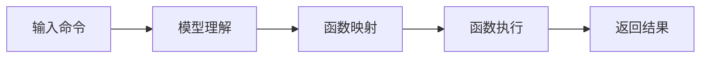

## 1.背景介绍

随着人工智能的飞速发展，大语言模型如GPT-3等已经在多个领域取得了显著的成果，包括自然语言处理、对话系统、文本生成等。这些模型的一个重要应用就是function calling，即通过语言模型来调用函数。这种方法将自然语言处理与编程语言的执行相结合，为我们提供了一种全新的方式来处理和理解语言。

## 2.核心概念与联系

在进行function calling时，我们需要理解以下几个核心概念：

- **语言模型**：语言模型是一种统计和预测的工具，它能够预测某个词在给定的一系列词后面出现的概率。

- **函数调用**：在编程中，函数调用是一种常见的操作，它允许我们执行特定的代码块。

- **语言模型的函数调用**：这是将语言模型与函数调用相结合的一种新的方法，通过这种方法，我们可以使用自然语言的命令来调用函数。

这三个概念相互关联，共同构成了我们今天要讨论的主题。

## 3.核心算法原理具体操作步骤

语言模型的函数调用的基本步骤如下：

1. **输入命令**：首先，我们需要输入一个自然语言的命令，如“计算两个数的和”。

2. **模型理解**：语言模型将解析这个命令，理解其含义。

3. **函数映射**：模型将命令映射到一个具体的函数，如“add”。

4. **函数执行**：模型执行这个函数，并返回结果。

这个过程可以用以下的Mermaid流程图来表示：



## 4.数学模型和公式详细讲解举例说明

在语言模型的函数调用中，我们主要使用了条件概率的概念。给定一个词序列，我们想要找到最可能的下一个词。这可以通过计算所有可能词的条件概率，然后选择概率最大的那个词来实现。

假设我们的词序列为$w_1, w_2, ..., w_n$，我们想要预测下一个词$w_{n+1}$。那么，我们可以计算其条件概率：

$$P(w_{n+1} | w_1, w_2, ..., w_n)$$

然后选择概率最大的词作为我们的预测。

## 5.项目实践：代码实例和详细解释说明

下面是一个简单的例子，展示了如何使用GPT-3进行函数调用。首先，我们需要安装OpenAI的GPT-3库：

```python
pip install openai
```

然后，我们可以使用以下代码来调用函数：

```python
import openai

openai.api_key = 'your-api-key'

response = openai.Completion.create(
  engine="text-davinci-002",
  prompt="Calculate the sum of 5 and 3.",
  max_tokens=10
)

print(response.choices[0].text.strip())
```

在这个例子中，我们首先设置了我们的API密钥，然后我们创建了一个新的Completion对象，输入了我们的命令“Calculate the sum of 5 and 3.”，并设置了最大的返回词数为10。然后，我们打印出了返回的文本，这就是我们的结果。

## 6.实际应用场景

语言模型的函数调用有很多实际的应用场景。例如，我们可以用它来创建一个智能的聊天机器人，用户可以用自然语言来提问，机器人可以理解问题并给出答案。另一个应用是在编程教学中，学生可以用自然语言来描述他们想要做的事情，然后系统可以帮助他们生成相应的代码。

## 7.工具和资源推荐

如果你想要深入学习和实践语言模型的函数调用，我推荐以下的工具和资源：

- **OpenAI GPT-3**：这是目前最强大的语言模型，你可以使用它来进行函数调用。

- **Hugging Face Transformers**：这是一个开源的库，提供了许多预训练的语言模型，你可以使用它来学习和实践。

## 8.总结：未来发展趋势与挑战

语言模型的函数调用是一个非常有前景的领域，它结合了自然语言处理和编程语言的执行，为我们提供了一种全新的方式来处理和理解语言。然而，这个领域也面临着一些挑战，例如如何提高模型的理解能力，如何处理模糊的命令等。我相信随着技术的进步，我们将能够克服这些挑战，实现更多的可能性。

## 9.附录：常见问题与解答

**问：语言模型的函数调用可以用在哪些领域？**

答：语言模型的函数调用可以用在很多领域，例如智能聊天机器人、编程教学、自动编程等。

**问：如何提高语言模型的函数调用的准确性？**

答：提高准确性的方法有很多，例如使用更大的模型、使用更多的训练数据、优化模型的架构等。

作者：禅与计算机程序设计艺术 / Zen and the Art of Computer Programming