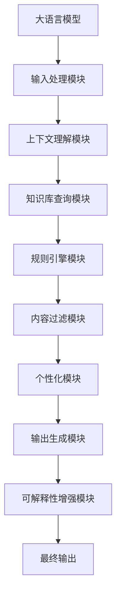

# 大语言模型应用指南：为什么需要外部工具

## 1.背景介绍

### 1.1 大语言模型的兴起

近年来,随着人工智能技术的不断发展,大型语言模型(Large Language Models, LLMs)在自然语言处理领域取得了令人瞩目的成就。这些模型通过在海量文本数据上进行预训练,学习到了丰富的语言知识和上下文信息,展现出了惊人的文本生成、问答、总结和翻译等能力。

代表性的大语言模型包括 GPT-3(Generative Pre-trained Transformer 3)、BERT(Bidirectional Encoder Representations from Transformers)、XLNet、T5(Text-to-Text Transfer Transformer)等。它们的出现,为自然语言处理领域带来了革命性的变革,极大地推动了智能对话、内容创作、信息检索等应用的发展。

### 1.2 大语言模型的局限性

尽管大语言模型展现出了强大的语言理解和生成能力,但它们也存在一些固有的局限性和缺陷。首先,这些模型通常是基于大规模的文本数据进行预训练,而这些数据可能存在偏差、噪声和不确定性,导致模型在特定领域或任务上的表现受到影响。

其次,大语言模型缺乏对上下文和世界知识的深入理解,容易产生不合理或矛盾的输出。此外,它们也存在安全性和隐私问题,可能会生成有害或不当的内容。

因此,仅依赖大语言模型本身是远远不够的,我们需要引入外部工具和技术来增强和补充它们的能力,从而实现更加智能、安全和可靠的自然语言处理应用。

## 2.核心概念与联系

### 2.1 外部工具的作用

引入外部工具主要有以下几个作用:

1. **提高准确性和相关性**:通过引入特定领域的知识库、规则和约束,可以指导和校正大语言模型的输出,使其更加准确和相关。
2. **增强理解和推理能力**:外部工具可以提供额外的上下文信息、常识知识和推理能力,帮助大语言模型更好地理解和推理复杂的语义关系。
3. **保证安全性和可控性**:通过引入内容过滤、策略控制和监督机制,可以防止大语言模型生成有害或不当的内容,提高其安全性和可控性。
4. **提升可解释性和可信度**:外部工具可以提供解释和证据支持,增强大语言模型输出的可解释性和可信度。
5. **实现个性化和定制化**:通过引入用户偏好、领域知识和特定任务需求,可以实现大语言模型输出的个性化和定制化。

### 2.2 外部工具的类型

常见的外部工具包括但不限于:

1. **知识库和本体**:包括结构化的知识图谱、领域本体和事实数据库等。
2. **规则引擎和约束系统**:基于领域知识和最佳实践制定的规则和约束,用于指导和校正大语言模型的输出。
3. **上下文理解和推理模块**:通过对话历史、场景信息和常识知识进行推理,提高对上下文的理解能力。
4. **内容过滤和策略控制**:基于预定义的策略和规则,过滤和控制大语言模型的输出内容。
5. **可解释性和可信度增强模块**:提供证据支持、解释生成和可视化等功能,增强输出的可解释性和可信度。
6. **个性化和定制化模块**:根据用户偏好、领域知识和任务需求,对大语言模型的输出进行个性化和定制化。

这些外部工具与大语言模型相结合,构成了一个综合的智能系统,能够提供更加准确、安全和可靠的自然语言处理服务。

## 3.核心算法原理具体操作步骤

### 3.1 大语言模型与外部工具的集成框架

为了有效地将大语言模型与外部工具相结合,我们需要一个灵活且可扩展的集成框架。该框架应该能够无缝地集成各种外部工具,并与大语言模型进行交互和协作。

一种常见的集成框架如下所示:

该框架的工作流程如下:

1. **输入处理模块**:对用户输入进行预处理,如分词、词性标注、命名实体识别等。
2. **上下文理解模块**:结合对话历史、场景信息和常识知识,对输入的上下文进行理解和推理。
3. **知识库查询模块**:根据上下文,从知识库中查询相关的事实和信息。
4. **规则引擎模块**:基于领域知识和最佳实践,应用规则和约束来指导和校正大语言模型的输出。
5. **内容过滤模块**:根据预定义的策略和规则,过滤和控制大语言模型的输出内容。
6. **个性化模块**:根据用户偏好、领域知识和任务需求,对大语言模型的输出进行个性化和定制化。
7. **输出生成模块**:将经过处理的上下文信息和知识库信息输入大语言模型,生成初步输出。
8. **可解释性增强模块**:提供证据支持、解释生成和可视化等功能,增强输出的可解释性和可信度。
9. **最终输出**:将经过各个模块处理的输出呈现给用户。

该框架的优点在于模块化设计,各个模块可以独立开发和替换,从而实现高度的灵活性和可扩展性。同时,它也支持不同的大语言模型和外部工具的集成,满足不同应用场景的需求。

### 3.2 关键算法和技术

在上述集成框架中,涉及到了多种关键算法和技术,包括但不限于:

1. **自然语言理解**:用于理解输入的上下文和意图,包括分词、词性标注、命名实体识别、句法分析、语义分析等技术。
2. **知识表示与推理**:用于构建和查询知识库,以及进行推理和reasoning,包括知识图谱、本体论、规则推理等技术。
3. **内容过滤和策略控制**:用于过滤和控制大语言模型的输出内容,包括基于规则的过滤、基于机器学习的内容审核等技术。
4. **个性化和定制化**:用于根据用户偏好、领域知识和任务需求对输出进行个性化和定制化,包括协同过滤、内容推荐等技术。
5. **可解释性增强**:用于提供证据支持、解释生成和可视化等功能,增强输出的可解释性和可信度,包括解释性AI、可视化技术等。
6. **大语言模型优化**:用于优化大语言模型的性能和效率,包括模型压缩、知识蒸馏、增量学习等技术。

这些算法和技术的有机结合,为大语言模型与外部工具的集成提供了坚实的理论和技术基础。

## 4.数学模型和公式详细讲解举例说明

在大语言模型与外部工具的集成过程中,涉及到多种数学模型和公式。以下是一些典型的数学模型和公式,以及它们在不同模块中的应用。

### 4.1 自然语言理解模块

在自然语言理解模块中,常用的数学模型包括:

1. **条件随机场(Conditional Random Fields, CRFs)**:用于序列标注任务,如分词、词性标注和命名实体识别等。CRFs的目标是最大化条件概率 $P(y|x)$,其中 $x$ 表示输入序列, $y$ 表示对应的标注序列。CRFs的基本思想是定义一个全局特征函数 $f(y_i, y_{i-1}, x, i)$,并通过最大化如下对数似然函数来学习模型参数:

$$\mathcal{L}(\theta) = \sum_{i=1}^{n} \log P(y_i|x_i; \theta)$$

2. **依存句法分析**:用于分析句子的语法结构和词与词之间的依存关系。常用的数学模型包括基于图的模型,如最大跨度树(Maximum Spanning Tree)和投射依存句法模型(Projective Dependency Parsing)等。这些模型通常采用动态规划或基于梯度的优化算法进行训练和推理。

3. **语义角色标注(Semantic Role Labeling, SRL)**:用于识别句子中谓词-论元结构,即"谁做了什么"。常用的数学模型包括基于特征的线性模型和基于神经网络的模型。后者通常采用序列标注或结构化预测的方法,如双向LSTM-CRF模型等。

### 4.2 知识表示与推理模块

在知识表示与推理模块中,常用的数学模型包括:

1. **知识图谱嵌入**:将实体和关系映射到低维连续向量空间,以捕获它们之间的语义关系。常用的嵌入模型包括TransE、DistMult、ComplEx等。这些模型通常采用基于能量函数的目标函数进行优化,如:

$$\mathcal{L} = \sum_{(h,r,t) \in \mathcal{S}} \sum_{(h',r',t') \in \mathcal{S'}} [\gamma + f_r(h,t) - f_r(h',t')]_+$$

其中 $\mathcal{S}$ 和 $\mathcal{S'}$ 分别表示正例和负例三元组集合, $f_r$ 是关系 $r$ 对应的打分函数, $\gamma$ 是边距超参数。

2. **规则推理**:基于一阶逻辑或描述逻辑等形式化规则系统进行推理。常用的推理算法包括前向链接(Forward Chaining)、后向链接(Backward Chaining)、决策树等。

3. **概率图模型**:用于表示和推理复杂的概率分布,如贝叶斯网络、马尔可夫网络等。这些模型通常采用变分推理(Variational Inference)、马尔可夫链蒙特卡罗(Markov Chain Monte Carlo, MCMC)等算法进行近似推理。

### 4.3 内容过滤和策略控制模块

在内容过滤和策略控制模块中,常用的数学模型包括:

1. **文本分类模型**:用于判断输出内容是否属于某个类别(如有害内容、不当内容等)。常用的模型包括逻辑回归、支持向量机(SVM)、神经网络等。这些模型通常采用交叉熵损失函数进行训练,如:

$$\mathcal{L} = -\frac{1}{N} \sum_{i=1}^{N} y_i \log(p_i) + (1 - y_i) \log(1 - p_i)$$

其中 $y_i$ 表示样本 $i$ 的真实标签, $p_i$ 表示模型预测的概率。

2. **主题模型**:用于发现文本中的潜在主题,并根据主题进行过滤和控制。常用的模型包括潜在狄利克雷分配(Latent Dirichlet Allocation, LDA)等。LDA的基本思想是假设每个文档由一组主题构成,每个主题又由一组词构成,并通过贝叶斯推断来学习主题-词分布和文档-主题分布。

3. **对抗性训练**:通过对抗性训练,可以增强模型对有害或不当内容的鲁棒性。常用的对抗性训练方法包括对抗样本生成、对抗正则化等。

### 4.4 个性化和定制化模块

在个性化和定制化模块中,常用的数学模型包括:

1. **协同过滤**:利用用户-项目交互数据,发现用户之间或项目之间的相似性,从而进行个性化推荐。常用的协同过滤模型包括基于邻域的方法(如用户基于邻域、项目基于邻域)和基于模型的方法(如矩阵分解、张量分解等)。

2. **主题模型**:通过发现用户兴趣主题和内容主题,实现个性化