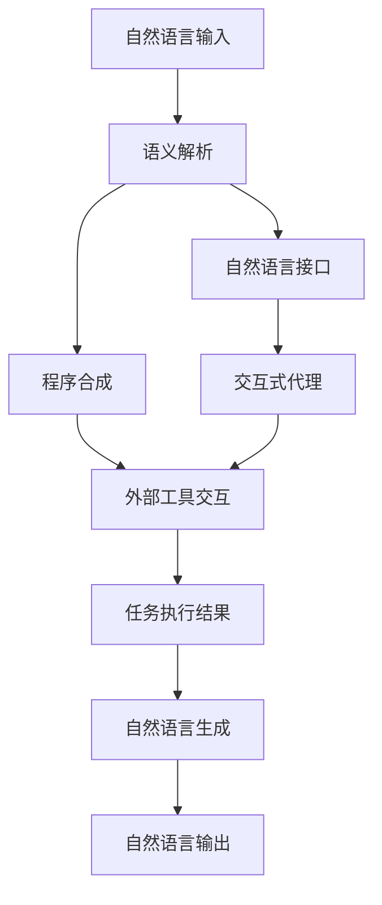

# 大语言模型应用指南：什么是外部工具

## 1. 背景介绍

随着人工智能技术的不断发展,大型语言模型(Large Language Models, LLMs)已经成为当前最具影响力的人工智能技术之一。这些模型通过从海量文本数据中学习,掌握了丰富的自然语言理解和生成能力,可以用于多种自然语言处理任务,如机器翻译、问答系统、文本摘要等。

然而,尽管大型语言模型拥有强大的语言能力,但它们仍然存在一些局限性。例如,缺乏对现实世界的理解和推理能力、无法访问最新信息、缺乏持续学习能力等。为了解决这些问题,研究人员提出了将外部工具与大型语言模型相结合的想法,以扩展其功能和应用范围。

### 1.1 什么是外部工具

外部工具(External Tools)是指与大型语言模型集成的外部系统、API或服务,它们可以为语言模型提供额外的功能和知识。这些工具可以是搜索引擎、知识库、计算工具、API等,通过与语言模型的交互,它们可以为模型提供所需的信息、计算能力或执行特定任务的能力。

外部工具的引入旨在弥补大型语言模型的不足,使其能够访问最新信息、利用专业知识、执行复杂计算等,从而提高模型的性能和应用范围。

### 1.2 外部工具的作用

将外部工具与大型语言模型相结合,可以带来以下主要好处:

1. **访问最新信息**: 通过与搜索引擎或知识库的集成,语言模型可以访问最新的信息和知识,而不再局限于训练数据集的范围。

2. **利用专业知识**: 一些专业领域的外部工具(如医疗诊断系统、金融分析工具等)可以为语言模型提供专业知识,使其能够处理特定领域的任务。

3. **执行复杂计算**: 通过与计算工具(如数学计算器、科学计算库等)的集成,语言模型可以执行复杂的数学运算和科学计算。

4. **扩展功能**: 外部工具可以为语言模型提供新的功能,如图像处理、音频处理、自动化任务执行等,从而扩展模型的应用范围。

5. **提高可解释性**: 一些外部工具可以为语言模型的输出提供解释和证据支持,提高模型的可解释性和可信度。

通过与外部工具的集成,大型语言模型可以克服自身的局限性,成为更加通用、强大和可靠的人工智能系统。

## 2. 核心概念与联系

在探讨外部工具与大型语言模型的集成之前,我们需要了解一些核心概念及它们之间的联系。

### 2.1 语义解析 (Semantic Parsing)

语义解析是将自然语言查询转换为可执行的形式表示(如逻辑形式或程序)的过程。它是将外部工具与语言模型集成的关键步骤,因为它能够理解用户的意图,并将其转换为可供外部工具执行的指令。

语义解析通常包括以下几个步骤:

1. **词法分析**: 将输入的自然语言查询分解为单词序列。
2. **句法分析**: 根据语言的语法规则,构建查询的句法树。
3. **语义分析**: 将句法树映射到语义表示,捕获查询的意义。
4. **意图识别**: 确定查询的目的,如查询信息、执行命令等。
5. **槽位填充**: 从查询中提取关键信息,如实体、属性等。

通过语义解析,语言模型可以将自然语言查询转换为可供外部工具理解和执行的形式。

### 2.2 自然语言接口 (Natural Language Interface)

自然语言接口是指用户可以使用自然语言与系统进行交互的界面。在将外部工具与语言模型集成的场景中,自然语言接口允许用户使用自然语言提出查询或命令,而不需要学习特定的API或命令语言。

自然语言接口通常包括以下组件:

1. **语言理解模块**: 负责将用户的自然语言输入转换为系统可以理解的形式,通常使用语义解析技术。
2. **对话管理模块**: 维护对话状态,确定系统的响应策略。
3. **任务执行模块**: 与外部工具集成,执行用户请求的任务。
4. **自然语言生成模块**: 将系统的响应转换为自然语言输出。

自然语言接口使得用户可以更加自然和友好地与系统交互,降低了使用门槛,提高了用户体验。

### 2.3 程序合成 (Program Synthesis)

程序合成是指根据给定的规范或示例,自动生成满足要求的计算机程序的过程。在将外部工具与语言模型集成的场景中,程序合成可以用于将自然语言查询转换为可执行的程序,从而与外部工具进行交互。

程序合成通常包括以下步骤:

1. **规范理解**: 从自然语言查询或示例中提取任务规范。
2. **搜索空间构建**: 根据规范,构建可能的程序空间。
3. **程序搜索**: 在程序空间中搜索满足规范的程序。
4. **程序评估**: 评估生成的程序是否满足规范。
5. **程序优化**: 对生成的程序进行优化,提高效率和可读性。

通过程序合成,语言模型可以将自然语言查询转换为可执行的程序,从而与外部工具进行交互和执行任务。

### 2.4 交互式代理 (Interactive Agent)

交互式代理是指能够与用户进行自然语言交互,并执行各种任务的智能系统。在将外部工具与语言模型集成的场景中,交互式代理可以作为中介,接收用户的自然语言输入,与外部工具交互以执行任务,并将结果以自然语言形式呈现给用户。

交互式代理通常包括以下组件:

1. **自然语言理解模块**: 将用户的自然语言输入转换为系统可以理解的形式。
2. **任务规划模块**: 根据用户的输入和系统的知识库,规划执行任务所需的步骤。
3. **外部工具交互模块**: 与外部工具进行交互,执行任务所需的操作。
4. **自然语言生成模块**: 将任务执行结果转换为自然语言输出。
5. **对话管理模块**: 维护对话状态,确保交互的连贯性和上下文相关性。

交互式代理可以作为语言模型与外部工具之间的桥梁,提供自然语言交互界面,并协调任务执行过程。

### 2.5 关系图

为了更好地理解这些核心概念之间的关系,我们可以使用 Mermaid 流程图进行可视化表示:

在这个关系图中,我们可以看到:

1. 用户的自然语言输入首先通过语义解析模块进行处理。
2. 语义解析的结果可以用于程序合成,生成可执行的程序与外部工具进行交互。
3. 语义解析的结果也可以被自然语言接口模块使用,将自然语言输入转换为系统可以理解的形式。
4. 自然语言接口模块可以与交互式代理模块集成,提供自然语言交互界面。
5. 交互式代理模块可以与外部工具进行交互,执行任务。
6. 任务执行结果可以通过自然语言生成模块转换为自然语言输出,呈现给用户。

这些核心概念的有机结合,使得语言模型能够与外部工具无缝集成,提供自然语言交互界面,并执行各种复杂任务。

## 3. 核心算法原理具体操作步骤

在将外部工具与大型语言模型集成的过程中,需要采用一些核心算法和技术。本节将介绍其中一些关键算法的原理和具体操作步骤。

### 3.1 语义解析算法

语义解析是将自然语言查询转换为可执行形式表示的关键步骤。常见的语义解析算法包括:

#### 3.1.1 基于规则的语义解析

基于规则的语义解析算法依赖于手工定义的语法和语义规则。具体操作步骤如下:

1. **定义语法规则**: 使用形式语法(如上下文无关文法)定义自然语言查询的语法结构。
2. **定义语义规则**: 为每个语法规则定义相应的语义规则,用于将语法结构映射到语义表示。
3. **句法分析**: 使用句法分析器(如递归下降分析器或图形分析器)构建查询的句法树。
4. **语义构建**: 遍历句法树,应用语义规则,构建查询的语义表示。

基于规则的语义解析算法具有较高的准确性,但需要大量的人工工作来定义规则,且难以处理复杂的自然语言现象。

#### 3.1.2 基于统计的语义解析

基于统计的语义解析算法使用机器学习技术从大量的语言数据中自动学习语法和语义模式。常见的算法包括:

1. **基于分类的语义解析**: 将语义解析视为一个多类别分类问题,使用监督学习算法(如支持向量机、逻辑回归等)从训练数据中学习语义解析模型。
2. **基于序列标注的语义解析**: 将语义解析视为一个序列标注问题,使用序列标注算法(如条件随机场、递归神经网络等)从训练数据中学习语义解析模型。
3. **基于注意力的神经语义解析**: 使用注意力机制和序列到序列模型(如Transformer)直接从自然语言查询和语义表示的对应关系中学习语义解析模型。

基于统计的语义解析算法可以自动学习语言模式,但需要大量的高质量训练数据,并且模型的可解释性较差。

### 3.2 程序合成算法

程序合成算法旨在从自然语言规范或示例中自动生成满足要求的计算机程序。常见的程序合成算法包括:

#### 3.2.1 基于约束求解的程序合成

基于约束求解的程序合成算法将程序合成视为一个约束满足问题(Constraint Satisfaction Problem, CSP)。具体操作步骤如下:

1. **构建程序空间**: 根据任务规范和可用的程序构建块,定义可能的程序空间。
2. **编码约束**: 将任务规范和程序语义编码为约束条件。
3. **求解约束**: 使用约束求解器(如SAT求解器或SMT求解器)在程序空间中搜索满足约束的程序。
4. **程序优化**: 对生成的程序进行优化,提高效率和可读性。

基于约束求解的程序合成算法具有较高的准确性和可解释性,但在处理大型程序空间时效率较低。

#### 3.2.2 基于示例导向的程序合成

基于示例导向的程序合成算法使用输入-输出示例对作为规范,通过机器学习技术自动生成满足示例的程序。常见的算法包括:

1. **神经程序合成**: 使用序列到序列模型(如Transformer)直接从输入-输出示例对中学习程序生成模型。
2. **程序归纳**: 通过构建和搜索程序空间,找到与示例一致的最小程序。
3. **程序修复**: 从一个初始程序开始,通过搜索和修复操作,生成与示例一致的程序。

基于示例导向的程序合成算法可以处理复杂的任务,但需要高质量的示例数据,并且生成的程序可解释性较差。

### 3.3 交互式代理算法

交互式代理算法旨在实现与用户的自然语言交互,并执行任务。常见的算法包括:

#### 3.3.1 基于规划的交互式代理

基于规划的交互式代理算法将任务执行视为一个规划问题,通过自动规划技