# 大语言模型应用指南：大语言模型

## 1.背景介绍

### 1.1 什么是大语言模型？

大语言模型(Large Language Model, LLM)是一种基于深度学习技术训练的具有极大规模参数的自然语言处理模型。这些模型通过在海量文本数据上进行无监督预训练,学习捕获人类语言的语义和语法规则,从而获得了强大的语言理解和生成能力。

大语言模型的出现彻底改变了自然语言处理领域,使得模型能够在广泛的任务上表现出人类水平的能力,如机器翻译、文本摘要、问答系统、内容生成等,极大地推动了人工智能技术的发展。

### 1.2 大语言模型的发展历程

大语言模型的发展可以追溯到2018年,当时谷歌发布了Transformer模型,这是第一个将自注意力机制应用于序列数据建模的模型,取得了突破性的成果。

2019年,OpenAI发布了GPT(Generative Pre-trained Transformer)模型,这是第一个在大规模语料库上预训练的生成式大语言模型,具有强大的文本生成能力。

2020年,谷歌发布了BERT(Bidirectional Encoder Representations from Transformers)模型,通过双向编码器的设计,BERT在多项自然语言理解任务上取得了state-of-the-art的表现。

2021年,OpenAI发布了GPT-3模型,这是当时最大的语言模型,包含1750亿个参数,展现出了令人惊叹的语言生成能力,可以完成包括代码生成、文本摘要、问答等多种任务。

2022年,以GPT-3为基础,OpenAI、Anthropic、Google AI等公司又陆续发布了更大更强的语言模型,如PaLM、Claude、Chinchilla等,进一步推动了大语言模型的发展。

### 1.3 大语言模型的重要性

大语言模型是当前人工智能领域最重要和最前沿的技术之一,具有重大的理论意义和应用价值:

- 理论意义:大语言模型通过无监督学习捕获了人类语言的本质规律,为语言的表示学习、概念形成等提供了新的视角和方法,推动了认知科学等相关领域的发展。

- 应用价值:大语言模型在自然语言处理的各种任务上表现出色,可广泛应用于对话系统、机器翻译、文本生成、知识问答等领域,为人机交互、智能辅助等提供了强有力的技术支撑。

- 通用性:大语言模型具有出色的通用性能力,可以通过少量的特定任务数据进行微调,就能完成各种不同的自然语言任务,被认为是通向人工通用智能(Artificial General Intelligence, AGI)的一条重要路径。

## 2.核心概念与联系

### 2.1 自注意力机制(Self-Attention)

自注意力机制是大语言模型的核心创新,它允许模型在处理序列数据时,充分利用输入序列中不同位置的信息,捕获长距离依赖关系。

在自注意力机制中,每个位置的表示是所有位置的表示的加权和,权重则由位置之间的相似性决定。这种机制使模型能够自适应地为每个目标位置分配注意力,从而更好地建模序列数据。

自注意力机制的计算过程如下所示:

$$\begin{aligned}
Q &= XW_Q\\
K &= XW_K\\
V &= XW_V\\
\text{Attention}(Q, K, V) &= \text{softmax}(\frac{QK^T}{\sqrt{d_k}})V
\end{aligned}$$

其中,$Q$、$K$、$V$分别表示查询(Query)、键(Key)和值(Value)的线性投影,通过计算查询和键的点积来获得注意力权重,再与值相乘得到注意力表示。

### 2.2 Transformer架构

Transformer是第一个完全基于自注意力机制的序列到序列模型,它抛弃了传统的递归神经网络和卷积神经网络结构,完全使用自注意力机制来建模序列数据。

Transformer的核心架构包括编码器(Encoder)和解码器(Decoder)两个部分,如下图所示:

```mermaid
graph TD
    subgraph Encoder
        MultiHeadAttention1[多头注意力]
        Add1[加法运算]
        LayerNorm1[层归一化]
        FeedForward1[前馈网络]
        Add2[加法运算]
        LayerNorm2[层归一化]
    end
    subgraph Decoder
        MultiHeadAttention2[多头注意力]
        Add3[加法运算]
        LayerNorm3[层归一化]
        MultiHeadAttention3[多头注意力]
        Add4[加法运算]
        LayerNorm4[层归一化] 
        FeedForward2[前馈网络]
        Add5[加法运算]
        LayerNorm5[层归一化]
    end

    MultiHeadAttention1 --> Add1 --> LayerNorm1 --> FeedForward1 --> Add2 --> LayerNorm2
    MultiHeadAttention2 --> Add3 --> LayerNorm3 --> MultiHeadAttention3 --> Add4 --> LayerNorm4 --> FeedForward2 --> Add5 --> LayerNorm5
```

编码器由多个相同的层组成,每一层包含两个子层:多头自注意力机制和前馈神经网络。解码器也由多个相同的层组成,除了编码器的两个子层外,还包含一个额外的多头注意力层,用于关注输入序列。

Transformer架构的创新之处在于完全放弃了循环和卷积,使用自注意力机制来直接建模输入和输出之间的依赖关系,大大提高了并行计算能力,成为大语言模型的基础架构。

### 2.3 预训练与微调(Pre-training & Fine-tuning)

大语言模型通常采用预训练与微调的范式进行训练。首先在大规模无标注语料库上进行自监督预训练,学习通用的语言表示;然后在特定的有标注数据集上进行微调,将预训练模型迁移到具体的下游任务。

预训练阶段通常采用自编码(Auto-Encoding)或自回归(Auto-Regressive)等无监督目标函数,在海量文本数据上训练模型捕获语言的本质规律。常见的预训练目标包括:

- 掩码语言模型(Masked Language Model, MLM):随机掩码部分词元,模型需要预测被掩码的词元。
- 下一句预测(Next Sentence Prediction, NSP):判断两个句子是否为连续句子。
- 因果语言模型(Causal Language Model, CLM):给定前文,模型需要预测下一个词元。

微调阶段则根据具体的下游任务设计有监督目标函数,如序列到序列生成、文本分类、问答等,在相对较小的任务数据集上继续训练预训练模型,使其适应特定任务。

通过预训练-微调的范式,大语言模型可以在预训练阶段学习通用的语言知识,并在微调阶段快速适应特定的下游任务,实现了有效的知识迁移,极大地提高了模型的泛化能力。

## 3.核心算法原理具体操作步骤

大语言模型的核心算法原理主要包括以下几个方面:

### 3.1 自注意力机制计算

自注意力机制是大语言模型的核心创新,它允许模型在处理序列数据时,充分利用输入序列中不同位置的信息,捕获长距离依赖关系。自注意力机制的计算过程如下:

1. 线性投影:将输入序列$X$分别通过三个不同的线性变换,得到查询(Query)$Q$、键(Key)$K$和值(Value)$V$:

   $$\begin{aligned}
   Q &= XW_Q\\
   K &= XW_K\\
   V &= XW_V
   \end{aligned}$$

2. 计算注意力权重:通过计算查询$Q$和键$K$的点积,除以缩放因子$\sqrt{d_k}$,得到注意力权重矩阵:

   $$\text{Attention}(Q, K, V) = \text{softmax}(\frac{QK^T}{\sqrt{d_k}})V$$

3. 多头注意力:为了捕获不同的子空间信息,我们将注意力机制扩展为多头注意力,将$Q$、$K$、$V$分别线性投影为$h$个头,分别计算注意力,再将所有头的注意力结果拼接:

   $$\text{MultiHead}(Q, K, V) = \text{Concat}(\text{head}_1, ..., \text{head}_h)W^O$$

   其中,$\text{head}_i = \text{Attention}(QW_i^Q, KW_i^K, VW_i^V)$

通过自注意力机制,模型可以自适应地为每个目标位置分配注意力,从而更好地建模序列数据。

### 3.2 Transformer编码器层计算

Transformer的编码器由多个相同的层组成,每一层包含两个子层:多头自注意力机制和前馈神经网络。编码器层的计算过程如下:

1. 多头自注意力子层:
   - 将输入$X$通过多头自注意力机制计算得到$X'$
   - 对$X'$进行残差连接和层归一化,得到$Z_1$

2. 前馈网络子层:
   - 将$Z_1$通过两层全连接前馈网络计算得到$Z_2$
   - 对$Z_2$进行残差连接和层归一化,得到$Z_3$

3. 将$Z_3$作为下一层的输入,重复上述过程

通过这种层次结构,编码器可以逐层提取输入序列的高级语义表示。

### 3.3 Transformer解码器层计算  

Transformer的解码器也由多个相同的层组成,除了编码器的两个子层外,还包含一个额外的多头注意力层,用于关注输入序列。解码器层的计算过程如下:

1. 掩码多头自注意力子层:
   - 对目标序列进行掩码多头自注意力计算,得到$X'$
   - 对$X'$进行残差连接和层归一化,得到$Z_1$

2. 编码器-解码器注意力子层:
   - 将$Z_1$和编码器输出进行多头注意力计算,得到$Z_2$
   - 对$Z_2$进行残差连接和层归一化,得到$Z_3$

3. 前馈网络子层:
   - 将$Z_3$通过两层全连接前馈网络计算得到$Z_4$
   - 对$Z_4$进行残差连接和层归一化,得到$Z_5$
   
4. 将$Z_5$作为下一层的输入,重复上述过程

通过掩码机制,解码器可以避免利用目标序列的未来信息,保证生成的自回归性。同时,通过编码器-解码器注意力,解码器可以关注输入序列的信息,实现序列到序列的转换。

### 3.4 预训练与微调

大语言模型通常采用预训练与微调的范式进行训练,具体步骤如下:

1. 预训练阶段:
   - 收集大规模无标注语料库,如网页、书籍、维基百科等
   - 设计自监督预训练目标函数,如掩码语言模型、下一句预测、因果语言模型等
   - 在海量语料库上训练模型,学习通用的语言表示

2. 微调阶段:
   - 针对特定的下游任务,收集有标注的任务数据集
   - 设计有监督目标函数,如序列到序列生成、文本分类、问答等
   - 在任务数据集上继续训练预训练模型,使其适应特定任务
   - 可选择对预训练模型进行层级微调或全量微调

通过预训练-微调的范式,大语言模型可以在预训练阶段学习通用的语言知识,并在微调阶段快速适应特定的下游任务,实现了有效的知识迁移,极大地提高了模型的泛化能力。

## 4.数学模型和公式详细讲解举例说明

在大语言模型中,自注意力机制和Transformer架构是最核心的数学模型,我们将详细讲解它们的公式及其含义。

### 4.1 自注意力机制

自注意力机制的计算公式如下:

$$\begin{aligned}
Q &= XW_Q\\
K &= XW_K\\
V &= XW_V\\
\text{Attention}(Q, K, V) &= \text{softmax}(\frac{QK^T}{\sqrt{d_k}})V
\end{aligned}$$

其中: