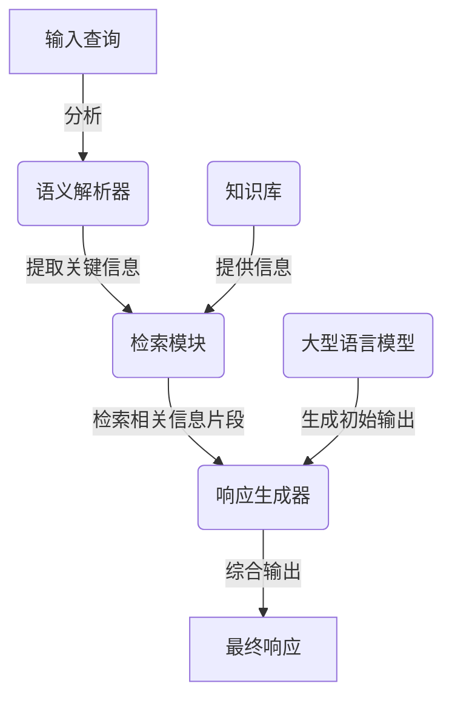

# 大语言模型应用指南：改进ReAct框架

## 1.背景介绍

随着人工智能和自然语言处理技术的快速发展,大型语言模型(Large Language Models, LLMs)已经成为当前最先进的人工智能系统之一。这些模型通过在海量文本数据上进行预训练,学习了丰富的语言知识和上下文信息,能够生成高质量、连贯的自然语言输出。

然而,现有的大型语言模型存在一些局限性,例如缺乏一致性、可解释性和可控性。为了更好地利用这些模型的强大能力并克服其局限性,研究人员提出了ReAct(Retrieval-Augmented Language Model Chains)框架。该框架将语言模型与检索增强模块相结合,旨在提高语言模型的一致性、可解释性和可控性。

### 1.1 ReAct框架概述

ReAct框架由以下几个主要组件组成:

1. **语言模型(LM)**: 一个经过预训练的大型语言模型,用于生成自然语言输出。
2. **检索模块(RM)**: 一个基于语义相似性的检索系统,用于从知识库中检索与当前上下文相关的信息片段。
3. **语义解析器(SP)**: 一个自然语言理解模块,用于分析输入查询并提取关键信息,以指导检索和响应生成过程。
4. **响应生成器(RG)**: 一个组件,将语言模型的输出与检索到的信息片段结合起来,生成最终的响应。

这些组件通过一个循环过程协同工作,以提高语言模型的一致性、可解释性和可控性。

### 1.2 ReAct框架的优势

与传统的语言模型相比,ReAct框架具有以下优势:

1. **一致性提高**: 通过将语言模型的输出与外部知识库中的事实信息相结合,ReAct框架可以生成更加一致和准确的响应。
2. **可解释性增强**: 由于将检索到的信息片段融入响应中,ReAct框架的输出更加透明和可解释。
3. **可控性提高**: 通过调整检索模块和语义解析器的参数,可以控制ReAct框架的输出,使其更加符合特定的需求和偏好。

## 2.核心概念与联系

### 2.1 大型语言模型(LLMs)

大型语言模型是一种基于transformer架构的深度神经网络模型,通过在海量文本数据上进行预训练,学习了丰富的语言知识和上下文信息。这些模型可以生成高质量、连贯的自然语言输出,在各种自然语言处理任务中表现出色,如机器翻译、文本生成、问答系统等。

常见的大型语言模型包括GPT-3、BERT、XLNet等。这些模型通过自监督学习或半监督学习的方式进行预训练,能够捕捉到语言中的复杂模式和语义关系。

### 2.2 检索增强(Retrieval Augmentation)

检索增强是一种将语言模型与外部知识库相结合的技术,旨在提高语言模型的一致性、可解释性和可控性。在检索增强过程中,系统会根据当前的上下文和查询,从知识库中检索相关的信息片段,并将这些信息与语言模型的输出相结合,生成最终的响应。

检索增强可以帮助语言模型避免产生矛盾或错误的输出,并提供更加准确和可靠的信息。同时,由于将检索到的信息片段融入响应中,检索增强也增强了语言模型输出的可解释性和透明度。

### 2.3 自然语言理解(NLU)

自然语言理解是指让计算机系统能够理解人类语言的含义和上下文。在ReAct框架中,自然语言理解模块(语义解析器)负责分析输入查询,提取关键信息,并指导检索和响应生成过程。

自然语言理解涉及多个子任务,如命名实体识别、关系抽取、意图识别等。通过这些子任务,系统可以更好地理解查询的语义,从而提高检索和响应生成的准确性和相关性。

### 2.4 响应生成(Response Generation)

响应生成是指根据当前上下文和查询,生成自然语言响应的过程。在ReAct框架中,响应生成器将语言模型的输出与检索到的信息片段相结合,生成最终的响应。

响应生成器需要考虑多个因素,如响应的连贯性、相关性、多样性等。同时,它还需要确保响应与检索到的信息保持一致,避免产生矛盾或错误的输出。

### 2.5 核心概念关系

上述核心概念在ReAct框架中紧密相连,共同协作以提高语言模型的一致性、可解释性和可控性。大型语言模型负责生成初始的自然语言输出,自然语言理解模块分析查询并提取关键信息,检索增强模块从知识库中检索相关信息片段,最后响应生成器将这些信息综合起来生成最终的响应。

这种模块化设计使ReAct框架具有良好的扩展性和灵活性,可以根据具体需求调整和优化各个组件。同时,各个组件之间的紧密协作也确保了框架的整体性能和效果。



## 3.核心算法原理具体操作步骤

ReAct框架的核心算法原理可以概括为以下几个步骤:

1. **查询分析**: 语义解析器分析输入查询,提取关键信息,如实体、关系、意图等。这些信息将用于指导后续的检索和响应生成过程。

2. **相关性检索**: 根据提取的关键信息,检索模块从知识库中检索与当前上下文相关的信息片段。这个过程通常基于语义相似性,例如使用向量空间模型或神经网络模型计算查询和知识库条目之间的相似度。

3. **初始响应生成**: 大型语言模型根据输入查询和当前上下文,生成初始的自然语言响应。

4. **响应增强**: 响应生成器将语言模型的初始输出与检索到的信息片段相结合,生成最终的响应。这个过程需要考虑响应的连贯性、相关性和一致性,确保输出与检索到的信息保持一致,避免产生矛盾或错误的输出。

5. **响应输出**: 最终的响应被输出,供用户查看和使用。

在整个过程中,各个组件之间存在反馈和调整机制,以优化整体性能。例如,如果检索到的信息片段与初始响应存在矛盾,系统可能会调整检索策略或响应生成策略,以产生更加一致和准确的输出。

## 4.数学模型和公式详细讲解举例说明

在ReAct框架中,数学模型和公式主要用于计算查询与知识库条目之间的相似度,以及控制响应生成过程。

### 4.1 语义相似度计算

语义相似度计算是检索模块中的关键步骤,用于量化查询与知识库条目之间的相关性。常见的语义相似度计算方法包括:

1. **向量空间模型(VSM)**: 将查询和知识库条目表示为向量,然后计算它们之间的余弦相似度。向量可以基于词袋(Bag-of-Words)模型或更高级的词嵌入(Word Embedding)模型构建。

   余弦相似度公式:

   $$\text{sim}(q, d) = \frac{q \cdot d}{||q|| \cdot ||d||}$$

   其中 $q$ 和 $d$ 分别表示查询和文档的向量表示。

2. **神经网络模型**: 使用神经网络模型(如BERT、XLNet等)计算查询和知识库条目的语义表示,然后计算它们之间的相似度。这种方法通常比传统的向量空间模型更加准确和有效。

   神经网络模型的相似度计算公式取决于具体的模型架构和损失函数,通常涉及到复杂的非线性变换和注意力机制。

### 4.2 响应生成控制

在响应生成过程中,ReAct框架需要控制语言模型的输出,以确保生成的响应与检索到的信息片段保持一致。常见的控制方法包括:

1. **约束解码(Constrained Decoding)**: 在生成响应时,对语言模型的输出进行约束,确保它包含检索到的关键信息片段。这可以通过修改语言模型的损失函数或引入额外的约束项来实现。

   约束解码的损失函数可以表示为:

   $$\mathcal{L} = \mathcal{L}_{\text{LM}} + \lambda \cdot \mathcal{L}_{\text{constraint}}$$

   其中 $\mathcal{L}_{\text{LM}}$ 是语言模型的原始损失函数, $\mathcal{L}_{\text{constraint}}$ 是约束项,用于惩罚不包含关键信息片段的输出, $\lambda$ 是一个权重系数,用于控制约束项的影响程度。

2. **注意力机制(Attention Mechanism)**: 在生成响应时,使用注意力机制让语言模型关注检索到的信息片段。这可以通过在语言模型的输入中添加特殊标记或增加额外的注意力层来实现。

   注意力机制的计算公式通常涉及查询向量 $q$、键向量 $K$ 和值向量 $V$ 之间的点积运算:

   $$\text{Attention}(Q, K, V) = \text{softmax}\left(\frac{QK^T}{\sqrt{d_k}}\right)V$$

   其中 $d_k$ 是缩放因子,用于防止点积运算过大或过小。

通过上述数学模型和公式,ReAct框架可以更好地控制语言模型的输出,生成与检索到的信息片段保持一致的响应。同时,这些模型和公式也为框架的进一步优化和扩展提供了基础。

## 5.项目实践:代码实例和详细解释说明

为了更好地理解ReAct框架的实现细节,我们提供了一个基于Python和Hugging Face Transformers库的代码示例。这个示例实现了一个简化版的ReAct框架,包括语义解析器、检索模块和响应生成器三个主要组件。

### 5.1 依赖库

```python
import re
import string
from collections import Counter
import numpy as np
from sklearn.metrics.pairwise import cosine_similarity
import torch
from transformers import AutoTokenizer, AutoModel
```

我们将使用以下库:

- `re`和`string`用于文本预处理
- `collections`用于计算词频
- `numpy`用于数值计算
- `sklearn`用于计算余弦相似度
- `torch`和`transformers`用于加载和使用预训练的语言模型

### 5.2 语义解析器

```python
def preprocess_text(text):
    # 去除标点符号和数字
    text = re.sub(r'[^a-zA-Z\s]', '', text)
    # 转换为小写
    text = text.lower()
    # 分词
    tokens = text.split()
    return tokens

def extract_keywords(query):
    tokens = preprocess_text(query)
    # 计算词频
    word_counts = Counter(tokens)
    # 提取前N个高频词作为关键词
    keywords = [word for word, count in word_counts.most_common(3)]
    return keywords
```

语义解析器的主要功能是从输入查询中提取关键词。我们首先对文本进行预处理,包括去除标点符号和数字、转换为小写和分词。然后,我们使用`Counter`计算每个词的频率,并选择前3个高频词作为关键词。

### 5.3 检索模块

```python
def load_knowledge_base(file_path):
    knowledge_base = []
    with open(file_path, 'r') as file:
        for line in file:
            text = line.strip()
            tokens = preprocess_text(text)
            knowledge_base.append(tokens)
    return knowledge_base

def vectorize_text(text, model, tokenizer):
    inputs = tokenizer(text, return_tensors='pt', padding=True, truncation=True)
    with torch.no_grad():
        outputs = model(**inputs)
    embeddings = outputs.last_hidden_state.mean(dim=1)
    return embeddings

def retrieve_relevant_info(query, knowledge_base, model, tokenizer, top_k