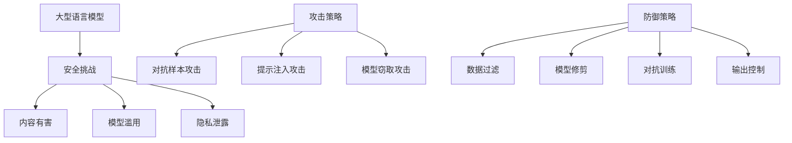

# 大语言模型应用指南：攻击策略

## 1. 背景介绍

随着人工智能技术的飞速发展,大型语言模型(Large Language Models, LLMs)已经成为当前最受关注的人工智能技术之一。这种基于海量文本数据训练而成的语言模型,能够生成看似人类写作的连贯文本,在自然语言处理、内容创作、问答系统等领域展现出了巨大的应用潜力。

然而,就像任何新兴技术一样,大型语言模型也面临着一些安全隐患和潜在风险。由于这些模型是通过学习海量互联网数据而训练得到的,因此它们可能会吸收并复制互联网上存在的有害、不当或违法内容。同时,由于模型的"黑盒"特性,很难完全控制其输出,存在被误用或滥用的风险。

因此,在充分利用大型语言模型的强大功能的同时,我们也必须高度重视其安全性,制定有效的攻击策略,以防范和减轻潜在的安全风险。本文将全面探讨大型语言模型在安全方面的挑战,介绍常见的攻击手段,并提出防御对策,为大型语言模型的安全应用指明方向。

### Mermaid 流程图



## 2. 核心概念与联系

### 2.1 大型语言模型

大型语言模型是一种基于深度学习的自然语言处理模型,通过在大规模文本语料库上进行无监督预训练而获得强大的语言理解和生成能力。这些模型通常采用Transformer等注意力机制,能够有效捕捉长距离的上下文依赖关系,生成高质量、连贯的文本输出。

典型的大型语言模型包括GPT(Generative Pre-trained Transformer)、BERT(Bidirectional Encoder Representations from Transformers)、XLNet、RoBERTa等。其中,GPT是一种自回归语言模型,专注于文本生成任务;而BERT则是一种双向编码器,更适用于文本理解和分类任务。

### 2.2 安全挑战

尽管大型语言模型展现出了强大的能力,但它们也面临着一些安全隐患和挑战:

1. **内容有害**:由于模型是基于互联网数据训练而成,可能会吸收并复制一些有害、不当或违法的内容,如仇恨言论、暴力内容、虚假信息等。
2. **模型滥用**:由于模型的"黑盒"特性,很难完全控制其输出,存在被误用或滥用的风险,如生成垃圾信息、破坏性内容等。
3. **隐私泄露**:模型可能会泄露在训练数据中存在的敏感信息,如个人隐私、商业机密等。
4. **版权争议**:模型生成的内容可能会侵犯原创作品的版权。

### 2.3 攻击策略

为了评估和提高大型语言模型的安全性,研究人员提出了多种攻击策略,旨在探索模型的薄弱环节并模拟真实攻击情况。常见的攻击策略包括:

1. **对抗样本攻击**:通过对输入数据进行精心设计的微小扰动,使模型产生错误的输出。
2. **提示注入攻击**:在输入中插入特殊的提示词,诱导模型生成期望的有害输出。
3. **模型窃取攻击**:通过查询模型的输出,试图重建或窃取模型的参数和知识。

### 2.4 防御策略

为了增强大型语言模型的安全性,研究人员也提出了多种防御策略,包括:

1. **数据过滤**:在训练数据中过滤掉有害、不当或低质量的内容。
2. **模型修剪**:通过修剪模型参数,减小模型的规模,降低潜在风险。
3. **对抗训练**:在训练过程中加入对抗样本,增强模型的鲁棒性。
4. **输出控制**:在模型输出层添加过滤器,阻止有害内容的生成。

上述概念和策略相互关联,共同构成了大型语言模型安全领域的核心内容。在接下来的章节中,我们将更加深入地探讨这些攻击策略和防御措施。

## 3. 核心算法原理具体操作步骤

### 3.1 对抗样本攻击

对抗样本攻击是一种常见的攻击策略,旨在通过对输入数据进行精心设计的微小扰动,使模型产生错误的输出。这种攻击手段可以用于评估模型的鲁棒性,并帮助开发更加安全的模型。

对抗样本攻击的具体步骤如下:

1. **选择目标模型**:首先选择要攻击的目标语言模型。
2. **定义攻击目标**:确定攻击的目标,例如使模型生成特定的有害输出、导致模型错误分类等。
3. **生成对抗样本**:使用对抗样本生成算法,在原始输入数据上进行微小的扰动,生成对抗样本。常用的算法包括快速梯度符号法(FGSM)、投射梯度下降法(PGD)等。
4. **评估攻击效果**:将生成的对抗样本输入到目标模型中,评估攻击是否成功,即模型是否产生了期望的错误输出。
5. **优化对抗样本**:如果攻击效果不理想,可以通过调整扰动大小、优化算法参数等方式,优化对抗样本以提高攻击成功率。
6. **分析模型弱点**:分析攻击成功的原因,找出模型的弱点,为后续的防御策略提供依据。

以下是一个使用FGSM算法生成对抗样本的Python代码示例:

```python
import numpy as np
from textattack.attack_recipes import PWWSRen2019

def generate_adversarial_examples(model, inputs, targets, epsilon=0.3):
    attack = PWWSRen2019.build(model)
    adversarial_examples = attack.attack(inputs, targets, epsilon=epsilon)
    return adversarial_examples
```

在这个示例中,我们使用TextAttack库中的PWWSRen2019攻击算法,通过设置扰动大小`epsilon`来生成对抗样本`adversarial_examples`。

### 3.2 提示注入攻击

提示注入攻击是另一种常见的攻击策略,它通过在输入中插入特殊的提示词,诱导语言模型生成期望的有害输出。这种攻击手段利用了语言模型对提示词的高度敏感性,可以用于评估模型的安全性和可控性。

提示注入攻击的具体步骤如下:

1. **选择目标模型**:首先选择要攻击的目标语言模型。
2. **定义攻击目标**:确定攻击的目标,例如使模型生成特定的有害内容、暴力言论等。
3. **设计提示词**:根据攻击目标,设计特殊的提示词,这些提示词将被插入到输入数据中。
4. **构建攻击样本**:将设计好的提示词插入到原始输入数据中,构建攻击样本。
5. **评估攻击效果**:将攻击样本输入到目标模型中,评估攻击是否成功,即模型是否生成了期望的有害输出。
6. **优化提示词**:如果攻击效果不理想,可以通过调整提示词的位置、长度、语义等,优化提示词以提高攻击成功率。
7. **分析模型弱点**:分析攻击成功的原因,找出模型对提示词的敏感性,为后续的防御策略提供依据。

以下是一个提示注入攻击的Python代码示例:

```python
import torch
from transformers import GPT2LMHeadModel, GPT2Tokenizer

def prompt_injection_attack(model, tokenizer, prompt, target_text):
    input_ids = tokenizer.encode(prompt + tokenizer.eos_token, return_tensors='pt')
    output = model.generate(input_ids, max_length=200, do_sample=True, top_k=50, top_p=0.95, num_return_sequences=1)
    generated_text = tokenizer.decode(output[0], skip_special_tokens=True)
    
    if target_text in generated_text:
        print(f"Attack successful! Generated text contains '{target_text}'")
    else:
        print("Attack failed.")
    
    return generated_text
```

在这个示例中,我们使用Hugging Face的Transformers库,通过在输入提示`prompt`中插入特殊的提示词,诱导GPT-2模型生成包含目标文本`target_text`的输出。如果生成的文本包含目标文本,则攻击成功。

### 3.3 模型窃取攻击

模型窃取攻击是一种旨在重建或窃取目标模型参数和知识的攻击策略。攻击者通过查询目标模型的输出,并利用机器学习算法,试图重建一个功能相似的模型副本。这种攻击手段可能会导致知识产权争议和商业机密泄露。

模型窃取攻击的具体步骤如下:

1. **选择目标模型**:首先选择要攻击的目标语言模型。
2. **准备查询数据**:准备一组用于查询目标模型的输入数据。
3. **查询目标模型**:使用准备好的输入数据,查询目标模型并记录其输出。
4. **训练替代模型**:使用查询得到的输入-输出对,训练一个替代模型,试图复制目标模型的功能。
5. **评估模型性能**:评估替代模型在各种任务上的性能,与目标模型进行对比。
6. **优化替代模型**:如果替代模型的性能不理想,可以通过增加查询数据、调整训练参数等方式,优化替代模型以提高其性能。
7. **分析模型安全性**:分析替代模型的性能和查询过程,评估目标模型的安全性,为后续的防御策略提供依据。

以下是一个使用知识蒸馏技术进行模型窃取攻击的Python代码示例:

```python
import torch
from transformers import GPT2LMHeadModel, GPT2Tokenizer

def model_extraction_attack(target_model, tokenizer, query_data):
    student_model = GPT2LMHeadModel.from_pretrained('gpt2')
    optimizer = torch.optim.AdamW(student_model.parameters(), lr=5e-5)
    
    for epoch in range(10):
        for input_text in query_data:
            input_ids = tokenizer.encode(input_text, return_tensors='pt')
            target_output = target_model.generate(input_ids, max_length=200)
            student_output = student_model.generate(input_ids, max_length=200)
            
            loss = torch.nn.CrossEntropyLoss()(student_output.logits, target_output.logits)
            loss.backward()
            optimizer.step()
            optimizer.zero_grad()
            
    return student_model
```

在这个示例中,我们使用知识蒸馏技术,通过查询目标模型`target_model`的输出,训练一个学生模型`student_model`,试图复制目标模型的功能。训练过程中,我们最小化学生模型输出与目标模型输出之间的交叉熵损失,以使学生模型逼近目标模型的行为。

## 4. 数学模型和公式详细讲解举例说明

在对抗样本攻击和模型窃取攻击中,常常会涉及到一些数学模型和公式。下面我们将详细介绍其中的一些核心公式,并给出具体的例子说明。

### 4.1 快速梯度符号法 (FGSM)

快速梯度符号法(Fast Gradient Sign Method, FGSM)是一种常用的对抗样本生成算法,它通过沿着输入数据的梯度方向进行扰动,生成对抗样本。

FGSM的公式如下:

$$
x_{adv} = x + \epsilon \cdot \text{sign}(\nabla_x J(x, y))
$$

其中:
- $x$ 是原始输入数据
- $y$ 是输入数据的真实标签
- $J(x, y)$ 是模型的损失函数
- $\nabla_x J(x, y)$ 是损失函数