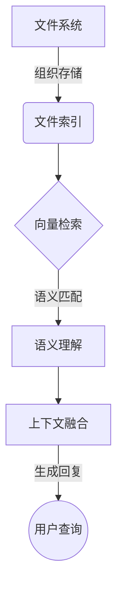

# 大语言模型应用指南：本地文件浏览

## 1.背景介绍

随着人工智能技术的不断发展,大型语言模型(Large Language Models, LLMs)已经成为当前最热门的研究领域之一。LLMs是一种基于大量文本数据训练的深度神经网络模型,能够生成看似人类写作的连贯、流畅的文本。这些模型在自然语言处理任务中表现出色,如机器翻译、文本摘要、问答系统等。

本地文件浏览是LLMs的一个重要应用场景。在这个场景中,LLMs需要读取本地计算机上的文件内容,并根据用户的查询生成相关的回复。这种应用广泛存在于个人电脑、移动设备以及企业内部系统中,可以帮助用户快速找到所需信息,提高工作效率。

## 2.核心概念与联系

本地文件浏览涉及以下几个核心概念:

1. **文件系统(File System)**: 用于组织和存储文件的逻辑结构。常见的文件系统包括FAT、NTFS、ext4等。

2. **文件索引(File Indexing)**: 为了加快文件搜索速度,需要对文件内容进行索引,建立倒排索引等数据结构。

3. **向量检索(Vector Retrieval)**: LLMs通常将文本映射为向量,然后基于向量相似性进行相关文档的检索。

4. **语义理解(Semantic Understanding)**: LLMs需要理解用户查询的语义,才能从海量文件中准确找到相关内容。

5. **上下文融合(Context Fusion)**: LLMs需要将检索到的文件内容与用户查询融合,生成连贯、相关的回复。

这些概念相互关联、环环相扣,共同构建了本地文件浏览应用的核心框架。



## 3.核心算法原理具体操作步骤

本地文件浏览应用的核心算法可以分为以下几个步骤:

1. **文件扫描与索引构建**

   - 扫描本地文件系统,获取所有文本文件的路径和内容
   - 对文件内容进行预处理,如分词、去停用词等
   - 将文件内容映射为向量,构建倒排索引等数据结构

2. **用户查询语义理解**

   - 对用户输入的自然语言查询进行分词和词性标注
   - 使用LLMs进行查询的语义表示,获取查询向量

3. **相关文件检索**

   - 基于查询向量,在文件索引中检索语义相似的文件
   - 对检索结果进行排序,选取与查询最相关的Top-N文件

4. **上下文融合与回复生成**

   - 将Top-N文件内容与用户查询融合,形成上下文向量
   - 使用LLMs对上下文向量进行解码,生成自然语言回复

这些步骤的具体实现细节会因系统架构和所使用的LLMs模型而有所不同,但总体思路是相似的。下面将对其中的关键步骤进行详细说明。

## 4.数学模型和公式详细讲解举例说明

### 4.1 文本向量化

为了进行语义匹配,我们需要将文本映射为向量表示。常用的方法包括Word2Vec、GloVe、BERT等。以BERT为例,其将单词映射为多维向量,并融合上下文信息,公式如下:

$$\operatorname{BERT}(x)=\sum_{i=1}^{n} \alpha_{i} h_{i}$$

其中:

- $x$是输入文本序列
- $n$是序列长度
- $h_i$是第$i$个词的隐藏状态向量
- $\alpha_i$是对应的注意力权重

通过自注意力机制,BERT能够捕捉文本中的长距离依赖关系,生成更准确的语义向量表示。

### 4.2 向量相似度计算

在检索相关文件时,我们需要计算查询向量与文件向量之间的相似度。常用的相似度度量包括余弦相似度、欧几里得距离等。以余弦相似度为例:

$$\operatorname{sim}(\vec{a}, \vec{b})=\frac{\vec{a} \cdot \vec{b}}{\|\vec{a}\|\|\vec{b}\|}=\frac{\sum_{i=1}^{n} a_{i} b_{i}}{\sqrt{\sum_{i=1}^{n} a_{i}^{2}} \sqrt{\sum_{i=1}^{n} b_{i}^{2}}}$$

其中$\vec{a}$和$\vec{b}$分别是查询向量和文件向量,$n$是向量维度。余弦相似度的值域为$[0,1]$,值越大表示两个向量越相似。

在实际应用中,我们可以设置一个相似度阈值,只保留超过该阈值的文件作为候选结果。这样可以提高检索的精确性,但也可能牺牲一定的召回率。

### 4.3 注意力融合

在生成自然语言回复时,LLMs需要将检索到的文件内容与用户查询融合,形成上下文向量。常用的融合方法是注意力机制,公式如下:

$$\vec{c}=\sum_{i=1}^{m} \beta_{i} \vec{h}_{i}$$

其中:

- $m$是输入序列长度(包括查询和文件内容)
- $\vec{h}_i$是第$i$个词的隐藏状态向量
- $\beta_i$是对应的注意力权重,计算方式为:

$$\beta_{i}=\frac{\exp \left(f\left(\vec{h}_{i}, \vec{q}\right)\right)}{\sum_{j=1}^{m} \exp \left(f\left(\vec{h}_{j}, \vec{q}\right)\right)}$$

- $\vec{q}$是查询向量
- $f$是注意力打分函数,如点积或多层感知机

通过注意力机制,LLMs可以自适应地为不同的词赋予不同的权重,从而生成更准确、相关的回复内容。

以上是本地文件浏览应用中的一些核心数学模型和公式。在实际系统中,这些模型和公式可能会根据具体需求和架构进行调整和优化。

## 5.项目实践:代码实例和详细解释说明

为了更好地理解本地文件浏览应用的实现细节,我们提供了一个基于Python和Transformers库的简单示例项目。该项目包括以下几个主要模块:

### 5.1 文件扫描与索引构建

```python
import os
from transformers import BertTokenizer, BertModel
import faiss

# 扫描指定目录,获取所有文本文件
def scan_files(dir_path):
    files = []
    for root, dirs, filenames in os.walk(dir_path):
        for filename in filenames:
            if filename.endswith('.txt'):
                file_path = os.path.join(root, filename)
                with open(file_path, 'r', encoding='utf-8') as f:
                    content = f.read()
                files.append((file_path, content))
    return files

# 使用BERT对文件内容进行向量化
def vectorize_files(files):
    tokenizer = BertTokenizer.from_pretrained('bert-base-uncased')
    model = BertModel.from_pretrained('bert-base-uncased')
    
    file_vecs = []
    for file_path, content in files:
        inputs = tokenizer(content, return_tensors='pt', padding=True, truncation=True, max_length=512)
        outputs = model(**inputs)
        file_vec = outputs.last_hidden_state.mean(dim=1).squeeze()
        file_vecs.append((file_path, file_vec))
    
    # 构建FAISS索引
    index = faiss.IndexFlatIP(file_vec.size(-1))
    index = faiss.IndexIDMap(index)
    for i, (file_path, file_vec) in enumerate(file_vecs):
        index.add_with_ids(file_vec.unsqueeze(0).numpy(), np.int64([i]))
    
    return index, file_vecs
```

在这个模块中,我们首先使用`scan_files`函数扫描指定目录,获取所有文本文件的路径和内容。然后使用`vectorize_files`函数,基于BERT模型将文件内容映射为向量表示。最后,我们使用FAISS库构建向量索引,以加速后续的相似度查询。

### 5.2 用户查询语义理解

```python
from transformers import BertTokenizer, BertModel

# 对用户查询进行向量化
def vectorize_query(query):
    tokenizer = BertTokenizer.from_pretrained('bert-base-uncased')
    model = BertModel.from_pretrained('bert-base-uncased')
    
    inputs = tokenizer(query, return_tensors='pt', padding=True, truncation=True, max_length=512)
    outputs = model(**inputs)
    query_vec = outputs.last_hidden_state.mean(dim=1).squeeze()
    
    return query_vec
```

在这个模块中,我们使用与文件向量化相同的BERT模型,将用户输入的自然语言查询映射为向量表示。

### 5.3 相关文件检索

```python
import faiss

# 在索引中搜索与查询最相关的文件
def search_files(index, query_vec, top_k=5):
    scores, ids = index.search(query_vec.unsqueeze(0).numpy(), top_k)
    
    results = []
    for score, id in zip(scores[0], ids[0]):
        file_path, file_vec = file_vecs[id]
        results.append((file_path, score))
    
    return results
```

在这个模块中,我们使用FAISS索引进行相似度查询,获取与用户查询最相关的Top-K文件。`search_files`函数返回一个包含文件路径和相似度分数的列表。

### 5.4 上下文融合与回复生成

```python
from transformers import BertTokenizer, BertForMaskedLM

# 融合文件内容和查询,生成自然语言回复
def generate_reply(query, top_files):
    tokenizer = BertTokenizer.from_pretrained('bert-base-uncased')
    model = BertForMaskedLM.from_pretrained('bert-base-uncased')
    
    context = query + ' '.join([f.read() for f in top_files])
    inputs = tokenizer(context, return_tensors='pt', padding=True, truncation=True, max_length=1024)
    outputs = model(**inputs)
    reply = tokenizer.decode(outputs.logits.argmax(dim=-1).squeeze(), skip_special_tokens=True)
    
    return reply
```

在这个模块中,我们使用BERT的Masked Language Model,将用户查询和Top文件内容融合,生成自然语言回复。`generate_reply`函数首先将查询和文件内容拼接成一个上下文字符串,然后使用MLM模型对该上下文进行解码,得到最终的回复文本。

以上是一个简单的本地文件浏览应用示例,仅供参考。在实际项目中,您可能需要进一步优化和扩展这些模块,以满足具体的需求和性能要求。

## 6.实际应用场景

本地文件浏览应用在以下场景中具有广泛的应用前景:

1. **个人知识管理**: 用户可以使用本地文件浏览应用快速查找和检索个人电脑或移动设备上的文档、笔记、电子书等信息,提高个人知识管理的效率。

2. **企业内部系统**: 在企业内部系统中,员工可以使用本地文件浏览应用快速查找公司政策、产品手册、技术文档等信息,提高工作效率。

3. **电子发现(eDiscovery)**: 在法律诉讼中,本地文件浏览应用可以用于快速检索大量电子文件,识别出与案件相关的证据文件。

4. **数字图书馆**: 数字图书馆可以使用本地文件浏览应用,为用户提供智能的文献检索和推荐服务。

5. **客户支持系统**: 客户支持人员可以使用本地文件浏览应用快速查找解决方案、常见问题等信息,提高客户服务质量。

6. **个人助理**: 未来,本地文件浏览应用可能会集成到智能个人助理中,为用户提供全方位的信息查询和管理服务。

总的来说,本地文件浏览应用可以广泛应用于需要快速检索和理解大量本地文件的场景,为用户带来高效、智能的信息获取体验。

## 7.工具和资源推荐

在开发本地文件浏览应用时,您可以使用以下工具和资源:

1. **Python**: 作为主流的编程语言,Python具有丰富的生态系统和第三方库,非常适合快速原型开发。

2. **Transformers**: 这是一个由