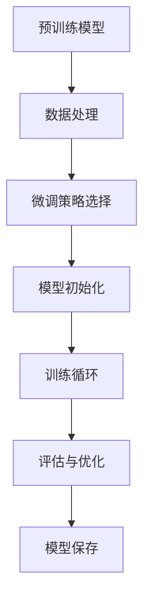

# 大语言模型的微调:从预训练到下游任务的最佳实践

## 1.背景介绍

### 1.1 大语言模型的兴起

近年来,大型语言模型(Large Language Models, LLMs)在自然语言处理(NLP)领域掀起了一股热潮。这些模型通过在大规模文本语料库上进行预训练,学习了丰富的语言知识和上下文信息,展现出令人惊叹的语言生成和理解能力。

代表性的大语言模型包括:

- GPT系列(GPT、GPT-2、GPT-3)
- BERT及其变体(RoBERTa、ALBERT等)
- T5
- PaLM
- Jurassic-1
- Bloom
- ...

这些模型在机器翻译、文本摘要、问答系统、内容创作等多个领域展现出卓越的性能,推动了NLP技术的飞速发展。

### 1.2 微调的重要性

尽管大语言模型在通用语言理解和生成任务上表现出色,但直接将它们应用于特定的下游任务(如情感分析、命名实体识别等)往往会导致性能下降。这是因为预训练阶段使用的是通用语料,与下游任务的领域和数据分布存在差异。

为了解决这个问题,研究人员提出了"微调"(Fine-tuning)的方法。微调是指在大语言模型的预训练权重基础上,使用特定任务的标注数据进行进一步的训练,以使模型适应下游任务的特征和要求。通过微调,可以显著提高大语言模型在特定任务上的性能表现。

本文将深入探讨大语言模型微调的最佳实践,包括微调流程、策略选择、数据处理、超参数调优等关键环节,为读者提供实用的指导和建议。

## 2.核心概念与联系

### 2.1 预训练与微调

预训练(Pre-training)和微调(Fine-tuning)是大语言模型训练过程中的两个关键阶段。

预训练阶段是在大规模通用语料库上训练模型,使其学习到丰富的语言知识和上下文信息。常见的预训练目标包括:

- 掩码语言模型(Masked Language Modeling, MLM)
- 下一句预测(Next Sentence Prediction, NSP)
- 自编码(Autoencoding)
- 自监督对比学习(Self-Supervised Contrastive Learning)

微调阶段则是在预训练模型的基础上,使用特定任务的标注数据进行进一步训练,以使模型适应下游任务的特征和要求。微调过程通常只需要调整模型的部分参数,避免了从头开始训练的巨大计算开销。

### 2.2 微调策略

根据下游任务的特点和数据量,可以采用不同的微调策略:

1. **全模型微调(Full Model Fine-tuning)**: 对预训练模型的所有参数进行微调,适用于数据量较大的情况。
2. **前馈层微调(Featurized Fine-tuning)**: 只微调预训练模型的前馈层(Feed-Forward Layer),保持其他层参数不变,适用于数据量较小的情况。
3. **前馈层插入(Featurized Embedding)**: 在预训练模型的输出层插入新的前馈层,只微调新插入的层,其他层参数不变。
4. **提示微调(Prompt-based Fine-tuning)**: 通过设计特定的提示(Prompt),将下游任务转化为掩码语言模型任务,避免直接微调预训练模型的参数。

不同的微调策略在计算开销、性能表现和泛化能力上存在权衡,需要根据具体情况进行选择。

### 2.3 数据处理

数据处理是微调过程中的重要环节,包括:

1. **数据清洗**: 去除噪声数据、处理缺失值等,提高数据质量。
2. **数据增强**: 通过回译(Back-translation)、同义替换(Synonym Replacement)等方法,扩充训练数据。
3. **数据划分**: 将数据划分为训练集、验证集和测试集,用于模型训练、调优和评估。

良好的数据处理有助于提高微调效果,减少过拟合风险。

### 2.4 评估指标

根据下游任务的特点,需要选择合适的评估指标,如:

- 分类任务: 准确率(Accuracy)、F1分数(F1 Score)等
- 生成任务: BLEU、ROUGE、METEOR等
- 问答任务: EM(Exact Match)、F1分数等

选择合理的评估指标,有助于全面评估模型性能,并指导微调过程的优化。

## 3.核心算法原理具体操作步骤

微调大语言模型的核心算法原理可以概括为以下步骤:

1. **预训练模型加载**

   首先加载预训练好的大语言模型,如BERT、GPT-2等。这些模型通过在大规模语料库上预训练,已经学习到丰富的语言知识和上下文信息。

2. **数据处理**

   对下游任务的数据进行清洗、增强和划分,生成高质量的训练集、验证集和测试集。数据处理的质量直接影响微调效果。

3. **微调策略选择**

   根据下游任务的特点和数据量,选择合适的微调策略,如全模型微调、前馈层微调、提示微调等。不同策略在计算开销和性能之间存在权衡。

4. **模型初始化**

   使用预训练模型的权重初始化微调模型,并根据选择的微调策略,确定需要微调的层和参数。

5. **训练循环**

   进入训练循环,使用下游任务的训练数据对模型进行微调。每个训练epoch结束后,在验证集上评估模型性能,用于监控训练过程和调整超参数。

6. **评估与优化**

   在验证集上评估模型性能,根据选择的评估指标(如准确率、F1分数等)进行评估。如果性能满足要求,则停止训练;否则,调整超参数(如学习率、批量大小等),继续训练。

7. **模型保存**

   训练结束后,保存微调后的模型权重,以便后续在下游任务上进行预测和部署。

通过上述步骤,大语言模型在保留预训练知识的同时,可以通过微调适应特定的下游任务,显著提高任务性能。

## 4.数学模型和公式详细讲解举例说明

在微调大语言模型的过程中,涉及到一些重要的数学模型和公式,下面将对它们进行详细讲解和举例说明。

### 4.1 交叉熵损失函数

交叉熵损失函数(Cross-Entropy Loss)是自然语言处理任务中常用的损失函数,用于衡量模型预测与真实标签之间的差异。对于一个样本 $x$ 和其真实标签 $y$,交叉熵损失函数可以表示为:

$$
\mathcal{L}(x, y) = -\sum_{i=1}^{C} y_i \log(p_i)
$$

其中,
- $C$ 是类别数量
- $y_i$ 是真实标签的one-hot编码,如果样本 $x$ 属于第 $i$ 类,则 $y_i=1$,否则 $y_i=0$
- $p_i$ 是模型预测样本 $x$ 属于第 $i$ 类的概率

在微调过程中,我们通过最小化交叉熵损失函数,使模型预测尽可能接近真实标签。

**举例**:
假设一个二分类问题,真实标签为 $y=[0, 1]$,模型预测概率为 $p=[0.6, 0.4]$,则交叉熵损失为:

$$
\mathcal{L}(x, y) = -(0 \log(0.6) + 1 \log(0.4)) = 0.916
$$

### 4.2 注意力机制

注意力机制(Attention Mechanism)是大语言模型中的核心组件,它允许模型在编码序列时,动态地关注不同位置的信息,捕捉长距离依赖关系。

对于一个长度为 $n$ 的序列 $X = (x_1, x_2, \dots, x_n)$,注意力机制首先计算查询向量 $q$、键向量 $K = (k_1, k_2, \dots, k_n)$ 和值向量 $V = (v_1, v_2, \dots, v_n)$,然后通过下式计算注意力权重:

$$
\text{Attention}(Q, K, V) = \text{softmax}\left(\frac{QK^T}{\sqrt{d_k}}\right)V
$$

其中,
- $Q$ 是查询向量
- $K$ 是键向量序列
- $V$ 是值向量序列
- $d_k$ 是缩放因子,用于防止内积过大导致梯度消失

注意力权重反映了查询向量对每个位置的关注程度,通过加权求和值向量,可以获得注意力输出,捕捉到序列中的重要信息。

**举例**:
假设一个长度为 3 的序列 $X = (x_1, x_2, x_3)$,查询向量 $Q=[0.1, 0.2, 0.3]$,键向量 $K=[[0.4, 0.5, 0.6], [0.7, 0.8, 0.9], [1.0, 1.1, 1.2]]$,值向量 $V=[[2, 3, 4], [5, 6, 7], [8, 9, 10]]$,缩放因子 $d_k=3$,则注意力权重为:

$$
\begin{aligned}
\text{Attention}(Q, K, V) &= \text{softmax}\left(\frac{QK^T}{\sqrt{3}}\right)V \\
&= \text{softmax}\left(\begin{bmatrix}
0.35 & 0.65 & 0.95 \\
0.70 & 1.30 & 1.90 \\
1.05 & 1.95 & 2.85
\end{bmatrix}\right) \begin{bmatrix}
2 & 3 & 4 \\
5 & 6 & 7 \\
8 & 9 & 10
\end{bmatrix} \\
&= \begin{bmatrix}
0.23 & 0.32 & 0.45 \\
0.31 & 0.34 & 0.35 \\
0.26 & 0.24 & 0.50
\end{bmatrix} \begin{bmatrix}
2 & 3 & 4 \\
5 & 6 & 7 \\
8 & 9 & 10
\end{bmatrix} \\
&= \begin{bmatrix}
4.38 & 5.76 & 7.95 \\
6.57 & 7.68 & 9.45 \\
6.98 & 7.56 & 13.00
\end{bmatrix}
\end{aligned}
$$

可以看到,注意力机制通过动态地分配不同位置的权重,捕捉到了序列中的重要信息。

### 4.3 掩码语言模型

掩码语言模型(Masked Language Modeling, MLM)是大语言模型预训练的常用目标之一。它的基本思想是在输入序列中随机掩码部分词元(Token),然后让模型预测被掩码的词元。

对于一个长度为 $n$ 的序列 $X = (x_1, x_2, \dots, x_n)$,我们随机选择一些位置进行掩码,得到掩码后的序列 $\tilde{X} = (\tilde{x}_1, \tilde{x}_2, \dots, \tilde{x}_n)$。模型的目标是最大化被掩码位置的条件概率:

$$
\max_\theta \sum_{i=1}^{n} \log P(x_i | \tilde{X}, \theta)
$$

其中,
- $\theta$ 是模型参数
- $P(x_i | \tilde{X}, \theta)$ 是在给定掩码序列 $\tilde{X}$ 和模型参数 $\theta$ 的条件下,预测第 $i$ 个位置的词元 $x_i$ 的概率

通过最大化这个条件概率,模型可以学习到上下文信息和语言知识,从而提高语言理解和生成能力。

**举例**:
假设一个长度为 5 的序列 $X = (\text{我}, \text{爱}, \text{吃}, \text{苹果}, \text{和})$,我们在第 3 个位置进行掩码,得到掩码序列 $\tilde{X} = (\text{我}, \text{爱