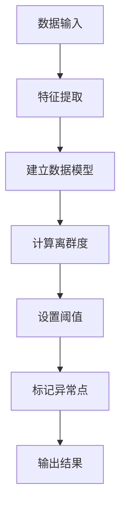

# 奇异值检测：识别数据中的异常点

## 1.背景介绍

在现实世界中,数据通常会存在异常值或离群点。这些异常值可能是由于测量误差、人为错误或其他异常情况造成的。如果不加处理,异常值会对数据分析和机器学习模型的性能产生严重影响。因此,识别和处理异常值是数据预处理的关键步骤之一。

奇异值检测(Outlier Detection)是一种广泛应用于数据挖掘、机器学习和统计学等领域的技术,旨在从数据集中识别出异常点或异常模式。异常值可能是由于噪声、测量错误或其他异常情况导致的极端值,也可能是由于数据分布的固有特性而产生的合理但罕见的观测值。

奇异值检测在许多实际应用中扮演着重要角色,例如:

- 金融欺诈检测:识别异常交易活动以防止欺诈行为。
- 网络安全:检测入侵和恶意活动。
- 工业故障诊断:监测制造过程中的异常情况。
- 健康监测:发现医疗数据中的异常病例。
- 数据清洗:清除数据集中的异常值以提高分析质量。

## 2.核心概念与联系

奇异值检测涉及以下几个核心概念:

### 2.1 异常值(Outlier)

异常值是与大多数数据观测值明显不同的数据点。它可能是由于噪声、测量错误或其他异常情况导致的极端值,也可能是由于数据分布的固有特性而产生的合理但罕见的观测值。

### 2.2 离群点(Outlying Object)

离群点是数据集中与其他数据点明显不同的个体或对象。它可能是由于异常值引起的,也可能是由于数据分布的固有特性导致的。

### 2.3 离群度(Outlierness)

离群度是衡量数据点异常程度的度量。离群度越高,数据点越有可能是异常值。

### 2.4 异常模式(Anomaly Pattern)

异常模式是指数据集中不符合预期行为或结构的模式。异常模式可能由一个或多个离群点组成。

这些概念之间存在着密切的联系。异常值和离群点是奇异值检测的主要研究对象,离群度用于量化异常程度,而异常模式则描述了异常值在数据集中的分布和结构特征。

## 3.核心算法原理具体操作步骤

奇异值检测算法可以分为以下几个主要步骤:



### 3.1 数据输入

首先需要获取待分析的数据集,可能需要进行数据清洗和预处理操作。

### 3.2 特征提取

从原始数据中提取有意义的特征,这些特征将用于后续的异常检测过程。特征提取的方式取决于数据的性质和应用场景。

### 3.3 建立数据模型

根据提取的特征,建立数据模型来描述数据的正常行为或结构。常用的模型包括统计模型(如高斯模型)、深度学习模型(如自编码器)等。

### 3.4 计算离群度

对于每个数据点,计算其与建立的数据模型的偏离程度,即离群度。离群度高的数据点更有可能是异常值。

### 3.5 设置阈值

根据应用场景和需求,设置一个合理的阈值,将离群度高于该阈值的数据点标记为异常点。

### 3.6 标记异常点

将离群度高于阈值的数据点标记为异常点,其余数据点标记为正常点。

### 3.7 输出结果

输出标记后的数据集,包括异常点和正常点的信息。

## 4.数学模型和公式详细讲解举例说明

奇异值检测算法通常基于某种数学模型或统计假设。下面将介绍一些常见的数学模型和公式。

### 4.1 基于统计的方法

#### 4.1.1 Z-Score

Z-Score是一种常用的异常值检测方法,它基于数据的均值和标准差计算每个数据点的标准化分数。公式如下:

$$z_i = \frac{x_i - \mu}{\sigma}$$

其中,$x_i$是第i个数据点的值,$\mu$是数据的均值,$\sigma$是数据的标准差。

通常,如果$|z_i| > k$($k$通常取3或其他阈值),则将$x_i$标记为异常值。

例如,假设我们有一组数据$X = \{1, 2, 3, 4, 100\}$,其均值$\mu = 22$,标准差$\sigma = 38.94$。对于数据点$x_5 = 100$,其Z-Score为:

$$z_5 = \frac{100 - 22}{38.94} = 2.00$$

由于$|z_5| > 3$,因此$x_5 = 100$被标记为异常值。

#### 4.1.2 修改的Z-Score

修改的Z-Score是Z-Score的一种变体,它使用中位数和中位绝对偏差(MAD)代替均值和标准差,从而减小异常值对模型的影响。公式如下:

$$z_i = \frac{x_i - \tilde{x}}{c \times MAD}$$

其中,$x_i$是第i个数据点的值,$\tilde{x}$是数据的中位数,$MAD$是中位绝对偏差,通常取$c = 0.6745$以使$MAD$与正态分布的标准差一致。

修改的Z-Score对于非正态分布的数据更加鲁棒。

### 4.2 基于距离的方法

#### 4.2.1 K-近邻(KNN)

K-近邻是一种基于距离的异常值检测方法。对于每个数据点,计算它到数据集中所有其他点的距离,然后取前K个最近邻的平均距离作为离群度。离群度越大,越有可能是异常值。

给定一个数据点$x_i$,其离群度可以定义为:

$$\text{outlier\_score}(x_i) = \frac{1}{k} \sum_{j \in N_k(x_i)} d(x_i, x_j)$$

其中,$N_k(x_i)$是$x_i$的k个最近邻,$d(x_i, x_j)$是$x_i$和$x_j$之间的距离(如欧几里得距离)。

#### 4.2.2 局部异常系数(LOF)

局部异常系数(Local Outlier Factor, LOF)是另一种基于密度的异常值检测方法。它通过比较数据点与其邻域的密度来衡量异常程度。

对于数据点$x_i$,其LOF定义为:

$$\text{LOF}(x_i) = \frac{\sum_{x_j \in N_k(x_i)} \frac{lrd(x_j)}{lrd(x_i)}}{|N_k(x_i)|}$$

其中,$N_k(x_i)$是$x_i$的k个最近邻,$lrd(x_i)$是$x_i$的局部可达密度(local reachability density)。

$lrd(x_i)$的计算过程如下:

1. 对于$x_i$的每个邻居$x_j$,计算$reach\_dist(x_i, x_j)$,即$x_i$到$x_j$的可达距离。
2. 取$x_i$到所有邻居的最大可达距离,记为$lrd(x_i)$。

可达距离$reach\_dist(x_i, x_j)$的定义为:

$$reach\_dist(x_i, x_j) = \max\{d(x_i, x_j), lrd(x_j)\}$$

其中,$d(x_i, x_j)$是$x_i$和$x_j$之间的距离。

LOF值越大,数据点越有可能是异常值。通常,如果$\text{LOF}(x_i) > 1$,则将$x_i$标记为异常值。

### 4.3 基于模型的方法

#### 4.3.1 高斯混合模型(GMM)

高斯混合模型(Gaussian Mixture Model, GMM)是一种常用的概率模型,它假设数据由多个高斯分布的混合而成。GMM可以用于异常值检测,因为异常值通常位于混合模型的低概率密度区域。

给定一个数据点$x_i$,根据GMM计算其概率密度$p(x_i)$。如果$p(x_i)$低于某个阈值,则将$x_i$标记为异常值。

GMM的概率密度函数为:

$$p(x) = \sum_{k=1}^K \pi_k \mathcal{N}(x|\mu_k, \Sigma_k)$$

其中,$K$是混合成分的数量,$\pi_k$是第$k$个成分的权重,$\mathcal{N}(x|\mu_k, \Sigma_k)$是以$\mu_k$为均值,$\Sigma_k$为协方差矩阵的高斯分布。

GMM的参数$\{\pi_k, \mu_k, \Sigma_k\}$可以通过期望最大化(EM)算法从训练数据中估计得到。

#### 4.3.2 一类支持向量机(One-Class SVM)

一类支持向量机(One-Class SVM, OC-SVM)是一种半监督异常值检测方法,它试图在高维特征空间中找到一个紧密包围大部分数据点的超球体。落在超球体之外的数据点被视为异常值。

OC-SVM的目标是找到一个最小半径的超球体,使得包含大部分数据点,同时最小化一些数据点到球体边界的距离。这可以通过以下优化问题来实现:

$$\begin{aligned}
\min_{R, c, \xi} &\quad R^2 + \frac{1}{\nu n} \sum_{i=1}^n \xi_i \\
\text{s.t.} &\quad \|x_i - c\|^2 \leq R^2 + \xi_i, \quad \xi_i \geq 0, \quad i = 1, \ldots, n
\end{aligned}$$

其中,$R$是超球体的半径,$c$是超球体的中心,$\xi_i$是松弛变量,$\nu \in (0, 1)$控制异常值的比例。

对于任何新的数据点$x$,如果$\|x - c\| > R$,则将其标记为异常值。

## 5.项目实践:代码实例和详细解释说明

在这一部分,我们将通过Python代码示例来演示如何使用scikit-learn库中的异常检测算法。

### 5.1 导入所需库

```python
import numpy as np
from sklearn.covariance import EllipticEnvelope
from sklearn.neighbors import LocalOutlierFactor
from sklearn.svm import OneClassSVM
from sklearn.ensemble import IsolationForest
```

### 5.2 生成示例数据

```python
# 生成正态分布数据
X = 0.3 * np.random.randn(100, 2)
# 添加一些异常值
X = np.r_[X, np.random.uniform(low=-4, high=4, size=(20, 2))]
```

### 5.3 椭圆包络(EllipticEnvelope)

椭圆包络是一种基于协方差估计的异常检测算法,它假设数据服从一个高斯分布,并试图找到一个紧密包围大部分数据点的椭圆体。

```python
# 初始化模型
ee = EllipticEnvelope(contamination=0.1)
# 拟合数据
ee.fit(X)
# 预测异常值
outliers = ee.predict(X) == -1
```

### 5.4 局部异常系数(LocalOutlierFactor)

局部异常系数是一种基于密度的异常检测算法,它通过比较数据点与其邻域的密度来衡量异常程度。

```python
# 初始化模型
lof = LocalOutlierFactor(n_neighbors=20, contamination=0.1)
# 拟合数据
lof.fit_predict(X)
# 预测异常值
outliers = lof.negative_outlier_factor_ < -1.5
```

### 5.5 一类支持向量机(OneClassSVM)

一类支持向量机是一种半监督异常检测方法,它试图在高维特征空间中找到一个紧密包围大部分数据点的超球体。

```python
# 初始化模型
ocsvm = OneClassSVM(nu=0.1, kernel="rbf", gamma=0.1)
# 拟合数据
ocsvm.fit(X)
# 预测异常值
outliers = ocsvm.predict(X) == -1
```

### 5.6 隔离森林(IsolationForest)