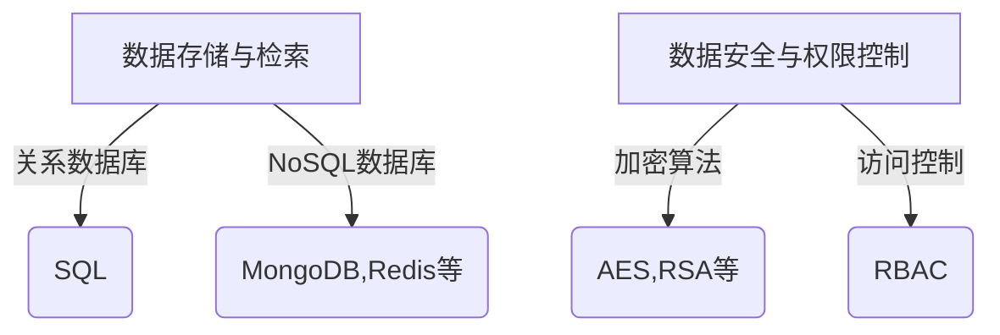

# 学生学籍管理系统详细设计与具体代码实现

## 1. 背景介绍

随着教育信息化进程的不断推进,学生学籍管理系统作为学校教务管理的核心系统之一,已经成为高校日常运营的重要组成部分。学生学籍信息的准确性和完整性直接关系到学校教学管理的效率和质量。传统的纸质学籍管理方式已经无法满足现代化教育管理的需求,因此构建一个高效、安全、可靠的学生学籍管理信息系统就显得尤为重要。

## 2. 核心概念与联系

学生学籍管理系统的核心概念包括:

1. **学生信息**:包括学生的基本信息、联系方式、家庭情况等。
2. **学籍信息**:包括学生的入学信息、学习阶段、学习成绩、奖惩情况等。
3. **教务管理**:包括开设课程、排课、考试安排、成绩管理等。
4. **用户权限**:不同角色如学生、教师、教务人员拥有不同的系统操作权限。

这些概念相互关联、相互影响,共同构建了完整的学生学籍管理体系。

## 3. 核心算法原理具体操作步骤

学生学籍管理系统的核心算法主要包括:

### 3.1 数据存储与检索算法

系统需要高效地存储和检索大量的学生信息和学籍记录,常用的数据存储方式包括关系数据库和NoSQL数据库。检索算法则需要支持模糊查询、索引查询等功能,以提高查询效率。

### 3.2 数据安全与权限控制算法

为保证学生信息的隐私和安全,系统需要采用加密算法对敏感数据进行加密存储。同时,还需要实现基于角色的访问控制(RBAC)算法,确保只有经过授权的用户才能访问相应的数据和功能。



### 3.3 教务管理算法

教务管理是学生学籍系统的核心功能之一,包括:

1. **排课算法**:根据教师、课程、教室等资源情况,自动生成合理的排课方案。
2. **考试安排算法**:根据考试时间、地点、监考人员等约束条件,生成最优化的考试安排方案。
3. **成绩计算算法**:根据不同科目的评分体系,自动计算加权平均分等综合成绩。

这些算法需要综合考虑多种约束条件,通常采用启发式算法或者人工智能算法来求解。

## 4. 数学模型和公式详细讲解举例说明

### 4.1 成绩计算模型

假设一门课程包括三个评分项目:平时成绩(30%)、期中考试(30%)和期末考试(40%),则该课程的综合成绩计算公式如下:

$$
\text{综合成绩} = 0.3 \times \text{平时成绩} + 0.3 \times \text{期中成绩} + 0.4 \times \text{期末成绩}
$$

其中,平时成绩、期中成绩和期末成绩的取值范围均为0到100分。

### 4.2 教室分配模型

教室分配是排课算法的一个重要组成部分。假设有$n$个课程需要分配教室,有$m$个教室可供选择,则教室分配问题可以建模为0-1整数规划问题:

$$
\begin{aligned}
\max \quad & \sum_{i=1}^n \sum_{j=1}^m x_{ij} \\
\text{s.t.} \quad & \sum_{j=1}^m x_{ij} = 1, \quad i = 1, 2, \ldots, n \\
& \sum_{i=1}^n x_{ij} \leq 1, \quad j = 1, 2, \ldots, m \\
& x_{ij} \in \{0, 1\}, \quad i = 1, 2, \ldots, n; \quad j = 1, 2, \ldots, m
\end{aligned}
$$

其中,决策变量$x_{ij}$表示课程$i$是否分配到教室$j$,目标函数是最大化被分配的课程数量。约束条件保证每个课程只能分配一个教室,每个教室最多只能分配一个课程。

该模型可以通过整数规划算法或者其他优化算法来求解。

## 5. 项目实践:代码实例和详细解释说明

为了更好地理解学生学籍管理系统的实现,我们提供了一个基于Python的简单示例代码。

### 5.1 数据模型定义

```python
class Student:
    def __init__(self, id, name, gender, birthday):
        self.id = id
        self.name = name
        self.gender = gender
        self.birthday = birthday
        self.enrollment = None
        self.grades = []

class Enrollment:
    def __init__(self, student, program, year):
        self.student = student
        self.program = program
        self.year = year
        student.enrollment = self

class Grade:
    def __init__(self, course, score):
        self.course = course
        self.score = score
```

上述代码定义了`Student`、`Enrollment`和`Grade`三个核心类,分别表示学生基本信息、学籍信息和成绩信息。

### 5.2 数据操作示例

```python
# 创建学生对象
student1 = Student(1, "张三", "男", "2000-01-01")
student2 = Student(2, "李四", "女", "2001-03-15")

# 创建学籍信息
enroll1 = Enrollment(student1, "计算机科学与技术", 2018)
enroll2 = Enrollment(student2, "软件工程", 2019)

# 添加成绩信息
student1.grades.append(Grade("计算机原理", 85))
student1.grades.append(Grade("数据结构", 92))
student2.grades.append(Grade("操作系统", 78))

# 计算综合成绩
def calc_gpa(student):
    total_score = sum(grade.score for grade in student.grades)
    return total_score / len(student.grades)

print(f"张三的综合成绩: {calc_gpa(student1)}")
print(f"李四的综合成绩: {calc_gpa(student2)}")
```

该示例代码展示了如何创建学生对象、添加学籍和成绩信息,以及计算综合成绩的方法。

## 6. 实际应用场景

学生学籍管理系统在教育领域有着广泛的应用,主要包括:

1. **高等教育机构**:大学、学院等高校是该系统的主要应用场景,用于管理学生的入学、课程、成绩等全过程。
2. **中小学教育机构**:中小学也需要学生学籍管理系统来记录学生的基本信息、在校表现等。
3. **培训机构**:一些大型培训机构也需要类似的系统来管理学员信息和培训进度。
4. **在线教育平台**:随着在线教育的兴起,相关的学习管理系统也应运而生,用于管理学生的注册、课程、考试等事务。

## 7. 工具和资源推荐

在开发和部署学生学籍管理系统时,可以使用以下工具和资源:

1. **开发工具**:Python、Java、C#等编程语言及相关IDE。
2. **数据库**:MySQL、PostgreSQL、MongoDB等主流数据库。
3. **前端框架**:React、Angular、Vue等前端框架,用于构建友好的用户界面。
4. **云服务**:AWS、Azure、阿里云等云服务,提供可扩展的计算和存储资源。
5. **安全工具**:加密算法库、防火墙、入侵检测系统等,保障系统的安全性。
6. **在线资源**:GitHub、Stack Overflow等开发者社区,提供丰富的代码示例和问题解答。

## 8. 总结:未来发展趋势与挑战

随着教育信息化的不断推进,学生学籍管理系统也面临着新的发展趋势和挑战:

1. **大数据分析**:如何利用学生的历史数据,进行学习行为分析、成绩预测等,为教学决策提供依据。
2. **智能化**:利用人工智能技术,实现自动化排课、智能考试阅卷等功能,提高管理效率。
3. **移动化**:适配移动端,让学生和教师能够随时随地查询信息、完成操作。
4. **信息安全**:加强对学生隐私信息的保护,防止数据泄露和身份冒用。
5. **系统集成**:与其他教育信息系统(如教学管理系统、校园一卡通等)实现无缝集成。

要解决这些挑战,需要教育机构、技术人员和政策制定者的通力合作。

## 9. 附录:常见问题与解答

1. **如何保证学生信息的安全性?**
   答:可以采取加密存储、访问控制、审计跟踪等多重安全措施,确保只有授权用户才能访问相关数据。

2. **系统如何处理学生转学或退学的情况?**
   答:需要设计相应的流程,记录学生的学籍变更情况,并及时更新相关信息。

3. **如何避免数据冗余和不一致?**
   答:可以采用规范化的数据库设计,并实现事务机制,确保数据的完整性和一致性。

4. **系统如何应对大规模并发访问?**
   答:可以采用负载均衡、缓存技术、数据库分库分表等策略,提高系统的并发处理能力。

5. **如何实现系统的可扩展性和可维护性?**
   答:在架构设计时遵循模块化、解耦等原则,方便后续功能扩展和系统升级。同时,编写完善的文档和单元测试,提高代码的可读性和可测试性。

作者: 禅与计算机程序设计艺术 / Zen and the Art of Computer Programming