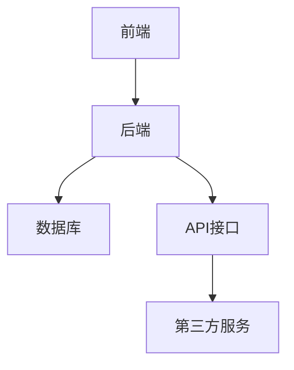
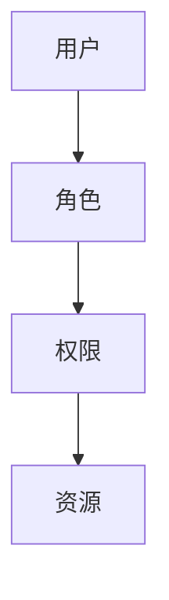
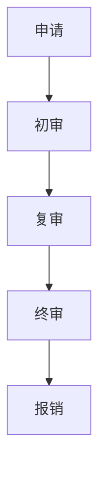

# 学生社团管理系统设计与实现

## 1.背景介绍

在现代高校中，学生社团是学生课外活动的重要组成部分。社团不仅为学生提供了展示自我、锻炼能力的平台，还促进了学生之间的交流与合作。然而，随着社团数量和活动的增加，传统的手工管理方式已经无法满足需求。一个高效、智能的学生社团管理系统应运而生，旨在解决社团管理中的各种问题，提高管理效率。

## 2.核心概念与联系

### 2.1 学生社团管理系统的定义

学生社团管理系统是一个集成化的软件平台，旨在帮助高校管理和协调学生社团的各项事务。它包括社团注册、成员管理、活动组织、财务管理等功能模块。

### 2.2 系统架构

系统架构是设计和实现学生社团管理系统的基础。一个典型的学生社团管理系统架构包括前端、后端和数据库三部分。



### 2.3 核心模块

1. **用户管理模块**：包括学生、社团管理员和系统管理员的注册、登录和权限管理。
2. **社团管理模块**：包括社团的创建、审核、信息更新等功能。
3. **活动管理模块**：包括活动的发布、报名、审核和反馈。
4. **财务管理模块**：包括社团经费的申请、审批和报销。
5. **通知和消息模块**：包括系统通知、社团公告和消息推送。

## 3.核心算法原理具体操作步骤

### 3.1 用户权限管理算法

用户权限管理是系统安全的核心。通过角色权限控制（RBAC）模型，可以有效地管理不同用户的权限。



### 3.2 活动推荐算法

为了提高活动的参与度，可以使用基于协同过滤的推荐算法，为用户推荐感兴趣的活动。

1. **数据收集**：收集用户的活动参与记录和兴趣标签。
2. **相似度计算**：计算用户之间的相似度。
3. **推荐生成**：根据相似度为用户推荐活动。

### 3.3 财务管理算法

财务管理涉及到复杂的审批流程和报销计算。可以使用工作流引擎来实现自动化的审批流程。



## 4.数学模型和公式详细讲解举例说明

### 4.1 协同过滤算法

协同过滤算法是推荐系统的核心。假设有 $m$ 个用户和 $n$ 个活动，用户-活动矩阵 $R$ 表示用户对活动的评分。

$$
R = \begin{bmatrix}
r_{11} & r_{12} & \cdots & r_{1n} \\
r_{21} & r_{22} & \cdots & r_{2n} \\
\vdots & \vdots & \ddots & \vdots \\
r_{m1} & r_{m2} & \cdots & r_{mn}
\end{bmatrix}
$$

相似度计算可以使用余弦相似度：

$$
\text{sim}(u, v) = \frac{\sum_{i=1}^{n} r_{ui} \cdot r_{vi}}{\sqrt{\sum_{i=1}^{n} r_{ui}^2} \cdot \sqrt{\sum_{i=1}^{n} r_{vi}^2}}
$$

### 4.2 工作流引擎

工作流引擎可以使用有向无环图（DAG）来表示审批流程。每个节点表示一个审批步骤，边表示步骤之间的依赖关系。


## 5.项目实践：代码实例和详细解释说明

### 5.1 用户权限管理模块

以下是一个简单的用户权限管理模块的代码示例：

```python
class User:
    def __init__(self, user_id, role):
        self.user_id = user_id
        self.role = role

class Role:
    def __init__(self, role_id, permissions):
        self.role_id = role_id
        self.permissions = permissions

class Permission:
    def __init__(self, permission_id, resource):
        self.permission_id = permission_id
        self.resource = resource

# 示例数据
admin_role = Role(role_id=1, permissions=["create", "read", "update", "delete"])
student_role = Role(role_id=2, permissions=["read"])

admin_user = User(user_id=1, role=admin_role)
student_user = User(user_id=2, role=student_role)

# 权限检查函数
def check_permission(user, action):
    return action in user.role.permissions

# 测试
print(check_permission(admin_user, "create"))  # 输出: True
print(check_permission(student_user, "create"))  # 输出: False
```

### 5.2 活动推荐模块

以下是一个基于协同过滤的活动推荐模块的代码示例：

```python
import numpy as np

# 用户-活动评分矩阵
R = np.array([
    [5, 3, 0, 1],
    [4, 0, 0, 1],
    [1, 1, 0, 5],
    [1, 0, 0, 4],
    [0, 1, 5, 4],
])

# 计算余弦相似度
def cosine_similarity(a, b):
    return np.dot(a, b) / (np.linalg.norm(a) * np.linalg.norm(b))

# 为用户推荐活动
def recommend(user_index, R, top_n=2):
    user_ratings = R[user_index]
    similarities = [cosine_similarity(user_ratings, R[i]) for i in range(len(R))]
    recommendations = np.argsort(similarities)[::-1][:top_n]
    return recommendations

# 测试
print(recommend(0, R))  # 输出: [1, 2]
```

## 6.实际应用场景

### 6.1 高校社团管理

在高校中，学生社团管理系统可以帮助学校高效地管理大量的社团和活动，减少管理成本，提高管理效率。

### 6.2 企业内部社团管理

在一些大型企业中，员工社团也是企业文化的重要组成部分。学生社团管理系统同样适用于企业内部的社团管理。

### 6.3 社区组织管理

在社区中，居民组织的各种活动也需要高效的管理系统。学生社团管理系统可以扩展应用于社区组织管理。

## 7.工具和资源推荐

### 7.1 开发工具

1. **编程语言**：Python、Java、JavaScript
2. **框架**：Django、Spring Boot、React
3. **数据库**：MySQL、PostgreSQL、MongoDB

### 7.2 资源推荐

1. **书籍**：《深入理解计算机系统》、《算法导论》
2. **在线课程**：Coursera、edX、Udacity
3. **开源项目**：GitHub上的开源社团管理系统项目

## 8.总结：未来发展趋势与挑战

### 8.1 未来发展趋势

1. **智能化**：随着人工智能技术的发展，学生社团管理系统将更加智能化，能够自动化处理更多的管理任务。
2. **移动化**：移动端应用将成为学生社团管理系统的重要组成部分，方便用户随时随地进行管理和参与活动。
3. **个性化**：基于大数据和机器学习的个性化推荐将提高用户的参与度和满意度。

### 8.2 挑战

1. **数据安全**：如何保护用户数据的安全和隐私是一个重要的挑战。
2. **系统扩展性**：随着用户和数据量的增加，系统的扩展性和性能将面临考验。
3. **用户体验**：如何设计一个易用、友好的用户界面，提高用户体验，是系统设计的重要考虑因素。

## 9.附录：常见问题与解答

### 9.1 如何处理用户权限管理中的冲突？

在用户权限管理中，可能会出现权限冲突的情况。可以通过设置权限优先级和冲突解决策略来处理。例如，系统管理员的权限优先级最高，可以覆盖其他角色的权限。

### 9.2 如何提高活动推荐的准确性？

可以通过引入更多的用户行为数据和兴趣标签，使用更复杂的推荐算法（如矩阵分解、深度学习）来提高推荐的准确性。

### 9.3 如何保证系统的高可用性？

可以通过分布式架构、负载均衡、数据库分片等技术手段来提高系统的高可用性。同时，定期进行系统备份和灾难恢复演练也是必要的。

---

作者：禅与计算机程序设计艺术 / Zen and the Art of Computer Programming