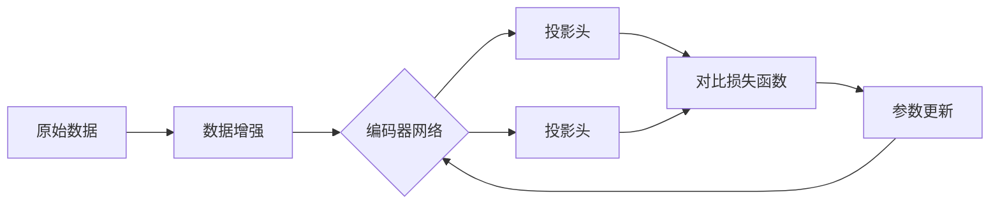

# 对比学习原理与代码实战案例讲解

## 1. 背景介绍
### 1.1 对比学习的兴起
### 1.2 对比学习的应用前景
### 1.3 本文的主要内容

## 2. 核心概念与联系
### 2.1 对比学习的定义
### 2.2 对比学习与监督学习、无监督学习的区别
### 2.3 对比学习的核心思想
#### 2.3.1 正样本对
#### 2.3.2 负样本对
#### 2.3.3 对比损失函数

## 3. 核心算法原理具体操作步骤
### 3.1 数据准备与预处理
### 3.2 构建对比学习模型
#### 3.2.1 编码器网络
#### 3.2.2 投影头
#### 3.2.3 对比损失函数
### 3.3 模型训练
#### 3.3.1 正负样本对的构建
#### 3.3.2 计算对比损失
#### 3.3.3 模型参数更新
### 3.4 下游任务微调

## 4. 数学模型和公式详细讲解举例说明 
### 4.1 编码器网络的数学表示
### 4.2 投影头的数学表示
### 4.3 对比损失函数的数学推导
#### 4.3.1 InfoNCE损失
#### 4.3.2 NT-Xent损失
### 4.4 数值计算案例

## 5. 项目实践：代码实例和详细解释说明
### 5.1 基于PyTorch实现SimCLR
#### 5.1.1 数据增强与预处理
#### 5.1.2 编码器网络构建
#### 5.1.3 投影头构建
#### 5.1.4 对比损失函数定义  
#### 5.1.5 训练循环
### 5.2 基于TensorFlow实现MoCo
#### 5.2.1 数据队列构建
#### 5.2.2 编码器网络构建
#### 5.2.3 动量编码器更新
#### 5.2.4 对比损失函数定义
#### 5.2.5 训练循环
### 5.3 下游任务微调案例

## 6. 实际应用场景
### 6.1 图像分类中的应用
### 6.2 目标检测中的应用 
### 6.3 语义分割中的应用
### 6.4 自然语言处理中的应用

## 7. 工具和资源推荐
### 7.1 主流深度学习框架
#### 7.1.1 PyTorch
#### 7.1.2 TensorFlow
### 7.2 预训练模型库
### 7.3 数据集资源
### 7.4 论文与教程

## 8. 总结：未来发展趋势与挑战
### 8.1 对比学习的研究进展
### 8.2 对比学习面临的挑战
### 8.3 对比学习的未来发展方向

## 9. 附录：常见问题与解答
### 9.1 如何选择编码器网络结构？
### 9.2 对比损失函数的选择有哪些考虑？
### 9.3 如何构建更有效的正负样本对？
### 9.4 对比学习的计算资源要求如何？
### 9.5 对比学习能否应用于小样本场景？

对比学习（Contrastive Learning）是近年来在深度学习领域备受关注的一种无监督学习范式。与传统的监督学习和无监督学习不同，对比学习通过构建正样本对和负样本对，利用对比损失函数来学习数据的表示，从而实现对数据的理解和泛化。

对比学习的核心思想是最大化正样本对的相似性，同时最小化负样本对的相似性。通过这种方式，模型能够学习到数据的内在结构和特征，捕捉到数据的本质属性。对比学习的优势在于它不需要显式的标签信息，而是通过数据本身的相似性和差异性来学习表示，因此具有很大的灵活性和适用性。

在实践中，对比学习通常包括以下几个关键步骤：

1. 数据准备与预处理：对原始数据进行增强和转换，生成不同视角的样本。常见的数据增强方法有随机裁剪、颜色变换、高斯噪声等。

2. 构建编码器网络：使用深度神经网络作为编码器，将输入数据映射到低维表示空间。常见的编码器网络包括ResNet、Transformer等。

3. 设计投影头：在编码器网络之后添加投影头，将表示映射到对比学习的空间。投影头通常是简单的全连接层。

4. 定义对比损失函数：根据正负样本对的构建方式，选择合适的对比损失函数，如InfoNCE损失、NT-Xent损失等。

5. 训练模型：通过最小化对比损失函数来优化模型参数，使正样本对的表示相似，负样本对的表示不同。

6. 下游任务微调：将预训练的编码器网络应用于具体的下游任务，如图像分类、目标检测等，进行微调和评估。

对比学习在计算机视觉、自然语言处理等领域取得了显著的成果。在图像分类任务中，基于对比学习的方法如SimCLR、MoCo等，在ImageNet数据集上达到了与监督学习相媲美的性能。在目标检测和语义分割任务中，将对比学习作为预训练策略，能够显著提升模型的性能。此外，对比学习还被应用于语音识别、推荐系统等领域，展现出广阔的应用前景。

尽管对比学习取得了令人瞩目的进展，但它仍然面临着一些挑战。如何构建更有效的正负样本对、选择合适的编码器网络结构和对比损失函数、降低计算资源的需求等，都是当前对比学习研究的重点问题。未来，对比学习有望与其他学习范式相结合，如半监督学习、迁移学习等，进一步提升模型的性能和泛化能力。

总之，对比学习为无监督学习提供了一种新的思路和方法，通过学习数据的内在结构和特征，实现了对数据的有效表示和理解。随着对比学习的不断发展和完善，它必将在人工智能的各个领域发挥越来越重要的作用，推动智能系统的进一步发展。

作者：禅与计算机程序设计艺术 / Zen and the Art of Computer Programming