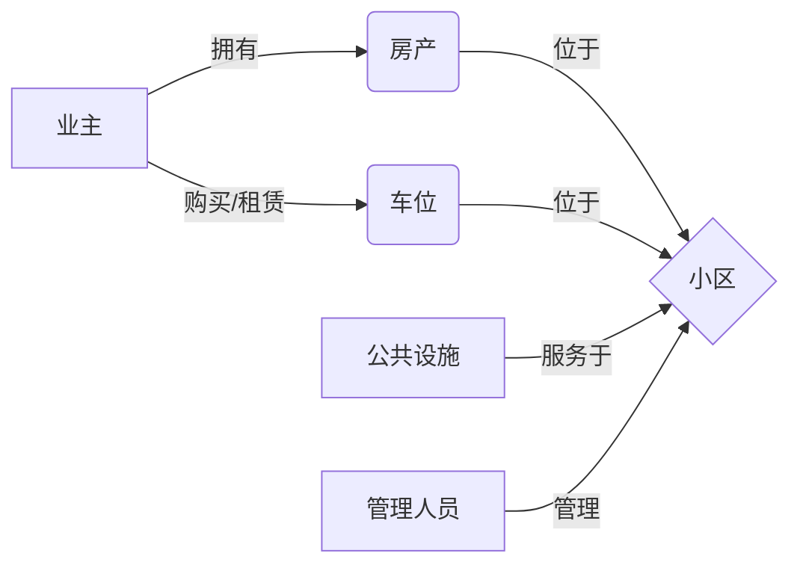

# 小区物业管理系统详细设计与具体代码实现

## 1. 背景介绍

随着城市化进程的不断加快,小区物业管理已成为现代社会管理的重要组成部分。传统的人工管理模式已经无法满足日益增长的管理需求,因此开发一套高效、智能、便捷的小区物业管理系统显得尤为重要。本文将从需求分析、系统架构设计、数据库设计、核心模块实现等方面,对小区物业管理系统进行详细阐述,并给出具体的代码实现。

### 1.1 小区物业管理的现状与挑战

#### 1.1.1 传统管理模式的弊端
- 人工作业效率低下
- 信息孤岛,数据难以共享
- 缺乏有效的监管手段

#### 1.1.2 智能化管理的必要性
- 提高管理效率,降低人力成本  
- 实现数据集中管控,提升决策水平
- 为业主提供优质便捷的服务

### 1.2 小区物业管理系统的目标与意义

#### 1.2.1 系统建设目标
- 实现小区信息、人员、设施设备等的一体化管理
- 提供完善的缴费、报修、投诉等业主服务功能
- 支持移动端访问,提升用户体验

#### 1.2.2 系统建设意义 
- 推动小区管理智能化、精细化发展
- 为物业公司节省运营成本,提高管理水平
- 为业主创造安全、舒适、便利的居住环境

## 2. 核心概念与关联

### 2.1 业主 Owner
业主是购买和拥有小区房产的个人或组织,是物业服务的主要对象。重要属性包括:
- 业主ID
- 姓名
- 身份证号
- 联系方式
- 所属房产
- 车位信息

### 2.2 房产 Property
房产是业主拥有的小区内的房屋,是物业管理的基本单元。重要属性包括:
- 房产ID
- 楼栋号
- 单元号 
- 房间号
- 面积
- 户型

### 2.3 车位 Parking
车位是业主购买或租赁的小区内停车位。重要属性包括:
- 车位ID
- 车位号
- 所属业主
- 车牌号

### 2.4 公共设施 Facility
公共设施是小区内供全体业主使用的公共区域和设备,如绿化、路灯、电梯等。重要属性包括:
- 设施ID
- 设施名称
- 设施类型 
- 位置
- 状态

### 2.5 管理人员 Staff
管理人员是物业公司派驻小区从事管理服务工作的人员,如保安、保洁等。重要属性包括:
- 员工ID
- 姓名
- 职位
- 联系方式

### 2.6 核心概念关联图


## 3. 核心算法原理与操作步骤

### 3.1 费用计算算法

#### 3.1.1 物业费计算
1. 根据房产面积、单价计算每户应缴物业费
2. 考虑优惠折扣、滞纳金等因素进行调整
3. 生成物业费账单

#### 3.1.2 停车费计算
1. 根据车位类型、占用时长计算停车费
2. 对业主车辆和临时车辆分别计费
3. 生成停车费账单

#### 3.1.3 算法伪代码
```
function calculatePropertyFee(area, price, discount, lateCharge) {
  fee = area * price
  if (discount) {
    fee = fee * discount
  }
  if (lateCharge) {
    fee = fee + lateCharge
  }
  return fee
}

function calculateParkingFee(type, duration, isOwner) {
  rate = getParkingRate(type)
  fee = rate * duration
  if (isOwner) {
    fee = fee * ownerDiscount
  }
  return fee
}
```

### 3.2 设施报修算法

#### 3.2.1 报修流程
1. 业主提交报修申请,填写设施信息和问题描述
2. 系统记录报修单,分配给维修人员
3. 维修人员接单,勘察问题并进行维修
4. 维修完成后,更新报修单状态
5. 业主确认问题解决,评价服务质量

#### 3.2.2 报修单优先级排序
- 根据设施重要性、问题严重程度计算优先级
- 对报修单进行优先级排序,高优先级优先处理

#### 3.2.3 算法伪代码
```
function submitRepair(facility, problem) {
  repairOrder = createRepairOrder(facility, problem)
  priority = calculatePriority(facility, problem)
  repairOrder.priority = priority
  assignToStaff(repairOrder)
}

function calculatePriority(facility, problem) {
  facilityLevel = getFacilityImportance(facility)
  problemLevel = getPromblemSeverity(problem)
  priority = facilityLevel * problemLevel
  return priority
}

function assignToStaff(repairOrder) {
  staff = findAvailableStaff()
  staff.addOrder(repairOrder)
  sendNotification(staff, repairOrder)
}
```

## 4. 数学模型与公式详解

### 4.1 物业费计算模型

假设小区有 $n$ 户住户,第 $i$ 户的房屋面积为 $a_i$,物业费单价为 $p$,住户享有的折扣率为 $d_i$,滞纳金为 $l_i$,则第 $i$ 户应缴物业费 $f_i$ 为:

$$
f_i = a_i \times p \times d_i + l_i
$$

全小区物业费总收入 $F$ 为:

$$
F = \sum_{i=1}^{n} f_i = \sum_{i=1}^{n} (a_i \times p \times d_i + l_i)
$$

### 4.2 停车费计算模型

假设小区有 $m$ 个车位,第 $j$ 个车位的费率为 $r_j$,车主享有的折扣率为 $o$,第 $j$ 个车位在一个计费周期内的总占用时长为 $t_j$,则第 $j$ 个车位的停车费收入 $c_j$ 为:

$$
c_j = \begin{cases}
  r_j \times t_j \times o, & \text{车主} \\
  r_j \times t_j, & \text{临时车辆}
\end{cases}
$$

全小区停车费总收入 $C$ 为:

$$
C = \sum_{j=1}^{m} c_j
$$

### 4.3 设施报修优先级模型

假设设施重要性分为 $s$ 个等级,级别依次为 $facility_1, facility_2, ..., facility_s$,对应的权重为 $w_1, w_2, ..., w_s$。问题严重程度分为 $t$ 个等级,级别依次为 $problem_1, problem_2, ..., problem_t$,对应的权重为 $v_1, v_2, ..., v_t$。则报修单的优先级 $P$ 可表示为:

$$
P = w_i \times v_j, \quad i \in [1,s], j \in [1,t]
$$

其中 $w_i$ 表示设施级别 $facility_i$ 的权重,$v_j$ 表示问题级别 $problem_j$ 的权重。$P$ 值越大,表示优先级越高,需要越优先处理。

## 5. 项目实践:代码实例与详解

### 5.1 业主信息管理模块

#### 5.1.1 业主实体类
```java
@Entity
@Table(name = "owner")
public class Owner {
    @Id
    @GeneratedValue(strategy = GenerationType.IDENTITY)
    private Long id;
    
    @Column(nullable = false)
    private String name;
    
    @Column(unique = true, nullable = false)
    private String idCard;
    
    private String phone;
    
    @OneToMany(mappedBy = "owner")
    private List<Property> properties;
    
    @OneToMany(mappedBy = "owner")
    private List<Parking> parkings;
    
    // getter and setter
}
```

#### 5.1.2 业主信息Service
```java
@Service
public class OwnerService {
    @Autowired
    private OwnerRepository ownerRepository;
    
    public Owner addOwner(Owner owner) {
        return ownerRepository.save(owner);
    }
    
    public Owner getOwnerById(Long id) {
        return ownerRepository.findById(id).orElse(null);
    }
    
    public List<Owner> getAllOwners() {
        return ownerRepository.findAll();
    }
    
    public Owner updateOwner(Owner owner) {
        return ownerRepository.save(owner);
    }
    
    public void deleteOwner(Long id) {
        ownerRepository.deleteById(id);
    }
}
```

#### 5.1.3 业主信息Controller
```java
@RestController
@RequestMapping("/owners")
public class OwnerController {
    @Autowired
    private OwnerService ownerService;
    
    @PostMapping
    public Owner addOwner(@RequestBody Owner owner) {
        return ownerService.addOwner(owner);
    }
    
    @GetMapping("/{id}")
    public Owner getOwnerById(@PathVariable Long id) {
        return ownerService.getOwnerById(id);
    }
    
    @GetMapping
    public List<Owner> getAllOwners() {
        return ownerService.getAllOwners();
    }
    
    @PutMapping
    public Owner updateOwner(@RequestBody Owner owner) {
        return ownerService.updateOwner(owner);
    }
    
    @DeleteMapping("/{id}")
    public void deleteOwner(@PathVariable Long id) {
        ownerService.deleteOwner(id);
    }
}
```

### 5.2 物业费管理模块

#### 5.2.1 物业费账单实体类
```java
@Entity
@Table(name = "property_bill")
public class PropertyBill {
    @Id
    @GeneratedValue(strategy = GenerationType.IDENTITY)
    private Long id;
    
    @ManyToOne
    private Property property;
    
    @Column(nullable = false)
    private BigDecimal amount;
    
    @Column(nullable = false)
    private LocalDateTime startDate;
    
    @Column(nullable = false)
    private LocalDateTime endDate;
    
    @Column(nullable = false)
    private BillStatus status;
    
    // getter and setter
}
```

#### 5.2.2 物业费账单Service
```java
@Service
public class PropertyBillService {
    @Autowired
    private PropertyBillRepository propertyBillRepository;
    
    public PropertyBill generateBill(Property property, LocalDateTime startDate, LocalDateTime endDate) {
        BigDecimal amount = calculateBillAmount(property, startDate, endDate);
        PropertyBill bill = new PropertyBill();
        bill.setProperty(property);
        bill.setAmount(amount);
        bill.setStartDate(startDate);
        bill.setEndDate(endDate);
        bill.setStatus(BillStatus.UNPAID);
        return propertyBillRepository.save(bill);
    }
    
    public PropertyBill payBill(Long billId) {
        PropertyBill bill = propertyBillRepository.findById(billId).orElse(null);
        if (bill != null && bill.getStatus() == BillStatus.UNPAID) {
            bill.setStatus(BillStatus.PAID);
            return propertyBillRepository.save(bill);
        }
        return null;
    }
    
    private BigDecimal calculateBillAmount(Property property, LocalDateTime startDate, LocalDateTime endDate) {
        BigDecimal area = property.getArea();
        BigDecimal price = getPropertyPrice();
        BigDecimal discount = getOwnerDiscount(property.getOwner());
        BigDecimal lateCharge = calculateLateCharge(property.getOwner());
        return area.multiply(price).multiply(discount).add(lateCharge);
    }
    
    // 获取物业费单价、业主折扣、滞纳金的方法
}
```

### 5.3 设施报修管理模块

#### 5.3.1 报修单实体类
```java
@Entity
@Table(name = "repair_order")
public class RepairOrder {
    @Id
    @GeneratedValue(strategy = GenerationType.IDENTITY)
    private Long id;
    
    @ManyToOne
    private Facility facility;
    
    @ManyToOne
    private Owner owner;
    
    @Column(nullable = false)
    private String problem;
    
    @Column(nullable = false)
    private Integer priority;
    
    @ManyToOne
    private Staff staff;
    
    @Column(nullable = false)
    private OrderStatus status;
    
    // getter and setter
}
```

#### 5.3.2 报修单Service
```java
@Service
public class RepairService {
    @Autowired
    private RepairOrderRepository repairOrderRepository;
    
    public RepairOrder createRepairOrder(Facility facility, Owner owner, String problem) {
        RepairOrder order = new RepairOrder();
        order.setFacility(facility);
        order.setOwner(owner);
        order.setProblem(problem);
        order.setPriority(calculatePriority(facility, problem));
        order.setStatus(OrderStatus.PENDING);
        return repairOrderRepository.save(order);
    }
    
    public RepairOrder assign