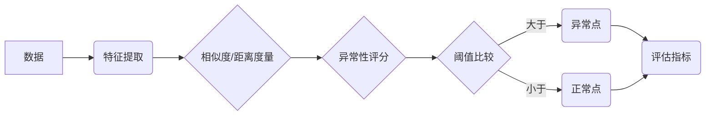

# 异常检测(Anomaly Detection) - 原理与代码实例讲解

## 1. 背景介绍
### 1.1 异常检测的定义与意义
异常检测(Anomaly Detection)是指识别数据集中与其他数据点显著不同的罕见项目、事件或观测值的问题。这些异常点通常被称为异常值、离群值、新奇值、噪声或偏差等。异常检测在许多领域都有广泛的应用,如欺诈检测、入侵检测、系统健康监控、传感器网络等。通过异常检测,我们可以及时发现系统或数据中的异常情况,从而采取相应的措施来预防或解决潜在的问题。

### 1.2 异常检测的挑战
异常检测是一个具有挑战性的问题,主要原因有以下几点:

1. 异常的定义因应用而异,很难给出一个统一的标准。
2. 异常数据通常非常稀少,获取有标签的异常样本进行训练较为困难。
3. 异常的形式和特征多种多样,很难用一种模型或方法来涵盖所有情况。
4. 许多异常检测任务需要实时或近实时地处理海量数据。

### 1.3 异常检测的方法分类
异常检测的方法大致可分为以下几类:

1. 基于统计的方法:假设数据服从某种概率分布,将偏离分布的点识别为异常。
2. 基于距离的方法:假设正常数据聚集在一起,异常点与其他点的距离较远。
3. 基于密度的方法:假设异常点所在区域的密度显著低于其他区域。
4. 基于聚类的方法:将数据点聚成多个簇,不属于任何簇或属于很小簇的点视为异常。
5. 基于分类的方法:将异常检测问题转化为二分类问题,用分类器来判别异常。
6. 基于信息论的方法:异常点能够显著增加对数据集的压缩长度或复杂度。

## 2. 核心概念与联系
### 2.1 异常点(Anomaly)
异常点是指数据集中明显偏离其余数据的个体。根据异常程度和影响的不同,异常点可进一步分为:

- 极端值(extreme value):数值上远大于或小于其他数据点。
- 离群点(outlier):在统计意义上显著偏离总体分布的点。
- 新奇点(novelty):之前未见过的、与已知数据不同的新类型数据。

### 2.2 特征(Feature)
特征是描述数据点属性的变量或维度。合适的特征表示是异常检测的关键。特征可分为:

- 原始特征:数据固有的、直接测量到的属性。
- 衍生特征:在原始特征的基础上经过变换或组合而得到的新特征。

### 2.3 相似度/距离度量(Similarity/Distance Measure)
相似度或距离度量用于度量两个数据点之间的相似性或差异性,是许多异常检测算法的基础。常用的度量包括:

- 欧氏距离(Euclidean Distance)
- 曼哈顿距离(Manhattan Distance)
- 余弦相似度(Cosine Similarity)
- 马氏距离(Mahalanobis Distance)

### 2.4 阈值(Threshold)
阈值是用来判定一个数据点是否异常的临界值。通常根据相似度/距离分数或异常性分数来设定阈值。阈值的选取需要在检测率和误报率之间权衡。

### 2.5 评估指标(Evaluation Metrics)
异常检测的评估指标用来衡量检测算法的性能,常见的指标有:

- 准确率(Accuracy)
- 精确率(Precision)
- 召回率(Recall) 
- F1分数(F1 Score)
- ROC曲线和AUC值

### 2.6 概念之间的联系

下图展示了异常检测中几个核心概念之间的关系:

从数据出发,先提取合适的特征表示,然后通过定义的相似度/距离度量来计算数据点异常性分数,再根据阈值比较结果判定其是否为异常,最后对检测结果进行评估。

## 3. 核心算法原理与具体操作步骤

异常检测的核心算法大致可分为无监督方法和有监督方法两大类。下面以几个经典算法为例进行讲解。

### 3.1 高斯分布模型(Gaussian Distribution Model)

高斯分布模型是一种常用的无监督异常检测算法,其基本假设是:正常数据服从高斯分布,异常点是低概率事件。

具体步骤如下:
1. 特征归一化:将每个特征独立地归一化到零均值、单位方差。
2. 参数估计:用最大似然估计(MLE)计算每个特征的均值μ和方差σ^2。
3. 异常性评分:对每个数据点x,计算其高斯密度函数值p(x)作为异常性评分。对于多元高斯分布,异常性评分为:

$$p(x)=\frac{1}{(2\pi)^{n/2} |\Sigma|^{1/2}} \exp\left(-\frac{1}{2}(x-\mu)^T \Sigma^{-1} (x-\mu)\right)$$

其中,n为特征维度,μ为均值向量,Σ为协方差矩阵。

4. 阈值判定:如果p(x)小于设定的阈值,则判定x为异常点。

### 3.2 局部异常因子(Local Outlier Factor, LOF)

LOF是一种基于密度的无监督异常检测算法,其基本思想是:异常点的局部密度显著低于其邻域内其他点的局部密度。

具体步骤如下:
1. 计算k-距离:对每个点p,找到距其第k近的点,p与该点的距离定义为p的k-距离。
2. 计算可达距离:点p到点o的可达距离定义为p的k-距离与p到o的实际距离的较大者。直观地,可达距离刻画了把o看作与p同一密度的点所需的最小半径。
3. 计算局部可达密度(lrd):点p的lrd定义为其k个最近邻点的平均可达距离的倒数。
4. 计算局部异常因子(LOF):点p的LOF定义为其k个最近邻点的lrd与p的lrd之比的平均值。直观地,LOF刻画了p与其邻域点的密度差异程度。
5. 阈值判定:如果点p的LOF显著大于1,则判定p为异常点。LOF值越大,异常程度越高。

### 3.3 单分类SVM(One-Class SVM)

单分类SVM是一种有监督的异常检测算法,适用于只有正常数据、缺乏异常样本的情形。其基本思想是:在特征空间中找到一个超平面,使其能够将正常数据与原点分开,并且边缘最大化。落在超平面另一侧的点被视为异常点。

具体步骤如下:
1. 特征映射:用核函数φ(x)将原始数据x映射到高维特征空间。
2. 构建优化问题:寻找一个超平面w和偏置项ρ,使得φ(x)落在超平面一侧的点尽可能多,同时最大化超平面与原点的距离。优化目标为:

$$\min_{w,\xi,\rho} \frac{1}{2}||w||^2 + \frac{1}{\nu n}\sum_{i=1}^n \xi_i - \rho$$

$$s.t. \quad w\cdot \phi(x_i) \geq \rho - \xi_i, \quad \xi_i \geq 0$$

其中,ν∈(0,1]控制异常点的比例,ξ为松弛变量。

3. 对偶求解:通过拉格朗日乘子法得到对偶问题,用SMO等方法高效求解。
4. 异常性评分:对测试点z,计算其异常性评分为:

$$s(z)=w\cdot \phi(z) - \rho = \sum_{i=1}^n \alpha_i k(x_i,z) - \rho$$

其中,α为对偶变量,k(·,·)为核函数,ρ为偏置项。

5. 阈值判定:如果s(z)<0,则判定z为异常点。s(z)的绝对值越大,异常程度越高。

## 4. 数学模型和公式详细讲解与举例说明

下面以高斯分布模型为例,详细讲解其数学原理,并给出具体的计算实例。

### 4.1 高斯分布

高斯分布又称正态分布,是一种常见的连续概率分布。其概率密度函数为:

$$f(x)=\frac{1}{\sqrt{2\pi}\sigma}\exp\left(-\frac{(x-\mu)^2}{2\sigma^2}\right)$$

其中,μ为均值,σ为标准差。高斯分布有以下重要性质:
- 均值μ决定了分布的位置,标准差σ决定了分布的幅度。
- 高斯分布关于均值对称,以μ±σ为拐点。
- 在μ±σ内的面积约为68%,在μ±2σ内的面积约为95%,在μ±3σ内的面积约为99.7%。

### 4.2 参数估计

给定一组独立同分布的样本{x_1, x_2, ..., x_n},可以用最大似然估计来估计高斯分布的参数μ和σ^2:

$$\hat{\mu}=\frac{1}{n}\sum_{i=1}^n x_i$$

$$\hat{\sigma}^2=\frac{1}{n}\sum_{i=1}^n (x_i-\hat{\mu})^2$$

直观地,μ的估计就是样本均值,σ^2的估计就是样本方差。

### 4.3 异常性评分

对于一个新的数据点x,可以计算其在估计出的高斯分布下的概率密度值作为其异常性评分:

$$s(x)=\frac{1}{\sqrt{2\pi}\hat{\sigma}}\exp\left(-\frac{(x-\hat{\mu})^2}{2\hat{\sigma}^2}\right)$$

s(x)越小,说明x越不可能由该高斯分布产生,从而越有可能是异常点。

### 4.4 阈值判定

阈值的选取需要权衡检测率和误报率。一种常用的策略是根据训练集中的异常性评分分布来设置阈值。例如,可以选择训练集异常性评分的5%分位点作为阈值,这样在训练集上的误报率就控制在5%以内。

### 4.5 多元高斯分布

对于多元数据,可以用多元高斯分布来建模。d维多元高斯分布的概率密度函数为:

$$f(x)=\frac{1}{(2\pi)^{d/2} |\Sigma|^{1/2}} \exp\left(-\frac{1}{2}(x-\mu)^T \Sigma^{-1} (x-\mu)\right)$$

其中,μ为d维均值向量,Σ为d×d的协方差矩阵。参数估计和异常性评分的计算与一元情形类似,只是将均值、方差替换为均值向量和协方差矩阵。

### 4.6 计算实例

假设有一组5个一维数据点:{1.2, 0.9, 1.0, 1.1, 1.3},现在要判断一个新的数据点0.5是否异常。

首先估计高斯分布参数:

$$\hat{\mu}=\frac{1.2+0.9+1.0+1.1+1.3}{5}=1.1$$

$$\hat{\sigma}^2=\frac{(1.2-1.1)^2+(0.9-1.1)^2+(1.0-1.1)^2+(1.1-1.1)^2+(1.3-1.1)^2}{5}=0.025$$

然后计算数据点0.5的异常性评分:

$$s(0.5)=\frac{1}{\sqrt{2\pi·0.025}}\exp\left(-\frac{(0.5-1.1)^2}{2·0.025}\right)=0.035$$

假设阈值设为训练集异常性评分的10%分位点,通过计算可知该值约为0.082。

由于0.035 < 0.082,因此判定数据点0.5为异常点。

## 5. 项目实践:代码实例与详细解释说明

下面以Python为