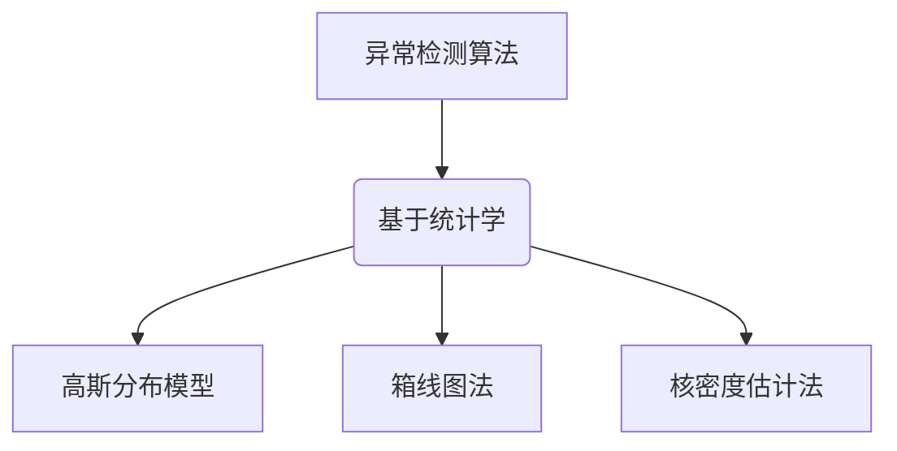
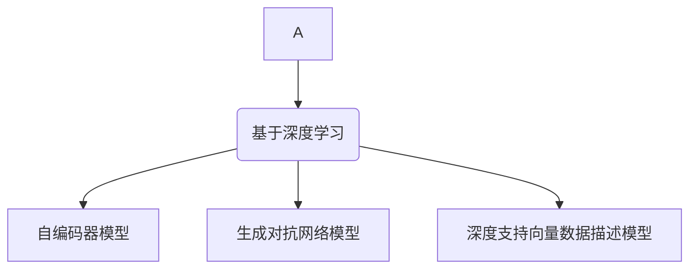
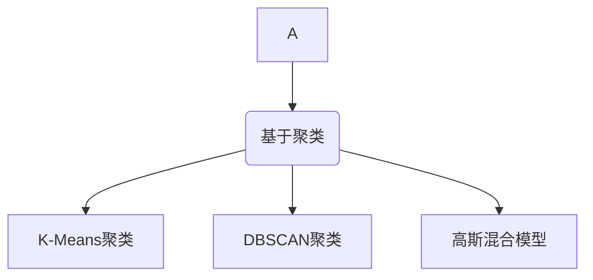
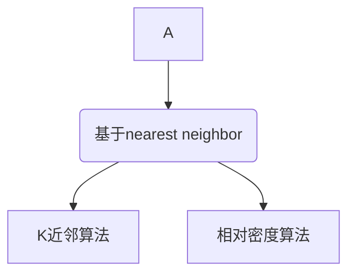
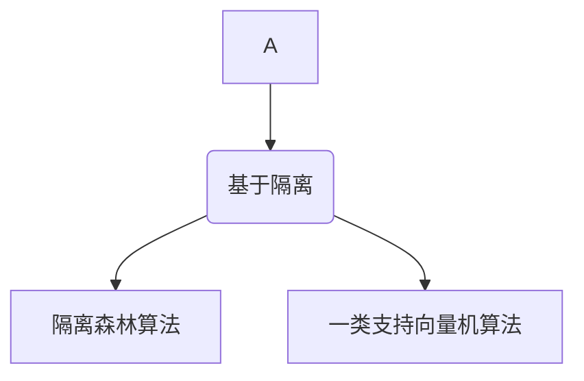
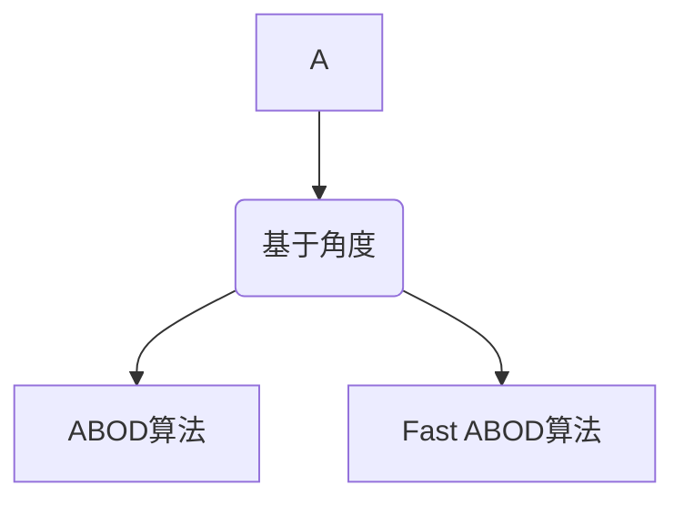

# 异常检测在金融风控领域的应用实践与经验总结

## 1.背景介绍

### 1.1 金融风控的重要性

在金融行业中,风险管理是一个至关重要的环节。良好的风险管控措施可以有效防范金融犯罪、欺诈行为,维护金融体系的安全运行。随着金融科技的快速发展,传统的风控手段已经无法满足日益复杂的业务需求,因此引入异常检测技术成为了金融风控的重要一环。

### 1.2 异常检测概述

异常检测(Anomaly Detection)是一种广泛应用于多个领域的技术,旨在从大量数据中识别出"异常"的数据实例。在金融风控场景下,异常检测主要用于发现可疑交易行为、欺诈活动等潜在风险事件。

## 2.核心概念与联系

### 2.1 异常检测的定义

异常检测是一种无监督学习技术,旨在从大量数据中发现"异常"或"离群"的数据实例。异常数据通常指与大多数其他数据实例明显不同的数据点。

### 2.2 异常检测与金融风控的关系

在金融风控领域,异常检测技术主要应用于以下几个方面:

1. **欺诈检测**: 发现可疑的金融交易行为,如洗钱、盗刷信用卡等。
2. **反作弊**: 识别在线借贷、保险等场景下的欺诈行为。
3. **反洗钱**: 监测可疑的大额资金流动,防止洗钱活动。
4. **账户风险评估**: 评估账户的风险程度,预防潜在的违规操作。

通过异常检测模型,金融机构可以提前发现异常行为,从而采取相应的风控措施,有效降低运营风险。

## 3.核心算法原理具体操作步骤

异常检测算法通常可分为以下几类:

### 3.1 基于统计学的算法

这类算法基于数据的统计分布特征来检测异常值,常见的有:

1. **高斯分布模型**
2. **箱线图(Box Plot)法**
3. **核密度估计法**

这些算法的优点是简单高效,但对数据分布有一定假设,适用场景较为有限。



### 3.2 基于深度学习的算法

利用深度神经网络自动从数据中学习异常模式,主要有:

1. **自编码器(AutoEncoder)模型**
2. **生成对抗网络(GAN)模型**
3. **深度支持向量数据描述(Deep SVDD)模型**

这些算法无需人工特征工程,具有较强的泛化能力,但需要大量标注数据进行训练。



### 3.3 基于聚类的算法

通过聚类算法将数据划分为多个簇,将不属于任何簇的点视为异常点,如:

1. **K-Means聚类**
2. **DBSCAN聚类**
3. **高斯混合模型(GMM)**

这类算法无监督、简单高效,但对噪声和异常值敏感。



### 3.4 基于nearest neighbor的算法

计算每个数据实例与其邻居的距离,如果某实例与邻居的距离超过阈值则视为异常,包括:

1. **K-nearest neighbors算法**
2. **相对密度算法**

这类算法简单直观,但对数据分布敏感,需要合理选择距离度量和邻居数量。



### 3.5 基于隔离的算法

通过分割技术将异常点隔离出来,如:

1. **隔离森林(Isolation Forest)算法**
2. **一类支持向量机(One-Class SVM)算法**

这类算法对异常值较为敏感,适合处理高维数据,但对数据分布有一定假设。



### 3.6 基于角度的算法

通过计算数据点之间的夹角,判断是否为异常点,如:

1. **角度基于外向量(Angle-Based Outlier Detection)算法**
2. **快速角度剪枝(Fast Angle-Based Outlier Detection using Pruning)算法**

这类算法适用于高维数据,但受参数设置影响较大。



在实际应用中,通常需要根据具体场景选择合适的算法或算法组合,并结合领域知识对算法进行优化和调整。

## 4.数学模型和公式详细讲解举例说明

### 4.1 高斯分布模型

高斯分布模型是最常用的异常检测模型之一。它基于这样一个假设:正常数据服从高斯(正态)分布,而异常数据则偏离该分布。

对于$D$维数据$\boldsymbol{x} = (x_1, x_2, \ldots, x_D)$,如果其服从均值为$\boldsymbol{\mu} = (\mu_1, \mu_2, \ldots, \mu_D)$,协方差矩阵为$\boldsymbol{\Sigma}$的多元正态分布,则其概率密度函数为:

$$
p(\boldsymbol{x}) = \frac{1}{(2\pi)^{D/2}|\boldsymbol{\Sigma}|^{1/2}} \exp\left(-\frac{1}{2}(\boldsymbol{x}-\boldsymbol{\mu})^T\boldsymbol{\Sigma}^{-1}(\boldsymbol{x}-\boldsymbol{\mu})\right)
$$

我们可以根据该概率密度函数计算出每个数据点$\boldsymbol{x}$的概率值$p(\boldsymbol{x})$,将概率值较小的数据点视为异常点。

通常情况下,我们需要估计出正态分布的参数$\boldsymbol{\mu}$和$\boldsymbol{\Sigma}$。最常用的估计方法是最大似然估计(MLE):

$$
\begin{aligned}
\hat{\boldsymbol{\mu}} &= \frac{1}{N}\sum_{i=1}^N\boldsymbol{x}_i\\
\hat{\boldsymbol{\Sigma}} &= \frac{1}{N}\sum_{i=1}^N(\boldsymbol{x}_i-\hat{\boldsymbol{\mu}})(\boldsymbol{x}_i-\hat{\boldsymbol{\mu}})^T
\end{aligned}
$$

其中$N$为样本数量。

### 4.2 隔离森林算法

隔离森林(Isolation Forest)是一种高效、无监督的异常检测算法。它的核心思想是:通过随机分割数据,使异常点被较快地"隔离"出来。

具体来说,隔离森林算法构建了一个由多棵二叉树组成的隔离森林。对于每棵树,算法从根节点开始,随机选择一个特征及其分割值,将数据分为两部分,重复该过程直到所有数据都被隔离(即每个数据实例被分到一个外部节点)。

显然,正常数据点需要更多的分割步骤才能被隔离,而异常点由于其特殊性,往往只需很少的分割步骤就能被隔离出来。算法通过计算每个数据实例的路径长度(即从根节点到该实例所需的分割次数),将路径较短的实例视为异常点。

设$h(x)$为数据实例$x$的路径长度,则$x$被识别为异常点的概率为:

$$
s(x, n) = 2^{-\frac{E(h(x))}{c(n)}}
$$

其中$E(h(x))$为$h(x)$的期望值,$c(n)$为一个用于正则化的常数,与样本数$n$有关。

隔离森林算法具有以下优点:
1. 无需人工特征工程,可直接处理高维数据
2. 可以自动给出异常分数,无需人工设置阈值
3. 具有较强的鲁棒性和高效性

### 4.3 One-Class SVM

One-Class SVM是一种半监督的异常检测算法,其基本思路是:在高维特征空间中寻找一个超球体,使大部分数据点被包含在该超球体内部,而异常点则位于外部。

具体来说,假设训练数据$\{\boldsymbol{x}_1, \boldsymbol{x}_2, \ldots, \boldsymbol{x}_N\}$映射到特征空间后为$\{\phi(\boldsymbol{x}_1), \phi(\boldsymbol{x}_2), \ldots, \phi(\boldsymbol{x}_N)\}$,我们需要求解以下优化问题:

$$
\begin{aligned}
\min_{R,\boldsymbol{c},\xi} &\quad R^2 + \frac{1}{\nu N}\sum_{i=1}^N\xi_i\\
\text{s.t.} &\quad \|\phi(\boldsymbol{x}_i)-\boldsymbol{c}\|^2 \leq R^2 + \xi_i\\
&\quad \xi_i \geq 0, \quad i=1,2,\ldots,N
\end{aligned}
$$

其中$R$和$\boldsymbol{c}$分别为超球体的半径和中心,$\xi_i$为松弛变量,用于处理噪声数据,$\nu \in (0,1)$控制了异常点的比例上限。

通过求解该优化问题,我们可以得到最优超球体的参数$R^*$和$\boldsymbol{c}^*$。对于任意测试数据$\boldsymbol{x}_{test}$,如果$\|\phi(\boldsymbol{x}_{test})-\boldsymbol{c}^*\| > R^*$,则判定为异常点。

One-Class SVM算法的优点是能够学习复杂的决策边界,缺点是计算复杂度较高,需要合理选择核函数和参数。

## 5.项目实践:代码实例和详细解释说明

以下是使用Python中scikit-learn库实现隔离森林算法的代码示例:

```python
from sklearn.ensemble import IsolationForest

# 初始化隔离森林模型
model = IsolationForest(n_estimators=100, max_samples='auto', contamination=0.1)

# 训练模型
model.fit(X_train)

# 获取异常分数
anomaly_scores = model.decision_function(X_test)

# 根据异常分数判断是否为异常点
is_outlier = anomaly_scores < -0.5
```

解释如下:

1. 导入隔离森林模型`IsolationForest`。
2. 初始化模型实例,设置参数:
    - `n_estimators`控制树的数量,默认为100。
    - `max_samples`控制每棵树使用的样本比例,设为'auto'时会自动选择。
    - `contamination`控制期望的异常点比例,默认为0.1。
3. 使用`fit`方法在训练数据`X_train`上训练模型。
4. 调用`decision_function`方法在测试数据`X_test`上获取每个样本的异常分数。
5. 根据异常分数判断是否为异常点,通常将分数小于-0.5的视为异常点。

以下是使用PyTorch实现自编码器模型进行异常检测的示例代码:

```python
import torch
import torch.nn as nn

# 定义自编码器模型
class AutoEncoder(nn.Module):
    def __init__(self, input_dim):
        super().__init__()
        self.encoder = nn.Sequential(
            nn.Linear(input_dim, 128),
            nn.ReLU(),
            nn.Linear(128, 64),
            nn.ReLU(),
            nn.Linear(64, 32)
        )
        self.decoder = nn.Sequential(
            nn.Linear(32, 64),
            nn.ReLU(),
            nn.Linear(64, 128),
            nn.ReLU(),
            nn.Linear(128, input_dim)
        )

    def forward(self, x):
        encoded = self.encoder(x)
        decoded = self.decoder(encoded)
        return decoded

# 初始化模型
model = AutoEncoder(input_dim=X_train.shape[1