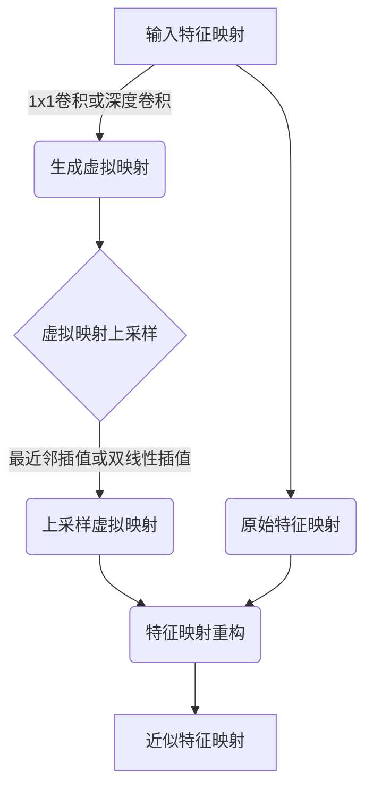

# 张量运算:GhostNet中的数学基础

## 1.背景介绍

在深度学习领域,卷积神经网络(CNN)已经取得了巨大的成功,但是由于其高计算复杂度和内存消耗,在资源受限的移动设备和嵌入式系统上部署仍然是一个巨大的挑战。因此,高效的模型压缩和加速技术变得越来越重要。Ghost模块是一种新颖的深度神经网络模块,旨在通过生成虚拟映射来减少计算和内存消耗,从而加速卷积神经网络。GhostNet是第一个将Ghost模块应用于卷积神经网络的模型,展现了出色的速度和准确性权衡。

## 2.核心概念与联系

### 2.1 张量(Tensor)

张量是一种多维数组,可以看作是标量(0阶张量)、向量(1阶张量)和矩阵(2阶张量)的推广。在深度学习中,张量被广泛用于表示输入数据、模型参数和中间计算结果。

### 2.2 卷积(Convolution)

卷积是深度学习中最基本和最重要的操作之一。它通过在输入数据上滑动一个小窗口(卷积核),并在每个位置执行元素级乘法和求和,从而提取局部模式和特征。卷积操作可以有效地捕获图像或序列数据中的空间或时间局部相关性。

### 2.3 Ghost模块

Ghost模块是GhostNet中引入的一种新颖的深度神经网络模块。它的核心思想是生成一组虚拟映射(Ghost maps),这些映射通过廉价的线性组合来近似原始的卷积特征映射,从而大大减少了计算和内存消耗。

## 3.核心算法原理具体操作步骤

Ghost模块的工作原理可以分为以下几个步骤:

1. **生成虚拟映射(Ghost maps)**: 首先,通过对输入特征映射进行廉价的线性变换(如1x1卷积或深度卷积),生成一组虚拟映射。这些虚拟映射的数量远小于原始特征映射的数量,因此可以大大减少计算和内存消耗。

2. **虚拟映射上采样**: 接下来,将生成的虚拟映射通过最近邻插值或双线性插值等方式上采样到与原始特征映射相同的空间分辨率。

3. **特征映射重构**: 最后,通过将上采样后的虚拟映射与原始特征映射进行逐元素相加,重构出近似的特征映射。这些重构的特征映射可以直接用于后续的卷积操作,而无需进行昂贵的卷积计算。

通过上述步骤,Ghost模块可以显著减少计算量和内存消耗,同时保持较高的精度。GhostNet通过在不同层次上堆叠多个Ghost模块,实现了高效的特征提取和表示。



## 4.数学模型和公式详细讲解举例说明

Ghost模块的数学模型可以用以下公式表示:

假设输入特征映射为 $X \in \mathbb{R}^{C \times H \times W}$,其中 $C$ 表示通道数,  $H$ 和 $W$ 分别表示高度和宽度。我们希望生成一个新的特征映射 $Y \in \mathbb{R}^{M \times H \times W}$,其中 $M$ 是期望的输出通道数。

传统的卷积操作可以表示为:

$$Y = W * X$$

其中 $W \in \mathbb{R}^{M \times C \times k \times k}$ 是卷积核,  $*$ 表示卷积操作。

在Ghost模块中,我们首先生成一组虚拟映射 $V \in \mathbb{R}^{m \times H' \times W'}$,其中 $m \ll M$,  $H'$ 和 $W'$ 是下采样后的空间分辨率。虚拟映射可以通过以下方式获得:

$$V = \phi(X)$$

其中 $\phi$ 是一个廉价的线性变换,如1x1卷积或深度卷积。

接下来,我们将虚拟映射 $V$ 上采样到原始分辨率,得到 $\tilde{V} \in \mathbb{R}^{m \times H \times W}$。上采样操作可以使用最近邻插值或双线性插值等方法。

最后,我们通过将上采样后的虚拟映射与原始特征映射相加,重构出近似的特征映射:

$$Y = \tilde{V} \oplus X$$

其中 $\oplus$ 表示逐元素相加操作。

通过上述公式,我们可以看到Ghost模块避免了昂贵的卷积操作,而是通过廉价的线性变换和上采样操作来近似原始的特征映射,从而大大减少了计算和内存消耗。

例如,假设输入特征映射 $X$ 的形状为 $(64, 56, 56)$,我们希望生成一个形状为 $(128, 56, 56)$ 的新特征映射。传统的卷积操作需要 $128 \times 64 \times 3 \times 3 = 92,160$ 个参数和 $128 \times 64 \times 56 \times 56 = 3,211,264$ 次乘累加操作。而在Ghost模块中,我们可以首先生成 $16$ 个虚拟映射,形状为 $(16, 28, 28)$,然后上采样到 $(16, 56, 56)$,最后与原始特征映射相加,得到近似的 $(128, 56, 56)$ 特征映射。这种方式只需要 $16 \times 64 \times 1 \times 1 = 1,024$ 个参数和 $16 \times 64 \times 28 \times 28 = 200,704$ 次乘累加操作,大大减少了计算和内存开销。

## 5.项目实践:代码实例和详细解释说明

以下是使用PyTorch实现Ghost模块的示例代码:

```python
import torch
import torch.nn as nn
import torch.nn.functional as F

class GhostModule(nn.Module):
    def __init__(self, inp, oup, kernel_size=1, ratio=2, dw_size=3, stride=1, relu=True):
        super(GhostModule, self).__init__()
        self.oup = oup
        init_channels = math.ceil(oup / ratio)
        new_channels = init_channels*(ratio-1)

        self.primary_conv = nn.Sequential(
            nn.Conv2d(inp, init_channels, kernel_size, stride, kernel_size//2, bias=False),
            nn.BatchNorm2d(init_channels),
            nn.ReLU(inplace=True) if relu else nn.Sequential(),
        )

        self.cheap_operation = nn.Sequential(
            nn.Conv2d(init_channels, new_channels, dw_size, 1, dw_size//2, groups=init_channels, bias=False),
            nn.BatchNorm2d(new_channels),
            nn.ReLU(inplace=True) if relu else nn.Sequential(),
        )

    def forward(self, x):
        x1 = self.primary_conv(x)
        x2 = self.cheap_operation(x1)
        out = torch.cat([x1,x2], dim=1)
        return out

# 使用示例
input = torch.randn(1, 16, 64, 64)
ghost_module = GhostModule(16, 32)
output = ghost_module(input)
print(output.shape)  # 输出: torch.Size([1, 32, 64, 64])
```

在上面的代码中,我们定义了一个 `GhostModule` 类,它继承自 `nn.Module`。该模块的构造函数接受以下参数:

- `inp`: 输入特征映射的通道数
- `oup`: 输出特征映射的期望通道数
- `kernel_size`: 主要卷积核的大小
- `ratio`: Ghost模块的压缩比率,用于控制虚拟映射的数量
- `dw_size`: 廉价操作(如深度卷积)的卷积核大小
- `stride`: 主要卷积的步长
- `relu`: 是否在主要卷积和廉价操作后应用ReLU激活函数

在 `forward` 函数中,我们首先通过 `self.primary_conv` 对输入特征映射进行主要卷积操作,得到初始特征映射 `x1`。接下来,我们使用 `self.cheap_operation` 对 `x1` 进行廉价的深度卷积操作,生成虚拟映射 `x2`。最后,我们将 `x1` 和 `x2` 沿通道维度拼接,得到最终的输出特征映射。

通过使用Ghost模块,我们可以显著减少计算和内存消耗,同时保持较高的精度。在实际应用中,GhostNet通常会在不同层次上堆叠多个Ghost模块,构建高效的卷积神经网络架构。

## 6.实际应用场景

Ghost模块和GhostNet主要应用于以下场景:

1. **移动设备和嵌入式系统**: 由于Ghost模块可以显著减少计算和内存消耗,因此非常适合在资源受限的移动设备和嵌入式系统上部署深度学习模型。例如,可以在手机、平板电脑、无人机等设备上运行基于GhostNet的计算机视觉任务,如目标检测、图像分类等。

2. **边缘计算和物联网**: 在边缘计算和物联网领域,由于设备的计算能力和带宽有限,需要高效的模型来处理实时数据。GhostNet可以在边缘设备上高效地执行各种任务,如视频分析、异常检测等。

3. **云端服务**: 虽然云端服务通常拥有更强大的计算资源,但高效的模型仍然可以降低计算成本和延迟。GhostNet可以用于云端的计算机视觉服务、自然语言处理等任务,提高服务的性能和响应速度。

4. **自动驾驶和机器人**: 在自动驾驶和机器人领域,实时性和准确性是至关重要的。GhostNet可以在这些系统中高效地执行目标检测、场景分割等任务,确保及时做出正确的决策。

5. **医疗影像分析**: 在医疗领域,Ghost模块可以用于加速医疗影像分析任务,如CT扫描图像分割、病理图像分类等,从而提高诊断效率和准确性。

总的来说,Ghost模块和GhostNet为在资源受限环境中部署深度学习模型提供了一种高效的解决方案,在各种应用场景中都具有广阔的前景。

## 7.工具和资源推荐

如果你希望进一步了解和实践Ghost模块和GhostNet,以下是一些推荐的工具和资源:

1. **官方代码库**: GhostNet的官方代码库托管在GitHub上,地址为 https://github.com/huawei-noah/ghostnet。该代码库提供了PyTorch和TensorFlow两种实现,以及预训练模型和示例代码。

2. **论文**: GhostNet的原始论文 "GhostNet: More Features from Cheap Operations" 详细介绍了Ghost模块的理论基础和实现细节,可以在 https://arxiv.org/abs/1911.11263 上找到。

3. **教程和博客**: 有许多优秀的教程和博客文章讲解了Ghost模块和GhostNet的原理和实践,例如:
   - https://towardsdatascience.com/ghostnet-more-features-from-cheap-operations-a7d7d0d7c3a7
   - https://www.analyticsvidhya.com/blog/2020/08/ghostnet-more-features-from-cheap-operations/

4. **深度学习框架**: 主流的深度学习框架,如PyTorch、TensorFlow和MXNet,都支持Ghost模块的实现和部署。你可以在这些框架的官方文档和社区中找到相关资源。

5. **在线课程**: 一些优质的在线课程,如Coursera和Udacity,提供了深度学习和模型压缩相关的课程,可以帮助你更好地理解Ghost模块的背景知识和应用场景。

6. **社区和论坛**: 加入相关的社区和论坛,如Reddit的 /r/MachineLearning 和 /r/DeepLearning,可以与其他研究人员和从业者交流经验,获取最新的技术动态和资源。

通过利用这些工具和资源,你可以更深入地学习和实践Ghost模块和GhostNet,并将其应用于实际项目中。

## 8.总结