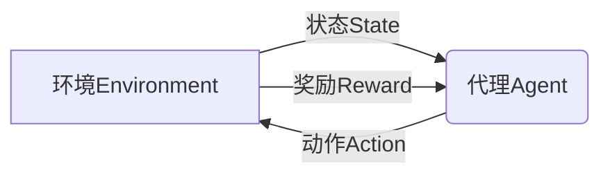
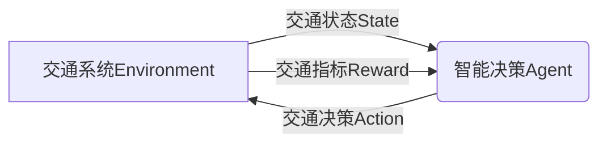

# 强化学习Reinforcement Learning在智慧交通系统中的创新应用

## 1.背景介绍

### 1.1 智慧交通系统概述

随着城市化进程的不断加快,交通拥堵、环境污染等问题日益严重,亟需建立一个高效、绿色、智能的综合交通运输系统来优化交通资源配置、提高运输效率。智慧交通系统(Intelligent Transportation System,ITS)应运而生,它是一种基于先进的信息技术、数据通信传输技术、电子传感器技术、计算机技术、控制技术以及网络技术等,对整个交通运输系统进行有效感知、动态监测和集成控制管理的综合性应用系统。

### 1.2 智慧交通系统的挑战

智慧交通系统的建设和运营面临诸多挑战:

1. **复杂多变的交通环境**:交通系统是一个错综复杂的大系统,受多种因素影响,如天气、节假日、突发事件等,系统状态多变且难以预测。

2. **海量异构交通数据**:来自不同传感设备和平台的大规模多源异构交通数据,给数据融合和处理带来极大挑战。

3. **交通决策的实时性和动态性**:交通系统需要根据瞬时交通状况做出实时动态决策,如路径规划、信号优化等。

4. **复杂约束条件**:交通决策需满足多个维度的约束,如路网结构、车辆行驶规则、资源限制等。

### 1.3 强化学习在智慧交通系统中的作用

强化学习(Reinforcement Learning,RL)是机器学习的一个重要分支,它通过与环境的不断互动,获取经验并自主学习最优决策,在处理复杂动态系统决策问题方面展现出巨大潜力。将强化学习应用于智慧交通系统,可以有效应对上述挑战:

1. **处理复杂动态环境**:强化学习算法能够自主探索并学习复杂动态系统的最优决策策略。

2. **实时决策**:强化学习算法可根据当前交通状态,实时做出动态决策。

3. **持续优化**:算法可以持续自我迭代,不断优化决策策略。

4. **多约束条件**:算法可以考虑多种约束条件,做出满足多目标的最优决策。

5. **数据驱动**:算法可以从大规模交通数据中自主学习,无需人工设计复杂规则。

综上所述,强化学习为智能化交通决策提供了一种全新的解决范式,是智慧交通系统发展的重要驱动力。

## 2.核心概念与联系

### 2.1 强化学习基本概念

强化学习是一类基于环境交互的机器学习范式,主要涉及以下几个核心概念:

1. **环境(Environment)**: 指代理与之交互的外部世界,可以是物理环境或数学模型。

2. **状态(State)**: 用于描述环境当前的具体情况。

3. **奖励(Reward)**: 环境给予代理的反馈,指示代理当前行为的好坏程度。

4. **策略(Policy)**: 代理根据当前状态选择下一步动作的规则或函数映射。

5. **价值函数(Value Function)**: 用于评估在某个状态下执行某个策略所能获得的长期累积奖励。

6. **代理(Agent)**: 与环境交互并学习的主体,目标是通过试错学习获得最优策略。

强化学习的核心思想是:代理通过与环境不断互动,根据获得的奖励信号,不断调整策略,最终获得在长期累积奖励最大化的最优策略。

### 2.2 强化学习与智慧交通系统的映射关系

将强化学习应用于智慧交通系统时,核心概念可映射为:

- **环境**: 交通系统本身,包括路网结构、车辆行驶规则等。
- **状态**: 交通系统的当前状态,如路段车流量、路口等待车辆数等。  
- **奖励**: 衡量交通决策好坏的指标,如路网通行效率、能耗排放等。
- **策略**: 交通决策策略,如路径规划、信号控制等。
- **代理**: 智能交通控制决策系统。

代理通过采集交通大数据,感知交通系统当前状态,并做出如路径规划、信号优化等决策,将决策执行于交通系统后,再根据交通系统的响应反馈(如通行效率、拥堵情况等)来评估当前决策的好坏,并不断调整优化决策策略,最终获得在长期累积奖励最大化的最优决策策略。

## 3.核心算法原理具体操作步骤

### 3.1 强化学习算法分类

根据算法是否需要先验知识环境的转移概率模型,强化学习算法可分为:

1. **基于模型的算法**: 需要先获取环境的转移概率模型,再基于模型求解最优策略。典型算法有价值迭代、策略迭代等。

2. **基于无模型的算法**: 不需要先验知道环境模型,通过在线互动直接从经验数据中学习最优策略。典型算法有Q-Learning、Sarsa、策略梯度等。

对于智慧交通系统这样的大型复杂系统,由于难以建立精确的环境模型,通常采用无模型的强化学习算法。

### 3.2 Q-Learning算法原理

Q-Learning是最经典的基于无模型的强化学习算法之一,其核心思想是:

1. **状态-动作值函数**: 定义 $Q(s,a)$ 为在状态 $s$ 下执行动作 $a$ 后所能获得的长期累积奖励的期望值。

2. **贝尔曼最优方程**:最优状态-动作值函数 $Q^*(s,a)$ 满足贝尔曼最优方程:

$$Q^*(s,a)=\mathbb{E}_{s'}[r+\gamma\max_{a'}Q^*(s',a')|s,a]$$

其中 $r$ 为立即奖励, $\gamma$ 为折现因子, $s'$ 为执行动作 $a$ 后转移到的新状态。

3. **Q-Learning迭代式**: 通过不断与环境交互,在线更新 $Q(s,a)$ 的估计值:

$$Q(s,a)\leftarrow Q(s,a)+\alpha[r+\gamma\max_{a'}Q(s',a')-Q(s,a)]$$

其中 $\alpha$ 为学习率。当 $Q(s,a)$ 收敛时,即得到最优策略 $\pi^*(s)=\arg\max_aQ^*(s,a)$。

### 3.3 Q-Learning算法步骤

1. 初始化 $Q(s,a)$ 为任意值。
2. 对每个episode:
    - 初始化起始状态 $s$
    - 对episode中每个时间步:
        - 在状态 $s$ 下,选择动作 $a$ (如探索-利用策略)
        - 执行动作 $a$,获得奖励 $r$,转移到新状态 $s'$
        - 根据Q-Learning迭代式更新 $Q(s,a)$
        - $s\leftarrow s'$
3. 直到 $Q(s,a)$ 收敛,得到最优策略 $\pi^*(s)=\arg\max_aQ^*(s,a)$

Q-Learning算法无需建模,只需交互即可在线学习,可应对复杂环境,但也存在维数灾难等问题。

## 4.数学模型和公式详细讲解举例说明  

### 4.1 马尔可夫决策过程

强化学习问题通常建模为**马尔可夫决策过程(Markov Decision Process, MDP)**。MDP由以下5元组构成:

$$\langle\mathcal{S},\mathcal{A},\mathcal{P},\mathcal{R},\gamma\rangle$$

- $\mathcal{S}$: 有限状态集合
- $\mathcal{A}$: 有限动作集合 
- $\mathcal{P}$: 状态转移概率 $\mathcal{P}_{ss'}^a=\mathbb{P}(s_{t+1}=s'|s_t=s,a_t=a)$
- $\mathcal{R}$: 奖励函数 $\mathcal{R}_s^a=\mathbb{E}[r_{t+1}|s_t=s,a_t=a]$
- $\gamma\in[0,1)$: 折现因子

在MDP中,代理根据策略 $\pi$选择动作序列,目标是最大化期望的累积折现奖励:

$$G_t=\mathbb{E}_\pi[\sum_{k=0}^{\infty}\gamma^kr_{t+k+1}|s_t]$$

例如,在交通路径规划问题中:

- $\mathcal{S}$: 所有可能的车辆位置状态
- $\mathcal{A}$: 可选的行驶方向(上下左右)
- $\mathcal{P}_{ss'}^a$: 从位置 $s$ 行驶方向 $a$ 到达新位置 $s'$ 的概率  
- $\mathcal{R}_s^a$: 从位置 $s$ 行驶方向 $a$ 的即时代价(如时间、能耗等)
- $\gamma$: 折现因子,权衡即时代价和目的地到达效用

代理的目标是通过学习,找到从起点到终点的最优路径策略,使累积折现代价最小。

### 4.2 价值函数和贝尔曼方程

对于MDP,我们定义**状态价值函数**和**状态-动作价值函数**:

$$
\begin{aligned}
V^\pi(s)&=\mathbb{E}_\pi[G_t|s_t=s]\\
Q^\pi(s,a)&=\mathbb{E}_\pi[G_t|s_t=s,a_t=a]
\end{aligned}
$$

它们分别表示在策略 $\pi$ 下,从状态 $s$ 开始执行或先执行动作 $a$ 后,期望获得的累积折现奖励。

根据MDP的性质,价值函数满足**贝尔曼方程**:

$$
\begin{aligned}
V^\pi(s)&=\mathbb{E}_\pi[r_{t+1}+\gamma V^\pi(s_{t+1})|s_t=s]\\
&=\sum_{a}\pi(a|s)\sum_{s'}\mathcal{P}_{ss'}^a[\mathcal{R}_s^a+\gamma V^\pi(s')]
\end{aligned}
$$

$$
\begin{aligned}
Q^\pi(s,a)&=\mathbb{E}_\pi[r_{t+1}+\gamma Q^\pi(s_{t+1},a_{t+1})|s_t=s,a_t=a]\\
&=\sum_{s'}\mathcal{P}_{ss'}^a[\mathcal{R}_s^a+\gamma\sum_{a'}\pi(a'|s')Q^\pi(s',a')]
\end{aligned}
$$

我们的目标是找到使价值函数最大化的**最优策略**$\pi^*$及其对应的**最优价值函数**:

$$
\begin{aligned}
V^*(s)&=\max_\pi V^\pi(s)\\
Q^*(s,a)&=\max_\pi Q^\pi(s,a)
\end{aligned}
$$

最优价值函数同样满足**贝尔曼最优方程**:

$$
\begin{aligned}
V^*(s)&=\max_a\mathbb{E}[r_{t+1}+\gamma V^*(s_{t+1})|s_t=s,a_t=a]\\
&=\max_a\sum_{s'}\mathcal{P}_{ss'}^a[\mathcal{R}_s^a+\gamma V^*(s')]
\end{aligned}
$$

$$
\begin{aligned}
Q^*(s,a)&=\mathbb{E}[r_{t+1}+\gamma\max_{a'}Q^*(s_{t+1},a')|s_t=s,a_t=a]\\
&=\sum_{s'}\mathcal{P}_{ss'}^a[\mathcal{R}_s^a+\gamma\max_{a'}Q^*(s',a')]
\end{aligned}
$$

强化学习算法的目标就是基于这些方程,从环境交互数据中估计出最优价值函数 $V^*$ 或 $Q^*$,从而导出最优策略 $\pi^*$。

### 4.3 时间差分目标和Q-Learning

Q-Learning是一种基于时间差分(Temporal Difference, TD)的无模型强化学习算法,它直接