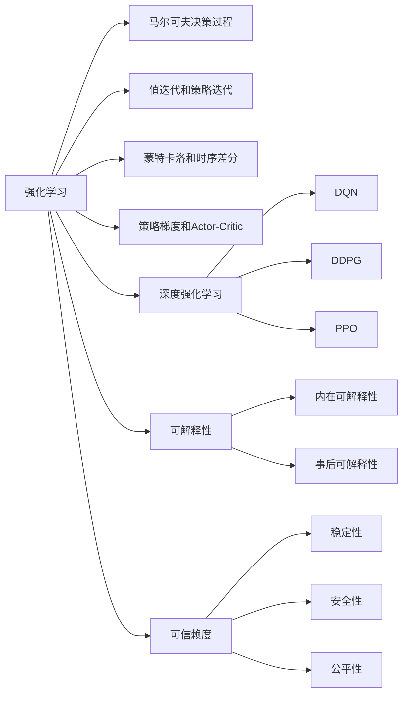

# 强化学习Reinforcement Learning的算法可解释性和可信赖度

## 1.背景介绍

强化学习(Reinforcement Learning, RL)是人工智能和机器学习领域的一个重要分支,它通过智能体(Agent)与环境的交互,从经验中学习,不断优化决策策略,以获得最大的累积奖励。近年来,随着深度学习的发展,深度强化学习(Deep Reinforcement Learning, DRL)取得了显著进展,在围棋、视频游戏、机器人控制等领域展现出了超越人类的性能。

然而,DRL算法存在着"黑箱"的问题,即训练好的模型难以解释其决策依据,这限制了它在安全关键领域的应用。此外,DRL算法对超参数、随机种子等因素敏感,训练结果的稳定性和可重复性较差。因此,DRL算法的可解释性(Explainability)和可信赖度(Trustworthiness)成为了亟待解决的问题。本文将围绕这一主题展开探讨。

### 1.1 强化学习的发展历程
#### 1.1.1 早期强化学习
#### 1.1.2 深度强化学习的崛起 
#### 1.1.3 强化学习的应用现状

### 1.2 强化学习面临的挑战
#### 1.2.1 算法的可解释性不足
#### 1.2.2 训练结果的稳定性差
#### 1.2.3 泛化能力有待提高

## 2.核心概念与联系

### 2.1 强化学习的数学框架
#### 2.1.1 马尔可夫决策过程(MDP)
#### 2.1.2 状态、动作、奖励和环境转移概率
#### 2.1.3 策略、价值函数和贝尔曼方程

### 2.2 强化学习的核心算法
#### 2.2.1 值迭代和策略迭代
#### 2.2.2 蒙特卡洛方法和时序差分学习
#### 2.2.3 策略梯度和Actor-Critic算法

### 2.3 深度强化学习 
#### 2.3.1 深度Q网络(DQN)
#### 2.3.2 深度确定性策略梯度(DDPG) 
#### 2.3.3 近端策略优化(PPO)

### 2.4 可解释性和可信赖度
#### 2.4.1 可解释性的定义和分类
#### 2.4.2 可信赖度的内涵
#### 2.4.3 二者之间的关系



## 3.核心算法原理具体操作步骤

### 3.1 深度Q网络(DQN)
#### 3.1.1 Q学习回顾
#### 3.1.2 DQN的网络结构 
#### 3.1.3 经验回放和目标网络
#### 3.1.4 DQN的训练过程

### 3.2 深度确定性策略梯度(DDPG)
#### 3.2.1 确定性策略梯度定理
#### 3.2.2 Actor-Critic结构
#### 3.2.3 DDPG的改进:TD3
#### 3.2.4 DDPG的训练过程

### 3.3 近端策略优化(PPO) 
#### 3.3.1 策略梯度的问题
#### 3.3.2 重要性采样和信赖域
#### 3.3.3 PPO的目标函数
#### 3.3.4 PPO的训练过程

## 4.数学模型和公式详细讲解举例说明

### 4.1 马尔可夫决策过程(MDP)
一个MDP由状态空间$\mathcal{S}$,动作空间$\mathcal{A}$,奖励函数$r(s,a)$,状态转移概率$p(s'|s,a)$和折扣因子$\gamma$组成。在时刻$t$,智能体处于状态$s_t$,选择动作$a_t$,获得奖励$r_t$,环境转移到下一状态$s_{t+1}$。目标是最大化累积奖励:
$$G_t = \sum_{k=0}^{\infty} \gamma^k r_{t+k}$$

### 4.2 值函数与贝尔曼方程
状态值函数$V^{\pi}(s)$表示从状态$s$开始,采用策略$\pi$能获得的期望回报:
$$V^{\pi}(s)=\mathbb{E}_{\pi}[G_t|S_t=s]$$
状态-动作值函数$Q^{\pi}(s,a)$表示从状态$s$开始,选择动作$a$,然后采用策略$\pi$能获得的期望回报:  
$$Q^{\pi}(s,a)=\mathbb{E}_{\pi}[G_t|S_t=s,A_t=a]$$
它们满足贝尔曼方程:
$$V^{\pi}(s)=\sum_a \pi(a|s) \sum_{s',r} p(s',r|s,a)[r+\gamma V^{\pi}(s')]$$
$$Q^{\pi}(s,a)=\sum_{s',r} p(s',r|s,a)[r+\gamma \sum_{a'} \pi(a'|s') Q^{\pi}(s',a')]$$

### 4.3 策略梯度定理
定义性能度量函数$J(\theta)$为:
$$J(\theta)=\sum_s d^{\pi}(s) V^{\pi}(s)=\sum_s d^{\pi}(s) \sum_a \pi_{\theta}(a|s) Q^{\pi}(s,a)$$
其中$d^{\pi}(s)$是状态$s$在策略$\pi$下的稳态分布。策略梯度定理指出:
$$\nabla_{\theta} J(\theta) = \sum_s d^{\pi}(s) \sum_a \nabla_{\theta} \pi_{\theta}(a|s) Q^{\pi}(s,a)$$
$$=\mathbb{E}_{s \sim d^{\pi}, a \sim \pi_{\theta}}[\nabla_{\theta} \log \pi_{\theta}(a|s) Q^{\pi}(s,a)]$$
这为策略梯度算法提供了理论基础。

## 5.项目实践：代码实例和详细解释说明

### 5.1 DQN在Atari游戏中的应用
```python
import gym
import numpy as np
import torch
import torch.nn as nn
import torch.optim as optim

class DQN(nn.Module):
    def __init__(self, state_dim, action_dim):
        super(DQN, self).__init__()
        self.fc1 = nn.Linear(state_dim, 64)
        self.fc2 = nn.Linear(64, 64)
        self.fc3 = nn.Linear(64, action_dim)
        
    def forward(self, x):
        x = torch.relu(self.fc1(x))
        x = torch.relu(self.fc2(x))
        x = self.fc3(x)
        return x
      
class ReplayBuffer:
    def __init__(self, capacity):
        self.capacity = capacity
        self.buffer = []
        self.position = 0
    
    def push(self, state, action, reward, next_state, done):
        if len(self.buffer) < self.capacity:
            self.buffer.append(None)
        self.buffer[self.position] = (state, action, reward, next_state, done)
        self.position = (self.position + 1) % self.capacity
    
    def sample(self, batch_size):
        batch = random.sample(self.buffer, batch_size)
        state, action, reward, next_state, done = zip(*batch)
        return state, action, reward, next_state, done
    
    def __len__(self):
        return len(self.buffer)

env = gym.make('CartPole-v1')
state_dim = env.observation_space.shape[0]
action_dim = env.action_space.n

policy_net = DQN(state_dim, action_dim)
target_net = DQN(state_dim, action_dim)
target_net.load_state_dict(policy_net.state_dict())

optimizer = optim.Adam(policy_net.parameters(), lr=1e-3)
memory = ReplayBuffer(10000)

def select_action(state):
    state = torch.tensor(state, dtype=torch.float32).unsqueeze(0)
    q_value = policy_net(state)
    action = q_value.argmax().item()
    return action

def train(batch_size):
    if len(memory) < batch_size:
        return
    state_batch, action_batch, reward_batch, next_state_batch, done_batch = memory.sample(batch_size)
    
    state_batch = torch.tensor(state_batch, dtype=torch.float32)
    action_batch = torch.tensor(action_batch, dtype=torch.int64).unsqueeze(1)  
    reward_batch = torch.tensor(reward_batch, dtype=torch.float32)
    next_state_batch = torch.tensor(next_state_batch, dtype=torch.float32)
    done_batch = torch.tensor(done_batch, dtype=torch.float32)
    
    q_values = policy_net(state_batch).gather(1, action_batch)
    next_q_values = target_net(next_state_batch).max(1)[0].detach()
    expected_q_values = reward_batch + (1 - done_batch) * gamma * next_q_values
    
    loss = nn.MSELoss()(q_values, expected_q_values.unsqueeze(1))
    
    optimizer.zero_grad()
    loss.backward()
    optimizer.step()

num_episodes = 500
gamma = 0.99
batch_size = 64
update_freq = 10

for episode in range(num_episodes):
    state = env.reset()
    done = False
    total_reward = 0
    
    while not done:
        action = select_action(state)
        next_state, reward, done, _ = env.step(action)
        memory.push(state, action, reward, next_state, done)
        state = next_state
        total_reward += reward
        
        train(batch_size)
        
        if episode % update_freq == 0:
            target_net.load_state_dict(policy_net.state_dict())
            
    print(f'Episode: {episode+1}, Reward: {total_reward}')
```

这是一个使用DQN算法玩CartPole游戏的简单示例。代码主要包括以下几个部分:

1. DQN网络结构的定义,包括三个全连接层,使用ReLU激活函数。
2. 经验回放缓冲区ReplayBuffer的实现,用于存储和采样转移数据。
3. 动作选择函数select_action,根据当前策略网络选择Q值最大的动作。 
4. 训练函数train,从ReplayBuffer中采样一个batch的数据,计算TD误差,并更新策略网络的参数。
5. 主循环,与环境交互,将转移数据存入ReplayBuffer,定期从中采样数据进行训练,并定期将策略网络的参数复制给目标网络。

通过不断的探索和学习,智能体逐渐掌握了平衡车杆的技巧,游戏奖励不断提高。这展示了DQN算法的有效性。

### 5.2 DDPG在连续控制任务中的应用
```python
import gym
import numpy as np
import torch
import torch.nn as nn
import torch.optim as optim

class Actor(nn.Module):
    def __init__(self, state_dim, action_dim, max_action):
        super(Actor, self).__init__()
        self.fc1 = nn.Linear(state_dim, 256)
        self.fc2 = nn.Linear(256, 256)
        self.fc3 = nn.Linear(256, action_dim)
        self.max_action = max_action
        
    def forward(self, x):
        x = torch.relu(self.fc1(x))
        x = torch.relu(self.fc2(x))
        x = self.max_action * torch.tanh(self.fc3(x)) 
        return x
        
class Critic(nn.Module):
    def __init__(self, state_dim, action_dim):
        super(Critic, self).__init__()
        self.fc1 = nn.Linear(state_dim + action_dim, 256)
        self.fc2 = nn.Linear(256, 256)
        self.fc3 = nn.Linear(256, 1)
        
    def forward(self, x, u):
        x = torch.cat([x, u], 1)
        x = torch.relu(self.fc1(x))
        x = torch.relu(self.fc2(x))
        x = self.fc3(x)
        return x

class DDPG(object):
    def __init__(self, state_dim, action_dim, max_action):
        self.actor = Actor(state_dim, action_dim, max_action)
        self.actor_target = Actor(state_dim, action_dim, max_action)
        self.actor_target.load_state_dict(self.actor.state_dict())
        self.actor_optimizer = optim.Adam(self.actor.parameters(), lr=1e-4)
        
        self.critic = Critic(state_dim, action_dim)
        self.critic_target = Critic(state_dim, action_dim)
        self.critic_target.load_state_dict(self.critic.state_dict())
        self.critic_optimizer = optim.Adam(self