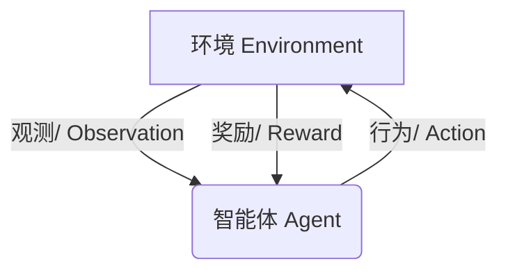

# 强化学习与自适应控制原理与代码实战案例讲解

## 1.背景介绍

### 1.1 什么是强化学习

强化学习(Reinforcement Learning)是机器学习的一个重要分支,它关注于如何基于环境反馈来学习行为策略,以最大化预期的长期回报。与监督学习不同,强化学习没有提供正确的输入/输出对,而是通过与环境的交互来学习。

强化学习的核心思想是让智能体(Agent)通过试错来学习,通过观察环境状态,采取行动,然后获得奖励或惩罚,并据此调整行为策略。这种学习方式类似于人类或动物的学习过程,通过不断尝试和调整来获得最佳行为。

### 1.2 强化学习的应用场景

强化学习已经在许多领域得到了广泛应用,例如:

- 机器人控制
- 游戏AI
- 自动驾驶
- 资源管理
- 金融交易
- 网络路由优化

任何需要基于环境反馈来优化决策的问题,都可以使用强化学习来解决。

## 2.核心概念与联系

### 2.1 强化学习的核心要素

强化学习系统由以下几个核心要素组成:

- 智能体(Agent):执行行为的决策主体
- 环境(Environment):智能体与之交互的外部世界
- 状态(State):环境的当前情况
- 行为(Action):智能体对环境采取的操作
- 奖励(Reward):环境对智能体行为的反馈,用数值表示

智能体的目标是学习一个策略(Policy),根据当前状态选择最优行为,以最大化长期累积奖励。



### 2.2 强化学习的主要类型

根据环境的不同特性,强化学习可以分为以下几种类型:

- 基于模型(Model-based)与无模型(Model-free)
- 价值函数(Value Function)与策略函数(Policy Gradient)
- 离散动作(Discrete Action)与连续动作(Continuous Action)
- 单智能体(Single Agent)与多智能体(Multi-Agent)

不同类型的强化学习问题需要采用不同的算法和技术来解决。

## 3.核心算法原理具体操作步骤 

### 3.1 马尔可夫决策过程(MDP)

马尔可夫决策过程(Markov Decision Process, MDP)是强化学习的数学基础。MDP由以下五元组组成:

- 状态集合S
- 行为集合A 
- 转移概率 $P(s'|s,a)$
- 奖励函数 $R(s,a,s')$
- 折扣因子 $\gamma$

其中:

- $s,s' \in S$ 表示当前状态和下一个状态
- $a \in A$ 表示智能体采取的行为
- $P(s'|s,a)$ 表示在状态s采取行为a后,转移到状态s'的概率
- $R(s,a,s')$ 表示在状态s采取行为a后,转移到状态s'获得的奖励
- $\gamma \in [0,1)$ 是折扣因子,用于权衡当前奖励和未来奖励的权重

目标是找到一个最优策略 $\pi^*$,使得在任意初始状态下,按照该策略行动可以获得最大化的期望累积奖励。

### 3.2 价值函数方法

价值函数方法旨在估计每个状态或状态-行为对的长期价值,然后选择具有最大价值的行为。主要算法包括:

1. **Q-Learning**: 估计状态-行为对的Q值函数,并根据贝尔曼最优方程进行迭代更新。

$$Q(s,a) \leftarrow Q(s,a) + \alpha \big[r + \gamma\max_{a'}Q(s',a') - Q(s,a)\big]$$

2. **Sarsa**: 在策略评估和策略提升两个步骤之间交替进行。

$$Q(s,a) \leftarrow Q(s,a) + \alpha \big[r + \gamma Q(s',a') - Q(s,a)\big]$$

3. **Deep Q-Network(DQN)**: 使用深度神经网络来逼近Q值函数,解决高维状态的问题。

### 3.3 策略梯度方法

策略梯度方法直接优化策略函数,使期望累积奖励最大化。主要算法包括:

1. **REINFORCE**: 使用策略梯度上升,根据累积奖励更新策略参数。

$$\Delta\theta = \alpha\gamma^tG_t\nabla_\theta\log\pi_\theta(a_t|s_t)$$

2. **Actor-Critic**: 将价值函数(Critic)和策略函数(Actor)结合,加速策略学习。
3. **Proximal Policy Optimization(PPO)**: 通过限制策略更新的步长来提高稳定性和样本效率。

### 3.4 高级技术

为了提高强化学习算法的性能和应用范围,研究人员提出了许多高级技术,例如:

- 经验回放(Experience Replay)
- 目标网络(Target Network)
- 双重Q学习(Double Q-Learning)
- 优先经验回放(Prioritized Experience Replay)
- 梯度策略(Policy Gradients)
- 信任区域策略优化(Trust Region Policy Optimization)

这些技术可以提高训练稳定性、样本效率和泛化能力。

## 4.数学模型和公式详细讲解举例说明

### 4.1 马尔可夫决策过程(MDP)

在3.1节中,我们介绍了马尔可夫决策过程的基本概念。现在让我们通过一个具体的例子来深入理解MDP的数学模型。

考虑一个简单的网格世界,智能体的目标是从起点移动到终点。每移动一步,智能体会获得-1的奖励,到达终点时获得+10的奖励。

```python
# 网格世界的状态转移概率
# 上、右、下、左移动的概率均为1
P = {
    's0': {'u':0.0, 'r':0.0, 'd':0.0, 'l':0.0}, # 起点
    's1': {'u':0.25, 'r':0.25, 'd':0.25, 'l':0.25},
    's2': {'u':0.25, 'r':0.25, 'd':0.25, 'l':0.25},
    's3': {'u':0.0, 'r':0.0, 'd':0.0, 'l':0.0}, # 终点
}

# 奖励函数
R = {
    's0': {'u':-1, 'r':-1, 'd':-1, 'l':-1},
    's1': {'u':-1, 'r':-1, 'd':-1, 'l':-1},
    's2': {'u':-1, 'r':-1, 'd':-1, 'l':-1},
    's3': {'u':10, 'r':10, 'd':10, 'l':10}, # 到达终点获得+10奖励
}
```

对于状态s1,采取行为'u'(向上移动),转移到下一个状态s2的概率为0.25,获得的奖励为-1。我们可以用如下公式表示:

$$P(s_2|s_1,u) = 0.25$$
$$R(s_1,u,s_2) = -1$$

通过建模MDP,我们可以应用强化学习算法来找到最优策略,使智能体从起点到终点的路径长度最短。

### 4.2 Q-Learning算法

Q-Learning是一种无模型的强化学习算法,它不需要事先知道MDP的转移概率和奖励函数,而是通过与环境交互来学习Q值函数。

对于任意状态-行为对(s,a),其Q值定义为:

$$Q(s,a) = \mathbb{E}\Big[r_t + \gamma r_{t+1} + \gamma^2 r_{t+2} + \cdots | s_t=s, a_t=a, \pi\Big]$$

即在策略π下,从状态s执行行为a,获得的长期累积奖励的期望值。

Q-Learning使用下面的迭代方式更新Q值:

$$Q(s_t,a_t) \leftarrow Q(s_t,a_t) + \alpha\Big[r_t + \gamma\max_{a'}Q(s_{t+1},a') - Q(s_t,a_t)\Big]$$

其中:
- $\alpha$ 是学习率
- $\gamma$ 是折扣因子
- $r_t$ 是立即奖励
- $\max_{a'}Q(s_{t+1},a')$ 是下一状态的最大Q值

通过不断与环境交互并更新Q值,最终Q值函数会收敛到最优值,从而可以得到最优策略。

### 4.3 策略梯度方法(REINFORCE)

策略梯度方法直接对策略函数$\pi_\theta(a|s)$进行参数优化,使期望累积奖励最大化。

定义回报(Return)为:

$$G_t = \sum_{k=t}^{T}\gamma^{k-t}r_k$$

其中T是序列终止时间步。

我们希望最大化期望回报:

$$J(\theta) = \mathbb{E}_{\pi_\theta}[G_t] = \sum_{s}d^{\pi}(s)\sum_{a}\pi_\theta(a|s)Q^{\pi}(s,a)$$

其中$d^{\pi}(s)$是在策略$\pi$下状态s的稳态分布。

通过策略梯度定理,我们可以得到期望回报的梯度:

$$\nabla_\theta J(\theta) = \mathbb{E}_{\pi_\theta}\Big[\sum_{t=0}^{T}\nabla_\theta\log\pi_\theta(a_t|s_t)G_t\Big]$$

因此,我们可以使用这个梯度来更新策略参数:

$$\theta \leftarrow \theta + \alpha\nabla_\theta J(\theta)$$

这就是REINFORCE算法的核心思想。

## 5.项目实践:代码实例和详细解释说明

为了帮助读者更好地理解强化学习的原理和实现,我们将通过一个实际的代码示例来讲解如何使用Python和PyTorch实现一个简单的Q-Learning算法。

### 5.1 环境设置

我们将使用OpenAI Gym提供的经典控制环境"FrozenLake"作为示例。这是一个离散的网格世界,智能体的目标是从起点安全到达终点,同时避开冰面。

```python
import gym
import numpy as np

env = gym.make('FrozenLake-v1')

# 打印环境信息
print(f'Observation space: {env.observation_space}') 
print(f'Action space: {env.action_space}')
```

输出:
```
Observation space: Discrete(16)
Action space: Discrete(4)
```

可以看到,环境有16个离散状态,4个离散行为(上、右、下、左)。

### 5.2 Q-Learning实现

我们将使用PyTorch实现一个简单的Q-Learning算法,并可视化训练过程。

```python
import torch
import torch.nn as nn
import matplotlib.pyplot as plt

# 定义Q网络
class QNetwork(nn.Module):
    def __init__(self, state_dim, action_dim):
        super(QNetwork, self).__init__()
        self.fc1 = nn.Linear(state_dim, 64)
        self.fc2 = nn.Linear(64, action_dim)

    def forward(self, x):
        x = torch.relu(self.fc1(x))
        x = self.fc2(x)
        return x

# 定义Q-Learning算法
def q_learning(env, q_net, num_episodes=2000, max_steps=100, lr=0.001, gamma=0.99, epsilon=1.0, epsilon_decay=0.995):
    optimizer = torch.optim.Adam(q_net.parameters(), lr=lr)
    loss_fn = nn.MSELoss()
    losses = []
    
    for episode in range(num_episodes):
        state = env.reset()
        episode_loss = 0
        
        for step in range(max_steps):
            # 探索或利用
            if np.random.rand() < epsilon:
                action = env.action_space.sample()
            else:
                state_tensor = torch.tensor(state, dtype=torch.float32)
                q_values = q_net(state_tensor.unsqueeze(0))
                action = torch.argmax(q_values).item()
            
            # 执行行为并获取反馈
            next_state, reward, done, _ = env.step(action)
            
            # 计算目标Q值
            next_state_tensor = torch.tensor(next_state, dtype=torch.float32)
            q_next = q_net(next_state_tensor.unsqueeze(0)).max().item()
            q_target = reward + gamma * q_next * (1 - done)
            
            # 计算损失并优化
            state_tensor = torch.tensor(state, dtype=torch.float32)
            q_values = q_net(state_tensor.unsqueeze(0))
            loss = loss_fn(q_values[0, action], torch.tensor(q_target))
            optimizer.zero_grad()
            