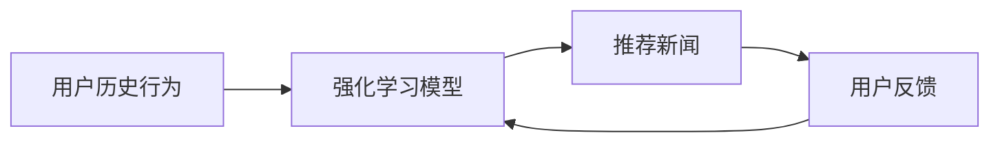

## 1.背景介绍

在信息爆炸的时代，新闻推荐系统的重要性日益凸显。它能够帮助用户在海量的新闻中快速找到自己感兴趣的内容，极大地提升了用户体验。然而，传统的新闻推荐方法，如基于内容的推荐和协同过滤，往往忽略了用户的动态行为和新闻的时效性，导致推荐效果并不理想。这就需要我们寻找一种能够充分利用用户行为信息，同时考虑新闻时效性的推荐方法，而强化学习正是满足这一需求的理想选择。

## 2.核心概念与联系

强化学习是一种机器学习方法，通过让模型与环境进行交互，学习在给定状态下执行何种动作可以获得最大的累积奖励。在新闻推荐场景中，状态可以被定义为用户的历史行为，动作则是推荐的新闻，奖励则是用户对推荐新闻的反馈。



## 3.核心算法原理具体操作步骤

强化学习的核心是通过不断的试错，学习一个策略π，使得从任意状态s开始，按照策略π选择动作，可以获得的累积奖励最大。这个过程可以分为以下几个步骤：

1. **初始化**：初始化状态s和策略π。
2. **选择动作**：根据当前状态s和策略π，选择一个动作a。
3. **执行动作**：执行动作a，得到奖励r和新的状态s'。
4. **更新策略**：根据奖励r和新的状态s'，更新策略π。
5. **重复**：将状态s更新为s'，重复步骤2-4，直到满足终止条件。

## 4.数学模型和公式详细讲解举例说明

强化学习的目标是找到一个策略π，使得从任意状态s开始，按照策略π选择动作，可以获得的累积奖励最大。这可以用数学语言表达为：

$$
\max_\pi E_{\pi}[\sum_{t=0}^{\infty}\gamma^t r_t]
$$

其中，$E_{\pi}$表示在策略π下的期望，$r_t$表示在时间t获得的奖励，$\gamma$是折扣因子，用于控制对未来奖励的考虑程度。

## 5.项目实践：代码实例和详细解释说明

这里我们以Deep Q Network（DQN）为例，介绍如何使用强化学习进行新闻推荐。由于篇幅原因，我们只展示核心代码。

```python
import numpy as np
import tensorflow as tf
from tensorflow.keras.models import Sequential
from tensorflow.keras.layers import Dense

# 定义DQN模型
model = Sequential([
    Dense(32, activation='relu', input_shape=(state_size,)),
    Dense(32, activation='relu'),
    Dense(action_size)
])

# 定义动作选择策略
def choose_action(state, epsilon):
    if np.random.random() < epsilon:
        return np.random.randint(action_size)
    else:
        return np.argmax(model.predict(state))

# 定义训练过程
def train(batch_size):
    # 从经验回放中随机抽取一个批次的经验
    batch = random.sample(memory, batch_size)
    for state, action, reward, next_state, done in batch:
        if done:
            target = reward
        else:
            target = reward + gamma * np.max(model.predict(next_state))
        target_f = model.predict(state)
        target_f[0][action] = target
        model.fit(state, target_f, epochs=1, verbose=0)
```

## 6.实际应用场景

强化学习在新闻推荐系统中的应用已经非常广泛。例如，阿里巴巴的新闻推荐系统就使用了强化学习，通过实时学习用户的反馈，动态调整推荐策略，大大提升了用户的点击率和阅读时长。

## 7.工具和资源推荐

1. **TensorFlow**：Google开源的深度学习框架，支持多种强化学习算法。
2. **OpenAI Gym**：OpenAI开源的强化学习环境库，提供了丰富的环境供强化学习模型进行训练。

## 8.总结：未来发展趋势与挑战

强化学习在新闻推荐中的应用还处于初级阶段，未来有很大的发展空间。一方面，我们可以尝试更多的强化学习算法，例如Actor-Critic、PPO等。另一方面，我们还可以尝试将强化学习与其他技术结合，例如使用深度学习来表示状态和动作，或者使用迁移学习来提高模型的泛化能力。然而，这也带来了挑战，如何有效地处理大规模用户和新闻的问题，如何处理新闻的时效性问题，都是我们需要解决的问题。

## 9.附录：常见问题与解答

1. **强化学习和监督学习有什么区别？**

强化学习和监督学习的主要区别在于，强化学习没有明确的标签，模型需要通过与环境的交互来学习；而监督学习有明确的标签，模型通过最小化预测值和标签之间的差距来学习。

2. **强化学习如何处理新闻的时效性问题？**

强化学习可以通过引入时间衰减因子来处理新闻的时效性问题。具体来说，我们可以让模型对近期的奖励给予更大的权重，对远期的奖励给予较小的权重。

作者：禅与计算机程序设计艺术 / Zen and the Art of Computer Programming