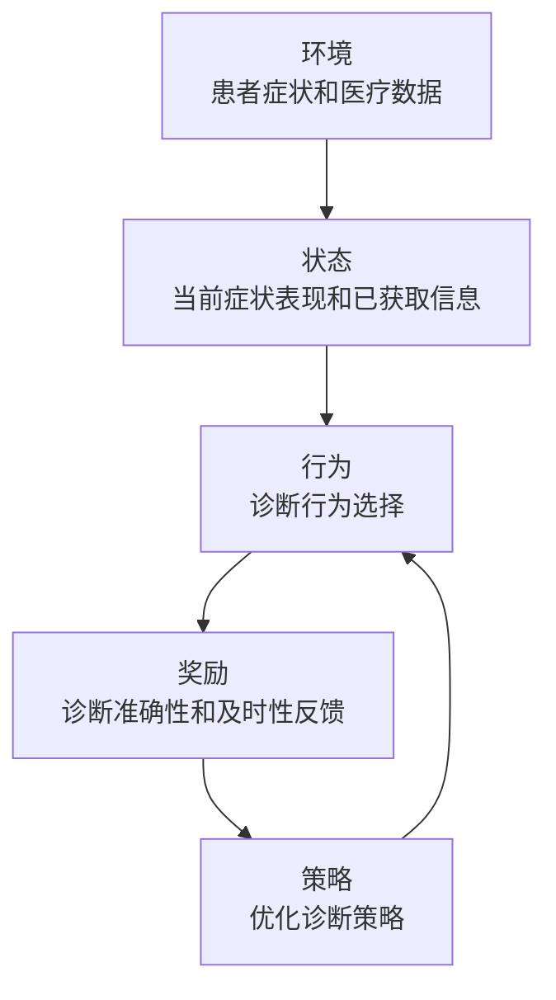

# 强化学习：在智能医疗诊断中的应用

## 1.背景介绍

### 1.1 医疗诊断的重要性和挑战

医疗诊断是医疗保健体系中最关键的环节之一。准确及时的诊断对于疾病的早期发现、治疗方案的制定和预后的改善至关重要。然而,医疗诊断过程存在诸多挑战:

- 疾病症状的复杂性和多样性,导致诊断过程具有很高的不确定性。
- 医生的知识和经验存在局限性,难以涵盖所有疾病的全部症状表现。
- 医疗资源的不均衡分布,导致部分地区缺乏经验丰富的医生。

### 1.2 人工智能在医疗诊断中的应用前景

随着人工智能技术的不断发展,尤其是机器学习和深度学习的兴起,人工智能在医疗诊断领域展现出了巨大的应用潜力。人工智能系统可以通过学习海量的医疗数据,捕捉疾病与症状之间的复杂关联模式,从而提供准确的诊断建议。

强化学习作为机器学习的一个重要分支,其独特的试错学习方式和决策优化能力,使其在医疗诊断领域具有广阔的应用前景。本文将重点探讨强化学习在智能医疗诊断中的应用。

## 2.核心概念与联系

### 2.1 强化学习概述

强化学习是一种基于环境交互的机器学习范式,其核心思想是通过不断试错,学习一系列行为策略,以最大化预期的长期回报。强化学习系统由以下几个核心组件组成:

- **环境(Environment)**:强化学习智能体所处的外部世界,智能体通过与环境交互来获取信息和反馈。
- **状态(State)**:描述环境当前的情况。
- **行为(Action)**:智能体在当前状态下可以采取的行动。
- **奖励(Reward)**:环境对智能体行为的反馈,指导智能体朝着正确方向学习。
- **策略(Policy)**:智能体在各种状态下选择行为的策略,是强化学习的最终目标。

强化学习算法通过不断尝试不同的行为策略,获取环境反馈,并根据反馈调整策略,最终达到最优化目标。

### 2.2 医疗诊断中的强化学习框架

将强化学习应用于医疗诊断过程中,可以构建如下框架:

- **环境**:患者的症状、体征、检查结果等医疗数据构成了强化学习环境。
- **状态**:描述患者当前的症状表现和已获取的医疗信息。
- **行为**:医生可以采取的诊断行为,如询问症状、要求进行检查等。
- **奖励**:根据诊断的准确性和及时性给予奖励或惩罚。
- **策略**:智能诊断系统根据当前状态选择最优诊断行为的策略。

通过不断尝试不同的诊断策略,获取诊断反馈,强化学习算法可以逐步优化诊断策略,提高诊断的准确性和效率。



## 3.核心算法原理具体操作步骤

强化学习算法的核心在于如何根据环境反馈,有效地更新和优化策略。以下是一种常用的强化学习算法——Q-Learning的具体操作步骤:

1. **初始化Q表**:创建一个Q表,其中的每个元素Q(s,a)表示在状态s下采取行为a的价值估计。初始时,所有Q(s,a)被赋予一个较小的随机值。

2. **选择行为**:对于当前状态s,根据一定的策略(如ε-贪婪策略)选择一个行为a。ε-贪婪策略是指以一定的概率ε选择最优行为,以1-ε的概率随机选择其他行为,以保证探索的充分性。

3. **执行行为并获取反馈**:执行选择的行为a,观察环境的反馈,获取下一个状态s'和即时奖励r。

4. **更新Q值**:根据下式更新Q(s,a)的估计值:

$$Q(s,a) \leftarrow Q(s,a) + \alpha[r + \gamma\max_{a'}Q(s',a') - Q(s,a)]$$

其中:
- $\alpha$是学习率,控制了新知识对旧知识的影响程度。
- $\gamma$是折扣因子,表示对未来奖励的衰减程度。
- $\max_{a'}Q(s',a')$是在下一状态s'下可获得的最大预期奖励。

5. **重复步骤2-4**:重复执行上述步骤,直到策略收敛或达到预设的迭代次数。

通过不断更新Q表,Q-Learning算法可以逐步找到最优策略,使长期累积奖励最大化。

## 4.数学模型和公式详细讲解举例说明

### 4.1 马尔可夫决策过程(MDP)

强化学习问题通常可以建模为马尔可夫决策过程(Markov Decision Process, MDP)。MDP是一种离散时间的随机控制过程,由以下五元组组成:

$$\langle \mathcal{S}, \mathcal{A}, \mathcal{P}, \mathcal{R}, \gamma \rangle$$

其中:

- $\mathcal{S}$是状态集合
- $\mathcal{A}$是行为集合
- $\mathcal{P}$是状态转移概率,表示在状态s下执行行为a后,转移到状态s'的概率:$\mathcal{P}_{ss'}^a = \Pr(s_{t+1}=s' | s_t=s, a_t=a)$
- $\mathcal{R}$是奖励函数,表示在状态s下执行行为a后,获得的即时奖励:$\mathcal{R}_s^a$
- $\gamma \in [0, 1)$是折扣因子,表示对未来奖励的衰减程度

在医疗诊断中,MDP可以这样建模:

- 状态$\mathcal{S}$:患者的症状表现和已获取的医疗信息
- 行为$\mathcal{A}$:医生可采取的诊断行为,如询问症状、要求检查等
- 状态转移概率$\mathcal{P}$:执行某个诊断行为后,患者症状和信息的变化概率
- 奖励函数$\mathcal{R}$:根据诊断的准确性和及时性给予的奖励或惩罚
- 折扣因子$\gamma$:表示对未来诊断结果的重视程度

### 4.2 价值函数和Bellman方程

在强化学习中,我们希望找到一个最优策略$\pi^*$,使得在该策略下的长期累积奖励最大化。这个长期累积奖励被称为价值函数(Value Function),记为$V^{\pi}(s)$,表示在状态s下执行策略$\pi$所能获得的预期长期奖励:

$$V^{\pi}(s) = \mathbb{E}_{\pi}\left[ \sum_{t=0}^{\infty} \gamma^t r_{t+1} | s_0 = s \right]$$

其中$r_{t+1}$是在时刻t+1获得的即时奖励。

价值函数满足著名的Bellman方程:

$$V^{\pi}(s) = \mathbb{E}_{\pi}\left[ r(s, a) + \gamma \sum_{s' \in \mathcal{S}} \mathcal{P}_{ss'}^a V^{\pi}(s') \right]$$

该方程表明,在状态s下执行策略$\pi$的价值,等于在该状态下获得的即时奖励,加上按照概率$\mathcal{P}_{ss'}^a$转移到下一状态s'后,获得的折扣后的价值之和。

我们的目标是找到一个最优策略$\pi^*$,使得$V^{\pi^*}(s) \geq V^{\pi}(s)$对所有$\pi$和$s$都成立。这个最优价值函数$V^*(s)$满足Bellman最优方程:

$$V^*(s) = \max_a \mathbb{E}\left[ r(s, a) + \gamma \sum_{s' \in \mathcal{S}} \mathcal{P}_{ss'}^a V^*(s') \right]$$

通过解析或迭代的方式求解Bellman最优方程,我们就可以找到最优策略$\pi^*$。

### 4.3 Q-Learning算法推导

Q-Learning算法是一种基于价值迭代的强化学习算法,它直接学习状态-行为对的价值函数Q(s,a),而不是先学习状态价值函数V(s)。Q(s,a)表示在状态s下执行行为a,之后能获得的预期长期奖励:

$$Q(s, a) = \mathbb{E}\left[ \sum_{t=0}^{\infty} \gamma^t r_{t+1} | s_0 = s, a_0 = a \right]$$

Q函数满足以下Bellman方程:

$$Q(s, a) = \mathbb{E}\left[ r(s, a) + \gamma \sum_{s' \in \mathcal{S}} \mathcal{P}_{ss'}^a \max_{a'} Q(s', a') \right]$$

我们可以通过迭代的方式更新Q(s,a)的估计值,使其逼近真实的Q函数:

$$Q(s,a) \leftarrow Q(s,a) + \alpha\left[ r(s, a) + \gamma \max_{a'} Q(s', a') - Q(s,a) \right]$$

其中$\alpha$是学习率,控制了新知识对旧知识的影响程度。

通过不断更新Q表,Q-Learning算法可以逐步找到最优策略,使长期累积奖励最大化。

以下是一个简单的Q-Learning算法实现示例(伪代码):

```python
初始化 Q(s, a) = 0
重复(对每个episode):
    初始化状态 s
    重复(对每个步骤):
        根据 ε-贪婪策略选择行为 a
        执行行为 a, 观察奖励 r 和新状态 s'
        Q(s, a) = Q(s, a) + α[r + γ max_a' Q(s', a') - Q(s, a)]
        s = s'
    直到 s 是终止状态
```

## 5.项目实践:代码实例和详细解释说明

为了更好地理解强化学习在医疗诊断中的应用,我们将构建一个简单的示例项目。在这个项目中,我们将使用Q-Learning算法训练一个智能诊断系统,根据患者的症状表现,选择最优的诊断行为序列,以准确地诊断出患者的疾病。

### 5.1 问题建模

我们将医疗诊断问题建模为一个MDP:

- 状态$\mathcal{S}$:患者的症状表现和已获取的医疗信息,用一个向量表示。
- 行为$\mathcal{A}$:医生可采取的诊断行为,包括询问症状、要求检查等。
- 状态转移概率$\mathcal{P}$:执行某个诊断行为后,患者症状和信息的变化概率,由模拟数据生成。
- 奖励函数$\mathcal{R}$:根据诊断的准确性和及时性给予的奖励或惩罚,正确诊断给予较大正奖励,错误诊断给予较大负奖励。
- 折扣因子$\gamma$:设置为较大的值(如0.9),表示对未来诊断结果的高度重视。

### 5.2 代码实现

以下是使用Python和PyTorch实现的Q-Learning智能诊断系统的核心代码:

```python
import torch
import torch.nn as nn
import numpy as np

# 定义Q网络
class QNetwork(nn.Module):
    def __init__(self, state_dim, action_dim):
        super(QNetwork, self).__init__()
        self.fc1 = nn.Linear(state_dim, 64)
        self.fc2 = nn.Linear(64, action_dim)

    def forward(self, x):
        x = torch.relu(self.fc1(x))
        x = self.fc2(x)
        return x

# 定义环境
class DiagnosisEnv:
    def __init__(self, num_symptoms, num_actions):
        self.num_symptoms = num_symptoms
        self.num_actions = num_actions
        self.state = np.zeros(num_symptoms)
        self.done = False

    def reset(self):
        self