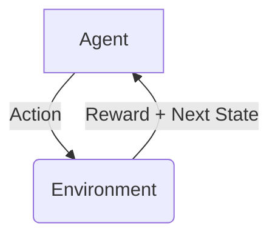

# 强化学习：在自然语言处理中的应用

## 1. 背景介绍

### 1.1 自然语言处理的挑战

自然语言处理(NLP)是人工智能领域的一个重要分支,旨在使计算机能够理解和生成人类语言。然而,自然语言的复杂性和多样性给NLP带来了巨大的挑战。例如:

- 语义歧义:同一个词或句子在不同上下文中可能有不同的含义。
- 语法复杂性:自然语言的语法结构往往非常复杂,难以用规则来精确描述。
- 语境依赖性:理解一个句子或段落通常需要考虑上下文信息。

### 1.2 强化学习在NLP中的作用

传统的NLP方法通常依赖于规则或统计模型,但这些方法难以处理自然语言的复杂性和多样性。强化学习(Reinforcement Learning,RL)则提供了一种新的解决方案。

强化学习是机器学习的一种范式,它通过与环境的交互来学习如何采取最优行动,以最大化预期的长期回报。在NLP领域,强化学习可以帮助智能体(Agent)学习如何理解和生成自然语言,从而克服传统方法的局限性。

## 2. 核心概念与联系

### 2.1 强化学习的核心概念

强化学习系统由以下几个核心组件组成:

- **Agent(智能体)**: 在环境中采取行动的决策实体。
- **Environment(环境)**: 智能体与之交互的外部世界。
- **State(状态)**: 环境的当前状况。
- **Action(行动)**: 智能体在给定状态下可以采取的操作。
- **Reward(奖励)**: 环境对智能体采取行动的评价,用于指导智能体学习。

强化学习的目标是找到一个策略(Policy),使得在给定的环境中,智能体能够通过采取一系列行动来最大化预期的长期奖励。



### 2.2 强化学习与NLP的联系

在NLP任务中,我们可以将智能体视为一个语言模型,环境则是输入的文本数据。智能体需要学习如何理解和生成自然语言,以获得最大的奖励(例如生成的文本质量评分)。

例如,在机器翻译任务中,智能体需要学习如何将源语言的句子翻译成目标语言,而环境则是源语言句子和目标语言语料库。智能体的行动可以是选择下一个词,奖励则可以是翻译质量的评分。通过不断与环境交互并获得奖励反馈,智能体可以逐步优化其翻译策略。

## 3. 核心算法原理具体操作步骤

强化学习算法通常分为基于价值的方法(Value-based)和基于策略的方法(Policy-based)两大类。我们将分别介绍这两种方法在NLP任务中的应用。

### 3.1 基于价值的方法

基于价值的方法旨在估计每个状态或状态-行动对的价值函数(Value Function),然后基于价值函数选择最优行动。在NLP任务中,我们可以将状态定义为当前生成的文本,行动则是选择下一个词。价值函数可以表示为:

$$V(s) = \mathbb{E}\left[\sum_{t=0}^{\infty}\gamma^tr_t|s_0=s\right]$$

其中$s$是状态,$r_t$是时间步$t$的奖励,$\gamma$是折现因子。我们的目标是找到一个最优的价值函数$V^*(s)$,使得在任何状态下采取的行动都能获得最大的预期奖励。

一种常用的基于价值的算法是Q-Learning,其核心思想是通过不断与环境交互,更新状态-行动对的Q值(Q-Value),直到收敛到最优的Q函数。Q函数定义为:

$$Q(s,a) = \mathbb{E}\left[\sum_{t=0}^{\infty}\gamma^tr_t|s_0=s,a_0=a\right]$$

其中$a$是行动。Q-Learning算法的更新规则为:

$$Q(s_t,a_t) \leftarrow Q(s_t,a_t) + \alpha\left[r_t + \gamma\max_{a'}Q(s_{t+1},a') - Q(s_t,a_t)\right]$$

其中$\alpha$是学习率。通过不断更新Q值,智能体可以逐步学习到最优的Q函数,从而选择能获得最大预期奖励的行动。

### 3.2 基于策略的方法

基于策略的方法直接学习一个策略函数(Policy Function)$\pi(a|s)$,表示在状态$s$下选择行动$a$的概率。在NLP任务中,策略函数可以表示为一个语言模型,输出下一个词的概率分布。

一种常用的基于策略的算法是Policy Gradient,其核心思想是通过梯度上升法直接优化策略函数,使得预期奖励最大化。Policy Gradient的目标函数为:

$$J(\theta) = \mathbb{E}_{\pi_\theta}\left[\sum_{t=0}^{\infty}r_t\right]$$

其中$\theta$是策略函数的参数。我们可以通过计算目标函数对参数$\theta$的梯度,并沿着梯度方向更新参数,从而优化策略函数:

$$\nabla_\theta J(\theta) = \mathbb{E}_{\pi_\theta}\left[\sum_{t=0}^{\infty}\nabla_\theta\log\pi_\theta(a_t|s_t)r_t\right]$$

通过不断与环境交互并更新策略函数的参数,智能体可以逐步学习到一个最优的策略,从而在给定的NLP任务中获得最大的预期奖励。

## 4. 数学模型和公式详细讲解举例说明

在前一节中,我们介绍了强化学习在NLP任务中的核心算法原理。现在,我们将通过一个具体的例子,详细讲解相关的数学模型和公式。

### 4.1 示例任务:文本摘要

假设我们的任务是生成一段文本的摘要。我们将使用基于序列的强化学习模型来解决这个问题。

设输入文本为$X = (x_1, x_2, \dots, x_n)$,目标是生成一个摘要序列$Y = (y_1, y_2, \dots, y_m)$。我们将状态$s_t$定义为已生成的摘要序列$(y_1, y_2, \dots, y_{t-1})$,行动$a_t$则是选择下一个词$y_t$。

我们的目标是学习一个策略函数$\pi_\theta(y_t|s_t, X)$,表示在给定输入文本$X$和当前状态$s_t$下,选择词$y_t$的概率。其中$\theta$是策略函数的参数。

### 4.2 奖励函数

为了引导智能体学习生成高质量的摘要,我们需要设计一个合理的奖励函数$r(s_t, a_t)$。一种常用的方法是基于生成的摘要与参考摘要之间的相似度来计算奖励。

假设我们有一个参考摘要$Y^* = (y_1^*, y_2^*, \dots, y_m^*)$,我们可以使用ROUGE分数来衡量生成摘要$Y$与参考摘要$Y^*$的相似度。ROUGE分数越高,表示生成的摘要质量越好。

我们可以将ROUGE分数作为即时奖励$r_t$,即:

$$r_t = \text{ROUGE}(Y, Y^*)$$

其中$Y$是当前生成的摘要序列$(y_1, y_2, \dots, y_t)$。

### 4.3 策略函数优化

我们将使用Policy Gradient算法来优化策略函数$\pi_\theta(y_t|s_t, X)$。根据Policy Gradient的原理,我们需要计算目标函数$J(\theta)$对参数$\theta$的梯度,并沿着梯度方向更新参数。

目标函数$J(\theta)$定义为预期的总奖励:

$$J(\theta) = \mathbb{E}_{\pi_\theta}\left[\sum_{t=0}^{m}r_t\right]$$

其中$m$是生成摘要的长度。

根据Policy Gradient算法,我们可以计算目标函数对参数$\theta$的梯度为:

$$\nabla_\theta J(\theta) = \mathbb{E}_{\pi_\theta}\left[\sum_{t=0}^{m}\nabla_\theta\log\pi_\theta(y_t|s_t, X)R_t\right]$$

其中$R_t = \sum_{t'=t}^{m}r_{t'}$是从时间步$t$开始的累积奖励。

在实践中,我们可以使用蒙特卡罗采样来估计梯度:

$$\nabla_\theta J(\theta) \approx \frac{1}{N}\sum_{i=1}^{N}\sum_{t=0}^{m}\nabla_\theta\log\pi_\theta(y_t^{(i)}|s_t^{(i)}, X)R_t^{(i)}$$

其中$N$是采样次数,$(y_t^{(i)}, s_t^{(i)}, R_t^{(i)})$是第$i$次采样得到的序列、状态和累积奖励。

通过计算梯度$\nabla_\theta J(\theta)$,我们可以使用优化算法(如Adam)沿着梯度方向更新策略函数的参数$\theta$,从而逐步优化策略函数,使其能够生成高质量的文本摘要。

## 5. 项目实践:代码实例和详细解释说明

在前面的章节中,我们介绍了强化学习在NLP任务中的理论基础。现在,我们将通过一个实际的代码示例,展示如何使用强化学习来解决文本摘要任务。

我们将使用PyTorch和OpenAI Gym库来实现一个基于Policy Gradient的强化学习模型。代码示例如下:

```python
import torch
import torch.nn as nn
import torch.optim as optim
from torch.distributions import Categorical
import gym

# 定义环境
env = gym.make('TextSummarization-v0')

# 定义策略网络
class PolicyNetwork(nn.Module):
    def __init__(self, input_size, hidden_size, output_size):
        super(PolicyNetwork, self).__init__()
        self.fc1 = nn.Linear(input_size, hidden_size)
        self.fc2 = nn.Linear(hidden_size, output_size)

    def forward(self, x):
        x = torch.relu(self.fc1(x))
        x = self.fc2(x)
        return x

# 初始化策略网络
policy_net = PolicyNetwork(input_size, hidden_size, output_size)

# 定义优化器
optimizer = optim.Adam(policy_net.parameters(), lr=learning_rate)

# 训练循环
for episode in range(num_episodes):
    state = env.reset()
    episode_reward = 0

    for t in range(max_steps):
        # 获取策略网络输出的动作概率
        action_probs = policy_net(state)
        dist = Categorical(action_probs)

        # 采样动作
        action = dist.sample()

        # 执行动作并获取奖励
        next_state, reward, done, _ = env.step(action.item())
        episode_reward += reward

        # 更新策略网络
        optimizer.zero_grad()
        log_probs = dist.log_prob(action)
        loss = -log_probs * reward
        loss.backward()
        optimizer.step()

        if done:
            break

        state = next_state

    print(f'Episode {episode}: Reward = {episode_reward}')
```

下面是代码的详细解释:

1. 首先,我们导入必要的库,并定义了文本摘要环境`env`。在实际应用中,这个环境可以是一个包装了文本数据集的自定义环境。

2. 接下来,我们定义了一个简单的全连接神经网络`PolicyNetwork`,作为策略函数。该网络将输入状态(例如当前生成的摘要)映射到动作概率分布。

3. 我们初始化了策略网络`policy_net`和优化器`optimizer`。

4. 在训练循环中,我们遍历每一个episode。对于每个episode,我们首先重置环境,获取初始状态。

5. 在每个时间步,我们通过策略网络获取动作概率分布`action_probs`。然后,我们从该分布中采样一个动作`action`。

6. 我们执行采样的动作,获取下一个状态`next_state`、即时奖励`reward`和是否结束标志`done`。

7. 我们计算该episode的累积奖励`episode_reward`。

8. 根据Policy Gradient算法,我们计算损失函数`loss`,即负的log概率乘以即时奖励。然后,我们通过反向传播更新策略网络的参数。

9. 如果当前episode