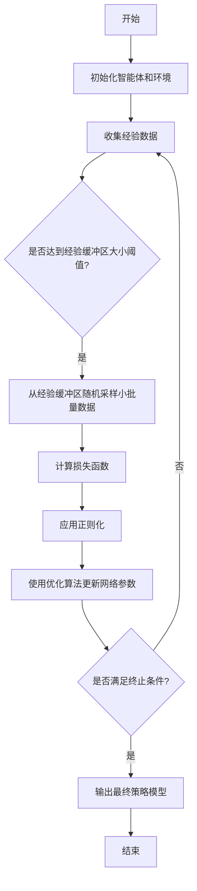

# 强化学习：防止过拟合的策略

## 1.背景介绍

### 1.1 什么是强化学习?

强化学习(Reinforcement Learning, RL)是机器学习的一个重要分支,它赋予智能体(Agent)在与环境(Environment)交互的过程中,通过试错学习获取最优策略的能力。与监督学习和无监督学习不同,强化学习没有提供标准答案的训练数据集,智能体需要基于从环境获得的奖励信号(Reward),自主探索并学习获取最优行为策略。

### 1.2 强化学习在实际应用中的重要性

强化学习在诸多领域展现出巨大的应用前景,如机器人控制、游戏AI、自动驾驶、智能调度等。其中,DeepMind的AlphaGo战胜人类顶尖棋手的壮举,充分展示了强化学习在复杂决策领域的卓越表现。随着算力和数据的不断增长,强化学习有望在更多领域发挥关键作用。

### 1.3 过拟合问题

尽管强化学习取得了诸多成功,但仍面临一些挑战,其中之一就是过拟合(Overfitting)问题。过拟合指的是模型过于专注于学习训练数据的特征和噪声,而无法很好地泛化到新的未见过的数据,导致在测试集上的性能下降。在强化学习中,过拟合会使智能体无法很好地推广已学习的策略到新的环境状态,影响其决策的稳健性和普适性。

## 2.核心概念与联系

### 2.1 价值函数(Value Function)

价值函数是强化学习中的核心概念之一,用于评估当前状态或状态-行为对的期望回报(Expected Return)。通过学习价值函数,智能体可以估计采取特定行为的长期收益,从而指导其做出最优决策。

### 2.2 Q-Learning算法

Q-Learning是一种著名的基于价值函数的强化学习算法,它通过不断更新Q值(Q-Value)来逼近最优Q函数,从而获得最优策略。Q值表示在当前状态采取某个行为后,期望获得的累积未来奖励。

### 2.3 深度神经网络(Deep Neural Network)

随着深度学习的兴起,越来越多的研究将深度神经网络应用于强化学习中,用于逼近复杂的价值函数或策略。深度神经网络具有强大的非线性拟合能力,可以从高维观测数据中提取有用的特征,提高智能体的决策质量。

### 2.4 经验重放(Experience Replay)

经验重放是一种常用的防止过拟合的技术,它通过存储智能体与环境交互的经验(状态、行为、奖励等),并在训练时随机抽取这些经验进行学习,从而减少相关性,提高数据的利用效率,并增强探索。

### 2.5 正则化(Regularization)

正则化是机器学习中常用的防止过拟合的方法,它通过在损失函数中加入惩罚项,限制模型的复杂度,从而提高其泛化能力。在强化学习中,常见的正则化方法包括L1/L2正则化、dropout等。

## 3.核心算法原理具体操作步骤

防止强化学习过拟合的核心算法原理和具体操作步骤如下:



1. **初始化智能体和环境**:根据问题场景,构建智能体(Agent)和环境(Environment)对象,设置初始状态和超参数。

2. **收集经验数据**:让智能体与环境进行交互,根据当前策略选择行为,并观测环境的反馈(下一状态和奖励),将这些经验(状态、行为、奖励、下一状态)存储到经验重放缓冲区(Experience Replay Buffer)中。

3. **判断经验缓冲区大小**:当经验缓冲区的大小达到预设阈值时,进入下一步骤。

4. **从经验缓冲区随机采样小批量数据**:为了减少相关性,从经验缓冲区中随机采样一个小批量的经验数据,用于网络训练。

5. **计算损失函数**:使用深度神经网络逼近价值函数或策略,并根据采样的经验数据计算损失函数(如时序差分误差)。

6. **应用正则化**:在损失函数中加入正则化项(如L1/L2正则化或dropout),以限制模型复杂度,提高泛化能力。

7. **使用优化算法更新网络参数**:使用优化算法(如随机梯度下降),根据损失函数的梯度,更新神经网络的参数。

8. **判断终止条件**:检查是否满足终止条件(如最大训练步数或策略收敛),如果不满足,则回到步骤3继续训练。

9. **输出最终策略模型**:当满足终止条件时,输出训练好的策略模型,可用于实际决策或部署。

通过上述步骤,强化学习算法可以有效地利用经验重放和正则化等技术,减少过拟合,提高策略的泛化能力。

## 4.数学模型和公式详细讲解举例说明

### 4.1 Q-Learning算法

Q-Learning是一种基于价值函数的强化学习算法,它通过不断更新Q值来逼近最优Q函数,从而获得最优策略。Q值定义为在状态s下采取行为a后,期望获得的累积未来奖励,可表示为:

$$Q(s, a) = \mathbb{E}\left[r_t + \gamma r_{t+1} + \gamma^2 r_{t+2} + \cdots | s_t = s, a_t = a\right]$$

其中,$\gamma$是折现因子,用于权衡即时奖励和未来奖励的重要性。

Q-Learning算法通过以下迭代方式更新Q值:

$$Q(s_t, a_t) \leftarrow Q(s_t, a_t) + \alpha \left[r_t + \gamma \max_{a'} Q(s_{t+1}, a') - Q(s_t, a_t)\right]$$

其中,$\alpha$是学习率,决定了新信息对Q值的影响程度。

通过不断更新Q值,Q-Learning算法可以逐步逼近最优Q函数$Q^*(s, a)$,从而获得最优策略$\pi^*(s) = \arg\max_a Q^*(s, a)$。

### 4.2 深度Q网络(Deep Q-Network, DQN)

深度Q网络(DQN)是将深度神经网络应用于Q-Learning的一种方法,用于逼近复杂的Q函数。DQN使用一个卷积神经网络(CNN)或全连接神经网络(FNN)来表示Q函数,其输入是当前状态s,输出是所有可能行为a的Q值$Q(s, a; \theta)$,其中$\theta$是网络参数。

在训练过程中,DQN使用经验重放和目标网络(Target Network)等技术,从而提高训练的稳定性和效率。目标网络是Q网络的一个副本,用于计算目标Q值,而Q网络则根据目标Q值和当前Q值之间的差异来更新参数,从而减少相关性并提高收敛速度。

DQN的损失函数可以定义为:

$$\mathcal{L}(\theta) = \mathbb{E}_{(s, a, r, s')\sim D}\left[\left(r + \gamma \max_{a'} Q(s', a'; \theta^-) - Q(s, a; \theta)\right)^2\right]$$

其中,$D$是经验重放缓冲区,$(s, a, r, s')$是从中采样的状态-行为-奖励-下一状态转移,$\theta^-$是目标网络的参数。

通过最小化损失函数,DQN可以逐步更新Q网络的参数$\theta$,从而逼近最优Q函数。

### 4.3 策略梯度算法(Policy Gradient)

除了基于价值函数的方法,策略梯度算法是另一种常用的强化学习方法。策略梯度算法直接对策略$\pi_\theta(a|s)$进行参数化,其中$\theta$是策略网络的参数,然后通过最大化期望回报来更新参数。

策略梯度算法的目标是最大化期望回报:

$$J(\theta) = \mathbb{E}_{\tau \sim \pi_\theta}\left[\sum_{t=0}^{T} \gamma^t r_t\right]$$

其中,$\tau$是按照策略$\pi_\theta$采样得到的轨迹(状态-行为序列),$r_t$是第t个时间步的奖励。

根据策略梯度定理,我们可以计算期望回报$J(\theta)$关于策略参数$\theta$的梯度:

$$\nabla_\theta J(\theta) = \mathbb{E}_{\tau \sim \pi_\theta}\left[\sum_{t=0}^{T} \nabla_\theta \log \pi_\theta(a_t|s_t) Q^{\pi_\theta}(s_t, a_t)\right]$$

其中,$Q^{\pi_\theta}(s_t, a_t)$是在策略$\pi_\theta$下,状态-行为对$(s_t, a_t)$的价值函数。

通过计算梯度$\nabla_\theta J(\theta)$,并使用优化算法(如随机梯度下降)更新策略参数$\theta$,策略梯度算法可以逐步提高期望回报,从而获得更优的策略。

### 4.4 Actor-Critic算法

Actor-Critic算法是一种结合了价值函数和策略梯度的方法,它将智能体分为两个部分:Actor(行为网络)和Critic(价值网络)。

- Actor网络$\pi_\theta(a|s)$根据当前状态s输出行为a的概率分布,其参数为$\theta$。
- Critic网络$V_w(s)$评估当前状态s的价值,其参数为$w$。

Actor-Critic算法的目标是同时优化Actor和Critic网络,使它们相互促进,提高策略的质量。

Actor网络的更新规则类似于策略梯度算法:

$$\theta \leftarrow \theta + \alpha \nabla_\theta \log \pi_\theta(a_t|s_t) A^{\pi_\theta}(s_t, a_t)$$

其中,$A^{\pi_\theta}(s_t, a_t)$是优势函数(Advantage Function),表示在状态$s_t$下采取行为$a_t$相对于当前策略$\pi_\theta$的优势。优势函数可以由Critic网络近似估计。

Critic网络的更新规则类似于监督学习,使用时序差分误差(Temporal Difference Error)作为损失函数:

$$\mathcal{L}(w) = \mathbb{E}_{(s, r, s')\sim D}\left[\left(r + \gamma V_w(s') - V_w(s)\right)^2\right]$$

通过交替优化Actor和Critic网络,Actor-Critic算法可以同时提高策略的质量和价值函数的准确性,从而获得更好的强化学习性能。

## 5.项目实践:代码实例和详细解释说明

为了更好地理解强化学习中防止过拟合的策略,我们将通过一个简单的示例项目进行实践。在这个项目中,我们将使用PyTorch实现一个Deep Q-Network (DQN),并应用经验重放和L2正则化等技术来缓解过拟合问题。

我们将使用OpenAI Gym中的CartPole-v1环境,这是一个经典的控制问题,目标是通过适当的力量来保持一根杆子垂直并平衡小车的位置。

### 5.1 导入所需库

```python
import gym
import torch
import torch.nn as nn
import torch.optim as optim
import numpy as np
from collections import deque
```

### 5.2 定义DQN模型

我们使用一个简单的全连接神经网络来近似Q函数:

```python
class DQN(nn.Module):
    def __init__(self, state_size, action_size):
        super(DQN, self).__init__()
        self.fc1 = nn.Linear(state_size, 64)
        self.fc2 = nn.Linear(64, 64)
        self.fc3 = nn.Linear(64, action_size)

    def forward(self, x):
        x = torch.relu(self.fc1(x))
        x