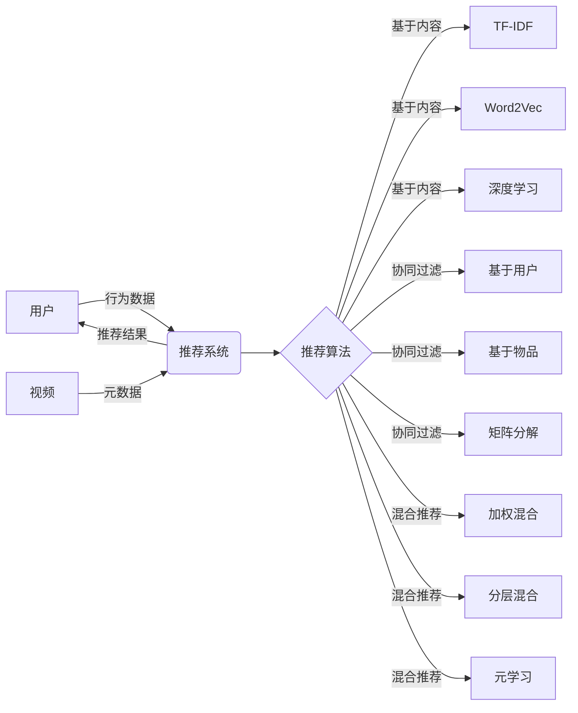

# 影片分享和推荐系统的设计与实现

## 1. 背景介绍

在当今互联网时代,视频分享和推荐已成为人们日常生活中不可或缺的一部分。越来越多的人通过在线视频平台获取信息、娱乐和学习资源。为了满足用户不断增长的需求,提供个性化、高质量的视频推荐服务变得尤为重要。本文将深入探讨影片分享和推荐系统的设计与实现,阐述其核心概念、关键技术以及实际应用。

### 1.1 视频分享平台的发展现状

#### 1.1.1 市场规模与用户群体分析
#### 1.1.2 主流视频分享平台介绍  
#### 1.1.3 用户需求与行为特征分析

### 1.2 个性化推荐的重要性

#### 1.2.1 提升用户体验与满意度
#### 1.2.2 增加用户粘性与留存率
#### 1.2.3 提高平台收益与商业价值

### 1.3 推荐系统面临的挑战

#### 1.3.1 信息过载与长尾问题
#### 1.3.2 用户兴趣多样性与变化性
#### 1.3.3 冷启动与数据稀疏性问题

## 2. 核心概念与联系

### 2.1 推荐系统的基本架构

#### 2.1.1 数据层：用户行为数据与视频元数据
#### 2.1.2 算法层：推荐算法与模型 
#### 2.1.3 应用层：推荐结果展示与反馈机制

### 2.2 推荐算法的分类

#### 2.2.1 基于内容的推荐算法
#### 2.2.2 协同过滤推荐算法
#### 2.2.3 混合推荐算法

### 2.3 用户画像与兴趣建模

#### 2.3.1 用户属性与行为特征提取
#### 2.3.2 用户兴趣表示与更新机制
#### 2.3.3 用户相似度计算方法

### 2.4 视频内容理解与表示学习

#### 2.4.1 视频内容特征提取与表示 
#### 2.4.2 深度学习在视频理解中的应用
#### 2.4.3 多模态融合与跨模态检索

## 3. 核心算法原理与具体操作步骤

### 3.1 基于内容的推荐算法

#### 3.1.1 TF-IDF 算法原理与实现
#### 3.1.2 Word2Vec 词嵌入模型原理与应用
#### 3.1.3 基于深度学习的内容表示学习方法

### 3.2 协同过滤推荐算法

#### 3.2.1 基于用户的协同过滤算法
#### 3.2.2 基于物品的协同过滤算法 
#### 3.2.3 矩阵分解技术在协同过滤中的应用

### 3.3 混合推荐算法

#### 3.3.1 加权混合推荐算法
#### 3.3.2 分层混合推荐算法
#### 3.3.3 元学习框架下的混合推荐方法

### 3.4 推荐系统中的排序与再排序策略

#### 3.4.1 基于相关性的排序算法
#### 3.4.2 基于多样性的再排序策略
#### 3.4.3 强化学习在排序问题中的应用

## 4. 数学模型和公式详细讲解举例说明

### 4.1 矩阵分解模型

#### 4.1.1 奇异值分解(SVD)
#### 4.1.2 非负矩阵分解(NMF)
#### 4.1.3 概率矩阵分解(PMF)

### 4.2 深度学习模型

#### 4.2.1 卷积神经网络(CNN)在视频理解中的应用
#### 4.2.2 循环神经网络(RNN)在序列建模中的应用
#### 4.2.3 注意力机制与自注意力机制

### 4.3 图神经网络模型 

#### 4.3.1 图卷积网络(GCN)原理与应用
#### 4.3.2 图注意力网络(GAT)原理与应用
#### 4.3.3 异构图神经网络(HIN)原理与应用

## 5. 项目实践：代码实例和详细解释说明

### 5.1 数据预处理与特征工程

#### 5.1.1 用户行为数据的清洗与转换
#### 5.1.2 视频元数据的提取与表示
#### 5.1.3 特征选择与降维技术

### 5.2 推荐算法的实现与优化

#### 5.2.1 基于内容的推荐算法实现
#### 5.2.2 协同过滤推荐算法实现
#### 5.2.3 混合推荐算法实现

### 5.3 模型训练与评估

#### 5.3.1 模型训练流程与超参数调优
#### 5.3.2 离线评估指标与方法
#### 5.3.3 在线 A/B 测试与效果评估

### 5.4 推荐系统的部署与优化

#### 5.4.1 推荐系统架构设计与实现
#### 5.4.2 推荐服务的性能优化与扩展性
#### 5.4.3 推荐系统的监控与报警机制

## 6. 实际应用场景

### 6.1 短视频推荐场景

#### 6.1.1 抖音的推荐策略分析
#### 6.1.2 快手的推荐策略分析
#### 6.1.3 短视频推荐中的挑战与创新

### 6.2 长视频推荐场景

#### 6.2.1 Netflix的推荐策略分析
#### 6.2.2 YouTube的推荐策略分析
#### 6.2.3 长视频推荐中的挑战与创新

### 6.3 垂直领域的视频推荐

#### 6.3.1 教育视频推荐场景分析
#### 6.3.2 电商直播推荐场景分析
#### 6.3.3 医疗健康视频推荐场景分析

## 7. 工具和资源推荐

### 7.1 开源推荐系统框架

#### 7.1.1 Apache Mahout
#### 7.1.2 LibRec
#### 7.1.3 Surprise

### 7.2 深度学习框架

#### 7.2.1 TensorFlow
#### 7.2.2 PyTorch
#### 7.2.3 Keras

### 7.3 图计算框架

#### 7.3.1 Neo4j
#### 7.3.2 GraphX
#### 7.3.3 DGL

### 7.4 推荐系统相关数据集

#### 7.4.1 MovieLens
#### 7.4.2 Netflix Prize
#### 7.4.3 Amazon Product Data

## 8. 总结：未来发展趋势与挑战

### 8.1 个性化与隐私保护的平衡

#### 8.1.1 差分隐私技术在推荐系统中的应用
#### 8.1.2 联邦学习框架下的隐私保护推荐
#### 8.1.3 用户隐私意识与隐私政策法规

### 8.2 推荐系统的公平性与多样性

#### 8.2.1 推荐结果的公平性评估与优化
#### 8.2.2 推荐多样性的度量与提升策略 
#### 8.2.3 推荐系统中的去偏见技术

### 8.3 推荐系统的可解释性与透明度

#### 8.3.1 可解释性推荐算法的研究进展
#### 8.3.2 推荐结果的可视化与交互式解释
#### 8.3.3 用户对推荐系统的信任与接受度

### 8.4 跨域推荐与知识迁移

#### 8.4.1 跨平台推荐中的用户身份链接
#### 8.4.2 跨领域推荐中的知识迁移学习
#### 8.4.3 异构网络中的推荐问题

## 9. 附录：常见问题与解答

### 9.1 如何解决冷启动问题？

### 9.2 如何平衡推荐的准确性与多样性？

### 9.3 如何处理用户反馈与噪声数据？

### 9.4 如何实现实时推荐？

### 9.5 如何评估推荐系统的效果？

### 9.6 如何应对数据稀疏性问题？

### 9.7 如何处理用户兴趣漂移问题？

### 9.8 如何利用社交网络信息进行推荐？

### 9.9 如何解释推荐结果？

### 9.10 如何保护用户隐私？

## 核心概念原理和架构的 Mermaid 流程图

作者：禅与计算机程序设计艺术 / Zen and the Art of Computer Programming