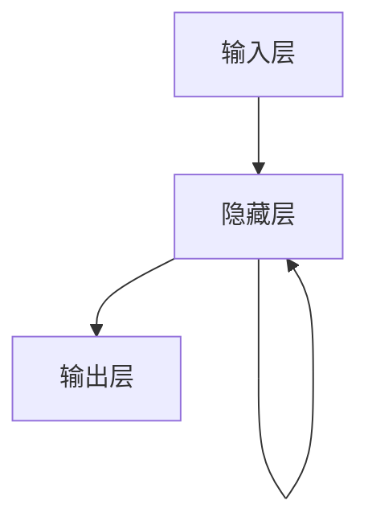

# 循环神经网络(RNN)原理与代码实战案例讲解

## 1.背景介绍

### 1.1 神经网络简介

神经网络是一种受生物神经系统启发而设计的计算模型,旨在模拟人脑的工作原理。它由大量相互连接的节点(神经元)组成,这些节点可以接收输入,进行计算处理,并产生输出。神经网络具有自适应性强、容错性高、并行处理能力强等优点,因此被广泛应用于模式识别、数据挖掘、预测分析等领域。

### 1.2 循环神经网络的产生背景

传统的前馈神经网络(如多层感知器)在处理序列数据时存在一些局限性。它们无法很好地捕捉序列数据中的时间依赖关系,也无法处理可变长度的输入和输出序列。为了解决这些问题,循环神经网络(Recurrent Neural Network, RNN)应运而生。

循环神经网络是一种特殊的深度神经网络,它在隐藏层中引入了循环连接,使得网络能够记住过去的信息,从而更好地处理序列数据。RNN在自然语言处理、语音识别、时间序列预测等领域有着广泛的应用。

## 2.核心概念与联系

### 2.1 循环神经网络的基本结构

循环神经网络的基本结构如下图所示:

与传统神经网络不同,RNN的隐藏层不仅与输入层和输出层相连,还与自身相连。这种循环连接使得RNN能够将当前时刻的隐藏状态与前一时刻的隐藏状态相结合,从而捕捉序列数据中的时间依赖关系。

在上图中,输入层接收当前时刻的输入数据$x_t$,隐藏层根据当前输入$x_t$和前一时刻的隐藏状态$h_{t-1}$计算出当前时刻的隐藏状态$h_t$,输出层则根据当前隐藏状态$h_t$计算出输出$y_t$。

### 2.2 循环神经网络的计算过程

循环神经网络的计算过程可以表示为以下公式:

$$h_t = f_h(x_t, h_{t-1})$$
$$y_t = f_o(h_t)$$

其中:
- $x_t$表示当前时刻的输入
- $h_t$表示当前时刻的隐藏状态
- $h_{t-1}$表示前一时刻的隐藏状态
- $y_t$表示当前时刻的输出
- $f_h$是计算隐藏状态的函数,通常是一个非线性函数,如tanh或ReLU
- $f_o$是计算输出的函数,通常是一个线性函数或softmax函数

循环神经网络通过不断迭代上述计算过程,从而处理序列数据。每一个时刻的隐藏状态都融合了当前输入和过去的信息,使得RNN能够很好地捕捉序列数据中的长期依赖关系。

### 2.3 循环神经网络的变体

基于标准的RNN结构,研究人员提出了多种变体,以解决RNN在实际应用中存在的一些问题,如梯度消失/爆炸问题。常见的RNN变体包括:

- **长短期记忆网络(LSTM)**: 通过引入门控机制,有效解决了梯度消失/爆炸问题,能够更好地捕捉长期依赖关系。
- **门控循环单元(GRU)**: 相比LSTM,它的结构更加简单,参数更少,在某些任务上表现更好。
- **双向循环神经网络(Bi-RNN)**: 能够同时利用序列的正向和反向信息,提高了模型的性能。
- **深层循环神经网络**: 将多个RNN层堆叠,形成更深的网络结构,提高了模型的表达能力。

这些变体在不同的应用场景下具有不同的优势,为RNN的发展和应用带来了新的活力。

## 3.核心算法原理具体操作步骤 

### 3.1 前向传播过程

循环神经网络的前向传播过程可以分为以下几个步骤:

1. **初始化隐藏状态**

   在处理序列数据之前,需要初始化RNN的隐藏状态$h_0$,通常将其设置为全0向量。

2. **计算当前时刻的隐藏状态**

   根据当前时刻的输入$x_t$和前一时刻的隐藏状态$h_{t-1}$,计算当前时刻的隐藏状态$h_t$:

   $$h_t = f_h(W_{xh}x_t + W_{hh}h_{t-1} + b_h)$$

   其中$W_{xh}$和$W_{hh}$分别是输入到隐藏层和隐藏层到隐藏层的权重矩阵,$b_h$是隐藏层的偏置项,$f_h$是非线性激活函数(如tanh或ReLU)。

3. **计算当前时刻的输出**

   根据当前时刻的隐藏状态$h_t$,计算当前时刻的输出$y_t$:

   $$y_t = f_o(W_{hy}h_t + b_y)$$

   其中$W_{hy}$是隐藏层到输出层的权重矩阵,$b_y$是输出层的偏置项,$f_o$是输出层的激活函数(如softmax或线性函数)。

4. **重复上述步骤**

   对于序列数据中的每一个时刻,重复步骤2和步骤3,直到处理完整个序列。

通过上述步骤,RNN能够逐步处理序列数据,并产生相应的输出序列。值得注意的是,在每一个时刻,RNN的隐藏状态都会融合当前输入和过去的信息,从而捕捉序列数据中的时间依赖关系。

### 3.2 反向传播过程

为了训练RNN模型,需要通过反向传播算法计算损失函数对模型参数的梯度,并使用优化算法(如随机梯度下降)更新模型参数。RNN的反向传播过程与前向传播过程类似,但需要通过时间回归的方式计算梯度。

具体步骤如下:

1. **初始化梯度**

   初始化隐藏状态梯度$\frac{\partial L}{\partial h_t}=0$和输出梯度$\frac{\partial L}{\partial y_t}=0$,其中$L$是损失函数。

2. **计算当前时刻的梯度**

   根据损失函数对输出的梯度$\frac{\partial L}{\partial y_t}$,计算隐藏状态梯度$\frac{\partial L}{\partial h_t}$:

   $$\frac{\partial L}{\partial h_t} = \frac{\partial L}{\partial y_t}\frac{\partial y_t}{\partial h_t}$$

3. **计算权重梯度**

   计算输入到隐藏层、隐藏层到隐藏层和隐藏层到输出层的权重梯度:

   $$\frac{\partial L}{\partial W_{xh}} = \frac{\partial L}{\partial h_t}\frac{\partial h_t}{\partial W_{xh}}$$
   $$\frac{\partial L}{\partial W_{hh}} = \frac{\partial L}{\partial h_t}\frac{\partial h_t}{\partial W_{hh}}$$
   $$\frac{\partial L}{\partial W_{hy}} = \frac{\partial L}{\partial y_t}\frac{\partial y_t}{\partial W_{hy}}$$

4. **计算偏置梯度**

   计算隐藏层和输出层的偏置梯度:

   $$\frac{\partial L}{\partial b_h} = \frac{\partial L}{\partial h_t}\frac{\partial h_t}{\partial b_h}$$
   $$\frac{\partial L}{\partial b_y} = \frac{\partial L}{\partial y_t}\frac{\partial y_t}{\partial b_y}$$

5. **计算下一时刻的隐藏状态梯度**

   根据当前时刻的隐藏状态梯度$\frac{\partial L}{\partial h_t}$和下一时刻的隐藏状态梯度$\frac{\partial L}{\partial h_{t+1}}$,计算下一时刻的隐藏状态梯度:

   $$\frac{\partial L}{\partial h_{t-1}} = \frac{\partial L}{\partial h_t}\frac{\partial h_t}{\partial h_{t-1}} + \frac{\partial L}{\partial h_{t+1}}\frac{\partial h_{t+1}}{\partial h_t}$$

6. **重复上述步骤**

   对于序列数据中的每一个时刻,重复步骤2到步骤5,直到处理完整个序列。

7. **更新模型参数**

   根据计算得到的梯度,使用优化算法(如随机梯度下降)更新模型参数。

通过上述反向传播过程,RNN能够有效地训练模型参数,从而提高模型在序列数据上的性能。

## 4.数学模型和公式详细讲解举例说明

### 4.1 循环神经网络的数学模型

循环神经网络的数学模型可以用以下公式表示:

$$h_t = f_h(W_{xh}x_t + W_{hh}h_{t-1} + b_h)$$
$$y_t = f_o(W_{hy}h_t + b_y)$$

其中:

- $x_t$是当前时刻的输入向量
- $h_t$是当前时刻的隐藏状态向量
- $h_{t-1}$是前一时刻的隐藏状态向量
- $y_t$是当前时刻的输出向量
- $W_{xh}$是输入到隐藏层的权重矩阵
- $W_{hh}$是隐藏层到隐藏层的权重矩阵
- $W_{hy}$是隐藏层到输出层的权重矩阵
- $b_h$是隐藏层的偏置向量
- $b_y$是输出层的偏置向量
- $f_h$是隐藏层的激活函数,通常使用tanh或ReLU
- $f_o$是输出层的激活函数,通常使用softmax或线性函数

上述公式描述了RNN在每一个时刻的计算过程。当前时刻的隐藏状态$h_t$不仅取决于当前输入$x_t$,还取决于前一时刻的隐藏状态$h_{t-1}$。这种递归计算方式使得RNN能够捕捉序列数据中的时间依赖关系。

### 4.2 长短期记忆网络(LSTM)的数学模型

LSTM是RNN的一种变体,它通过引入门控机制来解决梯度消失/爆炸问题,从而更好地捕捉长期依赖关系。LSTM的数学模型可以用以下公式表示:

$$f_t = \sigma(W_f[h_{t-1}, x_t] + b_f)$$
$$i_t = \sigma(W_i[h_{t-1}, x_t] + b_i)$$
$$\tilde{c}_t = \tanh(W_c[h_{t-1}, x_t] + b_c)$$
$$c_t = f_t \odot c_{t-1} + i_t \odot \tilde{c}_t$$
$$o_t = \sigma(W_o[h_{t-1}, x_t] + b_o)$$
$$h_t = o_t \odot \tanh(c_t)$$

其中:

- $f_t$是遗忘门,用于控制保留上一时刻的细胞状态$c_{t-1}$的程度
- $i_t$是输入门,用于控制当前输入$x_t$和隐藏状态$h_{t-1}$对细胞状态$c_t$的影响程度
- $\tilde{c}_t$是候选细胞状态,表示基于当前输入$x_t$和隐藏状态$h_{t-1}$计算出的新细胞状态
- $c_t$是当前时刻的细胞状态,由遗忘门、输入门和候选细胞状态共同决定
- $o_t$是输出门,用于控制细胞状态$c_t$对隐藏状态$h_t$的影响程度
- $h_t$是当前时刻的隐藏状态,由输出门和细胞状态共同决定
- $W_f$、$W_i$、$W_c$、$W_o$分别是遗忘门、输入门、候选细胞状态和输出门的权重矩阵
- $b_f$、$b_i$、$b_c$、$b_o$分别是遗忘门、输入门、候选细胞状态和输出门的偏置向量
- $\sigma$是sigmoid函数,用于将