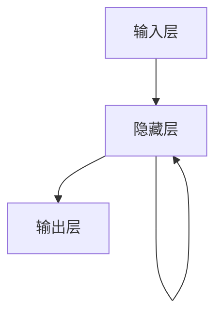

# 循环神经网络(Recurrent Neural Network)原理与代码实战案例讲解

## 1.背景介绍

循环神经网络（Recurrent Neural Network，简称RNN）是一种在处理序列数据方面表现优异的神经网络架构。与传统的前馈神经网络不同，RNN具有内部状态（或记忆），能够捕捉序列数据中的时间依赖性。这使得RNN在自然语言处理、时间序列预测、语音识别等领域得到了广泛应用。

## 2.核心概念与联系

### 2.1 序列数据

序列数据是指数据点按时间或顺序排列的集合。常见的序列数据包括文本、时间序列、音频信号等。RNN的设计初衷就是为了处理这类数据。

### 2.2 循环神经网络的基本结构

RNN的基本结构包括输入层、隐藏层和输出层。与传统神经网络不同的是，RNN的隐藏层不仅接收当前时间步的输入，还接收前一时间步的隐藏状态。



### 2.3 隐藏状态

隐藏状态是RNN的核心，它存储了序列数据的历史信息。隐藏状态在每个时间步都会更新，并传递到下一个时间步。

### 2.4 时间步

时间步是指序列数据中的每一个数据点在RNN中的处理过程。每个时间步都会更新隐藏状态，并生成输出。

## 3.核心算法原理具体操作步骤

### 3.1 前向传播

前向传播是指从输入层到输出层的计算过程。在RNN中，前向传播包括以下步骤：

1. 计算当前时间步的隐藏状态：
   $$
   h_t = \sigma(W_{xh}x_t + W_{hh}h_{t-1} + b_h)
   $$
   其中，$h_t$ 是当前时间步的隐藏状态，$x_t$ 是当前时间步的输入，$h_{t-1}$ 是前一时间步的隐藏状态，$W_{xh}$ 和 $W_{hh}$ 是权重矩阵，$b_h$ 是偏置，$\sigma$ 是激活函数。

2. 计算当前时间步的输出：
   $$
   y_t = \sigma(W_{hy}h_t + b_y)
   $$
   其中，$y_t$ 是当前时间步的输出，$W_{hy}$ 是权重矩阵，$b_y$ 是偏置。

### 3.2 反向传播

反向传播是指通过计算损失函数的梯度来更新权重和偏置。在RNN中，反向传播包括以下步骤：

1. 计算损失函数的梯度：
   $$
   \frac{\partial L}{\partial W_{hy}}, \frac{\partial L}{\partial b_y}, \frac{\partial L}{\partial W_{xh}}, \frac{\partial L}{\partial W_{hh}}, \frac{\partial L}{\partial b_h}
   $$

2. 更新权重和偏置：
   $$
   W_{hy} \leftarrow W_{hy} - \eta \frac{\partial L}{\partial W_{hy}}
   $$
   $$
   b_y \leftarrow b_y - \eta \frac{\partial L}{\partial b_y}
   $$
   $$
   W_{xh} \leftarrow W_{xh} - \eta \frac{\partial L}{\partial W_{xh}}
   $$
   $$
   W_{hh} \leftarrow W_{hh} - \eta \frac{\partial L}{\partial W_{hh}}
   $$
   $$
   b_h \leftarrow b_h - \eta \frac{\partial L}{\partial b_h}
   $$
   其中，$\eta$ 是学习率。

## 4.数学模型和公式详细讲解举例说明

### 4.1 数学模型

RNN的数学模型可以表示为以下形式：

1. 隐藏状态更新公式：
   $$
   h_t = \sigma(W_{xh}x_t + W_{hh}h_{t-1} + b_h)
   $$

2. 输出计算公式：
   $$
   y_t = \sigma(W_{hy}h_t + b_y)
   $$

### 4.2 举例说明

假设我们有一个简单的序列数据 $[x_1, x_2, x_3]$，我们希望通过RNN来预测每个时间步的输出。具体步骤如下：

1. 初始化隐藏状态 $h_0 = 0$。

2. 计算第一个时间步的隐藏状态和输出：
   $$
   h_1 = \sigma(W_{xh}x_1 + W_{hh}h_0 + b_h)
   $$
   $$
   y_1 = \sigma(W_{hy}h_1 + b_y)
   $$

3. 计算第二个时间步的隐藏状态和输出：
   $$
   h_2 = \sigma(W_{xh}x_2 + W_{hh}h_1 + b_h)
   $$
   $$
   y_2 = \sigma(W_{hy}h_2 + b_y)
   $$

4. 计算第三个时间步的隐藏状态和输出：
   $$
   h_3 = \sigma(W_{xh}x_3 + W_{hh}h_2 + b_h)
   $$
   $$
   y_3 = \sigma(W_{hy}h_3 + b_y)
   $$

## 5.项目实践：代码实例和详细解释说明

### 5.1 环境准备

首先，我们需要安装必要的Python库：

```bash
pip install numpy tensorflow
```

### 5.2 数据准备

我们使用一个简单的序列数据作为示例：

```python
import numpy as np

# 生成简单的序列数据
data = np.array([1, 2, 3, 4, 5, 6, 7, 8, 9, 10])
```

### 5.3 构建RNN模型

我们使用TensorFlow构建一个简单的RNN模型：

```python
import tensorflow as tf
from tensorflow.keras.models import Sequential
from tensorflow.keras.layers import SimpleRNN, Dense

# 构建RNN模型
model = Sequential()
model.add(SimpleRNN(10, input_shape=(None, 1)))
model.add(Dense(1))

model.compile(optimizer='adam', loss='mse')
```

### 5.4 训练模型

我们将数据进行预处理，并训练模型：

```python
# 数据预处理
X = data[:-1].reshape((1, -1, 1))
y = data[1:].reshape((1, -1, 1))

# 训练模型
model.fit(X, y, epochs=100)
```

### 5.5 预测结果

我们使用训练好的模型进行预测：

```python
# 预测结果
predictions = model.predict(X)
print(predictions)
```

## 6.实际应用场景

### 6.1 自然语言处理

RNN在自然语言处理（NLP）中的应用非常广泛，例如文本生成、机器翻译、情感分析等。通过捕捉文本中的时间依赖性，RNN能够生成上下文相关的输出。

### 6.2 时间序列预测

RNN在时间序列预测中的应用也非常广泛，例如股票价格预测、天气预报等。通过捕捉时间序列数据中的模式，RNN能够进行准确的预测。

### 6.3 语音识别

RNN在语音识别中的应用也非常广泛，例如语音转文字、语音合成等。通过捕捉音频信号中的时间依赖性，RNN能够生成准确的输出。

## 7.工具和资源推荐

### 7.1 开源框架

- TensorFlow：一个开源的机器学习框架，支持构建和训练RNN模型。
- PyTorch：另一个流行的开源机器学习框架，支持构建和训练RNN模型。

### 7.2 在线课程

- Coursera上的深度学习课程：由Andrew Ng教授讲授，涵盖了RNN的基本概念和应用。
- Udacity上的深度学习纳米学位：涵盖了RNN的高级应用和项目实践。

### 7.3 书籍推荐

- 《深度学习》：由Ian Goodfellow等人编写，详细介绍了RNN的原理和应用。
- 《神经网络与深度学习》：由Michael Nielsen编写，提供了RNN的详细讲解和代码示例。

## 8.总结：未来发展趋势与挑战

### 8.1 未来发展趋势

随着深度学习技术的不断发展，RNN在处理序列数据方面的应用将会越来越广泛。未来，RNN有望在更多领域中发挥重要作用，例如自动驾驶、智能家居等。

### 8.2 挑战

尽管RNN在处理序列数据方面表现优异，但它也面临一些挑战。例如，RNN在处理长序列数据时容易出现梯度消失和梯度爆炸问题。此外，RNN的训练过程较为复杂，计算资源消耗较大。

## 9.附录：常见问题与解答

### 9.1 什么是RNN？

RNN是一种在处理序列数据方面表现优异的神经网络架构，具有内部状态（或记忆），能够捕捉序列数据中的时间依赖性。

### 9.2 RNN的应用场景有哪些？

RNN的应用场景包括自然语言处理、时间序列预测、语音识别等。

### 9.3 RNN的主要挑战是什么？

RNN的主要挑战包括梯度消失和梯度爆炸问题，以及训练过程复杂、计算资源消耗较大等。

### 9.4 如何解决RNN的梯度消失和梯度爆炸问题？

可以通过使用长短期记忆网络（LSTM）和门控循环单元（GRU）等改进的RNN架构来解决梯度消失和梯度爆炸问题。

### 9.5 RNN与前馈神经网络的区别是什么？

RNN与前馈神经网络的主要区别在于RNN具有内部状态（或记忆），能够捕捉序列数据中的时间依赖性，而前馈神经网络则不能。

---

作者：禅与计算机程序设计艺术 / Zen and the Art of Computer Programming