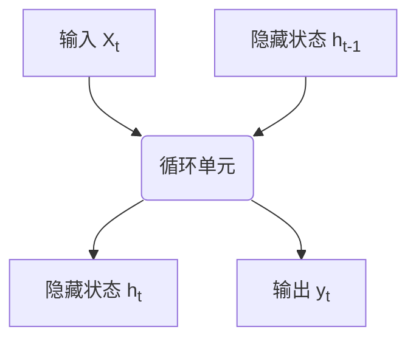

# 循环神经网络(Recurrent Neural Networks) - 原理与代码实例讲解

## 1.背景介绍

### 1.1 神经网络简介

神经网络是一种受生物神经系统启发而设计的计算模型,旨在模拟人脑进行信息处理和模式识别的方式。它由大量互相连接的节点(神经元)组成,这些节点通过数学运算对输入数据进行变换,从而学习并捕获输入数据中的模式。

### 1.2 传统神经网络的局限性

传统的前馈神经网络(Feed-Forward Neural Networks)在处理序列数据(如自然语言、语音、时间序列等)时存在一些局限性。这些网络通常将输入数据视为独立的实例,无法很好地捕捉序列数据中的时间依赖关系和上下文信息。

### 1.3 循环神经网络的出现

为了解决这个问题,循环神经网络(Recurrent Neural Networks, RNNs)应运而生。循环神经网络是一种特殊类型的神经网络,它通过引入循环连接,使得网络能够记住过去的信息,从而更好地处理序列数据。

## 2.核心概念与联系

### 2.1 循环神经网络的基本结构

循环神经网络的核心结构是一个循环单元,它由一个或多个非线性函数组成。这个循环单元会在每个时间步接收当前输入和上一时间步的隐藏状态,并计算当前时间步的隐藏状态和输出。



### 2.2 循环连接与时间依赖性

循环神经网络中的循环连接使得网络能够捕捉序列数据中的时间依赖关系。网络在每个时间步都会更新其隐藏状态,这个隐藏状态会携带过去时间步的信息,从而影响当前时间步的输出。

### 2.3 长期依赖问题

尽管循环神经网络能够在理论上捕捉任意长度的时间依赖关系,但在实践中,它们很难学习长期的依赖关系。这是由于梯度在反向传播过程中会逐渐消失或爆炸,导致无法有效地捕捉长期的时间依赖关系。

### 2.4 门控机制

为了解决长期依赖问题,研究人员提出了门控机制,如长短期记忆网络(LSTM)和门控循环单元(GRU)。这些门控机制通过引入门控单元,可以更好地控制信息的流动,从而更好地捕捉长期的时间依赖关系。

## 3.核心算法原理具体操作步骤

### 3.1 循环神经网络的前向传播

循环神经网络的前向传播过程可以概括为以下步骤:

1. 初始化隐藏状态,通常将其设置为全零向量。
2. 对于每个时间步 t:
   a. 将当前输入 $x_t$ 和上一时间步的隐藏状态 $h_{t-1}$ 作为输入,计算当前时间步的隐藏状态 $h_t$。
   b. 基于当前隐藏状态 $h_t$,计算当前时间步的输出 $y_t$。
3. 重复步骤 2,直到处理完整个序列。

### 3.2 循环神经网络的反向传播

循环神经网络的反向传播过程需要计算每个时间步的梯度,并将其累加到相应的权重梯度中。具体步骤如下:

1. 初始化所有时间步的梯度为零。
2. 对于每个时间步 t (从最后一个时间步开始,逆向遍历):
   a. 计算当前时间步的输出误差梯度。
   b. 计算当前时间步的隐藏状态梯度,包括来自当前时间步的输出误差梯度,以及来自下一时间步的隐藏状态梯度。
   c. 计算当前时间步的权重梯度,并累加到相应的权重梯度中。
3. 使用累加的权重梯度更新网络权重。

### 3.3 长短期记忆网络(LSTM)

长短期记忆网络(LSTM)是一种特殊的循环神经网络,它通过引入门控机制来解决长期依赖问题。LSTM的核心是一个记忆细胞,它通过三个门控单元(遗忘门、输入门和输出门)来控制信息的流动。

LSTM的前向传播和反向传播过程与普通循环神经网络类似,但需要额外计算门控单元的输出和梯度。

### 3.4 门控循环单元(GRU)

门控循环单元(GRU)是另一种解决长期依赖问题的门控机制。与LSTM相比,GRU的结构更加简单,只有两个门控单元(重置门和更新门)。

GRU的前向传播和反向传播过程与LSTM类似,但计算门控单元的输出和梯度的方式略有不同。

## 4.数学模型和公式详细讲解举例说明

### 4.1 循环神经网络的数学表示

循环神经网络的数学表示可以用以下公式描述:

$$h_t = f(x_t, h_{t-1}, \theta)$$
$$y_t = g(h_t, \theta)$$

其中:
- $x_t$ 是当前时间步的输入
- $h_t$ 是当前时间步的隐藏状态
- $h_{t-1}$ 是上一时间步的隐藏状态
- $y_t$ 是当前时间步的输出
- $f$ 和 $g$ 分别是计算隐藏状态和输出的函数
- $\theta$ 是网络的参数(权重和偏置)

### 4.2 长短期记忆网络(LSTM)的数学表示

LSTM的数学表示如下:

$$f_t = \sigma(W_f \cdot [h_{t-1}, x_t] + b_f)$$
$$i_t = \sigma(W_i \cdot [h_{t-1}, x_t] + b_i)$$
$$\tilde{C}_t = \tanh(W_C \cdot [h_{t-1}, x_t] + b_C)$$
$$C_t = f_t \odot C_{t-1} + i_t \odot \tilde{C}_t$$
$$o_t = \sigma(W_o \cdot [h_{t-1}, x_t] + b_o)$$
$$h_t = o_t \odot \tanh(C_t)$$

其中:
- $f_t$ 是遗忘门的输出
- $i_t$ 是输入门的输出
- $\tilde{C}_t$ 是候选记忆细胞
- $C_t$ 是当前时间步的记忆细胞
- $o_t$ 是输出门的输出
- $\sigma$ 是sigmoid函数
- $\tanh$ 是双曲正切函数
- $\odot$ 表示元素wise乘积操作

### 4.3 门控循环单元(GRU)的数学表示

GRU的数学表示如下:

$$z_t = \sigma(W_z \cdot [h_{t-1}, x_t] + b_z)$$
$$r_t = \sigma(W_r \cdot [h_{t-1}, x_t] + b_r)$$
$$\tilde{h}_t = \tanh(W_h \cdot [r_t \odot h_{t-1}, x_t] + b_h)$$
$$h_t = (1 - z_t) \odot h_{t-1} + z_t \odot \tilde{h}_t$$

其中:
- $z_t$ 是更新门的输出
- $r_t$ 是重置门的输出
- $\tilde{h}_t$ 是候选隐藏状态
- $h_t$ 是当前时间步的隐藏状态

## 5.项目实践：代码实例和详细解释说明

在这一部分,我们将提供一个基于PyTorch的循环神经网络实现示例,并对代码进行详细解释。

### 5.1 导入必要的库

```python
import torch
import torch.nn as nn
```

### 5.2 定义循环神经网络模型

```python
class RNN(nn.Module):
    def __init__(self, input_size, hidden_size, output_size):
        super(RNN, self).__init__()
        self.hidden_size = hidden_size
        self.rnn = nn.RNN(input_size, hidden_size, batch_first=True)
        self.fc = nn.Linear(hidden_size, output_size)

    def forward(self, x):
        batch_size = x.size(0)
        h0 = torch.zeros(1, batch_size, self.hidden_size)
        out, _ = self.rnn(x, h0)
        out = self.fc(out[:, -1, :])
        return out
```

在这个示例中,我们定义了一个简单的循环神经网络模型。该模型接受一个输入序列 `x`,并输出最后一个时间步的隐藏状态经过全连接层后的结果。

- `__init__`方法初始化模型参数,包括隐藏状态大小、RNN层和全连接层。
- `forward`方法定义了模型的前向传播过程。首先,我们初始化一个全零的隐藏状态 `h0`。然后,将输入序列 `x` 和初始隐藏状态 `h0` 传递给 RNN 层,得到所有时间步的输出和最后一个时间步的隐藏状态。最后,我们将最后一个时间步的隐藏状态经过全连接层,得到最终的输出。

### 5.3 训练和测试循环神经网络模型

```python
# 准备数据
# ...

# 定义模型
model = RNN(input_size, hidden_size, output_size)

# 定义损失函数和优化器
criterion = nn.CrossEntropyLoss()
optimizer = torch.optim.Adam(model.parameters())

# 训练循环
for epoch in range(num_epochs):
    for inputs, labels in train_loader:
        # 前向传播
        outputs = model(inputs)
        loss = criterion(outputs, labels)

        # 反向传播
        optimizer.zero_grad()
        loss.backward()
        optimizer.step()

    # 测试模型
    with torch.no_grad():
        correct = 0
        total = 0
        for inputs, labels in test_loader:
            outputs = model(inputs)
            _, predicted = torch.max(outputs.data, 1)
            total += labels.size(0)
            correct += (predicted == labels).sum().item()

        accuracy = 100 * correct / total
        print(f'Epoch: {epoch+1}, Accuracy: {accuracy}%')
```

在这个示例中,我们展示了如何训练和测试一个循环神经网络模型。具体步骤如下:

1. 准备训练和测试数据。
2. 定义循环神经网络模型。
3. 定义损失函数(这里使用交叉熵损失函数)和优化器(这里使用 Adam 优化器)。
4. 进入训练循环,对于每个批次的数据:
   a. 进行前向传播,计算输出和损失。
   b. 反向传播,计算梯度并更新模型参数。
5. 在每个epoch结束时,使用测试数据评估模型的性能,并打印准确率。

这只是一个简单的示例,在实际应用中,你可能需要调整模型架构、超参数和数据预处理方式,以获得更好的性能。

## 6.实际应用场景

循环神经网络在许多领域都有广泛的应用,包括但不限于:

### 6.1 自然语言处理

- **机器翻译**: 将一种语言的句子翻译成另一种语言。
- **文本生成**: 根据给定的上下文生成连贯的文本,如新闻摘要、对话系统等。
- **情感分析**: 分析文本中的情感倾向,如正面、负面或中性。
- **命名实体识别**: 识别文本中的人名、地名、组织机构名等实体。

### 6.2 语音识别

循环神经网络可以有效地处理语音信号,因此在语音识别领域有着广泛的应用。它们可以捕捉语音信号中的时间依赖关系,从而更准确地识别语音内容。

### 6.3 时间序列预测

循环神经网络非常适合处理时间序列数据,因此在时间序列预测领域有着广泛的应用,如股票价格预测、天气预报、能源需求预测等。

### 6.4 机器人控制

在机器人控制领域,循环神经网络可以用于处理传感器数据,并预测机器人的下一步动作。这对于实现更智能、更流畅的机器人控制至关重要。

### 6.5 视频分析

循环神经网络也可以应用于视频分析领域,如视