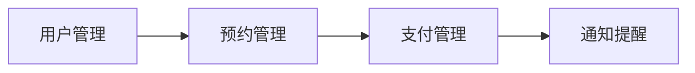

# 微信小程序健康体检预约

## 1. 背景介绍

随着人们健康意识的不断提高,定期体检已成为许多人的必备项目。然而,传统的体检预约方式往往存在诸多不便,如电话预约难以接通、现场排队等候时间长等问题。微信小程序的出现为体检预约提供了新的解决方案。本文将深入探讨如何利用微信小程序实现健康体检预约功能,让体检变得更加便捷高效。

### 1.1 微信小程序概述

#### 1.1.1 微信小程序的定义与特点
#### 1.1.2 微信小程序的发展现状
#### 1.1.3 微信小程序在医疗健康领域的应用前景

### 1.2 健康体检预约的现状与痛点

#### 1.2.1 传统体检预约方式的不足之处  
#### 1.2.2 移动互联网时代下用户对体检预约的新需求
#### 1.2.3 微信小程序在解决体检预约痛点方面的优势

## 2. 核心概念与联系

要实现微信小程序健康体检预约功能,需要理解以下几个核心概念:

### 2.1 用户管理

#### 2.1.1 用户注册与登录
#### 2.1.2 用户信息管理
#### 2.1.3 用户权限控制

### 2.2 预约管理 

#### 2.2.1 可预约项目管理
#### 2.2.2 预约时段管理  
#### 2.2.3 预约记录管理

### 2.3 支付管理

#### 2.3.1 支付方式集成
#### 2.3.2 订单管理
#### 2.3.3 退款处理

### 2.4 通知提醒

#### 2.4.1 预约成功通知
#### 2.4.2 体检前提醒
#### 2.4.3 体检报告推送

以上核心概念之间的联系可用下面的 Mermaid 流程图表示:



## 3. 核心算法原理具体操作步骤

实现健康体检预约的核心算法主要涉及以下几个方面:

### 3.1 预约时段算法

#### 3.1.1 读取可预约项目及对应的预约时段设置
#### 3.1.2 计算当前可预约时段
#### 3.1.3 更新预约时段占用情况

### 3.2 在线支付算法

#### 3.2.1 生成支付订单
#### 3.2.2 调用微信支付接口完成支付
#### 3.2.3 更新订单支付状态

### 3.3 体检报告推送算法

#### 3.3.1 体检完成后,读取用户体检报告
#### 3.3.2 根据用户设置,生成推送内容
#### 3.3.3 通过微信模板消息推送体检报告

## 4. 数学模型和公式详细讲解举例说明

在实现健康体检预约过程中,需要用到一些数学模型和公式,如下:

### 4.1 预约时段可用性计算

设某个体检项目共有 $n$ 个预约时段,每个时段可预约人数上限为 $m$,已预约人数为 $k_i(i=1,2,...,n)$,则第 $i$ 个时段的可用性 $a_i$ 可表示为:

$$
a_i=\begin{cases}
1, & k_i < m \\
0, & k_i = m
\end{cases}
$$

举例:假设某体检项目有 3 个预约时段,每个时段可预约 10 人,已预约人数分别为 5、8、10,则各时段可用性为:

$$
a_1 = 1, a_2 = 1, a_3 = 0
$$

### 4.2 预约人数统计

设有 $n$ 个体检项目,第 $i$ 个项目预约人数为 $c_i(i=1,2,...,n)$,则总预约人数 $t$ 为:

$$
t=\sum_{i=1}^n c_i
$$

举例:假设有 3 个体检项目,预约人数分别为 20、15、30,则总预约人数为:

$$
t = 20 + 15 + 30 = 65
$$

## 5. 项目实践:代码实例和详细解释说明

下面以用户预约体检项目的代码为例,详细说明微信小程序健康体检预约的实现过程。

### 5.1 可预约项目列表展示

```html
<!-- 可预约项目列表 -->
<view class="item-list">
  <view wx:for="{{items}}" wx:key="id" class="item">
    <image src="{{item.image}}" mode="aspectFill"></image>
    <view class="item-info">
      <text class="name">{{item.name}}</text>
      <text class="desc">{{item.desc}}</text>
      <text class="price">¥{{item.price}}</text>
    </view>
    <button class="btn" bindtap="bookTap" data-id="{{item.id}}">预约</button>
  </view>
</view>
```

### 5.2 预约时段选择

```html
<!-- 预约时段选择 -->
<view class="time-list">
  <radio-group bindchange="timeChange">
    <label wx:for="{{times}}" wx:key="id" class="time-item">
      <view class="time">
        <text>{{item.start}}-{{item.end}}</text>
        <text class="remain">剩余{{item.remain}}个名额</text>
      </view>
      <radio value="{{item.id}}" checked="{{item.checked}}"/>
    </label>
  </radio-group>
</view>
```

### 5.3 提交预约

```javascript
// 提交预约
bookTap(e){
  let itemId = e.currentTarget.dataset.id; 
  let timeId = this.data.timeId;

  // 调用预约接口
  wx.request({
    url: 'https://example.com/book',
    method:'POST',
    data:{itemId, timeId},
    success(res){
      if(res.data.code === 0){
        // 预约成功,跳转到预约结果页面  
        wx.navigateTo({
          url: '/pages/book-result/book-result'
        })
      }else {
        // 预约失败,提示错误信息
        wx.showToast({
          title: res.data.msg,
          icon:'none'
        })
      }
    }
  })
},
```

## 6. 实际应用场景

微信小程序健康体检预约可应用于以下场景:

### 6.1 医院体检中心

#### 6.1.1 医院可通过小程序为客户提供更便捷的体检预约服务
#### 6.1.2 合理分配体检资源,缓解医院排队压力

### 6.2 第三方体检机构

#### 6.2.1 第三方体检机构借助小程序拓展线上预约渠道
#### 6.2.2 为客户提供一站式体检预约服务,提升客户体验

### 6.3 企业员工体检

#### 6.3.1 企业可通过小程序统一安排员工体检,提高管理效率
#### 6.3.2 员工可自主选择体检时间,减少与工作的冲突

## 7. 工具和资源推荐

### 7.1 微信小程序开发工具

#### 7.1.1 微信开发者工具
#### 7.1.2 Wepy、Mpvue 等小程序开发框架

### 7.2 小程序后台开发

#### 7.2.1 Node.js + Express/Koa
#### 7.2.2 Java + Spring Boot
#### 7.2.3 PHP + ThinkPHP

### 7.3 体检相关资源

#### 7.3.1 体检项目参考:国家基本公共卫生服务规范
#### 7.3.2 体检报告解读:中华医学会健康管理学分会相关指南

## 8. 总结:未来发展趋势与挑战

### 8.1 未来发展趋势 

#### 8.1.1 AI 辅助体检预约与报告解读
#### 8.1.2 体检数据与医疗大数据的结合应用
#### 8.1.3 个性化体检套餐推荐

### 8.2 面临的挑战

#### 8.2.1 医疗数据安全与隐私保护
#### 8.2.2 小程序导流效果有待进一步验证
#### 8.2.3 线上线下服务的无缝衔接

## 9. 附录:常见问题与解答

### 9.1 预约后如何修改或取消预约?

用户可在小程序"我的预约"页面修改或取消预约,修改和取消均需在体检前一定时间内进行,超时将无法修改或取消。

### 9.2 如何查看体检结果?

体检完成后,体检报告将通过小程序推送给用户。用户也可在小程序"我的报告"页面查看历史体检报告。

### 9.3 预约费用如何支付?

用户可在小程序内选择微信支付完成预约费用的支付。如有疑问,可联系小程序客服。

---

作者:禅与计算机程序设计艺术 / Zen and the Art of Computer Programming