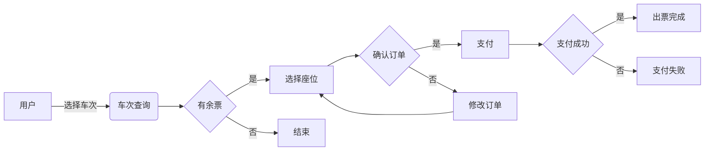

# 微信小程序铁路火车高铁座位预订售票系统

## 1. 背景介绍
### 1.1 铁路运输现状
#### 1.1.1 铁路运输在综合交通运输体系中的地位
#### 1.1.2 铁路客运发展现状
#### 1.1.3 铁路客运面临的挑战
### 1.2 微信小程序概述  
#### 1.2.1 微信小程序的定义和特点
#### 1.2.2 微信小程序的发展历程
#### 1.2.3 微信小程序在各行业的应用现状
### 1.3 铁路售票系统现状
#### 1.3.1 传统铁路售票方式的不足
#### 1.3.2 互联网售票平台的发展
#### 1.3.3 铁路售票系统智能化的必要性

## 2. 核心概念与联系
### 2.1 微信小程序技术架构
#### 2.1.1 微信小程序的技术组成
#### 2.1.2 WXML、WXSS、JavaScript 的作用
#### 2.1.3 微信小程序的生命周期
### 2.2 铁路座位预订业务流程
#### 2.2.1 旅客购票流程
#### 2.2.2 铁路售票流程
#### 2.2.3 座位分配规则
### 2.3 微信支付与退款机制
#### 2.3.1 微信支付接入流程
#### 2.3.2 微信支付安全机制
#### 2.3.3 退款流程与规则

## 3. 核心算法原理具体操作步骤
### 3.1 座位分配算法
#### 3.1.1 座位分配的基本原则
#### 3.1.2 座位分配算法的输入与输出
#### 3.1.3 座位分配算法的具体步骤
### 3.2 铁路线路与车次查询算法
#### 3.2.1 铁路线路数据结构设计
#### 3.2.2 车次查询算法的输入与输出
#### 3.2.3 车次查询算法的具体步骤
### 3.3 票价计算算法
#### 3.3.1 票价计算的影响因素
#### 3.3.2 票价计算算法的输入与输出
#### 3.3.3 票价计算算法的具体步骤

## 4. 数学模型和公式详细讲解举例说明
### 4.1 座位分配问题的数学模型
#### 4.1.1 问题描述与假设
#### 4.1.2 决策变量与目标函数
#### 4.1.3 约束条件的数学表达
### 4.2 最短路径问题的数学模型
#### 4.2.1 问题描述与假设
#### 4.2.2 决策变量与目标函数
#### 4.2.3 约束条件的数学表达
### 4.3 票价计算的数学模型
#### 4.3.1 问题描述与假设
#### 4.3.2 决策变量与目标函数
#### 4.3.3 约束条件的数学表达

## 5. 项目实践：代码实例和详细解释说明
### 5.1 微信小程序界面设计与实现
#### 5.1.1 首页设计与实现
#### 5.1.2 车次查询页面设计与实现
#### 5.1.3 座位选择页面设计与实现
#### 5.1.4 订单支付页面设计与实现
### 5.2 后端接口设计与实现
#### 5.2.1 车次查询接口设计与实现
#### 5.2.2 座位分配接口设计与实现
#### 5.2.3 订单生成接口设计与实现
#### 5.2.4 微信支付接口设计与实现
### 5.3 系统架构与部署
#### 5.3.1 系统架构设计
#### 5.3.2 数据库设计
#### 5.3.3 系统部署与运维

## 6. 实际应用场景
### 6.1 日常购票场景
#### 6.1.1 通勤购票
#### 6.1.2 旅游购票
#### 6.1.3 探亲访友购票
### 6.2 节假日购票场景
#### 6.2.1 春运购票
#### 6.2.2 小长假购票
#### 6.2.3 暑期学生购票
### 6.3 应急购票场景
#### 6.3.1 天气原因改签
#### 6.3.2 突发事件改签
#### 6.3.3 车次调整改签

## 7. 工具和资源推荐
### 7.1 微信小程序开发工具
#### 7.1.1 微信开发者工具
#### 7.1.2 微信小程序框架
#### 7.1.3 微信小程序UI组件库
### 7.2 后端开发工具
#### 7.2.1 Java开发框架
#### 7.2.2 Python开发框架
#### 7.2.3 Node.js开发框架
### 7.3 其他相关资源
#### 7.3.1 铁路客运服务规范
#### 7.3.2 铁路旅客运输规程
#### 7.3.3 铁路票价体系

## 8. 总结：未来发展趋势与挑战
### 8.1 铁路客运服务智能化趋势
#### 8.1.1 人工智能在铁路客运中的应用
#### 8.1.2 大数据分析在铁路客运中的应用
#### 8.1.3 区块链技术在铁路客运中的应用
### 8.2 铁路售票系统面临的挑战
#### 8.2.1 高并发访问的挑战
#### 8.2.2 数据安全与隐私保护的挑战
#### 8.2.3 跨平台与跨系统集成的挑战
### 8.3 未来铁路售票系统的发展方向
#### 8.3.1 移动支付与电子客票的普及
#### 8.3.2 智能客服与自助服务的完善
#### 8.3.3 铁路出行全流程的无缝衔接

## 9. 附录：常见问题与解答
### 9.1 如何在小程序中查询车次信息？
### 9.2 如何在小程序中选择座位？
### 9.3 如何在小程序中支付订单？
### 9.4 如何在小程序中办理退票？
### 9.5 如何在小程序中修改乘车人信息？
### 9.6 小程序购票是否安全？
### 9.7 小程序购票后如何取票？
### 9.8 小程序购票可以使用哪些优惠？
### 9.9 小程序购票是否支持电子客票？
### 9.10 小程序购票遇到问题如何求助？

作者：禅与计算机程序设计艺术 / Zen and the Art of Computer Programming

以上是一篇关于"微信小程序铁路火车高铁座位预订售票系统"的技术博客文章的大纲。在正文中，我们首先介绍了铁路运输的现状、微信小程序的概述以及铁路售票系统的现状，说明了开发这一系统的背景和意义。

接下来，我们深入探讨了系统涉及的核心概念，包括微信小程序的技术架构、铁路座位预订的业务流程以及微信支付与退款机制，帮助读者理解系统的运作原理。

在核心算法部分，我们重点介绍了座位分配算法、铁路线路与车次查询算法以及票价计算算法的具体步骤，并给出了相应的数学模型和公式，以严谨的数学语言描述了这些算法的原理。

在项目实践部分，我们通过代码实例和详细的解释说明，展示了如何使用微信小程序技术实现系统的各个功能模块，包括界面设计、后端接口设计以及系统架构与部署。

我们还分析了该系统在日常购票、节假日购票以及应急购票等不同场景下的实际应用，并推荐了一些实用的开发工具和相关资源，帮助读者更好地理解和实践这一系统。

最后，我们总结了铁路客运服务智能化的发展趋势，分析了铁路售票系统面临的挑战，展望了未来铁路售票系统的发展方向，并在附录中列出了一些常见问题与解答，以帮助读者解决实际应用中的疑惑。

通过这篇文章，读者可以全面了解微信小程序铁路火车高铁座位预订售票系统的方方面面，掌握其中涉及的关键技术和算法，并能够根据实际需求进行系统的设计与开发。我们相信，随着移动互联网技术的不断发展，铁路售票系统必将变得更加智能化、便捷化，为广大旅客提供更加优质的出行服务。