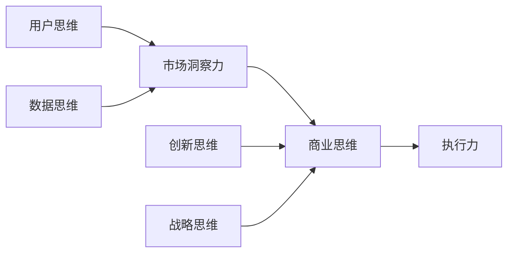

# 怎样培养敏锐的市场洞察力和商业思维

## 1. 背景介绍
### 1.1 商业环境的快速变化
在当今瞬息万变的商业环境中,企业面临着前所未有的机遇和挑战。市场竞争日益激烈,消费者需求不断变化,新技术层出不穷。在这样的大背景下,具备敏锐的市场洞察力和商业思维,对于企业生存发展至关重要。

### 1.2 市场洞察力和商业思维的内涵
- 市场洞察力是指对市场、消费者、竞争对手等方面信息的敏锐感知和深入理解的能力。它不仅仅停留在信息收集层面,更强调对信息的分析、判断和预测。
- 商业思维则是一种基于商业逻辑和市场规律,以创造价值为目标的思维方式。它强调全局观念、创新意识、风险意识等要素。

### 1.3 培养市场洞察力和商业思维的意义
拥有敏锐的市场洞察力和商业思维,能够帮助企业:
- 准确把握市场机会,开发新产品新业务
- 深入理解消费者需求,提供更好的产品和服务
- 应对市场变化和竞争压力,提高企业竞争力
- 优化资源配置,提高经营效率
- 创新商业模式,开拓新的利润增长点

因此,对于企业管理者和员工来说,培养市场洞察力和商业思维是一项必备的素质和技能。

## 2. 核心概念与联系
要培养市场洞察力和商业思维,需要理解和掌握一些核心概念:

### 2.1 用户思维
用户思维是指从用户的角度去思考问题,深入理解用户需求、痛点、行为等,并据此设计产品、服务和解决方案。它是市场洞察力的基础。

### 2.2 数据思维
在信息时代,海量数据为洞察市场提供了重要依据。数据思维强调通过收集、分析、应用数据,挖掘其中蕴含的价值和规律,为决策提供支撑。

### 2.3 创新思维
创新是驱动企业发展的关键力量。创新思维强调打破常规,从不同角度看问题,寻找新的解决方案和突破口。它是商业思维的重要组成部分。

### 2.4 战略思维
战略思维站在全局和长远的高度审视问题,强调对内外部环境的系统分析,制定清晰的目标和路径。它对于把握市场方向,指导企业经营至关重要。

### 2.5 执行力
再好的洞察和思路,如果不能落地执行,也只是空谈。执行力强调快速行动,持续改进,将战略规划转化为具体成果。

这些概念之间环环相扣,互为支撑,共同构成了市场洞察力和商业思维的核心内容:



只有将这些思维方式融会贯通,形成合力,才能真正提升市场洞察力和商业思维的水平。

## 3. 核心算法原理具体操作步骤
培养市场洞察力和商业思维是一个系统工程,需要遵循一定的方法和步骤。以下是一些关键的操作步骤:

### 3.1 信息收集
广泛收集各类市场信息是洞察力的基础。主要包括:
- 用户信息:通过访谈、问卷、用户行为数据等方式,深入了解用户特征、需求、痛点等。
- 行业信息:关注行业发展动态、技术趋势、监管政策等,把握行业大势。
- 竞争对手信息:分析竞争对手的战略布局、产品服务、营销策略等,找出差异化竞争点。

### 3.2 信息分析
收集到的信息需要进行系统的整理和分析,发现其中的关联和规律。常用的分析工具包括:
- SWOT分析:分析企业的优势(Strength)、劣势(Weakness)、机会(Opportunity)、威胁(Threat),制定应对策略。
- 用户画像:根据用户特征、行为等数据,勾勒出典型用户的轮廓,为精准营销提供依据。
- 波特五力模型:分析行业内的五种竞争力量(现有竞争者、潜在进入者、替代品、供应商议价能力、购买者议价能力),评估行业吸引力。

### 3.3 头脑风暴
头脑风暴是一种集思广益的创意思维方法。通过头脑风暴,可以:
- 群策群力,激发创意灵感
- 跳出思维定式,从多角度看问题
- 发散思维,产生大量创意点子
- 汇聚思想,形成可行的解决方案

头脑风暴需要营造自由、开放、互信的氛围,鼓励大胆想象和质疑,避免批评和否定。

### 3.4 假设验证
基于前期分析,提出一些假设和思路,并通过实践来验证。主要方式包括:
- A/B测试:将用户随机分为两组,分别体验不同方案,对比效果。
- 小批量试错:在小范围内进行试点,快速获得反馈,持续改进。
- 数据验证:通过数据分析来验证假设,如销售数据、用户反馈数据等。

通过假设验证,可以快速锁定有效的解决方案,降低决策风险。

### 3.5 决策优化
在实践的基础上,根据反馈对决策方案进行优化,形成闭环。主要包括:
- 总结复盘:回顾决策过程,分析经验教训,优化决策流程和方法。
- 动态调整:根据市场变化,及时调整决策方案,保持策略的有效性。
- 资源匹配:根据决策方案,优化配置人力、财力、物力等资源。

这是一个循环往复、不断迭代的过程,需要在实践中不断积累和优化。

## 4. 数学模型和公式详细讲解举例说明
在培养市场洞察力和商业思维的过程中,一些数学模型和公式可以提供参考和借鉴。以下举例说明几个常用的模型和公式:

### 4.1 Bass扩散模型
Bass扩散模型描述了新产品在市场中的渗透过程,考虑了创新者和模仿者的影响。其基本公式为:

$\frac{f(t)}{1-F(t)} = p + qF(t)$

其中,$f(t)$是$t$时刻的采纳率,$F(t)$是$t$时刻的累计采纳率,$p$是创新系数,$q$是模仿系数。

通过求解该微分方程,可以得到:

$F(t) = \frac{1-e^{-(p+q)t}}{1+\frac{q}{p}e^{-(p+q)t}}$

该模型可以用于预测新产品的市场潜力和扩散速度,优化产品推广策略。

### 4.2 BCG矩阵
BCG矩阵根据市场增长率和相对市场占有率,将业务单元划分为四类:
- 明星(Star):高增长、高占有率,需要大量投资以保持领先
- 现金牛(Cash Cow):低增长、高占有率,可以提供现金支持其他业务
- 问号(Question Mark):高增长、低占有率,需要评估是否值得投资
- 瘦狗(Dog):低增长、低占有率,缺乏吸引力,可考虑剥离

其判断标准可以用数学式表示:
- 相对市场占有率(RMS) = 我方市场占有率 / 最大竞争对手市场占有率
- 市场增长率(MGR) = (今年市场规模 - 去年市场规模) / 去年市场规模

一般以RMS=1和MGR=10%作为分界线。

BCG矩阵可以帮助企业评估业务组合,优化资源配置。

### 4.3 Logistic回归
Logistic回归是一种常用的二分类模型,可以用于预测事件发生的概率。其基本形式为:

$P(y=1|x) = \frac{1}{1+e^{-(\beta_0 + \beta_1x_1 + ... + \beta_nx_n)}}$

其中,$y$是二元输出(0或1),$x_i$是输入变量,$\beta_i$是待估计的参数。

通过极大似然估计等方法,可以拟合出模型参数。然后,可以用模型来预测新样本的输出概率。

Logistic回归可以用于客户流失预警、信用风险评估等场景,辅助企业决策。

以上只是几个代表性的模型和公式,实际应用中还有很多其他模型可供选择,如Markov链、决策树、支持向量机等。关键是要根据具体问题,选择恰当的模型,并正确使用和解释。

## 5. 项目实践:代码实例和详细解释说明
下面以Python代码为例,演示如何应用Bass扩散模型进行产品市场预测。

```python
import numpy as np
import matplotlib.pyplot as plt

# 定义参数
p = 0.02  # 创新系数
q = 0.3   # 模仿系数
M = 1000  # 潜在市场规模
T = 20    # 预测期数

# 定义函数
def bass_model(p, q, M, T):
    """
    Bass扩散模型
    p: 创新系数
    q: 模仿系数
    M: 潜在市场规模
    T: 预测期数
    return: T期的累计采纳量
    """
    F = np.zeros(T)
    F[0] = p*M
    for t in range(1, T):
        F[t] = F[t-1] + (p+q*F[t-1]/M) * (M-F[t-1])
    return F

# 调用函数
F = bass_model(p, q, M, T)

# 输出结果
for t in range(T):
    print("第{}期累计采纳量: {:.2f}".format(t+1, F[t]))

# 绘制曲线
plt.plot(range(1, T+1), F)
plt.xlabel('Time')
plt.ylabel('Cumulative Adoption')
plt.title('Bass Diffusion Model')
plt.show()
```

代码解释:
1. 首先导入需要的库,numpy用于数值计算,matplotlib用于绘图。
2. 定义模型参数,包括创新系数p、模仿系数q、潜在市场规模M和预测期数T。这些参数可以根据历史数据或专家经验来估计。
3. 定义Bass扩散模型的函数。函数输入为模型参数,输出为T期的累计采纳量。函数内部使用循环来迭代计算每一期的采纳量,并累加得到累计采纳量。
4. 调用bass_model函数,传入参数,得到结果F。
5. 使用循环输出每一期的累计采纳量。
6. 使用matplotlib绘制累计采纳量曲线。先创建时间序列和采纳量序列,然后调用plot函数绘图,并设置横纵坐标标签和标题。
7. 显示图形。

运行该代码,可以得到类似下面的输出结果:

```
第1期累计采纳量: 20.00
第2期累计采纳量: 45.20
第3期累计采纳量: 76.26
...
第19期累计采纳量: 993.91
第20期累计采纳量: 996.84
```

同时会弹出一个图形窗口,展示累计采纳量的变化曲线。

这只是一个简单的示例,实际应用中,还需要考虑更多因素,如多个产品的竞争、营销投入的影响等。可以在此基础上进行扩展和优化。

## 6. 实际应用场景
市场洞察力和商业思维在企业经营管理的方方面面都有广泛应用,下面列举几个典型场景:

### 6.1 产品开发
- 通过深入调研用户需求,挖掘痛点和机会,指导产品功能设计和优化。
- 分析市场趋势和竞品动向,确定产品定位和差异化策略。
- 运用创新思维,开发出有竞争力的新产品、新功能、新体验。

### 6.2 营销策略
- 细分目标市场,根据不同用户画像制定个性化营销方案。
- 优化营销组合(