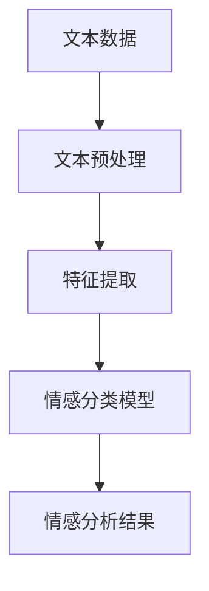

# 情感分析与危机公关：如何利用情感分析技术及时应对负面舆情

## 1. 背景介绍

### 1.1 舆情的重要性

在当今信息时代,互联网和社交媒体的迅速发展,使得舆论传播变得前所未有的快速和广泛。一个小小的负面事件,如果处理不当,很容易在网络上迅速蔓延,引发舆论危机,对企业和品牌造成巨大的声誉和经济损失。因此,及时发现和应对负面舆情,已经成为企业危机公关的当务之急。

### 1.2 传统舆情监控的缺陷

传统的舆情监控方式主要依赖人工,通过搜索引擎、新闻媒体等渠道来搜集和分析相关信息。这种方式存在以下几个主要缺陷:

1. 覆盖面有限,难以全面监控海量的网络信息
2. 反应滞后,当发现问题时往往已经较晚
3. 分析主观,难以客观准确地把握舆情走向
4. 成本高昂,需要大量的人力和时间投入

### 1.3 情感分析技术的优势

情感分析(Sentiment Analysis)是利用自然语言处理(NLP)和机器学习等技术,自动识别和提取文本中所蕴含的主观信息,如观点态度、情绪倾向等。与传统方式相比,情感分析技术具有以下优势:

1. 覆盖面广,可以实时监控各种网络信息源
2. 反应迅速,能够第一时间发现潜在的舆情问题
3. 分析客观,使用算法模型减少人为主观因素的影响
4. 高效低成本,可以大幅降低人力和时间成本

因此,将情感分析技术应用于舆情监控和危机公关,可以极大提高企业应对负面舆情的效率和水平。

## 2. 核心概念与联系

### 2.1 情感分析的核心概念

情感分析的核心概念主要包括:

1. **情感极性(Sentiment Polarity)**:表示文本所表达的情感倾向,通常分为正面(Positive)、负面(Negative)和中性(Neutral)三种。
2. **情感强度(Sentiment Intensity)**:表示情感的强弱程度,如"很高兴"比"高兴"的正面情感强度更高。
3. **情感目标(Sentiment Target)**:表示情感所指向的对象,如某个产品、人物或事件等。
4. **情感持有者(Sentiment Holder)**:表示情感的拥有者,即表达情感的主体。

### 2.2 情感分析与舆情监控的联系

情感分析技术在舆情监控中的应用,主要包括以下几个方面:

1. **舆情发现**:通过对网络上的大量文本数据进行情感分析,可以第一时间发现潜在的负面舆情。
2. **舆情跟踪**:持续监控并分析负面舆情的发展趋势,评估事态的严重程度。
3. **影响评估**:分析负面舆情对企业品牌、产品等的影响程度,为危机应对提供依据。
4. **舆论引导**:基于情感分析结果,制定有针对性的舆论引导策略,引导舆论向正面发展。

通过情感分析技术,企业可以实现对舆情的自动化、智能化监控,提高危机预警和响应的效率,从而更好地维护自身的声誉和利益。

## 3. 核心算法原理和具体操作步骤

情感分析的核心算法原理主要包括以下几个步骤:

### 3.1 文本预处理

文本预处理是情感分析的基础步骤,主要包括以下操作:

1. **分词(Word Segmentation)**: 将文本按照一定的规则分割成词语序列,如"这款手机真不错"分词为"这款/手机/真/不错"。
2. **去停用词(Stop Words Removal)**: 去除语义含义较少的高频词,如"的"、"了"等。
3. **词性标注(Part-of-Speech Tagging)**: 为每个词语赋予词性标记,如"手机(名词)"、"不错(形容词)"。
4. **命名实体识别(Named Entity Recognition)**: 识别出文本中的人名、地名、机构名等命名实体。
5. **词形还原(Lemmatization)**: 将词语还原为原形,如"买了"还原为"买"。

经过预处理后,文本被转换为结构化的数据,为后续的特征提取和模型训练做好准备。

### 3.2 特征提取

特征提取是将文本数据转换为算法模型可识别的数值型特征向量的过程,常用的特征提取方法包括:

1. **词袋模型(Bag-of-Words)**: 将文本表示为其所包含的词语的多重集,每个词语对应一个特征维度。
2. **TF-IDF(Term Frequency-Inverse Document Frequency)**: 根据词语在文本和语料库中的出现频率,计算其重要性权重。
3. **Word Embedding**: 将词语映射到低维连续的语义向量空间,如Word2Vec、Glove等。
4. **情感词典(Sentiment Lexicon)**: 构建情感词典,将词语与其情感极性和强度对应起来作为特征。

除了文本特征,还可以考虑其他辅助特征,如作者信息、发布时间、发布平台等,以提高模型的判别能力。

### 3.3 情感分类模型

情感分类模型的作用是根据特征向量,预测文本的情感极性和强度。常用的模型包括:

1. **传统机器学习模型**: 如朴素贝叶斯、支持向量机、逻辑回归等。
2. **深度学习模型**: 如卷积神经网络(CNN)、循环神经网络(RNN)、注意力机制(Attention)等。
3. **迁移学习模型**: 基于预训练的大型语言模型(如BERT、GPT等),通过微调的方式应用于情感分析任务。

在模型训练阶段,需要使用大量人工标注的情感数据集进行监督式学习。模型评估通常使用准确率(Accuracy)、F1分数等指标。

### 3.4 情感分析结果

情感分析的最终结果,是对每个文本的情感极性(正面、负面或中性)、情感强度(分值)、情感目标和情感持有者等信息的预测。这些结果可以用于后续的舆情监控和危机应对工作。

## 4. 数学模型和公式详细讲解举例说明

在情感分析的算法模型中,常常需要使用一些数学模型和公式来量化和优化模型的性能。下面将详细介绍几种常用的数学模型和公式。

### 4.1 朴素贝叶斯模型

朴素贝叶斯模型是一种基于贝叶斯定理的简单而有效的概率模型,常用于文本分类任务。在情感分析中,可以将其应用于判断文本的情感极性。

朴素贝叶斯模型的核心思想是,假设每个特征(词语)之间是相互独立的,则文本 $d$ 的类别 $c$ 的条件概率可以表示为:

$$P(c|d) = \frac{P(d|c)P(c)}{P(d)}$$

其中:
- $P(c|d)$ 表示文本 $d$ 属于类别 $c$ 的条件概率(后验概率)
- $P(d|c)$ 表示在已知类别 $c$ 的情况下,文本 $d$ 出现的概率(似然概率)
- $P(c)$ 表示类别 $c$ 的先验概率
- $P(d)$ 表示文本 $d$ 的边缘概率,是一个常数

由于 $P(d)$ 对所有类别是相同的,因此可以忽略不计。根据贝叶斯定理和特征独立性假设,可以得到:

$$P(c|d) \propto P(c)\prod_{i=1}^{n}P(t_i|c)$$

其中 $t_i$ 表示文本 $d$ 中的第 $i$ 个词语特征, $n$ 是特征的总数。

在训练阶段,需要基于标注好的数据集,估计每个类别 $c$ 的先验概率 $P(c)$,以及每个特征 $t_i$ 在已知类别 $c$ 时的条件概率 $P(t_i|c)$。在预测阶段,对于新的文本 $d$,计算每个类别 $c$ 的后验概率 $P(c|d)$,取概率最大的类别作为预测结果。

朴素贝叶斯模型简单高效,对小规模数据表现良好,但由于其独立性假设过于简单,在处理复杂数据时可能会受到限制。

### 4.2 逻辑回归模型

逻辑回归是一种广泛使用的概率模型,常用于二分类和多分类问题。在情感分析中,可以将其应用于判断文本的情感极性(正面或负面)。

对于二分类问题,逻辑回归模型的目标是学习一个逻辑函数 (logistic function),将输入特征 $\vec{x}$ 映射到 $[0,1]$ 区间内的概率值 $P(y=1|\vec{x})$,表示输入 $\vec{x}$ 属于正例(y=1)的概率。具体公式如下:

$$P(y=1|\vec{x}) = \frac{1}{1+e^{-(\vec{w}^T\vec{x}+b)}}$$

其中 $\vec{w}$ 是权重向量, $b$ 是偏置项。

对于多分类问题,可以使用 One-vs-Rest 策略,将其转化为多个二分类问题。

在训练阶段,通过最大似然估计或者最大后验概率估计等方法,学习模型参数 $\vec{w}$ 和 $b$,使得训练数据的似然函数或者后验概率最大化。

在预测阶段,对于新的输入 $\vec{x}$,计算 $P(y=1|\vec{x})$ 的值,如果大于 0.5,则预测为正例,否则预测为负例。

逻辑回归模型具有简单、可解释性强的优点,但对于线性不可分的数据,其表现会受到限制。

### 4.3 支持向量机模型

支持向量机(Support Vector Machine, SVM)是一种基于核技巧(Kernel Trick)的有监督学习模型,可以用于分类和回归任务。在情感分析中,SVM 常被用于判断文本的情感极性。

SVM 的基本思想是,在特征空间中找到一个最大间隔超平面,将不同类别的样本分开。对于线性可分的二分类问题,可以表示为:

$$\vec{w}^T\vec{x}+b=0$$

其中 $\vec{w}$ 是超平面的法向量, $b$ 是偏置项, $\vec{x}$ 是输入特征向量。

SVM 的目标是最大化超平面到最近数据点的距离(间隔),即最小化 $\|\vec{w}\|$,这可以转化为以下约束优化问题:

$$\begin{aligned}
\min_{\vec{w},b} & \frac{1}{2}\|\vec{w}\|^2 \\
\text{s.t. } & y_i(\vec{w}^T\vec{x}_i+b) \geq 1, i=1,2,...,n
\end{aligned}$$

其中 $y_i \in \{-1,1\}$ 是样本 $\vec{x}_i$ 的标签, $n$ 是样本数量。

对于线性不可分的情况,可以引入核技巧,将数据映射到高维特征空间,使其变为线性可分。常用的核函数包括线性核、多项式核、高斯核等。

在训练阶段,通过求解上述优化问题,学习模型参数 $\vec{w}$ 和 $b$。在预测阶段,对于新的输入 $\vec{x}$,计算 $\vec{w}^T\vec{x}+b$ 的值,根据正负号预测其类别。

SVM 具有泛化能力强、可解释性好的优点,但对于大规模数据集,求解优化问题的计算复杂度较高。

### 4.4 Word Embedding 模型

Word Embedding 是一种将词语映射到低维连续向量空间的技术,常用于捕捉词语之间的语义和句法关系。在情感分析中,Word Embedding