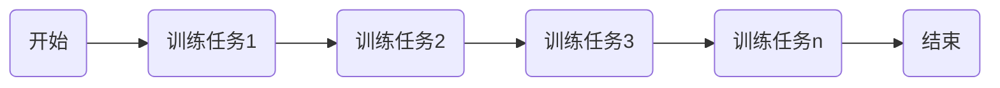
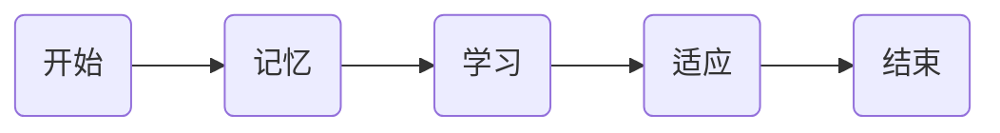

## 1.背景介绍

在人工智能领域中，持续学习（Continual Learning）是一个重要的研究方向。它的目标是让机器学习模型能够像人类一样，随着时间的推移，不断地学习和适应新的知识，而不会忘记之前学到的知识。这种学习方式对于建立具有长期记忆和适应性的机器学习模型具有重要意义。

## 2.核心概念与联系

持续学习的核心概念可以概括为：**模型的知识不断积累，而不是被覆盖**。这与我们通常在训练机器学习模型时的做法不同，通常我们在训练新的任务时，会重新初始化模型的参数，导致模型忘记之前学到的知识。而在持续学习中，我们希望模型在学习新任务时，能保留之前学到的知识，并在此基础上增加新的知识。



## 3.核心算法原理具体操作步骤

持续学习的核心算法可以分为三个步骤：**记忆、学习和适应**。

- **记忆**：模型需要记住之前学到的知识，这通常通过保存模型的参数来实现。

- **学习**：模型需要学习新的任务，这通常通过训练模型来实现。

- **适应**：模型需要适应新的任务，这通常通过调整模型的参数来实现。



## 4.数学模型和公式详细讲解举例说明

在持续学习中，我们通常使用**弹性权重共享（Elastic Weight Consolidation，EWC）**作为数学模型。EWC的主要思想是为模型的参数添加一个正则项，以防止在训练新任务时，模型的参数过度改变，从而忘记之前学到的知识。

EWC的数学公式如下：

$$
L(\theta) = L_{new}(\theta) + \sum_i \frac{\lambda}{2} F_i (\theta_i - \theta_{old,i})^2
$$

其中，$L_{new}(\theta)$ 是新任务的损失函数，$\theta$ 是模型的参数，$\lambda$ 是正则项的系数，$F_i$ 是Fisher信息矩阵，$\theta_{old,i}$ 是旧任务的模型参数。

## 5.项目实践：代码实例和详细解释说明

下面是一个使用PyTorch实现EWC的代码示例：

```python
class EWC(object):
    def __init__(self, model, lamda=4000):
        self.model = model
        self.lamda = lamda
        self.params = {n: p for n, p in self.model.named_parameters() if p.requires_grad} 
        self._means = {}
        self._precision_matrices = self._calculate_importance()

    def _calculate_importance(self):
        precision_matrices = {}
        for n, p in self.params.items():
            p.data.zero_()
            precision_matrices[n] = p.clone().detach()
        return precision_matrices

    def penalty(self):
        loss = 0
        for n, p in self.model.named_parameters():
            _loss = self._precision_matrices[n] * (p - self._means[n]).pow(2)
            loss += _loss.sum()
        return self.lamda/2 * loss
```

## 6.实际应用场景

持续学习在很多实际应用场景中都有应用，例如：自动驾驶、机器人、语音识别等。在这些场景中，模型需要不断地学习新的知识，以适应不断变化的环境。

## 7.工具和资源推荐

推荐使用PyTorch和TensorFlow这两个深度学习框架来实现持续学习，它们都提供了丰富的API和工具，可以方便地实现持续学习。

## 8.总结：未来发展趋势与挑战

持续学习是人工智能的重要研究方向，它的目标是让机器学习模型能够像人类一样，不断地学习和适应新的知识。目前，持续学习还面临很多挑战，例如：如何有效地记忆旧的知识、如何在记住旧的知识的同时学习新的知识、如何在不同任务之间平衡模型的性能等。但是，随着人工智能技术的不断发展，我相信这些挑战都会被逐渐解决。

## 9.附录：常见问题与解答

Q: 持续学习和增量学习有什么区别？

A: 持续学习强调的是模型的知识不断积累，而不是被覆盖，而增量学习强调的是模型的知识可以被覆盖。

Q: 持续学习有哪些常见的算法？

A: 持续学习的常见算法有：弹性权重共享（EWC）、同步弹性权重共享（si-EWC）、增量矩估计（i-ME）等。

作者：禅与计算机程序设计艺术 / Zen and the Art of Computer Programming