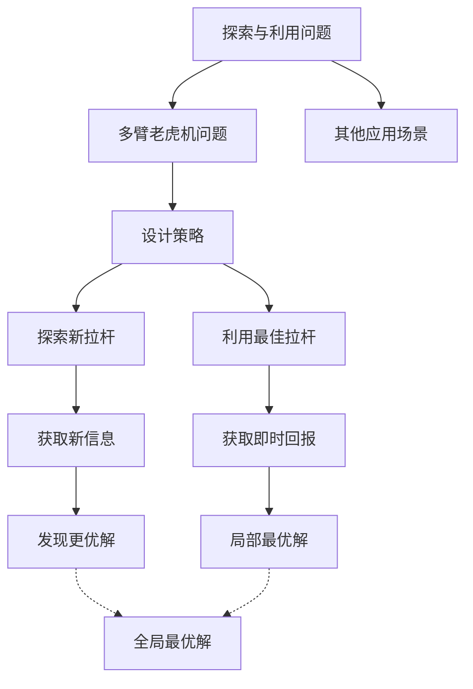

# 探索与利用 (Exploration and Exploitation)

## 1.背景介绍

在人工智能、机器学习、优化理论等领域中,探索与利用(Exploration and Exploitation)是一个重要的权衡问题。它描述了在获取新知识(探索)和利用已有知识(利用)之间寻求平衡的挑战。这个问题在许多实际应用中都有体现,例如机器人路径规划、网络内容推荐、网页搜索排名等。

探索与利用的矛盾源于有限的资源和时间。在有限的时间和资源下,我们需要在探索新的可能性和利用已知的最佳选择之间进行权衡。过度探索可能导致资源的浪费,而过度利用则可能错过更好的机会。找到合适的平衡点对于获得最优解是至关重要的。

## 2.核心概念与联系 

### 2.1 多臂老虎机问题

探索与利用问题的一个经典模型是多臂老虎机问题(Multi-Armed Bandit Problem)。它源于赌场中的老虎机游戏,玩家需要在多个拉杆中选择一个来拉动,每个拉杆都有不同的支付概率分布。

在多臂老虎机问题中,我们需要设计一种策略来最大化期望累积回报。这意味着我们需要在探索新的拉杆(以发现更高回报的机会)和利用已知最佳拉杆(以获得当前已知的最高回报)之间进行权衡。

### 2.2 探索与利用的权衡

探索与利用的权衡可以形式化为:

- **探索(Exploration)**: 尝试新的行为或策略,以获取更多信息和发现潜在的更优解。
- **利用(Exploitation)**: 根据当前已知的最佳行为或策略来获取即时回报。

这种权衡存在于许多领域,例如:

- **强化学习**: 探索新的状态和行为以发现更好的策略,或利用已知的最优策略来最大化即时回报。
- **优化算法**: 探索新的解空间区域以发现更优解,或利用当前最优解进行局部搜索。
- **网页排名**: 探索新的排名算法以提高相关性,或利用当前最佳算法来满足用户需求。
- **网络推荐系统**: 探索用户新的兴趣偏好以改善推荐质量,或利用已知用户偏好进行推荐。

适当平衡探索与利用对于获得最优解是至关重要的。过度探索可能导致资源浪费,而过度利用则可能陷入局部最优解。

### 2.3 Mermaid 流程图

## 3.核心算法原理具体操作步骤

针对探索与利用问题,已经提出了多种算法和策略。以下是一些经典算法的原理和具体操作步骤:

### 3.1 ε-贪婪算法 (ε-Greedy Algorithm)

ε-贪婪算法是一种简单而有效的探索与利用策略。它的基本思想是:以一定的概率ε进行探索,以(1-ε)的概率进行利用。

具体操作步骤如下:

1. 初始化所有行为(拉杆)的估计值Q(a),通常设为0或一个较小的常数值。
2. 对于每一步决策:
    - 以概率ε选择随机行为(探索)
    - 以概率(1-ε)选择当前估计值最大的行为(利用)
3. 观察选择行为的实际回报R
4. 更新选择行为a的估计值Q(a),通常使用以下公式:
    
    $$Q(a) \leftarrow Q(a) + \alpha [R - Q(a)]$$
    
    其中α是学习率,控制新观察值对估计值的影响程度。
5. 重复步骤2-4,直到达到终止条件。

ε-贪婪算法的优点是简单易实现,缺点是需要手动设置ε值,且ε值固定会导致探索与利用失衡。

### 3.2 软更新算法 (Softmax Algorithm)

软更新算法是一种基于行为选择概率的探索与利用策略。它的基本思想是:根据行为估计值的大小,给予不同的选择概率。估计值越高,选择概率越大。

具体操作步骤如下:

1. 初始化所有行为(拉杆)的估计值Q(a),通常设为0或一个较小的常数值。
2. 对于每一步决策:
    - 计算每个行为a的选择概率P(a),通常使用Softmax函数:
        
        $$P(a) = \frac{e^{Q(a)/\tau}}{\sum_{b}e^{Q(b)/\tau}}$$
        
        其中τ是温度参数,控制概率分布的平坦程度。τ越大,分布越平坦,探索程度越高。
    - 根据计算出的概率分布P(a)随机选择一个行为。
3. 观察选择行为的实际回报R
4. 更新选择行为a的估计值Q(a),通常使用以下公式:

    $$Q(a) \leftarrow Q(a) + \alpha [R - Q(a)]$$
    
    其中α是学习率。
5. 重复步骤2-4,直到达到终止条件。

软更新算法的优点是探索程度可控,缺点是需要手动设置温度参数τ。

### 3.3 UCB算法 (Upper Confidence Bound Algorithm)

UCB算法是一种基于置信区间的探索与利用策略。它的基本思想是:对于每个行为,计算一个置信上界,并选择置信上界最大的行为。这样可以在探索和利用之间达成平衡。

具体操作步骤如下:

1. 初始化所有行为(拉杆)的估计值Q(a)和选择次数N(a),通常设为0。
2. 对于每一步决策:
    - 对于每个行为a,计算其置信上界:
        
        $$\text{UCB}(a) = Q(a) + c\sqrt{\frac{\ln N}{ N(a)}}$$
        
        其中N是总的决策步数,c是一个控制探索程度的常数。
    - 选择置信上界UCB(a)最大的行为a。
3. 观察选择行为的实际回报R
4. 更新选择行为a的估计值Q(a)和选择次数N(a):

    $$Q(a) \leftarrow Q(a) + \frac{1}{N(a)} [R - Q(a)]$$
    $$N(a) \leftarrow N(a) + 1$$
    
5. 重复步骤2-4,直到达到终止条件。

UCB算法的优点是能自动平衡探索与利用,无需手动设置参数。缺点是对于非平稳的问题可能表现不佳。

### 3.4 梯度策略算法 (Policy Gradient Algorithms)

梯度策略算法是一种基于策略搜索的探索与利用方法,常用于强化学习领域。它的基本思想是:通过估计策略的梯度,并沿着梯度方向更新策略参数,从而优化策略。

具体操作步骤如下:

1. 初始化策略参数θ
2. 对于每一个Episode(即一个完整的决策序列):
    - 根据当前策略参数θ,执行一系列行为,并记录每个时刻的状态s、行为a和回报r。
    - 计算该Episode的累积回报G。
    - 对于每个时刻t:
        - 计算该时刻的对数概率梯度: $\nabla_\theta \log \pi_\theta(a_t|s_t)$
        - 更新策略参数θ:
            
            $$\theta \leftarrow \theta + \alpha \gamma^t G \nabla_\theta \log \pi_\theta(a_t|s_t)$$
            
            其中α是学习率,γ是折现因子。
3. 重复步骤2,直到策略收敛或达到终止条件。

梯度策略算法的优点是可以直接优化策略,适用于连续动作空间。缺点是需要大量数据和计算资源,并且存在收敛问题。

以上是一些经典的探索与利用算法的原理和操作步骤。在实际应用中,还可以根据具体问题进行算法改进和组合,以获得更好的性能。

## 4.数学模型和公式详细讲解举例说明

在探索与利用问题中,常常需要建立数学模型来描述和分析问题。以下是一些常见的数学模型和公式:

### 4.1 多臂老虎机问题的数学模型

多臂老虎机问题可以用如下数学模型描述:

设有K个拉杆(行为),每个拉杆i的回报服从某个未知分布$\nu_i$,其期望值为$\mu_i$。我们的目标是设计一种策略$\pi$,使得在N次试验中,累积回报的期望值最大化:

$$\max_\pi \mathbb{E}\left[\sum_{n=1}^N X_n^\pi\right]$$

其中$X_n^\pi$是第n次试验时根据策略$\pi$选择的拉杆的回报。

我们可以将累积回报的期望值分解为:

$$\mathbb{E}\left[\sum_{n=1}^N X_n^\pi\right] = \sum_{i=1}^K \mu_i \mathbb{E}[T_i(N)]$$

其中$T_i(N)$表示在N次试验中,选择第i个拉杆的次数。

由于$\mu_i$未知,我们需要在试验过程中不断估计和更新$\mu_i$的值,并根据估计值进行决策。这就引入了探索与利用的权衡:探索新的拉杆以获取更准确的$\mu_i$估计,或利用当前估计值最大的拉杆以获取即时回报。

### 4.2 回报期望的置信区间

在UCB算法中,我们需要计算每个行为的置信上界,以平衡探索与利用。置信上界的计算基于回报期望的置信区间。

设第i个行为的回报服从均值为$\mu_i$、方差为$\sigma_i^2$的分布。根据切比雪夫不等式,对于任意正实数c,有:

$$\mathbb{P}(|\bar{X}_i - \mu_i| \geq c) \leq \frac{\sigma_i^2}{c^2}$$

其中$\bar{X}_i$是第i个行为的样本均值。

进一步,根据伯努利不等式,有:

$$\mathbb{P}(\bar{X}_i \geq \mu_i + c) \leq \frac{\sigma_i^2}{c^2}$$

令$\delta = \frac{\sigma_i^2}{c^2}$,则有:

$$\mathbb{P}(\mu_i \leq \bar{X}_i + c) \geq 1 - \delta$$

因此,对于任意的置信水平$1-\delta$,我们有:

$$\mu_i \leq \bar{X}_i + c(\delta, n_i)$$

其中$n_i$是第i个行为的样本数,c是一个只与$\delta$和$n_i$有关的函数。

这就给出了回报期望$\mu_i$的一个置信上界,UCB算法就是基于这个上界来进行决策的。

### 4.3 策略梯度估计

在梯度策略算法中,我们需要估计策略的梯度,以优化策略参数。假设策略$\pi_\theta$由参数$\theta$参数化,我们希望最大化该策略的期望回报:

$$J(\theta) = \mathbb{E}_{\tau \sim \pi_\theta}[R(\tau)]$$

其中$\tau$表示一个Episode的轨迹(状态-行为序列),R(τ)表示该轨迹的累积回报。

根据策略梯度定理,我们可以得到期望回报J(θ)对参数θ的梯度为:

$$\nabla_\theta J(\theta) = \mathbb{E}_{\tau \sim \pi_\theta}\left[\sum_t \nabla_\theta \log \pi_\theta(a_t|s_t)R(\tau)\right]$$

因此,我们可以通过采样估计这个梯度,并沿着梯度方向更新策略参数θ,从而优化策略。

这里给出一个具体的例子,说明如何估计策略梯度:

假设我们有一个Episode的轨迹$\tau = (s_