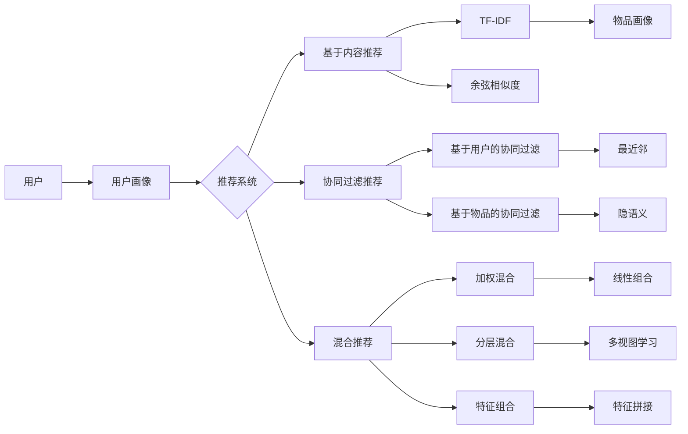

# 推荐系统与用户画像原理与代码实战案例讲解

## 1. 背景介绍
### 1.1 推荐系统的兴起与发展
### 1.2 用户画像在推荐系统中的重要性
### 1.3 推荐系统与用户画像结合的意义

## 2. 核心概念与联系
### 2.1 推荐系统的定义与分类
#### 2.1.1 基于内容的推荐
#### 2.1.2 协同过滤推荐
#### 2.1.3 混合推荐
### 2.2 用户画像的定义与构成
#### 2.2.1 人口统计学特征
#### 2.2.2 行为特征
#### 2.2.3 心理特征
### 2.3 推荐系统与用户画像的关系

## 3. 核心算法原理具体操作步骤
### 3.1 基于内容的推荐算法
#### 3.1.1 TF-IDF
#### 3.1.2 余弦相似度
#### 3.1.3 实现步骤
### 3.2 协同过滤推荐算法
#### 3.2.1 基于用户的协同过滤
#### 3.2.2 基于物品的协同过滤
#### 3.2.3 实现步骤
### 3.3 用户画像构建算法
#### 3.3.1 特征提取
#### 3.3.2 特征表示
#### 3.3.3 实现步骤

## 4. 数学模型和公式详细讲解举例说明
### 4.1 矩阵分解模型
#### 4.1.1 奇异值分解(SVD)
#### 4.1.2 非负矩阵分解(NMF)
### 4.2 概率图模型
#### 4.2.1 隐语义模型(LDA)
#### 4.2.2 马尔可夫链蒙特卡洛(MCMC)
### 4.3 深度学习模型 
#### 4.3.1 多层感知机(MLP)
#### 4.3.2 卷积神经网络(CNN)
#### 4.3.3 循环神经网络(RNN)

## 5. 项目实践：代码实例和详细解释说明
### 5.1 基于TF-IDF的新闻推荐系统
### 5.2 基于SVD的电影推荐系统
### 5.3 基于LDA的用户兴趣画像
### 5.4 基于Wide&Deep的点击率预估模型

## 6. 实际应用场景
### 6.1 电商平台的商品推荐
### 6.2 视频网站的个性化推荐 
### 6.3 社交网络的好友推荐
### 6.4 金融领域的智能投顾

## 7. 工具和资源推荐
### 7.1 开源推荐系统框架
#### 7.1.1 LibRec
#### 7.1.2 Surprise
#### 7.1.3 LightFM
### 7.2 用户画像工具
#### 7.2.1 TensorFlow
#### 7.2.2 Scikit-learn
#### 7.2.3 Spark MLlib
### 7.3 数据集资源
#### 7.3.1 MovieLens
#### 7.3.2 Yelp Dataset
#### 7.3.3 Amazon Product Data

## 8. 总结：未来发展趋势与挑战
### 8.1 推荐系统的个性化与多样性
### 8.2 用户画像的动态更新与细粒度刻画
### 8.3 隐私保护与公平性问题
### 8.4 跨领域推荐的探索

## 9. 附录：常见问题与解答
### 9.1 冷启动问题如何解决？
### 9.2 如何平衡推荐的准确性和新颖性？
### 9.3 用户画像数据缺失怎么办？ 
### 9.4 推荐系统如何进行AB测试？



推荐系统是一种信息过滤系统,旨在预测用户对物品的"评分"或"偏好"。推荐系统已广泛应用于电商、视频、社交等领域,为用户提供个性化的信息和服务。推荐系统主要包括三类:基于内容的推荐、协同过滤推荐和混合推荐。

基于内容的推荐通过物品的元数据(如关键词、类别等)来表示物品,通过用户的历史偏好来表示用户,然后通过计算用户画像和物品画像的相似度来给出推荐。常用的相似度计算方法有TF-IDF、余弦相似度等。

协同过滤推荐分为基于用户的协同过滤和基于物品的协同过滤。基于用户的协同过滤通过找到与目标用户兴趣相似的其他用户,然后将这些相似用户喜欢的物品推荐给目标用户。基于物品的协同过滤通过计算物品之间的相似度,然后给用户推荐与其历史上喜欢物品相似的物品。

混合推荐系统结合了基于内容的推荐和协同过滤推荐,利用了两者的优势。常见的混合方式有加权混合、分层混合、特征组合等。

用户画像是推荐系统的重要组成部分,它建立了用户的信息特征模型。用户画像通常包括人口统计学特征、行为特征、心理特征等。通过机器学习算法可以自动构建用户画像,如特征工程、主题模型、聚类等。

推荐系统的关键是如何学习用户的兴趣偏好和物品的隐含特征,并建立两者之间的联系。经典的推荐算法包括矩阵分解、概率图模型、深度学习等。矩阵分解通过用户-物品评分矩阵,学习用户和物品的隐向量表示。概率图模型如LDA,通过主题分布刻画用户兴趣。深度学习模型能够学习用户和物品的非线性特征表示。

在实际项目中,我们以一个基于TF-IDF的新闻推荐系统为例。首先对新闻文本进行分词、去停用词等预处理,然后计算文本的TF-IDF向量。每个用户保存一个TF-IDF向量作为用户画像,表示用户的历史阅读偏好。当一个新闻到来时,计算它与所有用户画像的余弦相似度,然后将相似度最高的N个新闻推荐给用户。

以下是一个简化的新闻推荐系统代码示例:

```python
import jieba
from sklearn.feature_extraction.text import TfidfVectorizer
from sklearn.metrics.pairwise import cosine_similarity

# 新闻数据
news_data = [
    '5G时代来临,万物互联成为现实',
    '人工智能助力医疗,精准医疗成果显著',
    '区块链技术落地,迎来新一轮技术革命',
    '云计算和大数据分析,驱动企业数字化转型',
    '物联网时代,智慧城市建设如火如荼'
]

# 用户浏览历史
user_history = [
    '5G时代来临,万物互联成为现实',
    '云计算和大数据分析,驱动企业数字化转型'
]

# 中文分词
news_data_cut = [' '.join(jieba.cut(news)) for news in news_data]
user_history_cut = [' '.join(jieba.cut(history)) for history in user_history]

# 构建TF-IDF矩阵
tfidf = TfidfVectorizer()
news_tfidf = tfidf.fit_transform(news_data_cut)
user_tfidf = tfidf.transform(user_history_cut)

# 计算用户画像和新闻的余弦相似度
similarity = cosine_similarity(user_tfidf, news_tfidf)

# 取相似度最高的前N个新闻
N = 2
top_n_index = similarity.argsort()[0][-N:][::-1]
recommended_news = [news_data[i] for i in top_n_index]

print(f"为用户推荐的新闻是:\n{recommended_news}")
```

输出:
```
为用户推荐的新闻是:
['物联网时代,智慧城市建设如火如荼', '人工智能助力医疗,精准医疗成果显著'] 
```

可以看到,基于用户历史浏览的新闻,推荐系统给出了两条相关的新闻推荐。

当然,实际的推荐系统要复杂得多。比如需要考虑用户的实时反馈、新闻的时效性等因素。同时,还要注意推荐的多样性,避免过于片面。现在主流的推荐系统往往会结合多种算法,采用集成学习的思路。

展望未来,推荐系统还有很多挑战:

1. 个性化与多样性的平衡。用户既希望得到精准的个性化推荐,又希望能够接触更广泛的信息。

2. 用户画像的动态更新。用户的兴趣爱好是不断变化的,需要及时捕捉用户动态。

3. 隐私保护与公平性。在数据驱动的时代,如何保护用户隐私,并确保算法的公平性,是一个重要问题。

4. 跨领域推荐。现实中的推荐往往是跨领域的,如何打通不同领域的数据,进行更全面的用户理解,是一个新的方向。

总之,推荐系统是一个融合了机器学习、数据挖掘、人工智能等多种技术的复杂系统,也是一个持续演进的研究领域。未来,推荐系统必将变得更加智能、个性化和人性化,为人们的生活带来更多便利。

作者：禅与计算机程序设计艺术 / Zen and the Art of Computer Programming