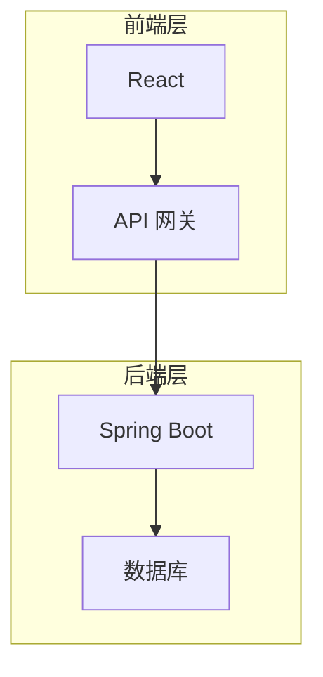

# 教学设备管理系统详细设计与具体代码实现

## 1.背景介绍

随着教育信息化进程的不断推进,各级各类学校纷纷引进现代化教学设备,如多媒体教室、语音室、计算机机房等。这些教学设备的投入使用,极大地提高了教学质量,为师生创造了良好的教与学环境。然而,教学设备的管理却成为一大难题。由于缺乏有效的管理手段,设备利用率低下、维修效率低下、统计分析滞后等问题时有发生,严重影响了教学设备的效益发挥。因此,构建一套完善的教学设备管理系统,实现教学设备的科学化、规范化、精细化管理,已经成为当务之急。

## 2.核心概念与联系

教学设备管理系统的核心概念主要包括:

1. **设备**:指学校用于教学活动的各种硬件设施,如投影仪、电脑、语音设备等。
2. **场地**:指容纳教学设备的物理空间,如多媒体教室、语音室、机房等。
3. **教学课程**:指安排在特定场地使用特定设备进行的教学活动。
4. **维修**:指对故障设备进行检修的过程。
5. **借还**:指场地或设备的借用和归还。

这些核心概念相互关联、环环相扣:

- 设备被布置在特定场地,为教学课程服务
- 教学课程安排在特定场地,使用特定设备
- 设备故障时需要维修
- 场地和设备可以临时借出,借出后需要归还

## 3.核心算法原理具体操作步骤

教学设备管理系统的核心算法主要包括:

### 3.1 场地和设备分配算法

该算法的目标是合理分配有限的场地和设备资源,最大限度满足教学需求。算法步骤如下:

1. 收集所有教学课程的需求信息,包括上课时间、人数、所需设备等
2. 根据课程需求,估算总体场地和设备需求量
3. 以教室座位数和设备数量为约束条件,构建优化模型
4. 运行优化算法,输出最优分配方案

常用的优化算法有:

- 整数规划
- 启发式算法(如模拟退火、遗传算法等)
- 在线分配算法

### 3.2 维修调度算法  

该算法的目标是高效安排维修人员,及时处理设备故障。算法步骤如下:

1. 收集所有设备故障报修信息
2. 根据故障设备类型、地点等,估算所需维修工时
3. 以维修人员数量和工时为约束,构建调度优化模型  
4. 运行优化算法,输出最优维修调度方案

常用的优化算法有:

- 车间作业调度算法
- 在线调度算法

### 3.3 借还管理算法

该算法的目标是精细化管理场地和设备的借还流程。算法步骤如下:

1. 收集所有借还申请信息
2. 检查申请时段是否与已有预约时段冲突
3. 若无冲突,则审批通过并分配场地/设备
4. 归还时,检查场地/设备是否完好,更新状态

该算法较为简单,主要依赖于数据库完整性约束。

## 4.数学模型和公式详细讲解举例说明

### 4.1 场地和设备分配模型

假设有 $m$ 个教室,每个教室 $i$ 的座位数为 $c_i$;有 $n$ 种设备,每种设备 $j$ 的数量为 $e_j$。现有 $p$ 个课程需求,第 $k$ 个课程的人数为 $s_k$,需要的设备类型为 $E_k$。

我们定义决策变量:
$$
x_{ijk} = \begin{cases}
1, & \text{将课程 $k$ 安排在教室 $i$,使用设备 $j$}\\
0, & \text{否则}
\end{cases}
$$

则该问题可以建模为整数规划问题:

$$
\begin{aligned}
\max\ & \sum_{i=1}^m\sum_{j=1}^n\sum_{k=1}^p x_{ijk}\\
\text{s.t. }& \sum_{i=1}^m\sum_{j\in E_k}x_{ijk}=1,\quad\forall k\\
        & \sum_{j=1}^n\sum_{k=1}^px_{ijk}s_k\leq c_i,\quad\forall i\\
        & \sum_{i=1}^m\sum_{k=1}^px_{ijk}\leq e_j,\quad\forall j\\
        & x_{ijk}\in\{0,1\},\quad\forall i,j,k
\end{aligned}
$$

其中:

- 目标函数最大化安排的课程数量
- 第一个约束条件保证每个课程只安排一次
- 第二个约束条件保证教室座位数足够容纳课程人数  
- 第三个约束条件保证设备数量足够

该模型是一个经典的分配问题,可以使用整数规划求解器(如CPLEX)或启发式算法(如模拟退火)求解。

### 4.2 维修调度模型

假设有 $m$ 个维修工人,每个工人 $i$ 的可用工时为 $h_i$;有 $n$ 个设备故障需要维修,第 $j$ 个故障设备的预计维修工时为 $t_j$。  

我们定义决策变量:
$$
x_{ij} = \begin{cases}
1, & \text{将故障 $j$ 分配给工人 $i$ 维修}\\
0, & \text{否则}
\end{cases}
$$

则该问题可以建模为整数规划问题:

$$
\begin{aligned}
\min\ & \sum_{i=1}^m\sum_{j=1}^n t_jx_{ij}\\
\text{s.t. }& \sum_{i=1}^mx_{ij}=1,\quad\forall j\\
        & \sum_{j=1}^nt_jx_{ij}\leq h_i,\quad\forall i\\
        & x_{ij}\in\{0,1\},\quad\forall i,j
\end{aligned}
$$

其中:

- 目标函数最小化总工时
- 第一个约束条件保证每个故障都被分配维修
- 第二个约束条件保证工人的工时足够

该模型也可使用整数规划或启发式算法求解。

### 4.3 借还管理模型

借还管理模型相对简单,主要依赖数据库完整性约束。我们可以在数据库中为场地和设备设置状态字段,如"空闲"、"已预约"、"借出"等。当收到借还申请时,通过检查状态字段判断是否可以借出。借出后将状态更新为"借出",归还时再更新回"空闲"状态。

例如,对于场地表可以设计如下结构:

```sql
CREATE TABLE Venue (
    vid INT PRIMARY KEY, 
    name VARCHAR(50),
    status VARCHAR(20) CHECK (status IN ('Free', 'Booked', 'Borrowed')),
    ...
);
```

对于设备表也可类似设计。在处理借还申请时,可以使用事务确保数据完整性和并发安全。

## 5.项目实践:代码实例和详细解释说明

### 5.1 系统架构

教学设备管理系统采用B/S架构,前端使用React框架,后端使用Spring Boot框架。系统架构如下图所示:



前端通过 API 网关与后端进行交互,后端使用 Spring 框架提供 RESTful 接口,并与数据库进行交互。

### 5.2 核心代码

#### 5.2.1 场地设备分配算法

```java
// 场地设备分配算法(整数规划)
public class RoomAllocation {
    public static void main(String[] args) {
        // 创建模型
        IloCplex cplex = new IloCplex();
        
        // 添加决策变量
        IloNumVar[][][] x = new IloNumVar[M][N][P];
        for (int i = 0; i < M; i++) {
            for (int j = 0; j < N; j++) {
                for (int k = 0; k < P; k++) {
                    x[i][j][k] = cplex.boolVar();
                }
            }
        }
        
        // 设置目标函数
        IloLinearNumExpr obj = cplex.linearNumExpr();
        for (int i = 0; i < M; i++) {
            for (int j = 0; j < N; j++) {
                for (int k = 0; k < P; k++) {
                    obj.addTerm(1.0, x[i][j][k]);
                }
            }
        }
        cplex.addMaximize(obj);
        
        // 添加约束条件
        for (int k = 0; k < P; k++) {
            IloLinearNumExpr expr = cplex.linearNumExpr();
            for (int i = 0; i < M; i++) {
                for (int j = 0; j < N; j++) {
                    if (E[k].contains(j)) {
                        expr.addTerm(1.0, x[i][j][k]);
                    }
                }
            }
            cplex.addEq(expr, 1.0);
        }
        
        for (int i = 0; i < M; i++) {
            IloLinearNumExpr expr = cplex.linearNumExpr();
            for (int j = 0; j < N; j++) {
                for (int k = 0; k < P; k++) {
                    expr.addTerm(S[k], x[i][j][k]);
                }
            }
            cplex.addLe(expr, C[i]);
        }
        
        for (int j = 0; j < N; j++) {
            IloLinearNumExpr expr = cplex.linearNumExpr();
            for (int i = 0; i < M; i++) {
                for (int k = 0; k < P; k++) {
                    expr.addTerm(1.0, x[i][j][k]);
                }
            }
            cplex.addLe(expr, E[j]);
        }
        
        // 求解
        if (cplex.solve()) {
            System.out.println("obj = " + cplex.getObjValue());
        }
        
        cplex.end();
    }
    
    // ... 数据定义
}
```

上述代码使用 IBM ILOG CPLEX 优化工具包实现了整数规划求解器。首先创建 0-1 决策变量,然后构造目标函数和约束条件,最后调用求解器求解。

#### 5.2.2 维修调度算法

```java
// 维修调度算法(整数规划)
public class RepairSchedule {
    public static void main(String[] args) {
        // 创建模型
        IloCplex cplex = new IloCplex();
        
        // 添加决策变量
        IloNumVar[][] x = new IloNumVar[M][N];
        for (int i = 0; i < M; i++) {
            for (int j = 0; j < N; j++) {
                x[i][j] = cplex.boolVar();
            }
        }
        
        // 设置目标函数
        IloLinearNumExpr obj = cplex.linearNumExpr();
        for (int i = 0; i < M; i++) {
            for (int j = 0; j < N; j++) {
                obj.addTerm(T[j], x[i][j]);
            }
        }
        cplex.addMinimize(obj);
        
        // 添加约束条件
        for (int j = 0; j < N; j++) {
            IloLinearNumExpr expr = cplex.linearNumExpr();
            for (int i = 0; i < M; i++) {
                expr.addTerm(1.0, x[i][j]);
            }
            cplex.addEq(expr, 1.0);
        }
        
        for (int i = 0; i < M; i++) {
            IloLinearNumExpr expr = cplex.linearNumExpr();
            for (int j = 0; j < N; j++) {
                expr.addTerm(T[j], x[i][j]);
            }
            cplex.addLe(expr, H[i]);
        }
        
        // 求解
        if (cplex.solve()) {
            System.out.println("obj = " + cplex.getObjValue());
        }
        
        cplex.end();
    }
    
    // ... 数据定义
}
```

上述代码使用整数规划模型求解维修调度问题,原理与场地设备分配算法类似。

#### 5.2.3 借还管理

```java
// 借还管理服务
@Service
public class BorrowService {
    @Autowired
    private VenueRepository venueRepo;
    
    @Autowired
    private EquipmentRepository equipRepo;
    
    @Transactional
    public void borrowVenue(int vid, Date start, Date end) {
        Venue venue = venueRepo.findById(vid).orElseThrow();
        if (venue.getStatus() != VenueStatus.FREE) {
            throw new RuntimeException("Venue not available");
        }
        
        venue.set