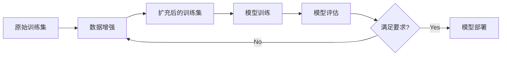

# 数据增强炼丹现场:Kaggle竞赛夺冠案例解读

## 1. 背景介绍

数据增强(Data Augmentation)是深度学习中一种常用的正则化技术,通过对训练数据进行一系列随机变换来人工扩充数据集,从而提高模型的泛化能力。近年来,数据增强技术在计算机视觉、语音识别、自然语言处理等领域取得了广泛应用,尤其是在数据量不足的情况下,合理的数据增强能显著提升模型性能。

本文将以Kaggle竞赛中的夺冠案例为切入点,深入剖析数据增强技术在图像分类任务中的实战应用。通过对竞赛赛题、数据特点、获胜方案的系统梳理,揭示数据增强的内在机理和最佳实践,为从事相关研究和应用的读者提供思路借鉴。

### 1.1 Kaggle竞赛平台简介

### 1.2 案例竞赛背景与赛题介绍  

### 1.3 竞赛数据集特点分析

## 2. 核心概念与联系

### 2.1 数据增强的定义与分类

#### 2.1.1 基于几何变换的数据增强方法

#### 2.1.2 基于颜色变换的数据增强方法 

#### 2.1.3 基于对抗生成网络的数据增强方法

#### 2.1.4 基于样本混合的数据增强方法

### 2.2 数据增强与过拟合、泛化能力的关系

### 2.3 数据增强在深度学习流程中的位置



## 3. 核心算法原理与具体操作步骤

### 3.1 基于OpenCV的传统图像增强实现

#### 3.1.1 几何变换:平移、旋转、缩放、翻转、裁剪

#### 3.1.2 颜色变换:亮度、对比度、饱和度调整

#### 3.1.3 噪声添加:高斯噪声、椒盐噪声 

### 3.2 基于深度学习的图像增强方法

#### 3.2.1 自动数据增强AutoAugment

#### 3.2.2 随机擦除Random Erasing

#### 3.2.3 图像混合:Mixup、Cutmix

### 3.3 多种数据增强方法的组合应用

## 4. 数学模型和公式详细讲解举例说明

### 4.1 图像几何变换的数学表示

#### 4.1.1 平移变换

$$\begin{bmatrix}x'\\ y'\\ 1\end{bmatrix}=\begin{bmatrix}1 & 0 & t_x\\ 0 & 1 & t_y\\ 0 & 0 & 1\end{bmatrix}\begin{bmatrix}x\\ y\\ 1\end{bmatrix}$$

#### 4.1.2 旋转变换

$$\begin{bmatrix}x'\\ y'\\ 1\end{bmatrix}=\begin{bmatrix}\cos\theta & -\sin\theta & 0\\ \sin\theta & \cos\theta & 0\\ 0 & 0 & 1\end{bmatrix}\begin{bmatrix}x\\ y\\ 1\end{bmatrix}$$

#### 4.1.3 缩放变换  

$x'=s_xx, y'=s_yy$

### 4.2 Mixup的数学形式

$\tilde{x}=\lambda x_i+(1-\lambda)x_j$

$\tilde{y}=\lambda y_i+(1-\lambda)y_j$

其中$\lambda\sim Beta(\alpha,\alpha), \lambda\in[0,1]$

### 4.3 Cutmix的数学形式

$\tilde{x}=M\odot x_A+(1-M)\odot x_B$  

$\tilde{y}=\lambda y_A+(1-\lambda)y_B$

其中$M$为掩码,$\lambda$为混合区域面积占比

## 5. 项目实践:代码实例和详细解释说明

### 5.1 使用Pytorch自定义数据增强transform

```python
import torch
from torchvision import transforms

class CustomAug(object):
    def __call__(self, img):
        # 随机水平翻转
        if torch.rand(1) < 0.5:
            img = transforms.functional.hflip(img)
        
        # 随机垂直翻转    
        if torch.rand(1) < 0.5:
            img = transforms.functional.vflip(img)
            
        # 随机旋转±90度
        if torch.rand(1) < 0.5:
            angle = torch.randint(-90, 90, (1,)).item()
            img = transforms.functional.rotate(img, angle)
            
        return img
```

### 5.2 使用Albumentations库进行图像增强

```python
import albumentations as A

transforms = A.Compose([
    A.RandomCrop(width=256, height=256),
    A.HorizontalFlip(p=0.5),
    A.RandomBrightnessContrast(p=0.2),
])

def augment(x):
    return transforms(image=x)['image']
```

### 5.3 将数据增强集成到Pytorch的DataLoader中

```python
from torch.utils.data import DataLoader

train_loader = DataLoader(
    dataset=train_dataset,
    batch_size=64, 
    shuffle=True,
    num_workers=4,
    pin_memory=True,
    collate_fn=lambda x: tuple(zip(*x)),
)
```

## 6. 实际应用场景

### 6.1 医学影像数据增强

### 6.2 遥感图像数据增强

### 6.3 工业缺陷检测中的数据增强

### 6.4 人脸识别中的数据增强

## 7. 工具和资源推荐

### 7.1 数据增强库

- Albumentations
- imgaug 
- AutoAugment

### 7.2 相关论文与学习资源

- AutoAugment: Learning Augmentation Policies from Data
- Bag of Tricks for Image Classification with Convolutional Neural Networks
- Data Augmentation Recipes for Object Detection

## 8. 总结:未来发展趋势与挑战

### 8.1 自动化数据增强技术

### 8.2 结合GAN的数据增强方法

### 8.3 多模态数据增强

### 8.4 数据增强的理论基础研究

### 8.5 数据增强的可解释性与可控性

## 9. 附录:常见问题与解答

### Q1: 数据增强会不会引入噪声,反而影响模型性能?

### Q2: 如何选择合适的数据增强方法?

### Q3: 数据增强对不同任务的效果是否一致?

### Q4: 在线数据增强和离线数据增强的区别?

### Q5: 数据增强对训练速度和资源消耗有何影响?

作者：禅与计算机程序设计艺术 / Zen and the Art of Computer Programming