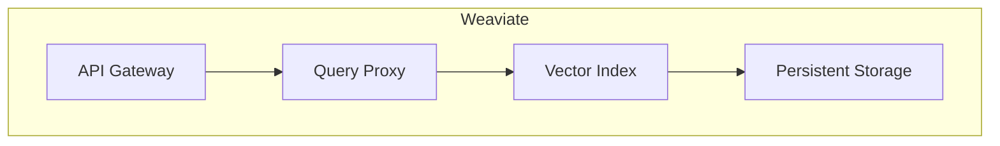

# 数据密集型业务中向量数据库的优势

## 1.背景介绍

### 1.1 数据密集型业务的兴起

随着人工智能、大数据和云计算等新兴技术的快速发展,数据正在以前所未有的规模和速度被生成和积累。越来越多的企业和组织开始依赖数据来驱动业务决策、优化运营效率、改善客户体验等。这些数据密集型业务对于高效存储、检索和分析海量数据提出了更高的要求,传统的关系型数据库和NoSQL数据库在处理非结构化数据(如文本、图像、视频等)时存在明显的局限性。

### 1.2 向量数据库的崛起

为了更好地满足数据密集型业务对非结构化数据处理的需求,向量数据库(Vector Database)应运而生。向量数据库是一种专门为高维向量数据(如嵌入向量、特征向量等)设计的数据库系统,能够高效地存储、检索和计算这些向量数据。它通过利用向量空间模型和相似性搜索算法,为诸如自然语言处理、计算机视觉、推荐系统等领域提供了强大的支持。

## 2.核心概念与联系

### 2.1 向量空间模型

向量空间模型(Vector Space Model)是向量数据库的核心理论基础。在这个模型中,每个数据对象(如文本文档、图像等)都被表示为一个高维向量,其中每个维度对应着一个特征(如词频、像素值等)。通过计算向量之间的相似度(如余弦相似度),我们可以发现彼此相关的数据对象。

### 2.2 相似性搜索

相似性搜索(Similarity Search)是向量数据库的核心功能之一。它允许用户基于向量相似度查询数据库,找到与给定向量最相似的若干个向量。这种查询方式在许多应用场景中都非常有用,例如:

- 在推荐系统中,可以根据用户的兴趣向量查找相似的商品或内容
- 在计算机视觉中,可以根据图像特征向量查找相似的图像
- 在自然语言处理中,可以根据文本嵌入向量查找语义相似的文档

### 2.3 近似最近邻搜索

由于向量数据通常具有很高的维度(如hundreds或thousands),在海量向量数据集中进行相似性搜索是一个计算量巨大的问题。为了提高搜索效率,向量数据库通常采用近似最近邻搜索(Approximate Nearest Neighbor Search,ANNS)算法,在保证一定精度的前提下,大幅降低搜索时间。常见的ANNS算法包括局部敏感哈希(Locality Sensitive Hashing,LSH)、层次导航小世界图(Hierarchical Navigable Small World,HNSW)等。

## 3.核心算法原理具体操作步骤  

### 3.1 向量数据的存储

向量数据库需要高效地存储大规模的向量数据。常见的存储方式包括:

1. **列存储(Column Store)**: 将向量拆分成多个列分别存储,有利于压缩和向量计算。
2. **LSM树(Log-Structured Merge Tree)**: 将不可变的向量数据以只追加的方式存储在多层结构中,支持高效的批量插入和合并操作。

### 3.2 近似最近邻搜索算法

#### 3.2.1 局部敏感哈希(LSH)

LSH是一种经典的ANNS算法,其核心思想是将相似的向量哈希到相同的桶中,从而将相似性搜索问题转化为桶查找问题。具体步骤如下:

1. 构建多个哈希函数族,每个函数族包含多个哈希函数。
2. 对每个向量使用多个哈希函数计算哈希值,将向量存储到对应的桶中。
3. 在查询时,对查询向量计算哈希值,检查对应桶中的向量,返回相似度最高的结果。

LSH的优点是简单高效,但精度和查询性能在高维向量场景下会受到一定影响。

#### 3.2.2 层次导航小世界图(HNSW)

HNSW是一种新兴的ANNS算法,通过构建多层次的导航结构来高效地近似最近邻搜索。具体步骤如下:

1. 构建入口层(Entry Layer),将所有向量随机分配到多个入口点。
2. 构建多层次的导航层(Navigation Layers),每个向量与其他向量建立多个有向边连接,边的权重为两个向量之间的距离。
3. 在查询时,从入口层出发,沿着距离最近的边遍历导航层,直到找到足够相似的向量。

HNSW在高维向量场景下表现优异,具有较高的查询精度和性能。

### 3.3 分布式向量数据库

为了支持大规模向量数据的存储和计算,向量数据库通常采用分布式架构。常见的分布式策略包括:

1. **分片(Sharding)**: 将向量数据按照某种策略(如哈希分区)分割到多个节点上,每个节点负责部分数据的存储和计算。
2. **复制(Replication)**: 在多个节点上复制完整的向量数据,提高读取吞吐量和可用性。
3. **一致性协议(Consistency Protocol)**: 采用一致性协议(如Raft、Paxos)来保证分布式系统的数据一致性和容错性。

## 4.数学模型和公式详细讲解举例说明

### 4.1 向量相似度度量

在向量空间模型中,向量相似度是一个核心概念,用于衡量两个向量之间的接近程度。常见的向量相似度度量包括:

1. **欧几里得距离(Euclidean Distance)**:

$$d(x,y) = \sqrt{\sum_{i=1}^{n}(x_i-y_i)^2}$$

其中$x$和$y$是$n$维向量,$x_i$和$y_i$分别表示它们在第$i$个维度上的值。

2. **余弦相似度(Cosine Similarity)**:

$$sim(x,y) = \frac{x \cdot y}{\|x\|\|y\|} = \frac{\sum_{i=1}^{n}x_iy_i}{\sqrt{\sum_{i=1}^{n}x_i^2}\sqrt{\sum_{i=1}^{n}y_i^2}}$$

余弦相似度测量两个向量之间的夹角余弦值,范围在$[-1,1]$之间。相似度越高,表示两个向量越相似。

在向量数据库中,通常使用余弦相似度作为相似性度量,因为它对向量的长度不敏感,更适合于处理嵌入向量等长度可变的向量数据。

### 4.2 局部敏感哈希(LSH)

LSH的核心思想是将相似的向量哈希到相同的桶中,从而将相似性搜索问题转化为桶查找问题。常见的LSH函数族包括:

1. **随机投影(Random Projection)**:

对于$d$维向量$v$,定义一个$d$维随机向量$r$,其中每个元素$r_i$服从标准高斯分布$\mathcal{N}(0,1)$。哈希函数$h(v)$定义为:

$$h(v) = \begin{cases}
1 & \text{if } r \cdot v \geq 0\\
0 & \text{if } r \cdot v < 0
\end{cases}$$

根据局部敏感哈希理论,如果两个向量$v$和$u$的夹角$\theta$较小(即相似度较高),那么$h(v)=h(u)$的概率较大。

2. **$p$稳定分布**:

对于$d$维向量$v$,定义一个$d$维随机向量$r$,其中每个元素$r_i$服从$p$稳定分布。哈希函数$h(v)$定义为:

$$h(v) = \lfloor \frac{r \cdot v + b}{w} \rfloor$$

其中$b$是一个随机实数,用于为哈希函数引入偏移,$w$是一个实数窗口,用于控制哈希函数的分桶粒度。

$p$稳定分布是一种具有更好的局部敏感性质的分布,在实践中表现优于随机投影。

通过组合多个哈希函数,LSH可以进一步提高查询精度。

### 4.3 层次导航小世界图(HNSW)

HNSW算法的核心思想是构建一个多层次的导航结构,使得每个向量都可以通过有限步骤到达其他向量。具体来说,对于一个包含$N$个$d$维向量的数据集$\mathcal{D}$,HNSW算法构建了一个由$N$个层次组成的导航图$G=(V,E)$:

- 顶层$L_0$只包含一个入口点$v_0$,即$L_0=\{v_0\}$。
- 对于第$i$层$L_i(i>0)$,每个向量$v\in\mathcal{D}$都在$L_i$中有一个对应的顶点$u_v$。
- 对于每个$u_v\in L_i$,它与$L_{i-1}$中的$M$个最近邻向量相连,形成$M$条有向边$(u_v,u_{NN_j(v)})$,其中$NN_j(v)$表示$v$在$L_{i-1}$中的第$j$个最近邻向量。边的权重为两个向量之间的距离。
- 最底层$L_{N-1}$包含所有向量对应的顶点。

在查询时,HNSW算法从入口点$v_0$出发,沿着距离最近的边遍历导航图,直到找到足够相似的向量。由于每个向量只需要维护$M$个最近邻连接,因此HNSW算法在空间和时间复杂度上都有很好的性能表现。

## 5.项目实践:代码实例和详细解释说明

为了更好地理解向量数据库的实现原理,我们以开源的向量数据库Weaviate为例,展示其核心代码和实现细节。

### 5.1 Weaviate架构概览

Weaviate是一个基于Go语言开发的云原生向量数据库,旨在为各种数据密集型应用提供高效的向量相似性搜索服务。它采用了微服务架构,主要包括以下几个核心组件:



- **API Gateway**: 提供RESTful API接口,接收客户端的查询请求。
- **Query Proxy**: 负责查询请求的调度和负载均衡。
- **Vector Index**: 使用HNSW算法构建向量索引,执行相似性搜索。
- **Persistent Storage**: 基于RocksDB存储向量数据和元数据。

### 5.2 向量索引构建

Weaviate使用HNSW算法构建向量索引,以支持高效的相似性搜索。下面是构建HNSW索引的核心代码:

```go
func (idx *HNSWIndex) Add(vector []float32) error {
    // 将向量插入HNSW索引
    idx.writeMutex.Lock()
    defer idx.writeMutex.Unlock()

    id := idx.addVector(vector)
    idx.addVectorToGraph(id, vector)

    return nil
}

func (idx *HNSWIndex) addVectorToGraph(id int64, vector []float32) {
    // 构建HNSW导航层
    currObj := idx.allocateOuterObjectNode(id, vector)
    idx.addToLayer(currObj, idx.maxLayer)
    idx.addToLayer(currObj, idx.entryLayer)
}

func (idx *HNSWIndex) addToLayer(currObj *outerObjectNode, layer int) {
    // 在当前层插入向量节点,并与最近邻建立连接
    currEp := idx.getRandomEntryPoint(layer)
    topEntries := idx.searchLayer(currObj, currEp, layer)
    idx.connectNewNodeToEntries(currObj, topEntries, layer)
}
```

上述代码展示了如何将一个新的向量插入HNSW索引。主要步骤包括:

1. 将向量作为一个新节点插入到HNSW的最顶层。
2. 在每一层,从随机入口点出发,找到当前节点的最近邻节点。
3. 将当前节点与最近邻节点相连,建立有向边连接。

通过这种方式,HNSW索引逐层构建,每个向量节点都与其最近邻相连,形成一个多层次的导航结构。

### 5.3 相似性搜索

基于构建好的