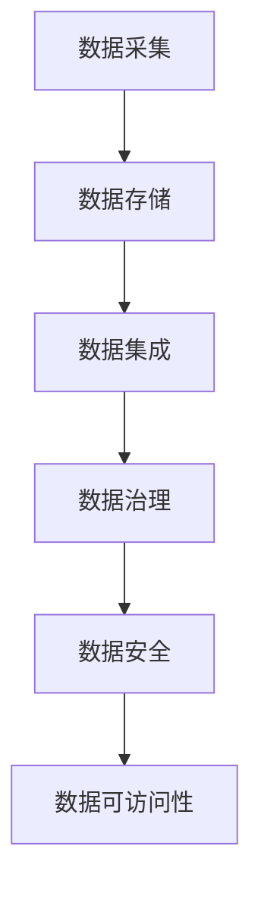
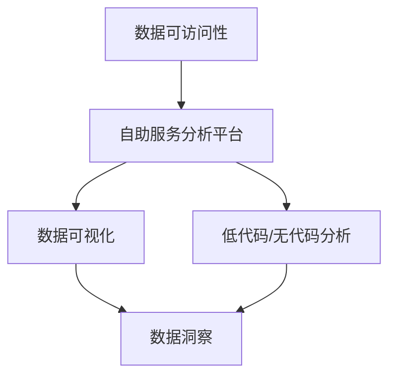
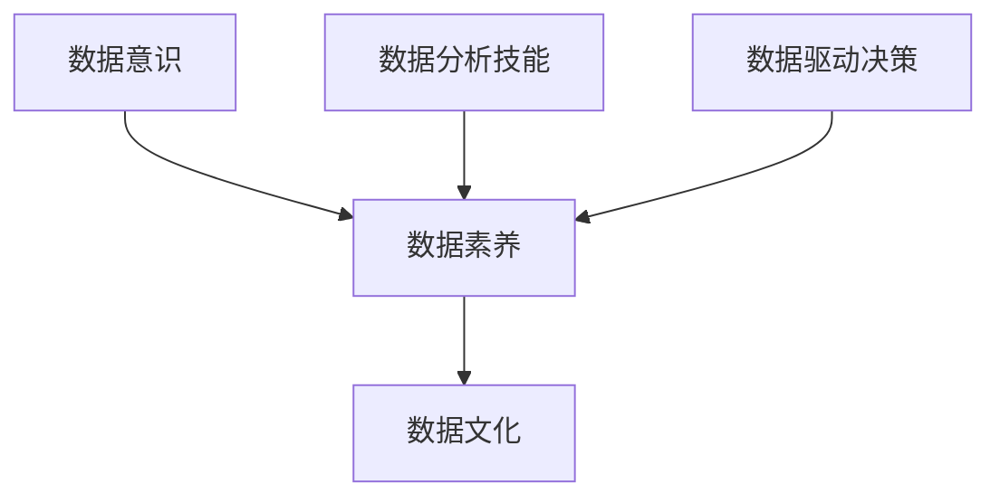
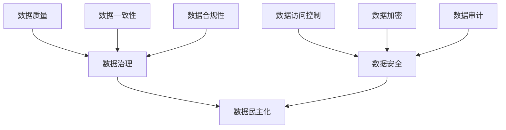

# 数据民主化:赋能业务创新

## 1.背景介绍

### 1.1 数据的价值与挑战

在当今数字时代,数据被视为新的"燃料",推动着各行业的创新与发展。企业和组织正在积累越来越多的数据,这些数据蕴含着巨大的价值,可用于洞察业务运营、优化决策、发现新的商机等。然而,要真正释放数据的力量并非易事。数据通常分散在不同的系统和部门中,存在数据孤岛、质量参差不齐等问题,给数据的整合、分析和利用带来了重大挑战。

### 1.2 数据民主化的兴起

为了解决上述挑战,数据民主化(Data Democratization)的概念应运而生。数据民主化旨在使数据资产对企业内的每个人都是可访问的、可理解的和可操作的,从而赋能整个组织的数据驱动决策和创新。通过数据民主化,企业可以打破数据孤岛,消除数据壁垒,实现数据资产的高效共享和利用。

### 1.3 数据民主化的意义

数据民主化不仅有助于提高企业的数据素养和数据文化,还能激发员工的创新潜力,促进跨部门协作,加速数据驱动型产品和服务的交付。从本质上讲,数据民主化是企业数字化转型的关键一环,有助于构建以数据为中心的敏捷型组织,增强企业的竞争优势。

## 2.核心概念与联系

### 2.1 数据管理

数据民主化的基础是健全的数据管理实践,包括数据采集、存储、集成、治理和安全等方面。企业需要建立统一的数据平台,整合来自各个系统和部门的数据资产,并通过元数据管理、数据质量管理等措施,确保数据的可访问性、一致性和可信度。

### 2.2 自助服务分析

自助服务分析(Self-Service Analytics)是数据民主化的核心环节。它允许非技术人员通过可视化工具和低代码/无代码平台,自主探索和分析数据,而无需依赖专业的数据分析师或IT人员。自助服务分析降低了数据分析的门槛,赋予更多员工数据洞察力。

### 2.3 数据素养培养

数据民主化不仅需要技术支持,更需要组织层面的文化转变。企业应当加强数据素养培养,提升员工的数据意识、数据分析技能和数据驱动决策能力。通过持续的培训和实践,企业可以建立一支数据人才队伍,推动数据文化在整个组织中的渗透。

### 2.4 数据治理与安全

在推进数据民主化的同时,企业也必须高度重视数据治理和数据安全。数据治理确保数据的质量、一致性和合规性,而数据安全则保护数据免受未经授权的访问、泄露或滥用。通过制定明确的政策、流程和技术控制措施,企业可以在实现数据民主化的同时,维护数据的完整性和隐私。

## 3.核心算法原理具体操作步骤

数据民主化涉及多种算法和技术,其中一些核心算法原理和具体操作步骤如下:

### 3.1 数据集成

数据集成是将来自不同源的数据合并到一个统一的视图中,以支持分析和决策。常用的数据集成技术包括ETL(提取、转换、加载)和ELT(提取、加载、转换)。

ETL流程:

1. **提取(Extract)**: 从各种数据源(如数据库、文件、API等)中提取原始数据。
2. **转换(Transform)**: 对提取的数据进行清理、转换和enrichment,以满足目标系统的要求。
3. **加载(Load)**: 将转换后的数据加载到目标数据仓库或数据湖中。

ELT流程:

1. **提取(Extract)**: 从各种数据源中提取原始数据。
2. **加载(Load)**: 将原始数据加载到目标数据湖或数据仓库中。
3. **转换(Transform)**: 在目标系统中对数据进行转换和处理。

### 3.2 数据建模

数据建模是将原始数据转换为分析友好的形式,以支持高效的查询和可视化。常用的数据建模技术包括:

- **星型模式**: 将数据组织为事实表(存储度量值)和维度表(存储描述性属性)的形式。
- **雪花模式**: 将维度表进一步规范化,形成多个子维度表。

数据建模步骤:

1. **识别业务流程**: 确定需要分析的主要业务流程和关键度量值。
2. **确定维度**: 根据业务需求确定描述事实的维度,如时间、地点、产品等。
3. **设计事实表**: 创建存储度量值的事实表。
4. **设计维度表**: 为每个维度创建维度表,存储相关的描述性属性。
5. **建立关系**: 通过共享键(如产品ID)将事实表和维度表相关联。

### 3.3 数据质量管理

数据质量管理是确保数据准确性、完整性和一致性的过程,包括以下步骤:

1. **定义数据质量规则**: 根据业务需求和法规要求,制定数据质量规则,如完整性、唯一性、有效性等。
2. **数据分析和评估**: 对现有数据进行分析和评估,识别数据质量问题。
3. **数据清理和标准化**: 通过数据清理和标准化规则,处理数据中的错误、重复、不一致等问题。
4. **数据增强**: 从其他数据源获取额外信息,丰富和完善现有数据。
5. **持续监控和改进**: 持续监控数据质量,并采取纠正措施,形成闭环的质量管理流程。

### 3.4 数据可视化

数据可视化是将数据转换为图形表示形式,以便于人类理解和探索。常用的数据可视化技术包括:

- **图表**: 如柱状图、折线图、饼图等,用于展示数据的分布和趋势。
- **仪表板**: 将多个图表和指标集成在一个界面中,提供全面的数据概览。
- **地理可视化**: 利用地图将数据与地理位置相关联,如热力图、符号地图等。

数据可视化步骤:

1. **确定可视化目标**: 明确可视化的目的,如展示趋势、对比差异还是发现异常等。
2. **选择合适的可视化类型**: 根据数据类型和可视化目标,选择合适的图表类型。
3. **数据转换和映射**: 将原始数据转换为可视化所需的格式,并映射到视觉通道(如颜色、大小、形状等)。
4. **设计和优化**: 调整图表的布局、颜色、标签等,提高可视化的清晰度和美观性。
5. **交互和探索**: 为可视化添加交互功能,如钻取、筛选、联动等,支持数据探索。

## 4.数学模型和公式详细讲解举例说明

数据民主化过程中,常常需要应用各种数学模型和公式进行数据分析和建模。以下是一些常见的数学模型和公式,以及相关的详细讲解和示例。

### 4.1 线性回归模型

线性回归模型是一种广泛应用的监督学习算法,用于预测连续型目标变量与一个或多个特征变量之间的线性关系。线性回归模型的数学表达式如下:

$$
y = \beta_0 + \beta_1x_1 + \beta_2x_2 + ... + \beta_nx_n + \epsilon
$$

其中:

- $y$ 是目标变量
- $x_1, x_2, ..., x_n$ 是特征变量
- $\beta_0, \beta_1, \beta_2, ..., \beta_n$ 是模型参数
- $\epsilon$ 是随机误差项

模型参数通常使用最小二乘法估计,目标是最小化残差平方和:

$$
\min \sum_{i=1}^{m} (y_i - (\beta_0 + \beta_1x_{i1} + \beta_2x_{i2} + ... + \beta_nx_{in}))^2
$$

其中 $m$ 是训练样本数量。

**示例**:

假设我们想预测某城市的房价,特征变量包括房屋面积、卧室数量和距市中心的距离。线性回归模型可以用于建立这种预测关系,并估计每个特征变量对房价的影响程度。

### 4.2 逻辑回归模型

逻辑回归模型是一种广泛应用的分类算法,用于预测二元或多元分类问题。它通过估计目标变量为某个类别的概率,从而进行分类预测。

对于二元逻辑回归,模型的数学表达式如下:

$$
P(Y=1|X) = \frac{1}{1 + e^{-(\beta_0 + \beta_1x_1 + \beta_2x_2 + ... + \beta_nx_n)}}
$$

其中:

- $P(Y=1|X)$ 是目标变量为1的条件概率
- $x_1, x_2, ..., x_n$ 是特征变量
- $\beta_0, \beta_1, \beta_2, ..., \beta_n$ 是模型参数

模型参数通常使用最大似然估计法进行估计,目标是最大化对数似然函数:

$$
\max \sum_{i=1}^{m} [y_i \log(p_i) + (1 - y_i) \log(1 - p_i)]
$$

其中 $p_i$ 是第 $i$ 个样本被预测为正类的概率。

**示例**:

在信用风险评估中,逻辑回归模型可用于预测客户是否会违约,特征变量可能包括年收入、信用评分、贷款金额等。模型输出的概率值可用于划分违约和非违约客户。

### 4.3 决策树模型

决策树是一种常用的机器学习模型,可用于分类和回归任务。它通过递归地构建决策树,根据特征值将样本划分到不同的叶节点,从而进行预测。

决策树的构建过程可以使用基尼系数或信息增益等指标来评估特征的分裂质量,选择最优特征进行分裂。对于分类问题,基尼系数的计算公式如下:

$$
\text{Gini}(D) = 1 - \sum_{k=1}^{K} p_k^2
$$

其中 $K$ 是类别数量, $p_k$ 是数据集 $D$ 中第 $k$ 类样本的比例。

对于回归问题,通常使用均方差作为分裂指标,公式如下:

$$
\text{MSE}(D) = \frac{1}{|D|} \sum_{x \in D} (y_x - \overline{y}_D)^2
$$

其中 $|D|$ 是数据集 $D$ 的样本数量, $y_x$ 是样本 $x$ 的目标值, $\overline{y}_D$ 是数据集 $D$ 中目标值的平均值。

**示例**:

在客户流失预测中,决策树模型可用于识别导致客户流失的关键特征,如服务质量、账单金额等,并根据这些特征构建决策规则,预测客户是否会流失。

## 5.项目实践:代码实例和详细解释说明

为了更好地理解数据民主化的实现,我们将通过一个实际项目案例,展示如何使用Python和相关库来构建一个自助服务分析平台。

### 5.1 项目概述

在本项目中