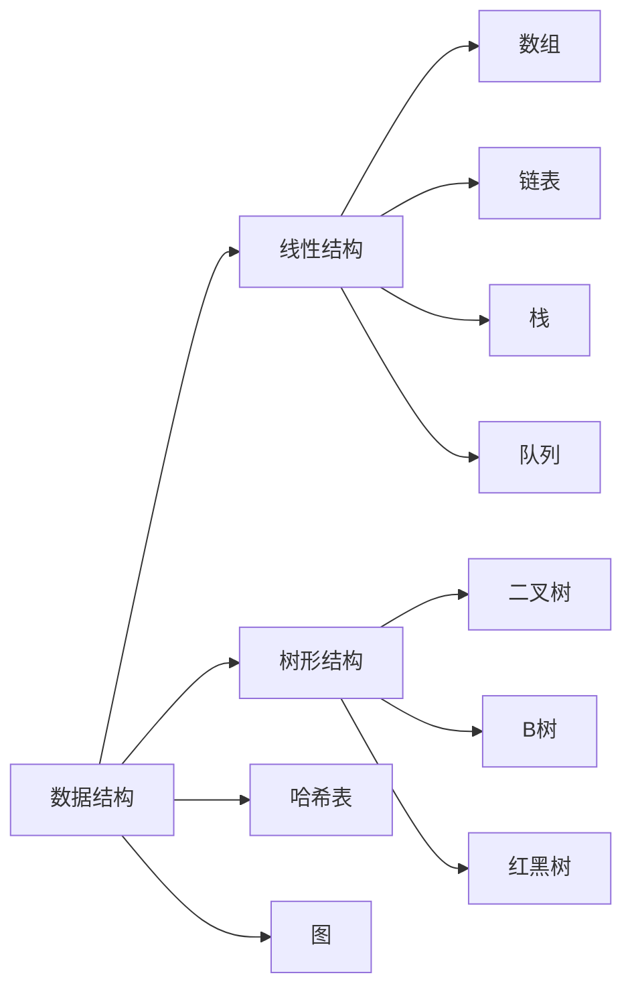
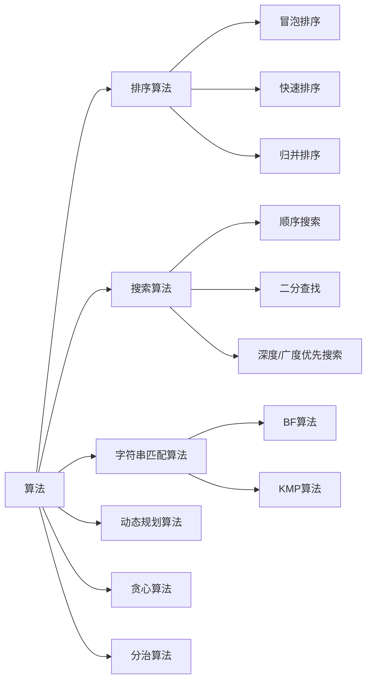

好的，我会严格按照您提供的要求和约束条件，撰写一篇高质量的技术博客文章。以下是正文部分的内容:

# 数据结构与算法原理与代码实战案例讲解

## 1.背景介绍

### 1.1 数据结构和算法的重要性

数据结构和算法是计算机科学的核心基础,对于程序员来说是必须掌握的基本功。良好的数据结构和算法设计可以极大地提高程序的运行效率,优化系统性能,降低开发和维护成本。随着大数据时代的到来,数据量的激增使得高效处理数据成为当务之急,因此数据结构和算法的重要性愈发凸显。

### 1.2 数据结构和算法的应用领域

数据结构和算法贯穿了计算机科学的方方面面,广泛应用于:

- 操作系统:文件系统、进程调度、内存管理等
- 编译原理:语法分析、代码优化等
- 数据库:索引结构、查询优化等
- 人工智能:搜索算法、机器学习等
- 计算机网络:路由算法、拥塞控制等
- 密码学:加密算法、哈希算法等

掌握数据结构和算法是进阶至高级程序员、系统架构师等高级岗位的必备基础。

## 2.核心概念与联系

### 2.1 数据结构

数据结构是指相互之间存在一种或多种特定关系的数据元素的集合。主要包括:

- 线性结构:数组、链表、栈、队列等
- 树形结构:二叉树、B树、红黑树等 
- 哈希表
- 图

不同的数据结构适用于不同的场景,需要根据具体问题选择合适的数据结构。



### 2.2 算法

算法是描述解决问题的方法和步骤的一系列规则。常见的算法有:

- 排序算法:冒泡排序、快速排序、归并排序等
- 搜索算法:顺序搜索、二分查找、深度/广度优先搜索等
- 字符串匹配算法:BF算法、KMP算法等
- 动态规划算法
- 贪心算法
- 分治算法

合理选择和应用算法可以最大限度地提高程序的效率和性能。



### 2.3 数据结构与算法的紧密关系

数据结构和算法密不可分,相辅相成:

- 数据结构是算法的载体,算法需要建立在适当的数据结构之上
- 算法是对特定数据结构进行操作的方法和步骤
- 高效的算法往往需要配合高效的数据结构,二者相互影响

掌握数据结构和算法的设计技巧,并能灵活运用,是每个程序员必备的核心能力。

## 3.核心算法原理具体操作步骤

### 3.1 排序算法

排序算法是最基础和最常用的算法之一,在许多场景下都会用到。以下介绍三种经典的排序算法原理和具体实现步骤。

#### 3.1.1 冒泡排序

**原理**: 重复遍历待排序列表,每次比较相邻两个元素,将值较大的元素交换至右端,通过不断"冒泡"完成排序。

**步骤**:
1. 比较相邻的两个元素,若前者大于后者,则交换位置
2. 对每一对相邻元素重复步骤1,直到最后一对
3. 针对所有元素重复步骤1和2,直到没有重复交换

**代码实现**:

```python
def bubble_sort(arr):
    n = len(arr)
    # 外层循环控制排序趟数
    for i in range(n):
        # 内层循环控制每趟比较的次数
        for j in range(0, n - i - 1):
            if arr[j] > arr[j + 1]:
                arr[j], arr[j + 1] = arr[j + 1], arr[j]
    return arr
```

**时间复杂度**: 最好情况$O(n)$,最坏情况$O(n^2)$,平均情况$O(n^2)$

#### 3.1.2 快速排序

**原理**: 选择一个基准元素,通过一趟排序将待排序列分割成独立的两部分,其中一部分记录的关键字均比基准元素小,另一部分记录的关键字均比基准元素大,然后分别对两部分继续进行排序。

**步骤**:
1. 从序列中挑出一个元素作为基准(pivot)
2. 重新排序数列,所有比基准值小的元素摆放在基准前面,比基准大的元素摆在基准后面,基准位置确定
3. 递归地把小于基准值的子序列和大于基准值的子序列进行排序

**代码实现**:

```python
def quick_sort(arr):
    if len(arr) < 2:
        return arr
    pivot = arr[0]
    less = [i for i in arr[1:] if i <= pivot]
    greater = [i for i in arr[1:] if i > pivot]
    return quick_sort(less) + [pivot] + quick_sort(greater)
```

**时间复杂度**: 最好情况$O(n\log n)$,最坏情况$O(n^2)$,期望时间复杂度$O(n\log n)$

#### 3.1.3 归并排序

**原理**: 采用分治法的思想,将原始序列不断二分,直至所有子序列的元素个数为1,然后将这些子序列按照规则合并为一个有序序列。

**步骤**:
1. 申请空间,使其大小为两个已经排序序列之和,该空间用来存放合并后的序列
2. 设定两个指针,最初位置分别为两个已经排序序列的起始位置
3. 比较两个指针所指向的元素,选择相对小的元素放入到合并空间,并移动指针到下一位置
4. 重复步骤3直到某一指针到达序列尾
5. 将另一序列剩下的所有元素直接复制到合并序列尾

**代码实现**:

```python
def merge_sort(arr):
    if len(arr) <= 1:
        return arr
    mid = len(arr) // 2
    left = merge_sort(arr[:mid])
    right = merge_sort(arr[mid:])
    return merge(left, right)

def merge(left, right):
    result = []
    i, j = 0, 0
    while i < len(left) and j < len(right):
        if left[i] <= right[j]:
            result.append(left[i])
            i += 1
        else:
            result.append(right[j])
            j += 1
    result += left[i:]
    result += right[j:]
    return result
```

**时间复杂度**: 最好、最坏、平均时间复杂度均为$O(n\log n)$

### 3.2 搜索算法

搜索算法用于在数据结构中查找特定元素或满足条件的元素,是非常常见和基础的算法。下面介绍两种经典的搜索算法。

#### 3.2.1 顺序搜索

**原理**: 从数据结构的一端开始,逐一查看每个元素,直到找到所求元素或遍历完整个数据结构。

**步骤**:
1. 从第一个元素开始遍历
2. 依次比较每个元素与目标元素是否相等
3. 若相等则返回该元素位置,否则继续遍历
4. 直到遍历完整个数据结构

**代码实现**:

```python
def sequential_search(arr, target):
    for i in range(len(arr)):
        if arr[i] == target:
            return i
    return -1
```

**时间复杂度**: 最好情况$O(1)$,最坏情况$O(n)$,平均情况$O(n)$

#### 3.2.2 二分查找

**原理**: 在有序数据结构中,取中间元素与目标元素比较,如果中间元素大于目标元素,则在中间元素的左半部分继续查找,否则在右半部分继续查找。

**前提条件**:
- 数据结构中的元素必须是有序的

**步骤**:
1. 取中间位置 `mid = (low + high) // 2`
2. 若 `arr[mid] > target`,在数组`arr[low:mid]`中继续查找
3. 若 `arr[mid] < target`,在数组`arr[mid+1:high+1]`中继续查找
4. 若 `arr[mid] == target`,返回 `mid` 位置
5. 若最终没有找到,返回 -1

**代码实现**:

```python
def binary_search(arr, target):
    low, high = 0, len(arr) - 1
    while low <= high:
        mid = (low + high) // 2
        if arr[mid] == target:
            return mid
        elif arr[mid] > target:
            high = mid - 1
        else:
            low = mid + 1
    return -1
```

**时间复杂度**: 最好情况$O(1)$,最坏情况$O(\log n)$,平均情况$O(\log n)$

### 3.3 动态规划算法

动态规划算法通过将原问题拆解成若干子问题,同时保存子问题的解,使得下次求解相同子问题时只需直接查表,避免重复计算,从而降低时间复杂度。

#### 3.3.1 斐波那契数列

**问题描述**:
斐波那契数列指的是这样一个数列:0、1、1、2、3、5、8、13、21、34、...
在数学上,斐波那契数列以如下被以递推的方法定义:F(0)=0,F(1)=1,F(n)=F(n-1)+F(n-2)(n>=2)

**动态规划解法**:
1. 定义 `dp` 数组用于存储已经计算过的斐波那契数
2. 设置初始值 `dp[0]=0, dp[1]=1`
3. 利用状态转移方程 `dp[n] = dp[n-1] + dp[n-2]` 计算第 n 个斐波那契数
4. 返回 `dp[n]`

**代码实现**:

```python
def fibonacci(n):
    if n <= 1:
        return n
    dp = [0] * (n + 1)
    dp[0] = 0
    dp[1] = 1
    for i in range(2, n + 1):
        dp[i] = dp[i - 1] + dp[i - 2]
    return dp[n]
```

**时间复杂度**: $O(n)$

#### 3.3.2 背包问题

**问题描述**:
给定一组物品,每种物品都有自己的重量和价值,在限定的总重量内,应如何选择,才能使得装入背包中的物品总价值最大?

**动态规划解法**:
1. 定义二维 `dp` 数组,`dp[i][j]` 表示前 `i` 个物品中,在总重量为 `j` 的情况下,能获得的最大价值
2. 对于第 `i` 个物品,有两种情况:
   - 不放入背包,则 `dp[i][j] = dp[i-1][j]`
   - 放入背包,则 `dp[i][j] = dp[i-1][j-weight[i]] + value[i]`
3. 状态转移方程: `dp[i][j] = max(dp[i-1][j], dp[i-1][j-weight[i]] + value[i])`
4. 返回 `dp[n][W]`,其中 `n` 为物品数量,`W` 为背包总重量

**代码实现**:

```python
def knapsack(W, weight, value, n):
    dp = [[0] * (W + 1) for _ in range(n + 1)]
    for i in range(1, n + 1):
        for j in range(W + 1):
            if j 