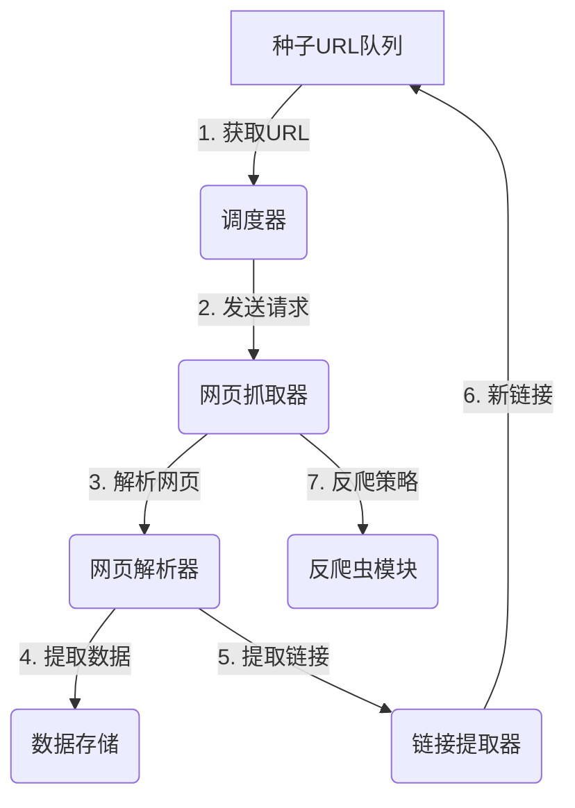

# 数据采集与标注原理与代码实战案例讲解

## 1. 背景介绍

在当今的数据驱动时代，数据无疑是推动人工智能、机器学习和深度学习等先进技术发展的核心燃料。无论是自然语言处理、计算机视觉、推荐系统还是其他领域,高质量的数据都是训练有效模型的关键先决条件。然而,获取高质量的数据并非易事,需要经过精心设计的数据采集和标注流程。本文将深入探讨数据采集和标注的原理和最佳实践,并提供实战案例,帮助读者掌握这一重要环节。

## 2. 核心概念与联系

### 2.1 数据采集

数据采集是从各种来源获取原始数据的过程。常见的数据来源包括:

- 网页抓取
- 传感器和物联网设备
- 社交媒体平台
- 公开数据集
- 企业内部数据库

根据数据类型的不同,采集方法也有所区别。例如,对于结构化数据(如数据库记录),可以使用 SQL 查询或 API 进行采集;对于非结构化数据(如网页内容、社交媒体帖子),则需要使用网页抓取技术或特定的 API。

### 2.2 数据标注

数据标注是为原始数据赋予语义标签或标记的过程,使其可以被机器学习模型理解和处理。标注的类型取决于具体的任务和数据类型,例如:

- 对于图像数据,标注可能包括对象检测、语义分割等。
- 对于文本数据,标注可能包括命名实体识别、情感分析等。
- 对于语音数据,标注可能包括语音转文本、说话人识别等。

数据标注可以由人工完成,也可以利用机器学习模型进行自动标注,再由人工校验和纠正。

### 2.3 数据质量

高质量的数据对于构建高性能的机器学习模型至关重要。数据质量可以从以下几个方面来衡量:

- 准确性:数据是否反映了真实情况,没有错误或噪声。
- 完整性:数据是否包含了所需的全部信息,没有缺失值。
- 一致性:数据是否在不同来源之间保持一致,没有矛盾。
- 代表性:数据是否能够很好地代表整个数据分布,没有偏差。

## 3. 核心算法原理具体操作步骤

### 3.1 数据采集算法

#### 3.1.1 网页抓取算法

网页抓取是获取网络数据的常用方法,其核心算法包括:

1. **种子URL队列**: 维护一个待抓取的URL队列,作为抓取的起点。

2. **URL去重**: 使用集合或布隆过滤器等数据结构,避免重复抓取相同URL。

3. **网页解析**: 使用HTML解析器(如Beautiful Soup、lxml等)从网页中提取所需数据。

4. **链接提取器**: 从已抓取的网页中提取新的链接URL,加入种子队列中。

5. **调度器**: 根据策略(如广度优先、深度优先等)有序地从种子队列中获取URL进行抓取。

6. **并行化**: 使用多线程或多进程技术,提高抓取效率。

7. **反爬虫策略**: 设置请求头、代理IP、随机延迟等策略,避免被目标网站拦截。

8. **持久化存储**: 将抓取的数据存储到数据库或文件系统中。

#### 3.1.2 API数据采集算法

对于提供API访问的数据源,可以使用以下算法进行采集:

1. **认证**: 根据API要求进行身份认证,获取访问令牌。

2. **构造请求**: 根据API文档,构造合法的HTTP请求,包括URL、请求头、请求体等。

3. **发送请求**: 使用HTTP客户端库(如requests)发送请求并获取响应。

4. **解析响应**: 根据响应格式(如JSON、XML等)解析响应数据。

5. **错误处理**: 处理请求过程中可能出现的各种错误,如认证失败、请求被拒绝等。

6. **速率限制**: 根据API限制,控制请求发送的频率,避免被服务器拦截。

7. **分页处理**: 对于分页数据,需要循环发送多个请求,获取全部数据。

8. **持久化存储**: 将获取的数据存储到数据库或文件系统中。

### 3.2 数据标注算法

#### 3.2.1 人工标注算法

人工标注是最常见的标注方式,其算法流程如下:

1. **任务分配**: 将标注任务分配给合格的人工标注员。

2. **标注规则**: 制定明确的标注规则和指南,确保标注的一致性。

3. **标注界面**: 提供用户友好的标注界面,方便标注员进行标注操作。

4. **质量控制**: 通过样本检查、众包等方式,控制标注质量。

5. **反馈机制**: 建立反馈机制,允许标注员提出疑问并及时获得解答。

6. **标注审核**: 由经验丰富的专家对标注结果进行审核,纠正错误。

7. **奖惩机制**: 根据标注质量,对标注员实施奖惩机制,提高积极性。

8. **持久化存储**: 将标注结果存储到数据库或文件系统中。

#### 3.2.2 自动标注算法

自动标注算法利用机器学习模型对数据进行初步标注,再由人工校验和纠正,可以大幅提高标注效率。常见的自动标注算法包括:

1. **监督学习算法**:使用已标注的数据训练模型,再对新数据进行预测和标注。

2. **迁移学习算法**:在源领域训练好的模型,通过一定的迁移策略,应用到目标领域进行标注。

3. **半监督学习算法**:利用少量标注数据和大量未标注数据,结合生成模型等技术进行标注。

4. **主动学习算法**:模型根据不确定性或代表性等策略,主动选择最有价值的样本进行人工标注,不断迭代优化自身。

5. **标注融合算法**:将多个模型的标注结果进行融合,提高标注质量。

无论采用何种自动标注算法,人工校验和反馈都是必不可少的环节,以确保标注结果的准确性。

## 4. 数学模型和公式详细讲解举例说明

### 4.1 主动学习算法

主动学习算法是一种有效的自动标注方法,它通过主动选择最有价值的样本进行人工标注,不断优化模型,从而达到以少量标注数据获得较高性能的目的。

假设我们有一个未标注数据集 $\mathcal{U} = \{x_1, x_2, \dots, x_n\}$,以及一个已标注数据集 $\mathcal{L} = \{(x_1, y_1), (x_2, y_2), \dots, (x_m, y_m)\}$,其中 $x_i$ 表示样本,而 $y_i$ 表示对应的标签。我们的目标是从 $\mathcal{U}$ 中选择一个子集 $\mathcal{S} \subset \mathcal{U}$,对其进行人工标注,并将标注结果加入 $\mathcal{L}$,以提高模型的性能。

主动学习算法的核心在于如何选择 $\mathcal{S}$。常见的策略包括:

1. **不确定性采样(Uncertainty Sampling)**:选择模型预测概率值最接近 0.5 的样本,即模型对这些样本最不确定。

   $$
   \mathcal{S} = \arg\max_{x_i \in \mathcal{U}} \left(1 - P(y^* | x_i)\right)
   $$

   其中 $y^*$ 是模型预测的最可能标签,而 $P(y^* | x_i)$ 是该样本被预测为 $y^*$ 的概率。

2. **代表性采样(Representative Sampling)**:选择能够很好代表整个数据分布的样本。一种常见方法是基于聚类,选择离聚类中心最近的样本。

   $$
   \mathcal{S} = \arg\min_{x_i \in \mathcal{U}} \min_{c_j \in \mathcal{C}} \text{dist}(x_i, c_j)
   $$

   其中 $\mathcal{C}$ 是数据集 $\mathcal{U}$ 的聚类中心集合,而 $\text{dist}(x_i, c_j)$ 表示样本 $x_i$ 与聚类中心 $c_j$ 之间的距离。

3. **密度加权采样(Density-Weighted Sampling)**:结合不确定性和代表性两个因素,选择具有较高密度且模型预测不确定的样本。

   $$
   \mathcal{S} = \arg\max_{x_i \in \mathcal{U}} \left(1 - P(y^* | x_i)\right) \cdot \text{density}(x_i)
   $$

   其中 $\text{density}(x_i)$ 表示样本 $x_i$ 所在区域的数据密度,可以通过核密度估计等方法计算。

通过不断迭代上述过程,主动学习算法可以有效地利用少量标注数据,快速提高模型的性能。

### 4.2 标注融合算法

在自动标注过程中,我们通常会使用多个模型进行预测,然后将这些预测结果进行融合,以获得更加准确的标注结果。假设我们有 $K$ 个模型 $\{M_1, M_2, \dots, M_K\}$,对于样本 $x_i$,每个模型会给出一个预测标签 $y_{i,k}$,我们需要将这些预测结果融合为一个最终的标签 $\hat{y}_i$。

一种常见的融合方法是**多数投票(Majority Voting)**,即选择出现次数最多的标签作为最终标签:

$$
\hat{y}_i = \arg\max_{y} \sum_{k=1}^K \mathbb{I}(y_{i,k} = y)
$$

其中 $\mathbb{I}(\cdot)$ 是指示函数,当条件成立时取值为 1,否则为 0。

另一种融合方法是**加权投票(Weighted Voting)**,即根据每个模型的权重对预测结果进行加权求和:

$$
\hat{y}_i = \arg\max_{y} \sum_{k=1}^K w_k \cdot \mathbb{I}(y_{i,k} = y)
$$

其中 $w_k$ 是第 $k$ 个模型的权重,可以根据模型在验证集上的表现来确定。

除了上述基于标签的融合方法,我们还可以进行**概率分布融合**,即将每个模型预测的概率分布进行加权求和,然后选择概率值最大的标签作为最终结果:

$$
\hat{y}_i = \arg\max_{y} \sum_{k=1}^K w_k \cdot P(y | x_i, M_k)
$$

其中 $P(y | x_i, M_k)$ 表示第 $k$ 个模型预测样本 $x_i$ 的标签为 $y$ 的概率。

通过合理的标注融合策略,我们可以有效地提高自动标注的准确性,为后续的模型训练提供高质量的数据支持。

## 5. 项目实践:代码实例和详细解释说明

在本节,我们将通过一个实际的项目案例,演示如何进行数据采集和标注。我们将使用 Python 编程语言,并利用多个流行的第三方库,如 Scrapy、Beautiful Soup、Pandas 等。

### 5.1 项目概述

我们的项目目标是从多个在线商店采集产品数据,并对产品图像进行标注,为后续的产品识别和推荐系统提供训练数据。具体来说,我们需要完成以下任务:

1. 从亚马逊、eBay 和淘宝等电商网站采集产品信息,包括产品名称、描述、价格、评论等。