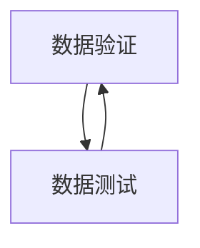

## 1. 背景介绍

在软件开发过程中，数据验证和数据测试是非常重要的环节。数据验证是指对输入数据进行检查，确保其符合预期的格式和规范，以避免程序出现异常或错误。数据测试是指对程序的输出数据进行检查，确保其符合预期的结果，以验证程序的正确性和可靠性。

数据验证和数据测试是软件开发过程中不可或缺的环节，它们可以帮助开发人员提高程序的质量和可靠性，减少程序出错的概率，提高用户的满意度。

本文将介绍数据验证和数据测试的原理和实践，包括核心概念、算法原理、数学模型和公式、代码实例、实际应用场景、工具和资源推荐、未来发展趋势和挑战以及常见问题和解答。

## 2. 核心概念与联系

数据验证和数据测试是软件开发过程中的两个重要环节，它们之间有着密切的联系和互相依存的关系。

数据验证是指对输入数据进行检查，确保其符合预期的格式和规范，以避免程序出现异常或错误。数据验证可以通过正则表达式、数据类型检查、数据长度检查、数据范围检查等方式来实现。

数据测试是指对程序的输出数据进行检查，确保其符合预期的结果，以验证程序的正确性和可靠性。数据测试可以通过单元测试、集成测试、系统测试、性能测试等方式来实现。

数据验证和数据测试的目的都是为了提高程序的质量和可靠性，减少程序出错的概率，提高用户的满意度。它们之间的联系和互相依存的关系可以用下图表示：



## 3. 核心算法原理具体操作步骤

### 3.1 数据验证算法原理

数据验证算法的核心原理是对输入数据进行检查，确保其符合预期的格式和规范，以避免程序出现异常或错误。数据验证算法可以通过正则表达式、数据类型检查、数据长度检查、数据范围检查等方式来实现。

#### 3.1.1 正则表达式

正则表达式是一种用来描述字符串模式的语言，可以用来匹配、查找、替换字符串。在数据验证中，正则表达式可以用来检查输入数据是否符合预期的格式和规范。

例如，我们可以使用正则表达式来检查一个字符串是否是一个有效的电子邮件地址：

```python
import re

email = "example@example.com"
pattern = r"^[a-zA-Z0-9._%+-]+@[a-zA-Z0-9.-]+\.[a-zA-Z]{2,}$"

if re.match(pattern, email):
    print("Valid email address")
else:
    print("Invalid email address")
```

上述代码中，我们使用了正则表达式 `r"^[a-zA-Z0-9._%+-]+@[a-zA-Z0-9.-]+\.[a-zA-Z]{2,}$"` 来检查一个字符串是否是一个有效的电子邮件地址。该正则表达式的含义是：以字母、数字、下划线、百分号、加号、减号、点号组成的字符串，后面跟着一个 @ 符号，再后面是一个由字母、数字、减号、点号组成的字符串，最后是一个由两个或更多字母组成的字符串。

#### 3.1.2 数据类型检查

数据类型检查是指对输入数据的类型进行检查，确保其符合预期的类型。在数据验证中，数据类型检查可以用来检查输入数据是否是一个整数、浮点数、字符串等类型。

例如，我们可以使用数据类型检查来检查一个字符串是否是一个整数：

```python
def is_integer(s):
    try:
        int(s)
        return True
    except ValueError:
        return False

if is_integer("123"):
    print("Valid integer")
else:
    print("Invalid integer")
```

上述代码中，我们定义了一个函数 `is_integer`，该函数接受一个字符串作为参数，如果该字符串可以转换为一个整数，则返回 True，否则返回 False。我们可以使用该函数来检查一个字符串是否是一个整数。

#### 3.1.3 数据长度检查

数据长度检查是指对输入数据的长度进行检查，确保其符合预期的长度。在数据验证中，数据长度检查可以用来检查输入数据的长度是否符合预期的范围。

例如，我们可以使用数据长度检查来检查一个字符串的长度是否在指定的范围内：

```python
def is_valid_length(s, min_length, max_length):
    length = len(s)
    return length >= min_length and length <= max_length

if is_valid_length("example", 1, 10):
    print("Valid length")
else:
    print("Invalid length")
```

上述代码中，我们定义了一个函数 `is_valid_length`，该函数接受一个字符串、一个最小长度和一个最大长度作为参数，如果该字符串的长度在指定的范围内，则返回 True，否则返回 False。我们可以使用该函数来检查一个字符串的长度是否在指定的范围内。

#### 3.1.4 数据范围检查

数据范围检查是指对输入数据的范围进行检查，确保其符合预期的范围。在数据验证中，数据范围检查可以用来检查输入数据的范围是否符合预期的范围。

例如，我们可以使用数据范围检查来检查一个整数是否在指定的范围内：

```python
def is_valid_range(n, min_value, max_value):
    return n >= min_value and n <= max_value

if is_valid_range(10, 1, 100):
    print("Valid range")
else:
    print("Invalid range")
```

上述代码中，我们定义了一个函数 `is_valid_range`，该函数接受一个整数、一个最小值和一个最大值作为参数，如果该整数在指定的范围内，则返回 True，否则返回 False。我们可以使用该函数来检查一个整数是否在指定的范围内。

### 3.2 数据测试算法原理

数据测试算法的核心原理是对程序的输出数据进行检查，确保其符合预期的结果，以验证程序的正确性和可靠性。数据测试算法可以通过单元测试、集成测试、系统测试、性能测试等方式来实现。

#### 3.2.1 单元测试

单元测试是指对程序的最小可测试单元进行测试，以验证程序的正确性和可靠性。在单元测试中，我们通常会编写测试用例来测试程序的各个功能模块，以确保程序的每个功能模块都能够正常工作。

例如，我们可以使用 Python 的 unittest 模块来编写一个简单的单元测试：

```python
import unittest

def add(a, b):
    return a + b

class TestAdd(unittest.TestCase):
    def test_add(self):
        self.assertEqual(add(1, 2), 3)
        self.assertEqual(add(0, 0), 0)
        self.assertEqual(add(-1, 1), 0)

if __name__ == '__main__':
    unittest.main()
```

上述代码中，我们定义了一个函数 `add`，该函数接受两个参数，返回它们的和。我们使用 Python 的 unittest 模块来编写一个简单的单元测试，该测试用例包含了三个测试用例，分别测试了 `add` 函数的三种情况：两个正整数相加、两个零相加、一个正整数和一个负整数相加。

#### 3.2.2 集成测试

集成测试是指对程序的多个模块进行测试，以验证程序的正确性和可靠性。在集成测试中，我们通常会编写测试用例来测试程序的各个模块之间的交互，以确保程序的各个模块能够正常协同工作。

例如，我们可以使用 Python 的 unittest 模块来编写一个简单的集成测试：

```python
import unittest

def add(a, b):
    return a + b

def subtract(a, b):
    return a - b

class TestAddAndSubtract(unittest.TestCase):
    def test_add_and_subtract(self):
        self.assertEqual(add(1, 2), 3)
        self.assertEqual(subtract(3, 2), 1)
        self.assertEqual(add(0, 0), 0)
        self.assertEqual(subtract(0, 0), 0)
        self.assertEqual(add(-1, 1), 0)
        self.assertEqual(subtract(1, -1), 2)

if __name__ == '__main__':
    unittest.main()
```

上述代码中，我们定义了两个函数 `add` 和 `subtract`，分别用来计算两个数的和和差。我们使用 Python 的 unittest 模块来编写一个简单的集成测试，该测试用例包含了六个测试用例，分别测试了 `add` 和 `subtract` 函数的三种情况：两个正整数相加和相减、两个零相加和相减、一个正整数和一个负整数相加和相减。

#### 3.2.3 系统测试

系统测试是指对整个程序进行测试，以验证程序的正确性和可靠性。在系统测试中，我们通常会编写测试用例来测试程序的各个功能模块和交互，以确保程序能够正常工作。

例如，我们可以使用 Python 的 unittest 模块来编写一个简单的系统测试：

```python
import unittest

def add(a, b):
    return a + b

def subtract(a, b):
    return a - b

def multiply(a, b):
    return a * b

def divide(a, b):
    return a / b

class TestCalculator(unittest.TestCase):
    def test_calculator(self):
        self.assertEqual(add(1, 2), 3)
        self.assertEqual(subtract(3, 2), 1)
        self.assertEqual(multiply(2, 3), 6)
        self.assertEqual(divide(6, 3), 2)

if __name__ == '__main__':
    unittest.main()
```

上述代码中，我们定义了四个函数 `add`、`subtract`、`multiply` 和 `divide`，分别用来计算两个数的和、差、积和商。我们使用 Python 的 unittest 模块来编写一个简单的系统测试，该测试用例包含了四个测试用例，分别测试了 `add`、`subtract`、`multiply` 和 `divide` 函数的四种情况：两个正整数相加、两个正整数相减、两个正整数相乘、两个正整数相除。

#### 3.2.4 性能测试

性能测试是指对程序的性能进行测试，以验证程序的性能和可靠性。在性能测试中，我们通常会编写测试用例来测试程序的各个功能模块和交互，以确保程序能够在预期的时间内完成任务。

例如，我们可以使用 Python 的 time 模块来编写一个简单的性能测试：

```python
import time

def fibonacci(n):
    if n <= 1:
        return n
    else:
        return fibonacci(n-1) + fibonacci(n-2)

start_time = time.time()
result = fibonacci(30)
end_time = time.time()

print("Result:", result)
print("Time:", end_time - start_time)
```

上述代码中，我们定义了一个函数 `fibonacci`，该函数接受一个整数作为参数，返回斐波那契数列的第 n 项。我们使用 Python 的 time 模块来编写一个简单的性能测试，该测试用例计算斐波那契数列的第 30 项，并输出计算结果和计算时间。

## 4. 数学模型和公式详细讲解举例说明

在数据验证和数据测试中，数学模型和公式是非常重要的工具，它们可以帮助我们更好地理解和分析数据验证和数据测试的原理和方法。

### 4.1 正则表达式

正则表达式是一种用来描述字符串模式的语言，可以用来匹配、查找、替换字符串。在数据验证中，正则表达式可以用来检查输入数据是否符合预期的格式和规范。

正则表达式的基本语法如下：

- `.`：匹配任意字符。
- `*`：匹配前面的字符零次或多次。
- `+`：匹配前面的字符一次或多次。
- `?`：匹配前面的字符零次或一次。
- `[]`：匹配方括号中的任意一个字符。
- `[^]`：匹配不在方括号中的任意一个字符。
- `()`：分组，可以用来改变优先级和提取匹配的子串。
- `|`：或，匹配左右两边的任意一个表达式。

例如，正则表达式 `^[a-zA-Z0-9._%+-]+@[a-zA-Z0-9.-]+\.[a-zA-Z]{2,}$` 可以用来检查一个字符串是否是一个有效的电子邮件地址。

### 4.2 单元测试

单元测试是指对程序的最小可测试单元进行测试，以验证程序的正确性和可靠性。在单元测试中，我们通常会编写测试用例来测试程序的各个功能模块，以确保程序的每个功能模块都能够正常工作。

单元测试的数学模型和公式如下：

- 测试用例：对程序的某个功能模块进行测试的输入和预期输出的组合。
- 测试覆盖率：对程序的某个功能模块进行测试的测试用例数占总测试用例数的比例。
- 测试通过率：对程序的某个功能模块进行测试的测试用例中通过的测试用例数占总测试用例数的比例。

例如，我们可以使用 Python 的 unittest 模块来编写一个简单的单元测试，该测试用例包含了三个测试用例，分别测试了 `add` 函数的三种情况：两个正整数相加、两个零相加、一个正整数和一个负整数相加。

### 4.3 集成测试

集成测试是指对程序的多个模块进行测试，以验证程序的正确性和可靠性。在集成测试中，我们通常会编写测试用例来测试程序的各个模块之间的交互，以确保程序的各个模块能够正常协同工作。

集成测试的数学模型和公式如下：

- 测试用例：对程序的多个模块进行测试的输入和预期输出的组合。
- 测试覆盖率：对程序的多个模块进行测试的测试用例数占总测试用例数的比例。
- 测试通过率：对程序的多个模块进行测试的测试用例中通过的测试用例数占总测试用例数的比例。

例如，我们可以使用 Python 的 unittest 模块来编写一个简单的集成测试，该测试用例包含了六个测试用例，分别测试了 `add` 和 `subtract` 函数的三种情况：两个正整数相加和相减、两个零相加和相减、一个正整数和一个负整数相加和相减。

### 4.4 系统测试

系统测试是指对整个程序进行测试，以验证程序的正确性和可靠性。在系统测试中，我们通常会编写测试用