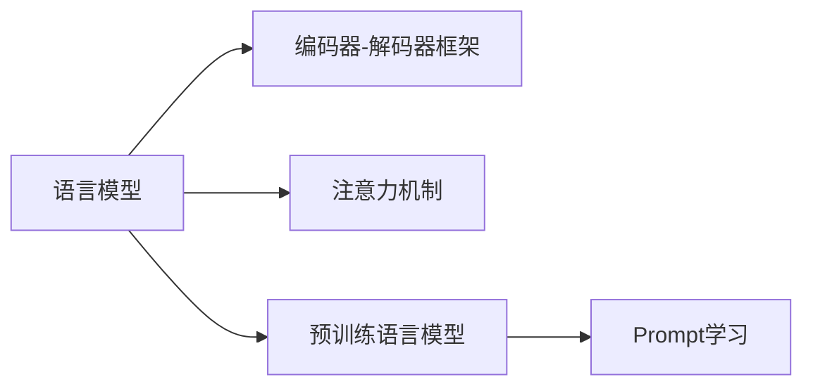

# 文本生成 (Text Generation)

## 1. 背景介绍
### 1.1 文本生成的定义与意义
文本生成是自然语言处理(NLP)领域的一个重要分支,旨在通过计算机算法自动生成连贯、通顺、符合语法规则且富有意义的文本内容。它在智能问答、机器翻译、对话系统、内容创作等诸多领域有着广泛的应用前景。

### 1.2 文本生成技术的发展历程
文本生成技术经历了从基于规则、基于统计到基于深度学习的发展过程。早期主要采用基于规则的方法,通过人工定义模板和语法规则来生成文本。随着统计机器学习的兴起,马尔可夫链、隐马尔可夫模型等统计模型被引入文本生成中。近年来,随着深度学习的蓬勃发展,RNN、LSTM、GRU、Transformer等神经网络模型在文本生成任务上取得了突破性进展。

### 1.3 文本生成的主要挑战
尽管文本生成技术取得了长足进步,但仍面临着诸多挑战:
1. 语义连贯性:如何确保生成的文本在语义上前后连贯、逻辑自洽。
2. 语法正确性:如何确保生成的文本符合目标语言的语法规则。
3. 多样性与创新性:如何提高生成文本的多样性,避免过于"模板化",同时又能生成一定创新性的内容。
4. 可控性:如何对生成过程进行引导和控制,使其满足特定的需求或体现特定的风格。
5. 评估难题:缺乏统一、权威的文本生成质量评估标准。

## 2. 核心概念与联系
### 2.1 语言模型
语言模型是文本生成的核心,用于刻画自然语言中词与词、句与句之间的概率依存关系。通过在大规模语料上训练语言模型,可以学习到语言的内在规律,从而指导文本生成。常见的语言模型有N-gram模型、RNN语言模型、Transformer语言模型等。

### 2.2 编码器-解码器框架
编码器-解码器(Encoder-Decoder)框架是文本生成的经典范式。编码器负责将输入的文本序列编码为一个固定维度的语义向量,解码器则根据该语义向量自回归地生成目标文本。这一范式广泛应用于机器翻译、文本摘要、对话生成等任务。

### 2.3 注意力机制
注意力机制(Attention Mechanism)使得模型能够在生成每个词时,自适应地分配对输入序列不同位置的关注度。它克服了将输入序列压缩为单一固定维度向量所带来的信息损失,极大地提升了文本生成的效果。自注意力机制(Self-Attention)进一步拓展了注意力机制的内涵,使其能够捕捉输入序列内部的依赖关系。

### 2.4 预训练语言模型
预训练语言模型(Pre-trained Language Model)是当前NLP领域的研究热点。通过在大规模无标注语料上进行自监督预训练,模型可以学习到语言的通用表征,再针对下游任务进行微调,从而实现更加强大的文本生成能力。代表性的预训练语言模型有BERT、GPT、XLNet等。

### 2.5 Prompt学习
Prompt学习是近年来兴起的一种全新范式,旨在充分利用预训练语言模型的知识,通过设计巧妙的输入提示(Prompt),引导模型生成符合特定需求的文本。这种范式在少样本学习、知识融合、可控文本生成等方面展现出了巨大潜力。

以下是这些核心概念之间的联系:



## 3. 核心算法原理具体操作步骤
### 3.1 RNN文本生成
RNN(循环神经网络)是早期文本生成的主流模型。其基本思想是:在生成每个词时,利用RNN的隐藏状态来编码之前生成的所有词的信息,从而实现语境的记忆与传递。
1. 将词映射为稠密向量表示(Word Embedding)。
2. 初始化RNN的隐藏状态。
3. 在每个时间步:
   - 将上一步生成的词的词向量输入RNN。
   - 更新RNN的隐藏状态。
   - 将隐藏状态通过全连接层+Softmax映射为各词的概率分布。
   - 根据概率分布采样生成下一个词。
4. 重复步骤3,直到生成结束符或达到最大长度。

### 3.2 Seq2Seq文本生成
Seq2Seq(Sequence-to-Sequence)模型采用编码器-解码器框架,广泛应用于机器翻译、文本摘要等任务。
1. 编码器:
   - 将输入文本序列映射为词向量序列。
   - 将词向量序列输入RNN编码器。
   - 将编码器最后一步的隐藏状态作为语义向量。
2. 解码器:
   - 初始化解码器RNN的隐藏状态为编码器的语义向量。
   - 在每个时间步:
     - 将上一步生成的词向量与隐藏状态拼接后输入解码器RNN。
     - 更新解码器RNN的隐藏状态。
     - 将隐藏状态通过注意力机制与编码器的输出序列进行加权求和。
     - 将加权求和结果通过全连接层+Softmax映射为各词的概率分布。
     - 根据概率分布采样生成下一个词。
   - 重复解码器步骤,直到生成结束符或达到最大长度。

### 3.3 Transformer文本生成
Transformer是当前NLP领域的主流模型,基于自注意力机制,抛弃了RNN的循环结构,采用全局建模的方式。
1. 输入嵌入:
   - 将输入序列映射为词向量序列。
   - 叠加位置编码以引入位置信息。
2. 编码器:
   - 多头自注意力层:通过自注意力机制建模输入序列内部的依赖关系。
   - 前馈神经网络层:对自注意力的输出进行非线性变换。
   - 残差连接与Layer Normalization。
   - 重复以上步骤N次。
3. 解码器:
   - 掩码多头自注意力层:在解码器内部建模已生成序列的依赖关系,同时避免看到未来的信息。
   - 编码器-解码器注意力层:在生成每个词时,自适应地聚焦于编码器输出的不同位置。
   - 前馈神经网络层:对注意力输出进行非线性变换。
   - 残差连接与Layer Normalization。
   - 重复以上步骤N次。
   - 线性层+Softmax:将解码器最后一层的输出映射为各词的概率分布。
4. 根据概率分布采样生成下一个词,重复解码过程直到生成结束符或达到最大长度。

## 4. 数学模型和公式详细讲解举例说明
### 4.1 语言模型的概率公式
给定词序列$w_1,w_2,...,w_T$,语言模型的目标是估计该序列的概率:

$$
P(w_1,w_2,...,w_T)=\prod_{t=1}^T P(w_t|w_1,w_2,...,w_{t-1})
$$

其中,$P(w_t|w_1,w_2,...,w_{t-1})$表示在给定前$t-1$个词的条件下,第$t$个词为$w_t$的条件概率。语言模型的任务就是学习如何估计这些条件概率。

以N-gram语言模型为例,它做了一个简化假设,认为一个词的出现只与前面的$n-1$个词相关:

$$
P(w_t|w_1,w_2,...,w_{t-1}) \approx P(w_t|w_{t-n+1},...,w_{t-1})
$$

N-gram模型的参数通过极大似然估计从语料中学习:

$$
P(w_t|w_{t-n+1},...,w_{t-1}) = \frac{Count(w_{t-n+1},...,w_{t-1},w_t)}{Count(w_{t-n+1},...,w_{t-1})}
$$

其中,$Count(·)$表示语料中某个词序列出现的次数。

### 4.2 Transformer中的自注意力机制
Transformer的核心是自注意力机制,它可以建模序列内部的依赖关系。对于输入序列的某个位置$i$,其自注意力值计算如下:

$$
\text{Attention}(Q_i,K,V) = \text{softmax}(\frac{Q_i K^T}{\sqrt{d_k}})V
$$

其中,$Q_i$是位置$i$的查询向量,$K$和$V$分别是所有位置的键向量和值向量,$d_k$是向量维度。这个公式可以解释为:位置$i$通过查询向量$Q_i$与所有位置的键向量$K$进行点积,得到与每个位置的相关性分数,然后经过softmax归一化后与值向量$V$加权求和,得到位置$i$的注意力表示。

Transformer还引入了多头自注意力机制,即并行地执行$h$个不同的自注意力函数,然后将它们的输出拼接起来:

$$
\text{MultiHead}(Q,K,V) = \text{Concat}(\text{head}_1,...,\text{head}_h)W^O
$$

$$
\text{head}_i = \text{Attention}(QW_i^Q,KW_i^K,VW_i^V)
$$

其中,$W_i^Q,W_i^K,W_i^V$是第$i$个头的权重矩阵,$W^O$是输出的权重矩阵。多头自注意力允许模型在不同的子空间中捕捉不同的依赖关系,提高了模型的表达能力。

## 5. 项目实践:代码实例和详细解释说明

下面是使用PyTorch实现Transformer模型进行文本生成的示例代码:

```python
import torch
import torch.nn as nn
import torch.nn.functional as F

class TransformerModel(nn.Module):
    def __init__(self, vocab_size, d_model, nhead, num_layers, dim_feedforward, max_seq_length):
        super(TransformerModel, self).__init__()
        self.embedding = nn.Embedding(vocab_size, d_model)
        self.pos_encoder = PositionalEncoding(d_model, max_seq_length)
        encoder_layer = nn.TransformerEncoderLayer(d_model, nhead, dim_feedforward)
        self.transformer_encoder = nn.TransformerEncoder(encoder_layer, num_layers)
        self.fc = nn.Linear(d_model, vocab_size)
        
    def forward(self, src):
        src = self.embedding(src) * math.sqrt(self.d_model)
        src = self.pos_encoder(src)
        output = self.transformer_encoder(src)
        output = self.fc(output)
        return output
    
    def generate(self, src, max_len, temperature=1.0):
        for i in range(max_len):
            src_mask = self.generate_square_subsequent_mask(src.size(0)).to(device)
            output = self.forward(src)
            output = output[-1, :] / temperature
            probs = F.softmax(output, dim=-1)
            next_word = torch.multinomial(probs, 1)
            src = torch.cat([src, next_word.unsqueeze(0)], dim=0)
        return src
        
class PositionalEncoding(nn.Module):
    def __init__(self, d_model, max_len=5000):
        super(PositionalEncoding, self).__init__()
        pe = torch.zeros(max_len, d_model)
        position = torch.arange(0, max_len, dtype=torch.float).unsqueeze(1)
        div_term = torch.exp(torch.arange(0, d_model, 2).float() * (-math.log(10000.0) / d_model))
        pe[:, 0::2] = torch.sin(position * div_term)
        pe[:, 1::2] = torch.cos(position * div_term)
        pe = pe.unsqueeze(0).transpose(0, 1)
        self.register_buffer('pe', pe)

    def forward(self, x):
        x = x + self.pe[:x.size(0), :]
        return x
```

代码解释:
- `TransformerModel`类定义了Transformer模型的结构,包括词嵌入层、位置编码、Transformer编码器层和最后的全连接输出层。
- `forward`方法定义了模型的前向传播过程:将输入序列映射为词嵌入,加上位置编码,然后通过Transformer编码器层,最后经过全连接层