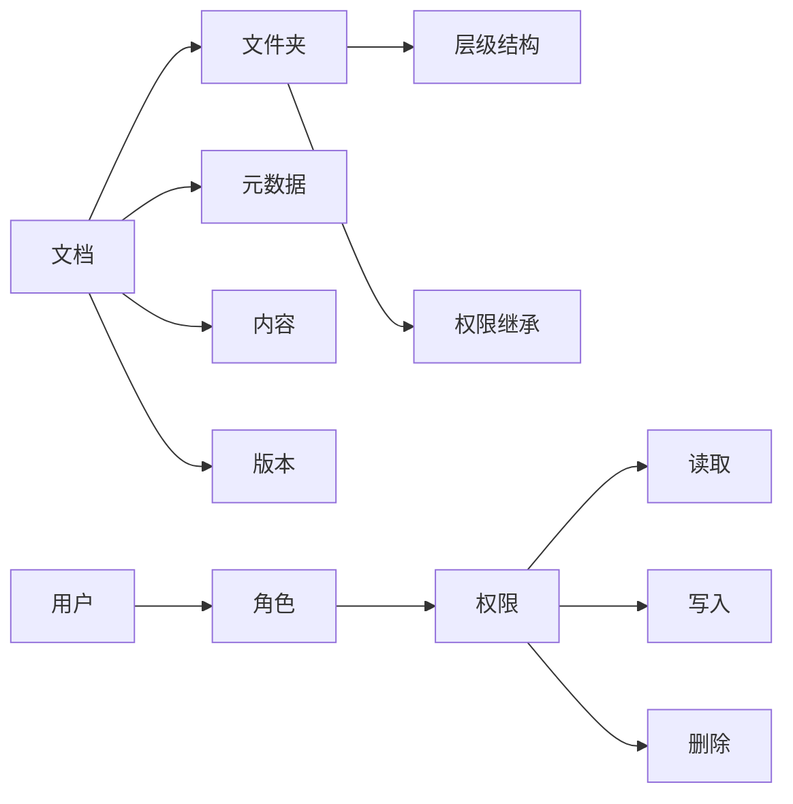

# 文档管理系统详细设计与具体代码实现

## 1. 背景介绍

在当今数字化时代,企业和组织面临着海量文档的管理挑战。高效、安全、易用的文档管理系统成为了提升工作效率、保障信息安全的关键。本文将深入探讨文档管理系统的详细设计与具体代码实现,为开发者提供实用的指导和参考。

### 1.1 文档管理系统的重要性
#### 1.1.1 提高工作效率
#### 1.1.2 保障信息安全
#### 1.1.3 促进协作与共享

### 1.2 文档管理系统的主要功能
#### 1.2.1 文档存储与组织
#### 1.2.2 文档版本控制  
#### 1.2.3 文档权限管理
#### 1.2.4 文档搜索与检索
#### 1.2.5 文档协作与共享

## 2. 核心概念与联系

### 2.1 文档(Document)
#### 2.1.1 文档元数据(Metadata)
#### 2.1.2 文档内容(Content)
#### 2.1.3 文档版本(Version)

### 2.2 文件夹(Folder)
#### 2.2.1 文件夹层级结构
#### 2.2.2 文件夹权限继承

### 2.3 用户(User)与角色(Role) 
#### 2.3.1 用户属性
#### 2.3.2 角色权限
#### 2.3.3 用户-角色关联

### 2.4 权限(Permission)
#### 2.4.1 读取权限(Read)
#### 2.4.2 写入权限(Write)
#### 2.4.3 删除权限(Delete)

### 2.5 核心概念关系图



## 3. 核心算法原理与具体操作步骤

### 3.1 文档存储算法
#### 3.1.1 分块存储
#### 3.1.2 去重存储
#### 3.1.3 压缩存储

### 3.2 文档版本管理算法
#### 3.2.1 差异比较算法
#### 3.2.2 版本合并算法
#### 3.2.3 版本回滚算法

### 3.3 文档搜索算法
#### 3.3.1 全文检索算法
#### 3.3.2 关键词提取算法
#### 3.3.3 相似度计算算法

### 3.4 文档权限控制算法
#### 3.4.1 访问控制列表ACL
#### 3.4.2 角色访问控制RBAC
#### 3.4.3 属性访问控制ABAC

## 4. 数学模型和公式详细讲解举例说明

### 4.1 文本相似度计算模型

余弦相似度:
$$ \cos(\theta) = \frac{\mathbf{A} \cdot \mathbf{B}}{\|\mathbf{A}\| \|\mathbf{B}\|} = \frac{\sum_{i=1}^n A_i B_i}{\sqrt{\sum_{i=1}^n A_i^2} \sqrt{\sum_{i=1}^n B_i^2}} $$

其中 $A_i$ 和 $B_i$ 分别表示文档向量 $\mathbf{A}$ 和 $\mathbf{B}$ 的分量。

Jaccard相似系数:
$$ J(A,B) = \frac{|A \cap B|}{|A \cup B|} = \frac{|A \cap B|}{|A| + |B| - |A \cap B|} $$

其中 $A$ 和 $B$ 是两个文档的 token 集合。

### 4.2 文档聚类模型

K-means聚类:

1. 随机选择 $k$ 个点作为初始聚类中心 $\{\mu_1,\mu_2,\dots,\mu_k\}$。
2. 对于每个样本点 $x_i$,计算它到各个聚类中心的距离,将其分配到距离最近的聚类中心所对应的类中。
3. 对于每个类 $C_i$,重新计算该类的聚类中心 $\mu_i = \frac{1}{|C_i|}\sum_{x\in C_i}x$。
4. 重复步骤 2 和 3,直到聚类中心不再发生变化或达到最大迭代次数。

### 4.3 文档排序模型

TF-IDF权重:

$$ \text{TF-IDF}(t,d,D) = \text{TF}(t,d) \times \text{IDF}(t,D) $$

其中:
- $\text{TF}(t,d)$ 表示词项 $t$ 在文档 $d$ 中的词频。
- $\text{IDF}(t,D) = \log \frac{|D|}{|\{d\in D:t\in d\}|}$,表示词项 $t$ 的逆文档频率。

文档得分:

$$ \text{score}(q,d) = \sum_{t\in q}\text{TF-IDF}(t,d,D) $$

其中 $q$ 表示查询词,对查询中的每个词项的 TF-IDF 得分求和,得到文档 $d$ 的最终得分。

## 5. 项目实践:代码实例和详细解释说明

### 5.1 文档存储模块

```python
class Document:
    def __init__(self, doc_id, content):
        self.doc_id = doc_id
        self.content = content
        self.chunks = self._split_chunks()
        
    def _split_chunks(self, chunk_size=4096):
        return [self.content[i:i+chunk_size] 
                for i in range(0, len(self.content), chunk_size)]
    
    def save(self, storage):
        for chunk in self.chunks:
            chunk_id = hashlib.sha256(chunk.encode()).hexdigest()
            storage.save_chunk(chunk_id, chunk)
        return True

class DocumentStorage:
    def __init__(self, db):
        self.db = db
        
    def save_chunk(self, chunk_id, chunk):
        if not self.db.exists(chunk_id):
            self.db.set(chunk_id, chunk)
            
    def get_chunk(self, chunk_id):
        return self.db.get(chunk_id)
```

文档存储的核心是将文档内容切分为固定大小的块,对每个块进行去重存储。`Document` 类负责文档切块,`DocumentStorage` 类负责块的存储与读取。通过这种方式,可以节省存储空间,提高存储和读取效率。

### 5.2 文档版本管理模块

```python
from diff_match_patch import diff_match_patch

class DocumentVersion:
    def __init__(self, doc_id, version_id, content):
        self.doc_id = doc_id
        self.version_id = version_id
        self.content = content
        
    def diff_content(self, other_content):
        dmp = diff_match_patch()
        diff = dmp.diff_main(self.content, other_content)
        return diff
    
    def patch_content(self, diff):
        dmp = diff_match_patch()
        patched_content, _ = dmp.patch_apply(dmp.patch_make(diff), self.content)
        return patched_content

class VersionManager:
    def __init__(self, db):
        self.db = db
        
    def save_version(self, doc_version):
        self.db.hmset(doc_version.doc_id, {doc_version.version_id: doc_version.content})
        
    def get_version(self, doc_id, version_id):
        content = self.db.hget(doc_id, version_id)
        return DocumentVersion(doc_id, version_id, content)
```

文档版本管理的核心是对不同版本的文档内容进行差异比较和合并。`DocumentVersion` 类封装了版本号和内容,提供了版本之间差异比较和打补丁的方法。`VersionManager` 类负责版本的存储与读取。使用时,可以通过比较版本之间的差异,生成补丁,再将补丁应用到另一个版本,实现版本之间的合并。

### 5.3 文档搜索模块

```python
from sklearn.feature_extraction.text import TfidfVectorizer

class DocumentSearcher:
    def __init__(self, docs):
        self.docs = docs
        self.vectorizer = TfidfVectorizer()
        self.doc_vectors = self.vectorizer.fit_transform([doc.content for doc in docs])
        
    def search(self, query, top_n=10):
        query_vector = self.vectorizer.transform([query])
        scores = self.doc_vectors.dot(query_vector.T).toarray()
        top_docs = [self.docs[i] for i in np.argsort(-scores, axis=0)[:top_n, 0]]
        return top_docs
```

文档搜索的核心是对文档和查询进行向量化表示,通过计算向量之间的相似度得到搜索结果。`DocumentSearcher` 类在初始化时对所有文档进行向量化,查询时将查询转换为向量,计算与文档向量的内积得到相似度分数,返回分数最高的若干文档。

### 5.4 文档权限控制模块

```python
class AccessController:
    def __init__(self, db):
        self.db = db
        
    def grant_permission(self, doc_id, role_id, permission):
        self.db.sadd(f"doc_roles:{doc_id}", role_id)
        self.db.sadd(f"role_perms:{role_id}", permission)
        
    def check_permission(self, doc_id, user_id, permission):
        user_roles = self.db.smembers(f"user_roles:{user_id}")
        for role_id in user_roles:
            if self.db.sismember(f"doc_roles:{doc_id}", role_id) and \
               self.db.sismember(f"role_perms:{role_id}", permission):
                return True
        return False
```

文档权限控制的核心是用户-角色-权限的关联管理。`AccessController` 类提供了权限的授予和校验方法。通过将文档关联到角色,角色关联到权限,再通过用户与角色的关联,实现了用户对文档权限的控制。权限校验时,判断用户所属角色是否与文档关联,且角色是否具有指定权限,来决定是否允许用户的操作。

## 6. 实际应用场景

### 6.1 企业文档管理
- 文档集中存储、分类组织与权限管控
- 文档版本管理与协作
- 文档全文检索与快速定位

### 6.2 在线文档编辑平台
- 文档实时多人协同编辑
- 文档版本自动保存与回滚
- 文档分享与评论

### 6.3 学术论文管理系统  
- 论文投稿、审稿流程管理
- 论文相似度检测
- 论文引用分析与统计

### 6.4 电子图书馆 
- 电子书籍、期刊管理
- 读者角色与借阅权限控制  
- 图书推荐与智能检索

## 7. 工具和资源推荐

### 7.1 文档数据库
- MongoDB: 文档型数据库,支持灵活的数据模型与高效查询。
- Elasticsearch: 分布式搜索和分析引擎,提供强大的全文检索与聚合分析能力。

### 7.2 文本处理库
- Apache Tika: 内容分析工具包,支持多种文档格式的解析、元数据提取等。
- Gensim: 自然语言处理工具包,提供主题模型、文档相似度计算等功能。
- Python-docx: Python操作Word文档的库,支持文档内容解析与生成。

### 7.3 版本管理工具
- Git: 分布式版本管理工具,在文档版本管理中可作为底层存储。
- SVN: 集中式版本管理工具,成熟稳定,适合中小规模文档版本管理。

### 7.4 开源文档管理系统
- LogicalDOC: 基于Java的开源文档管理系统,功能全面,界面友好。
- OpenKM: 基于Web的开源知识管理系统,支持文档管理、协作等。
- Mayan EDMS: 基于Python的开源电子文档管理系统,注重安全性与可定制性。

## 8. 总结:未来发展趋势与挑战

### 8.1 AI赋能的智能文档管理
- 基于自然语言处理的文档自动分类、摘要提取
- 基于计算机视觉的文档图像识别、表格提取
- 基于知识图谱的文档语义关联挖掘

### 8.2 区块链技术的应用  
- 基于区块链的文档版本溯源与证据保全
- 基于区块链的文档访问权限管理与审计
- 跨组织间的文档共享与价值流通

### 8.3 去中心化的文档存储  
- IPFS、Filecoin等去中心化存储方案
- 文档碎片化加密存储
- 存储容量证明与激励机制

### 8.4 