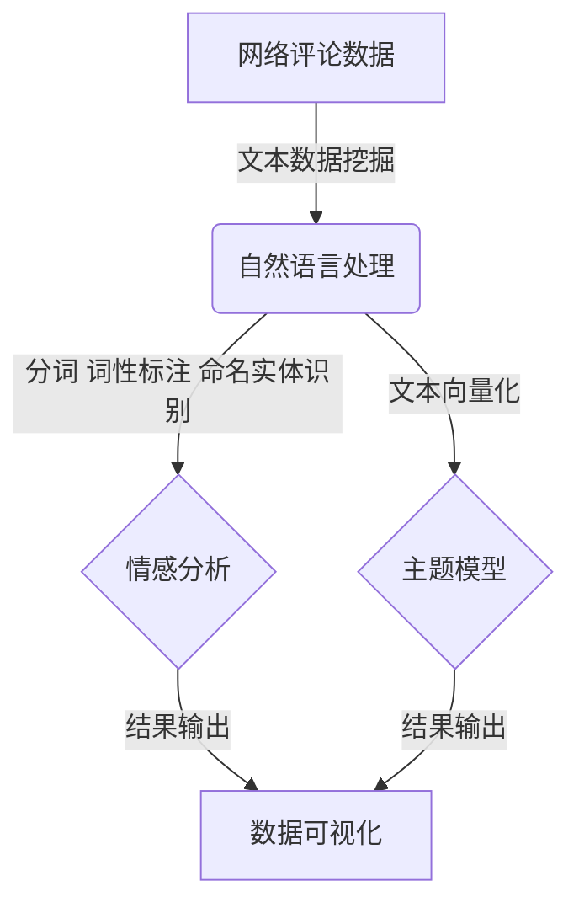

# 旅游景点的网络评论数据可视化分析与研究

## 1.背景介绍

### 1.1 旅游业的重要性

旅游业是世界经济的重要支柱产业之一。根据世界旅游组织的数据,2019年全球旅游业总收入达到1.7万亿美元,为全球GDP贡献了10.4%,为世界提供了3.3亿个就业岗位。旅游业的发展不仅促进了相关产业的繁荣,也推动了文化交流,增进了不同地区人民之间的相互理解。

### 1.2 网络评论对旅游业的影响

随着互联网和移动互联网的发展,人们越来越倾向于在网上查阅旅游景点的评论,评论对于旅游决策产生了重要影响。积极正面的评论能够吸引更多游客,提高景区的知名度和营收;而负面评论则可能造成游客流失,给景区带来经营压力。因此,对网络评论数据进行深入分析,把握游客关注点和满意度,对于旅游业的发展至关重要。

### 1.3 大数据时代的机遇和挑战

在大数据时代,旅游景点网络评论数据呈现出海量、多源、异构等特点。如何高效地从这些数据中提取有价值的信息,并进行可视化分析和展示,成为旅游业面临的新挑战。同时,大数据分析技术的发展也为旅游业带来了新的机遇,能够更精准地把握旅游需求,优化营销策略,提升游客体验。

## 2.核心概念与联系

### 2.1 文本数据挖掘

文本数据挖掘(Text Data Mining)是从非结构化或半结构化的文本数据中提取有用信息的过程。它涉及多个领域的技术,包括自然语言处理(NLP)、信息检索(IR)、数据挖掘(DM)等。对于旅游景点网络评论数据,文本数据挖掘可以帮助我们发现评论中的主题、情感倾向、高频词汇等有价值信息。

### 2.2 自然语言处理

自然语言处理(Natural Language Processing,NLP)是人工智能的一个分支,旨在让计算机能够理解和处理人类语言。在网络评论数据分析中,NLP技术可用于文本分词、词性标注、命名实体识别、情感分析等任务,为后续的数据挖掘和可视化分析奠定基础。

### 2.3 情感分析

情感分析(Sentiment Analysis)是NLP的一个重要应用领域,旨在自动识别文本中表达的情感倾向(正面、负面或中性)。对于旅游景点评论数据,情感分析可以帮助我们了解游客对景点的总体满意度,找出需要改进的方面。

### 2.4 主题模型

主题模型(Topic Model)是一种无监督机器学习算法,通过对文本语料进行概率建模,自动发现文本中隐含的主题结构。在旅游景点评论数据分析中,主题模型可用于提取评论的关键主题,了解游客关注的焦点。

### 2.5 数据可视化

数据可视化(Data Visualization)是将抽象数据转化为图形化表示的过程,有助于人类更直观地理解和探索数据。对于旅游景点评论数据分析的结果,可视化技术可以将其以更加生动形象的方式呈现出来,方便决策者把握要点。

上述核心概念相互关联、环环相扣,构成了旅游景点网络评论数据可视化分析的完整技术路线。数据挖掘和NLP技术为情感分析和主题建模提供支撑,而可视化技术则将分析结果以友好的方式呈现给用户。

## 3.核心算法原理具体操作步骤

### 3.1 数据采集与预处理

旅游景点网络评论数据可以从在线旅游平台(如携程、马蹄网等)、社交媒体平台(如微博、微信等)以及专业点评网站(如大众点评网等)采集获得。数据采集可以使用网络爬虫技术,也可以直接从提供方获取数据接口。

获取原始数据后,需要进行数据清洗,去除无效评论、广告信息、重复内容等噪声数据。同时还需要进行文本规范化处理,如转换编码格式、去除标点符号、转换同音异形词等。

### 3.2 文本分词与特征提取

对于中文评论数据,需要先进行分词处理,将评论文本切分为一个个单词序列。分词算法通常采用基于统计的方法或基于词典的方法。常用的分词工具包括结巴分词、THULAC、NLPIR等。

分词后,需要将文本转换为特征向量的形式,以便进行后续的机器学习处理。常用的文本特征提取方法包括TF-IDF(词频-逆文档频率)、Word2Vec、BERT等。

### 3.3 情感分析算法

情感分析的核心是判断一段文本表达的情感倾向。常用的情感分析算法有:

1. **基于词典的方法**:通过构建情感词典,根据文本中情感词的分布和强度来判断情感倾向。这种方法简单直观,但容易受词典覆盖范围的限制。

2. **基于机器学习的方法**:将情感分析问题转化为文本分类问题,使用监督学习算法(如朴素贝叶斯、支持向量机、神经网络等)在标注语料上训练分类模型。这种方法需要大量标注数据,但分类性能较好。

3. **基于深度学习的方法**:利用深度神经网络自动从数据中学习文本的语义表示,再构建分类模型。常用的模型包括RNN、LSTM、Transformer等。这种方法通常取得较好的分类效果,但需要大量计算资源。

### 3.4 主题模型算法

主题模型算法的目标是从文本语料中自动发现隐含的主题结构。常用的主题模型算法包括:

1. **LDA(Latent Dirichlet Allocation)**:LDA是一种基于贝叶斯概率模型的主题模型,它假设每个文档是由多个主题构成,每个主题又由多个词构成。LDA使用变分推断算法来估计模型参数。

2. **PLSA(Probabilistic Latent Semantic Analysis)**:PLSA是一种基于概率潜在语义分析的主题模型,它使用期望最大化算法估计模型参数。与LDA相比,PLSA模型更简单,但无法很好地处理未见数据。

3. **BTM(Biterm Topic Model)**:BTM是一种考虑词与词之间关系的主题模型,它直接对词对(biterm)建模,避免了数据稀疏问题。BTM在处理短文本时表现较好。

上述算法均属于无监督学习范畴,不需要人工标注主题信息。在实际应用中,还可以结合领域知识对主题模型的结果进行优化。

### 3.5 可视化技术

将情感分析和主题模型的结果进行可视化展示,有助于直观地把握数据信息。常用的可视化技术包括:

- **词云图**:以不同大小的字体展示文本中的高频词汇,直观反映关键词的重要性。
- **情感极性图**:通过正负极性的直方图或饼图展示文本的情感倾向分布。
- **主题河流图**:以时间作为横轴,主题词汇的大小作为纵轴,展示主题随时间的演化趋势。
- **主题词共现网络图**:将主题词汇作为节点,共现关系作为边,展示主题词之间的关联关系。
- **主题热力图**:以行列表的形式展示文档与主题之间的关联强度。

除了上述常见的可视化方式,还可以根据具体需求设计交互式的可视化界面,提高数据探索和分析的效率。

## 4.数学模型和公式详细讲解举例说明

在旅游景点网络评论数据分析中,涉及的数学模型主要包括文本特征提取模型、情感分析模型和主题模型等。下面将详细介绍其中的关键模型及公式。

### 4.1 TF-IDF文本特征提取模型

TF-IDF(Term Frequency-Inverse Document Frequency)是一种常用的文本特征提取方法,它通过计算每个词项在文档中的词频(TF)和逆文档频率(IDF)的乘积,来表示该词项对文档的重要程度。

对于一个词项$t$和文档$d$,它们的TF-IDF值计算公式如下:

$$\mathrm{tfidf}(t,d)=\mathrm{tf}(t,d)\times\mathrm{idf}(t)$$

其中:

- $\mathrm{tf}(t,d)$表示词项$t$在文档$d$中的词频,可以使用原始词频或进行平滑处理。
- $\mathrm{idf}(t)$表示词项$t$的逆文档频率,用于衡量该词项的区分能力,计算公式为:

$$\mathrm{idf}(t)=\log\frac{N}{|\{d:t\in d\}|}$$

其中$N$表示语料库中文档的总数,$|\{d:t\in d\}|$表示包含词项$t$的文档数量。

通过计算每个词项的TF-IDF值,我们可以构建文档的特征向量,进而将文本数据表示为向量空间模型,为后续的机器学习算法提供输入。

### 4.2 朴素贝叶斯情感分析模型

朴素贝叶斯分类器是一种常用的监督学习算法,在情感分析任务中也有广泛应用。假设需要判断一段文本$d$的情感类别$c$,根据贝叶斯公式,我们有:

$$P(c|d)=\frac{P(d|c)P(c)}{P(d)}$$

由于分母$P(d)$对所有类别是相同的,因此可以忽略不计,只需要最大化$P(d|c)P(c)$即可。进一步假设词项之间相互独立,则有:

$$P(d|c)=\prod_{t\in d}P(t|c)$$

其中$P(t|c)$表示在类别$c$下,词项$t$出现的概率,可以通过训练数据估计得到。$P(c)$表示类别$c$的先验概率。

在实际应用中,还需要对上述模型进行平滑处理,以避免概率值为0的情况。常用的平滑方法包括拉普拉斯平滑、Lidstone平滑等。

### 4.3 LDA主题模型

LDA(Latent Dirichlet Allocation)是一种常用的无监督主题模型,它假设每个文档是由多个主题构成,每个主题又由多个词构成。LDA模型的核心思想是通过对文档-主题和主题-词的概率分布进行建模,从而发现隐含的主题结构。

LDA模型的基本概率过程如下:

1. 对每个文档$d$:
   - 从狄利克雷分布$\alpha$中抽取一个主题分布$\theta_d$
2. 对每个主题$k$:
   - 从狄利克雷分布$\beta$中抽取一个词分布$\phi_k$
3. 对文档$d$中的每个词$w_{d,n}$:
   - 从$\theta_d$中抽取一个主题$z_{d,n}$
   - 从$\phi_{z_{d,n}}$中抽取一个词$w_{d,n}$

其中,$\alpha$和$\beta$是狄利克雷分布的超参数,$\theta_d$表示文档$d$的主题分布,$\phi_k$表示主题$k$的词分布。

在给定观测数据(词序列)的情况下,LDA模型需要使用变分推断算法或者吉布斯采样算法来估计隐含的$\theta$和$\phi$参数。具体的推导过程较为复杂,这里不再赘述。

通过LDA模型,我们可以发现文档语料中的主题结构,并获取每个主题的关键词汇,从而帮助理解和总结评论数据的核心内容。

## 5.项目实践:代码实例和详细