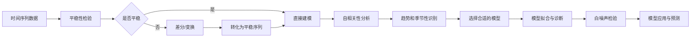

# 时间序列分析(Time Series Analysis) - 原理与代码实例讲解

## 1. 背景介绍

### 1.1 时间序列分析概述

时间序列分析是一种用于分析和建模随时间变化的数据的统计学方法。它广泛应用于各个领域,如金融、经济、工程、自然科学等,用于理解过去,预测未来。时间序列数据是按照时间顺序排列的一组观测值,其特点是数据点之间存在时间依赖性。

### 1.2 时间序列分析的重要性

- 发现数据中的模式和趋势
- 理解变量之间的动态关系  
- 预测未来的走势
- 异常检测和异常事件分析
- 支持决策制定

### 1.3 时间序列分析的应用领域

- 金融领域:股票价格预测、风险管理
- 经济领域:宏观经济指标预测、商业周期分析
- 工程领域:设备健康监测、故障诊断
- 自然科学:气象预报、生态系统动态
- 社会科学:人口增长预测、犯罪率分析

## 2. 核心概念与联系

### 2.1 平稳性(Stationarity)

平稳性是时间序列分析的核心概念之一。如果一个时间序列的统计特性(如均值和方差)不随时间变化,我们就称之为平稳时间序列。平稳性是许多时间序列模型的基本假设。

### 2.2 自相关性(Autocorrelation)

自相关性描述了时间序列在不同时间点上的相关程度。了解自相关性有助于选择合适的模型。常用的工具有自相关函数(ACF)和偏自相关函数(PACF)。

### 2.3 趋势(Trend)和季节性(Seasonality)

趋势反映了时间序列数据的长期变化方向,而季节性则反映了数据在固定时间周期内的重复模式。在建模之前,通常需要对趋势和季节性进行识别和处理。

### 2.4 白噪声(White Noise)

白噪声是一种理想的时间序列,其各个时间点上的值是独立同分布的随机变量。白噪声常被用作模型诊断的基准。

### 2.5 核心概念之间的联系

下图展示了时间序列分析中几个核心概念之间的联系:



## 3. 核心算法原理具体操作步骤

### 3.1 平稳性检验

- 时序图观察法:通过观察时间序列的时序图,初步判断是否存在趋势或季节性。
- 自相关图法:绘制自相关图和偏自相关图,观察是否快速衰减到0。
- 单位根检验:使用ADF检验或PP检验等方法进行单位根检验,以判断序列是否平稳。

### 3.2 差分与变换

- 一阶差分:对时间序列进行一阶差分,即用当前时间点的值减去前一时间点的值,可以消除线性趋势。
- 季节性差分:对时间序列进行季节性差分,即用当前时间点的值减去前一个季节周期对应时间点的值,可以消除季节性因素。
- 对数变换:对时间序列取对数,可以稳定方差,使序列更接近平稳。
- 幂变换:对时间序列进行幂变换(如平方根、立方根等),也可以稳定方差。

### 3.3 自回归移动平均(ARMA)模型

ARMA(p,q)模型由自回归(AR)部分和移动平均(MA)部分组成:

$$X_t = c + \sum_{i=1}^p \varphi_i X_{t-i} + \sum_{j=1}^q \theta_j \varepsilon_{t-j} + \varepsilon_t$$

其中,$\varphi_i$是自回归系数,$\theta_j$是移动平均系数,$\varepsilon_t$是白噪声项。

### 3.4 差分自回归移动平均(ARIMA)模型

ARIMA(p,d,q)模型是ARMA模型的扩展,引入了差分(I)的概念,适用于非平稳时间序列:

$$\Delta^d X_t = c + \sum_{i=1}^p \varphi_i \Delta^d X_{t-i} + \sum_{j=1}^q \theta_j \varepsilon_{t-j} + \varepsilon_t$$

其中,$\Delta$表示差分算子,$d$表示差分阶数。

### 3.5 季节性差分自回归移动平均(SARIMA)模型 

SARIMA(p,d,q)(P,D,Q)m模型进一步考虑了季节性因素,在ARIMA模型的基础上引入了季节性自回归(SAR)和季节性移动平均(SMA)部分:

$$\Phi(B^m)\Delta_m^D\Delta^d X_t = c + \Theta(B^m)\Psi(B)\varepsilon_t$$

其中,$\Phi(B^m)$是季节性自回归多项式,$\Theta(B^m)$是季节性移动平均多项式,$\Delta_m^D$表示季节性差分,$m$表示季节周期。

## 4. 数学模型和公式详细讲解举例说明

### 4.1 ARMA模型的数学表示

ARMA(p,q)模型可以表示为:

$$X_t = c + \sum_{i=1}^p \varphi_i X_{t-i} + \sum_{j=1}^q \theta_j \varepsilon_{t-j} + \varepsilon_t$$

例如,ARMA(1,1)模型可以写作:

$$X_t = c + \varphi_1 X_{t-1} + \theta_1 \varepsilon_{t-1} + \varepsilon_t$$

### 4.2 ARIMA模型的数学表示

ARIMA(p,d,q)模型可以表示为:

$$\Delta^d X_t = c + \sum_{i=1}^p \varphi_i \Delta^d X_{t-i} + \sum_{j=1}^q \theta_j \varepsilon_{t-j} + \varepsilon_t$$

例如,ARIMA(1,1,1)模型可以写作:

$$\Delta X_t = c + \varphi_1 \Delta X_{t-1} + \theta_1 \varepsilon_{t-1} + \varepsilon_t$$

### 4.3 SARIMA模型的数学表示

SARIMA(p,d,q)(P,D,Q)m模型可以表示为:

$$\Phi(B^m)\Delta_m^D\Delta^d X_t = c + \Theta(B^m)\Psi(B)\varepsilon_t$$

其中,$\Phi(B^m) = 1 - \Phi_1 B^m - \cdots - \Phi_P B^{mP}$是季节性自回归多项式,$\Theta(B^m) = 1 + \Theta_1 B^m + \cdots + \Theta_Q B^{mQ}$是季节性移动平均多项式,$\Psi(B) = 1 - \psi_1 B - \cdots - \psi_p B^p$是非季节性自回归多项式。

例如,SARIMA(1,1,1)(1,1,1)4模型可以写作:

$$(1 - \Phi_1 B^4)(1 - B^4)(1 - B)X_t = c + (1 + \Theta_1 B^4)(1 - \psi_1 B)\varepsilon_t$$

## 5. 项目实践:代码实例和详细解释说明

下面以Python为例,演示如何使用statsmodels库对时间序列数据进行建模和预测。

### 5.1 数据准备

首先,我们导入所需的库并加载时间序列数据:

```python
import numpy as np
import pandas as pd
import matplotlib.pyplot as plt
from statsmodels.tsa.arima.model import ARIMA

# 加载时间序列数据
data = pd.read_csv('time_series_data.csv', index_col='Date', parse_dates=True)
```

### 5.2 平稳性检验

接下来,我们对时间序列进行平稳性检验:

```python
from statsmodels.tsa.stattools import adfuller

def adf_test(series):
    result = adfuller(series)
    print(f'ADF Statistic: {result[0]}')
    print(f'p-value: {result[1]}')
    print('Critical Values:')
    for key, value in result[4].items():
        print(f'\t{key}: {value}')

adf_test(data['Value'])
```

### 5.3 差分与变换

如果序列不平稳,我们可以对其进行差分或变换:

```python
# 一阶差分
diff_data = data['Value'].diff().dropna()

# 对数变换
log_data = np.log(data['Value'])
```

### 5.4 模型选择与拟合

根据自相关图和偏自相关图选择合适的模型,并进行拟合:

```python
from statsmodels.graphics.tsaplots import plot_acf, plot_pacf

# 绘制自相关图和偏自相关图
fig, axes = plt.subplots(2, 1, figsize=(8, 6))
plot_acf(diff_data, lags=20, ax=axes[0])
plot_pacf(diff_data, lags=20, ax=axes[1])
plt.show()

# 拟合ARIMA模型
model = ARIMA(data['Value'], order=(1, 1, 1))
results = model.fit()
print(results.summary())
```

### 5.5 模型诊断

对拟合的模型进行诊断,检查残差是否为白噪声:

```python
from statsmodels.stats.diagnostic import acorr_ljungbox

# 残差序列
residuals = results.resid

# 白噪声检验
lb_test = acorr_ljungbox(residuals, lags=[10], return_df=True)
print(lb_test)
```

### 5.6 预测

最后,使用拟合的模型对未来进行预测:

```python
# 未来5个时间步的预测
forecast = results.forecast(steps=5)
print(forecast)
```

## 6. 实际应用场景

时间序列分析在各个领域都有广泛的应用,下面列举几个具体的应用场景:

### 6.1 金融领域

- 股票价格预测:使用历史股票价格数据建立时间序列模型,预测未来股票价格走势。
- 风险管理:分析金融资产收益率的波动性,评估和管理投资风险。

### 6.2 经济领域

- 宏观经济指标预测:利用历史经济数据(如GDP、通胀率等)预测未来经济走势。
- 商业周期分析:识别和预测经济的扩张和衰退周期,为决策提供依据。

### 6.3 工程领域

- 设备健康监测:通过分析设备运行数据的时间序列,及早发现潜在的故障征兆。
- 故障诊断:利用故障发生前后的时间序列数据,定位故障原因,指导维修。

### 6.4 自然科学

- 气象预报:利用历史气象数据(如温度、湿度、风速等)预测未来天气情况。
- 生态系统动态:分析物种种群数量、生物量等指标的时间序列,研究生态系统的变化规律。

## 7. 工具和资源推荐

### 7.1 Python库

- statsmodels:提供了丰富的时间序列分析工具,包括ARIMA、SARIMA、VAR等模型。
- Prophet:Facebook开源的时间序列预测库,易于使用,适合处理带有趋势和季节性的数据。
- PyFlux:一个用于时间序列分析和预测的开源Python库,支持多种模型。

### 7.2 R包

- forecast:提供了多种时间序列预测方法,如指数平滑、ARIMA等。
- tseries:提供了多种时间序列分析工具,如平稳性检验、自相关分析等。
- xts:用于管理和操作时间序列数据的R包。

### 7.3 在线学习资源

- Coursera上的《Time Series Analysis》课程:由加州大学圣地亚哥分校提供,系统介绍时间序列分析的理论和方法。
- 《Time Series Analysis and Its Applications: With R Examples》一书:深入浅出地讲解时间序列分析,附有R代码实例。
- Rob J. Hyndman的个人网站:时间序列分析领域的知名学者,网站上有丰富的学习资源。

## 8. 总结:未来发展趋势与挑战

### 8.1 趋势1:机器学习与深度学习